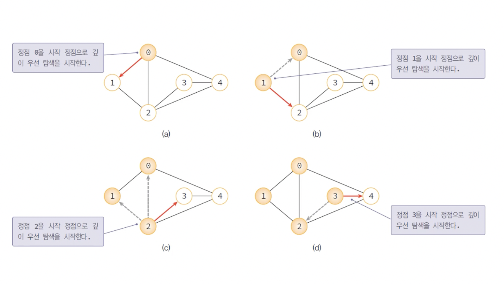
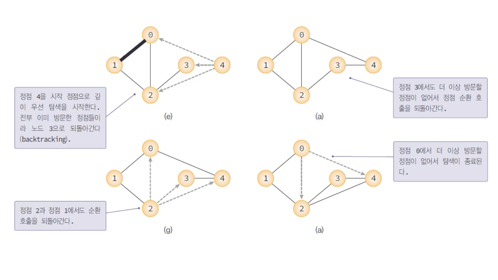

# DFS 와 BFS 


 ## 1. 깊이 우선 탐색 (DFS: Depth-First Search)

- 한 방향으로 갈 수 있을 때까지 가다가 더 이상 갈 수 없을 때 가장 최근 갈림길로 돌아와 다른 길을 선택하여 다시 진행하는 방법  
- 가능한 모든 경로를 탐색
- 스택 사용
- 재귀 호출  





---

## ***그래프 구현 - 인접행렬***

간선으로 이어진 정점 i,j가 그래프에 
존재한다면?
>M[i][j] = 1   

존재하지 않는다면?    
>M[i][j] = 0


**장점**
- 구현이 간단
- 정점끼리의 연결 여부를 쉽고 편리하게 확인 가능

**단점**
- 메모리의 부담
- 노드에 비해 간선이 적으면 비효율적

--- 

### **인접 행렬로 구현한 DFS**   

[백준 1260번](https://www.acmicpc.net/problem/1260)
``` py
import sys

n,m,v = map(int, sys.stdin.readline().split())
v = v-1 # 정점의 번호는 1부터 시작하기 때문에 인덱스를 위해서 -1을 해줌
graph = [[0]*n for _ in range(n)] # 정점의 갯수만큼 n*n 행렬 생성, 기본적으로 0을 전제
visited = [0 for _ in range(n)] # 방문 여부에 관한 배열 생성, 0을 전제

for _ in range(m):# 간선의 개수만큼 입력 받기
    a, b = map(int, sys.stdin.readline().split()) # 간선으로 연결되는 두 정점의 입력 받기
    graph[a-1][b-1] = 1 #두 정점이 연결되어 있다면 1로 표현
    graph[b-1][a-1] = 1

def depth_first_search(v):
    visited[v] = 1 # v를 방문했다고 표시 (check는 방문 여부를 확인하는 배열)

    print(v+1,end = ' ')
    for w in range(0, n):
        if graph[v][w] == 1 and visited[w] == 0 : # 간선이 존재하며 방문하지 않았을 때
            depth_first_search(w) # 재귀

depth_first_search(v)

```
---
**입력**

>4 5 1   (정점의 개수,간선의 개수,첫 시작 정점의 번호)     
1 2   (간선이 연결하는 두 정점의 번호)   
1 3   
1 4   
2 4   
3 4

**출력**

>1 2 4 3

---


