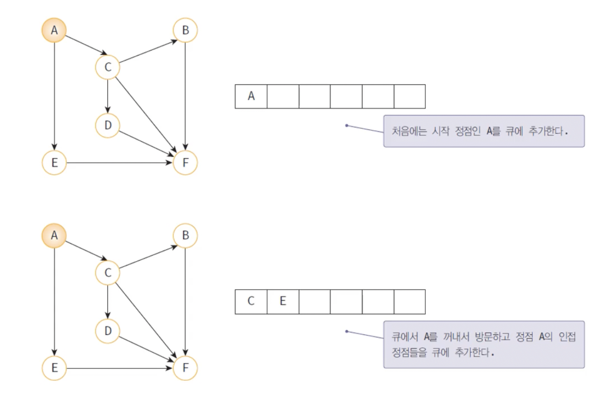
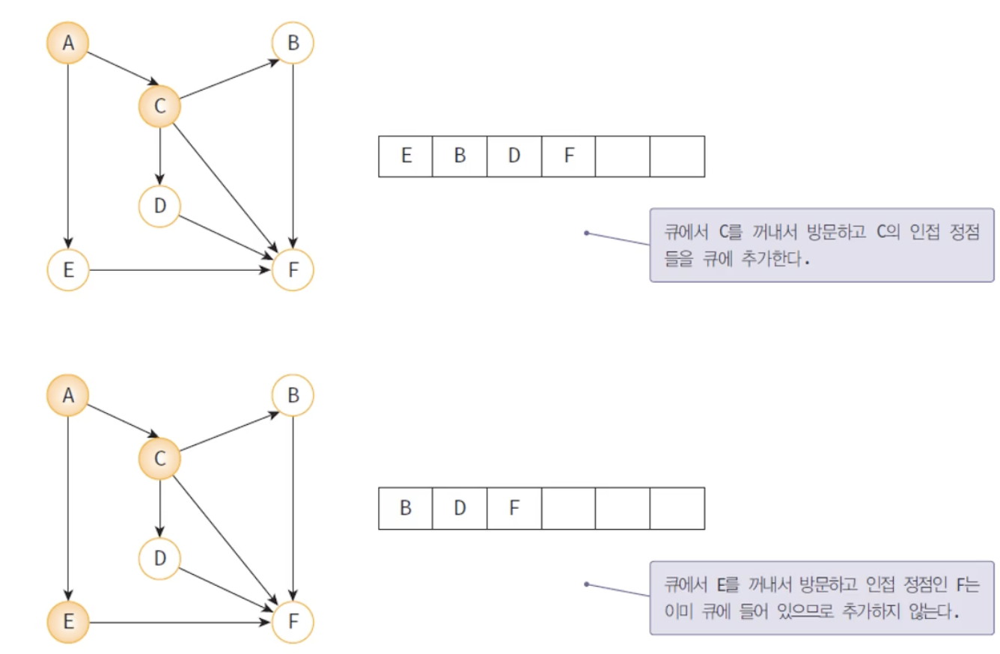

# DFS 와 BFS 


 ## 1. 깊이 우선 탐색 (DFS: Depth-First Search)

- 한 방향으로 갈 수 있을 때까지 가다가 더 이상 갈 수 없을 때 가장 최근 갈림길로 돌아와 다른 길을 선택하여 다시 진행하는 방법  
- 가능한 모든 경로를 탐색
- 스택 또는 재귀함수(가장 보편적이고 코드가 짧음) 이용

<details> 
   <br>
[출처 : https://developer-mac.tistory.com/64]
</details>


<br>

### 동작 방식


<br>

---

## ***그래프 구현 - 인접행렬***


간선으로 이어진 정점 i,j가 그래프에 
존재한다면?
>M[i][j] = 1   

존재하지 않는다면?    
>M[i][j] = 0


**장점**
- 구현이 간단
- 정점끼리의 연결 여부를 쉽고 편리하게 확인 가능

**단점**
- 메모리의 부담 : 간선의 수와는 관계 없이 n^2의 2차원 배열이 필요
- 노드에 비해 간선이 적으면 비효율적 : 간선의 수와는 관계 없이 모든 노드를 확인해야 함


---

## 2. 너비 우선 탐색 (BFS: Breadth-First Search)

- 시작 정점으로부터 가까운 정점을 먼저 방문하고 멀리 떨어져 있는 정점을 나중에 방문하는 방법
- 큐를 이용하여 구현
- 재귀로 동작하지 않음

<details> 
<br>
[출처 : https://developer-mac.tistory.com/64]
</details>
<br>


### 동작 방식




<br>

--- 
### **인접 행렬로 구현한 DFS&BFS**

  

[백준 1260번](https://www.acmicpc.net/problem/1260)
``` py
# 그래프는 인접행렬로 구현 (n*n행렬, n은 정점의 개수)
import sys
from collections import deque

# n은 정점의 개수, m은 간선의 개수, v는 시작 노드
n,m,v = map(int, sys.stdin.readline().split())
graph = [[0]*n for _ in range(n)] # 정점의 갯수만큼 n*n 행렬 생성, 기본적으로 0을 전제


visited = [0 for _ in range(n)] # 방문 여부에 관한 배열 생성, 0을 전제
dfs_v = v-1 # 정점의 번호는 1부터 시작하기 때문에 인덱스를 위해서 -1을 해줌
bfs_v = v-1

for _ in range(m):# 간선의 개수만큼 입력 받기
    a, b = map(int, sys.stdin.readline().split()) # 간선으로 연결되는 두 정점의 입력 받기
    graph[a-1][b-1] = 1 #두 정점이 연결되어 있다면 1로 표현
    graph[b-1][a-1] = 1

def depth_first_search(v):
    visited[v] = 1 # v를 방문했다고 표시 (check는 방문 여부를 확인하는 배열)
    print(v+1,end=' ') # 결과를 출력할 때는 원래 입력받은 번호로 출력하기 위해 +1


    for w in range(0, n):
        if graph[v][w] == 1 and visited[w] == 0 : # 간선이 존재하며 방문하지 않았을 때
            depth_first_search(w) # 재귀

# -------------------------------bfs 구현 - 인접 행렬
que = deque([]) # 큐

#그래프 [
# [0, 1, 1, 1],
# [1, 0, 0, 1],
# [1, 0, 0, 1],
# [1, 1, 1, 0]
# ]


def breadth_first_search(v):
    visited[v] = 1 #방문한 정점은 1로 표시
    que.append(v) #큐에 삽입
    print(v+1, end= ' ')

    while len(que) > 0: # 큐가 비어있지 않다면
        v = que.popleft() # 큐의 맨 앞에서 꺼내서 v에 저장
        for w in range(0,n):#v와 인접한 모든 정점 탐색
            if graph[v][w] == 1 and visited[w] == 0: #v와 w사이에 간선이 있고, 방문되지 않았다면
                visited[w] = 1 #w로 이동, 방문했으므로 1로 표시
                que.append(w) # 다시 큐에 저장(for문을 통해 모든 인접 정점을 큐에 저장하게 됨)
                print(w+1,end=' ')


visited = [0 for _ in range(n)]
print("")
depth_first_search(dfs_v)
breadth_first_search(bfs_v)


```
---
**입력**

>4 5 1   (정점의 개수,간선의 개수,첫 시작 정점의 번호)     
1 2   (간선이 연결하는 두 정점의 번호)   
1 3   
1 4   
2 4   
3 4

**출력**

>1 2 4 3 (DFS의 경우)   
>1 2 3 4 (BFS의 경우)


----

### **깊이 우선 탐색의 분석**
- 인접 행렬 -> O(n^2)
- 인접 리스트 -> O(n+e)

-> DFS와 BFS의 시간복잡도는 같음

---


