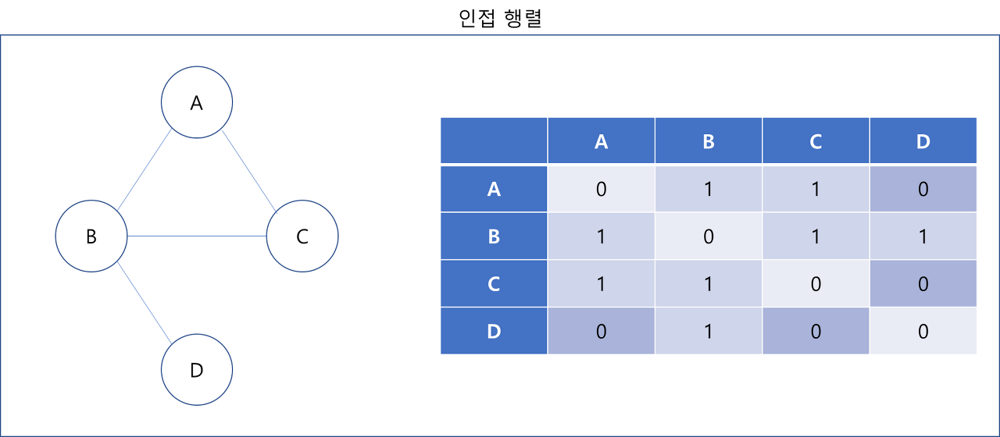

# DFS 와 BFS 

 ## 1. 깊이 우선 탐색 (DFS: Depth-First Search)

- 한 방향으로 갈 수 있을 때까지 가다가 더 이상 갈 수 없을 때 가장 최근 갈림길로 돌아와 다른 길을 선택하여 다시 진행하는 방법  
- 가능한 모든 경로를 탐색
- 스택 또는 재귀함수(가장 보편적이고 코드가 짧음) 이용

 
    
[출처 : https://developer-mac.tistory.com/64]

 

### 동작 방식

 

---

## ***그래프 구현 - 인접행렬***

간선으로 이어진 정점 i,j가 그래프에 
존재한다면?
>M[i][j] = 1   

존재하지 않는다면?    
>M[i][j] = 0

**장점**
- 구현이 간단
- 정점끼리의 연결 여부를 쉽고 편리하게 확인 가능

**단점**
- 메모리의 부담 : 간선의 수와는 관계 없이 n^2의 2차원 배열이 필요
- 노드에 비해 간선이 적으면 비효율적 : 간선의 수와는 관계 없이 모든 노드를 확인해야 함

---

## 2. 너비 우선 탐색 (BFS: Breadth-First Search)

- 시작 정점으로부터 가까운 정점을 먼저 방문하고 멀리 떨어져 있는 정점을 나중에 방문하는 방법
- 큐를 이용하여 구현
- 재귀로 동작하지 않음

 
 
[출처 : https://developer-mac.tistory.com/64]

 

----

### **깊이 우선 탐색의 분석**
- 인접 행렬 -> O(n^2)
- 인접 리스트 -> O(n+e)

-> DFS와 BFS의 시간복잡도는 같음

 

### ***다만 DFS와 BFS를 선택함에 있어서 차이점이 존재한다***

 

## DFS와 BFS

