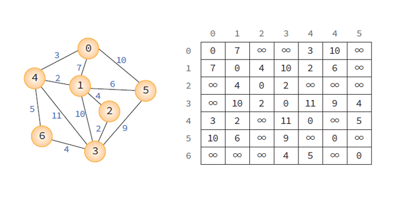
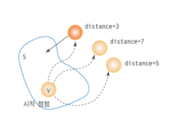
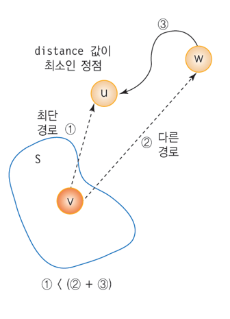
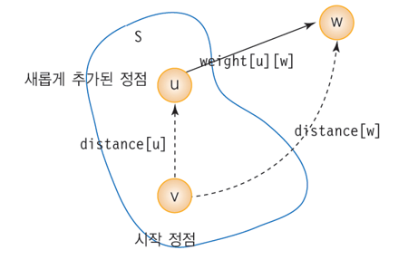
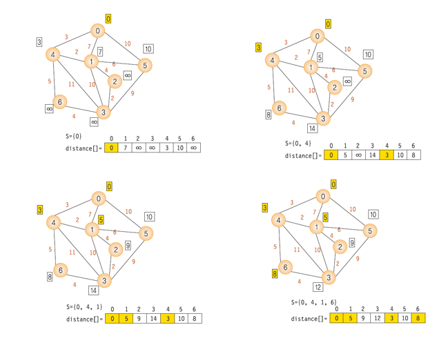
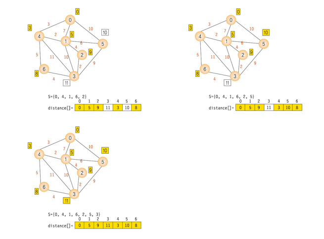
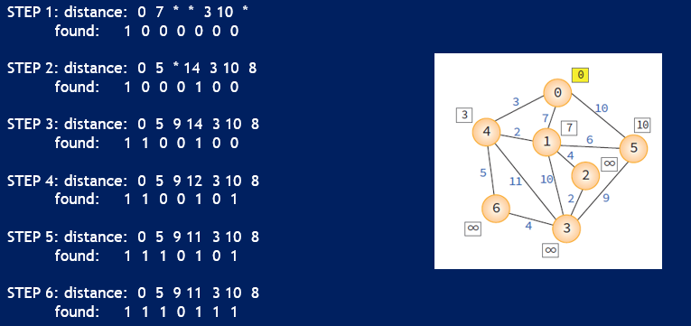

# Dijkstra 최단경로 알고리즘

> 하나의 시작 정점에서 다른 정점까지의 최단경로를 계산하는 문제
 * 가중치 인접행렬을 사용한다

<br>




<br>



<br>

* 집합 S: 시작 정점 v로부터의 최단경로가 이미 발견된 정점들의 집합
* 배열 distance: 최단경로가 알려진 정점들만을 이용한 다른 정점들까지의 최단경로 길이

> 매 단계에서 가장 distance 값이 작은 정점을 집합 S에 추가

<br>



<br>

1. 각 단계에서 집합 S안에 없는 정점 중에서 가장 distance 값이 작은 정점을 S에 추가한다.
2. 정점 w를 거쳐 정점 u로 가는 가상적인 더 짧은 경로가 있다고 가정하자.
3. 정점 v->u의 거리는 정점 v->w까지의 거리(2)와 정점 w->u로 가는 거리(3)을 합한 값이 된다.
4. 현재 distance 값이 가장 작은 정점은 u이기 때문에 경로 2는 경로 1보다 항상 길 수 밖에 없다.

<br>



<br>

새로운 정점이 S에 추가되면 distance 값 갱신
> distance[w] = min(distance[w], distance[u] + weight[u][w])

<br>

<details>
  <summary> <b>Dijkstra 예제1 </summary>
  <div markdown="0">
  

  <br>

  
  </div>
</details>


<br><br>

<details>
  <summary> <b>Dijkstra 예제 2</summary>
  <div markdown="0">
  
  </div>
</details>

<br>

``` c
#include <stdio.h>
#include <stdlib.h>
#include <limits.h>

#define TRUE 1
#define FALSE 0
#define MAX_VERTICES	100	
#define INF	1000000	/* 무한대 (연결이 없는 경우) */

typedef struct GraphType {
	int n;	// 정점의 개수
	int weight[MAX_VERTICES][MAX_VERTICES];
} GraphType;

int distance[MAX_VERTICES];/* 시작정점으로부터의 최단경로 거리 */
int found[MAX_VERTICES];		/* 방문한 정점 표시 */

int choose(int distance[], int n, int found[])
{
	int i, min, minpos;
	min = INT_MAX;
	minpos = -1;
	for (i = 0; i<n; i++)
		if (distance[i]< min && !found[i]) {
			min = distance[i];
			minpos = i;
		}
	return minpos;
}

void shortest_path(GraphType* g, int start)
{
	int i, u, w;
	for (i = 0; i<g->n; i++) /* 초기화 */
	{
		distance[i] = g->weight[start][i];
		found[i] = FALSE;
	}
	found[start] = TRUE;    /* 시작 정점 방문 표시 */
	distance[start] = 0;
	for (i = 0; i<g->n-1; i++) {
		print_status(g);
		u = choose(distance, g->n, found);
		found[u] = TRUE;
		for (w = 0; w<g->n; w++)
			if (!found[w])
				if (distance[u] + g->weight[u][w]<distance[w])
					distance[w] = distance[u] + g->weight[u][w];
	}
}

int main(void)
{
	GraphType g = { 7,
	{{ 0,  7,  INF, INF,   3,  10, INF },
	{ 7,  0,    4,  10,   2,   6, INF },
	{ INF,  4,    0,   2, INF, INF, INF },
	{ INF, 10,    2,   0,  11,   9,   4 },
	{ 3,  2,  INF,  11,   0, INF,   5 },
	{ 10,  6,  INF,   9, INF,   0, INF },
	{ INF, INF, INF,   4,   5, INF,   0 } }
	};
	shortest_path(&g, 0);
	return 0;
}
```

<br>


<details>
  <summary> <b>실행 결과</summary>
  <div markdown="0">
  
  </div>
</details>


