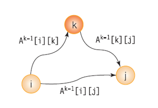
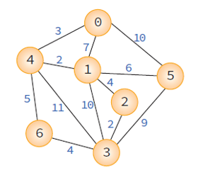
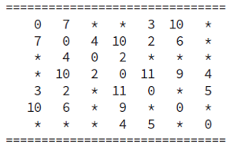
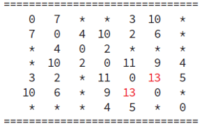
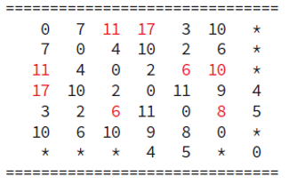

# Floyd 최단경로 알고리즘
> 모든 정점에서 다른 모든 정점까지의 최단경로를 계산하는 문제

 * 2차원 배열을 이용한 3중 반복문 구조를 가지고 있다
 * 가중치가 음의 정수일 때도 가능하다 (단, 음의 사이클이 없어야 한다)

<br>

### ***Dijkstra는 하나의 정점에서 다른 모든 정점까지의 최단 경로를 구하는 알고리즘이었다면*** 
### ***Floyd는 한 번 실행하여 모든 노드 간 최단 경로를 구할 수 있다***
 
<br>



 * `distance_k[i][j]`: 0부터 k까지의 정점만을 이용한 정점 i에서 j까지의 최단 경로 길이

<br>

### 다음과 같은 그래프가 있다고 가정하자


<br>

## Floyd 수행단계

<br>

### 1. 그래프의 가중치 행렬로 배열 A를 초기화한다

<br>



<br>

### 2. 정점 0을 거쳐서 가는 경로와 비교하여 최단 경로를 수정한다

<br>



 * distance[i][j] = min(distance[i][j], distance[i][n] + distance[n][j])

<br>

### 3. 정점 1을 거쳐서 가는 경로와 비교하여 최단 경로를 수정한다

<br>



 * distance[i][j] = min(distance[i][j], distance[i][n] + distance[n][j])

<br>

### ***정점 k를 거쳐서 가는 경로까지 반복한다***


<br>

### pseudocode
``` cpp
for k <- 0 to n-1
    for i <- 0 to n-1
        for j <- 0 to n-1
            distance[i][j] = min(distacne[i][j], distance[i][n] + distance[n][j])
```


