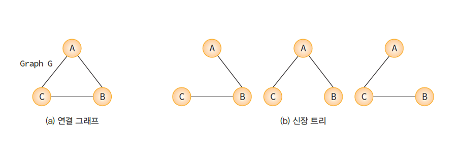
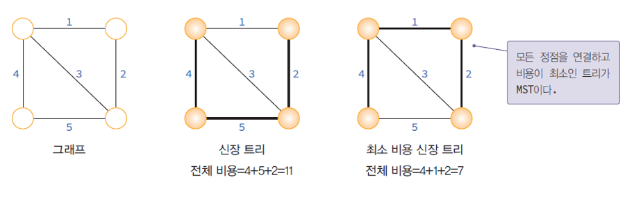
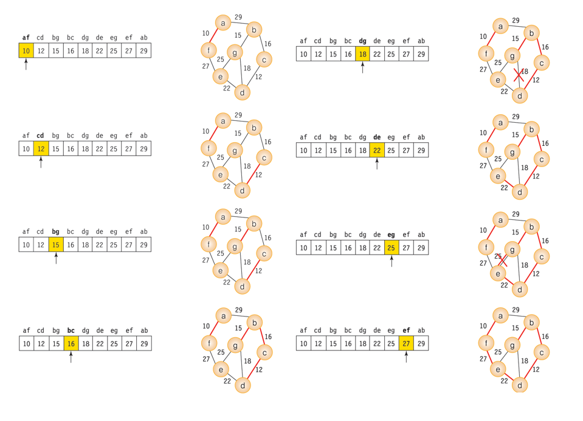
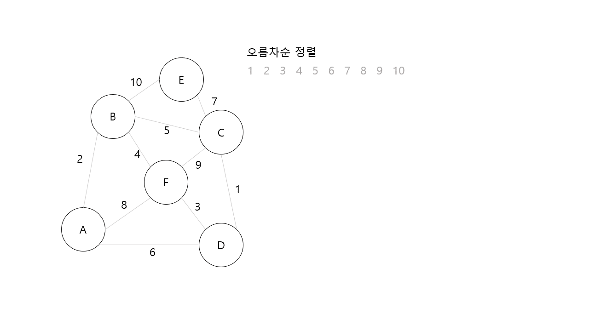
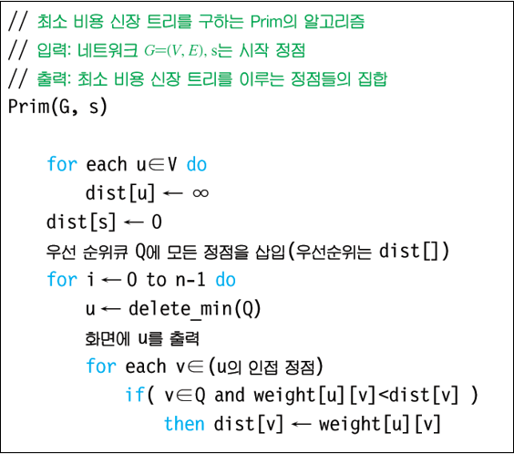
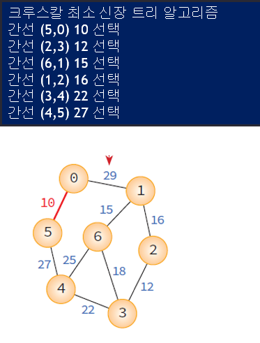
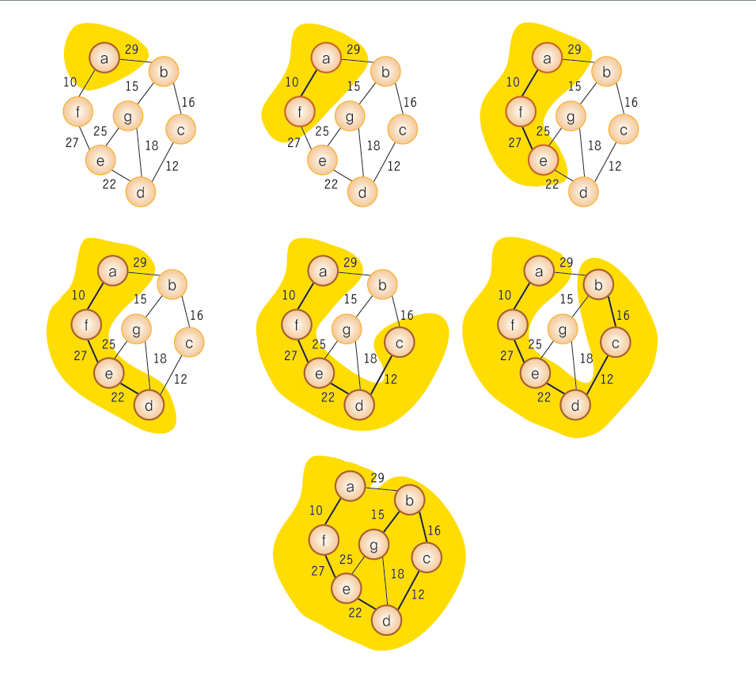
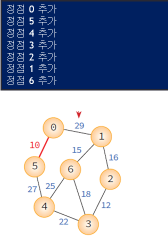

# 최소비용 신장트리(MST)

<br><br>


## 신장 트리(Spanning Tree)
> 신장 트리란 그래프내의 `모든 정점`을 포함하는 트리

* n개의 정점을 가지는 그래프의 신장트리는 n-1개의 간선을 가진다
* 하나의 그래프에는 많은 신장 트리가 존재할 수 있다
* 모든 정점들이 연결되어 있어야 하고 사이클이 형성되서는 안된다

<br>



> DFS, BFS를 이용하여 신장트리를 찾을 수 있다.


## MST(Minimum Spanning Tree)
> 네트워크에 있는 모든 정점들을 가장 적은 수의 간선과 비용으로 연결하는 알고리즘


### MST의 특징
1. 간선의 가중치의 합이 최소여야 한다
2. n개의 정점을 가지는 그래프에 대해 반드시 n-1개의 간선만을 사용해야 한다
3. 사이클이 포함되어서는 안된다.


<br>



<br>

## Kruskal's MST Algorithm
> 탐욕적인 방법(greedy method) 사용

* 각 단계에서 최선의 답을 선택하는 과정을 반복
* 항상 최적의 해를 갖는다

<br>



<br>

<details>
  <summary> <b>Kruskal's MST </summary>
  <div markdown="0">
  
  </div>
</details>

<br>

### union-find Algorithm
> 원소가 어떤 집합에 속하는지 알아내기 위한 알고리즘

* Kruskal's MST 알고리즘에서 사이클 검사에 사용

<br>

### union-find 
``` c
int parent[MAX_VERTICES];         // 부모 노드

void set_init(int n)
{
    for(int i=0; i<n; i++>)
        parent[i] = -1;
}

int set_find(int curr)
{
    if(parent[curr] == -1)
        return curr; 
    while(parent[curr] != -1)
        curr=parrent[curr];
    return curr;
}

void set_union(int a, int b)
{
    int root1 = set_find(a);              // 노드 a의 root를 찾는다.
    int root2 = set_find(b);              // 노드 b의 root를 찾는다.
    if(root1 != root2)                    // 합한다.
        parent[root1] = root2;
}
```

<br>



<br>

### Kruskal's MST
``` c
#include <stdio.h>
#include <stdlib.h>

#define TRUE 1
#define FALSE 0

#define MAX_VERTICES 100
#define INF 1000

int parent[MAX_VERTICES];		// 부모 노드 

// 초기화
void set_init(int n)
{
	for (int i = 0; i<n; i++) 
		parent[i] = -1;
}

// curr가 속하는 집합을 반환한다.
int set_find(int curr)
{
	if (parent[curr] == -1)
		return curr; 			// 루트 
	while (parent[curr] != -1) curr = parent[curr];
	return curr;
}

// 두개의 원소가 속한 집합을 합친다.
void set_union(int a, int b)
{
	int root1 = set_find(a);	// 노드 a의 루트를 찾는다. 
	int root2 = set_find(b);	// 노드 b의 루트를 찾는다. 
	if (root1 != root2) 	// 합한다. 
		parent[root1] = root2;
}

struct Edge {			// 간선을 나타내는 구조체
	int start, end, weight;
};

typedef struct GraphType {
	int n;	// 간선의 개수
	struct Edge edges[2 * MAX_VERTICES];
} GraphType;

// 그래프 초기화 
void graph_init(GraphType* g)
{
	g->n = 0;
	for (int i = 0; i < 2 * MAX_VERTICES; i++) {
		g->edges[i].start = 0;
		g->edges[i].end = 0;
		g->edges[i].weight = INF;
	}
}

// 간선 삽입 연산
void insert_edge(GraphType* g, int start, int end, int w)
{
	g->edges[g->n].start = start;
	g->edges[g->n].end = end;
	g->edges[g->n].weight = w;
	g->n++;
}

// qsort()에 사용되는 함수
int compare(const void* a, const void* b)
{
	struct Edge* x = (struct Edge*)a;
	struct Edge* y = (struct Edge*)b;
	return (x->weight - y->weight);
}

// kruskal의 최소 비용 신장 트리 프로그램
void kruskal(GraphType *g)
{
	int edge_accepted = 0;	// 현재까지 선택된 간선의 수	
	int uset, vset;			// 정점 u와 정점 v의 집합 번호
	struct Edge e;

	set_init(g->n);				// 집합 초기화
	qsort(g->edges, g->n, sizeof(struct Edge), compare);

	printf("크루스칼 최소 신장 트리 알고리즘 \n");
	int i = 0;
	while (edge_accepted < (g->n - 1))	// 간선의 수 < (n-1)
	{
		e = g->edges[i];
		uset = set_find(e.start);		// 정점 u의 집합 번호 
		vset = set_find(e.end);		// 정점 v의 집합 번호
		if (uset != vset) {			// 서로 속한 집합이 다르면
			printf("간선 (%d,%d) %d 선택\n", e.start, e.end, e.weight);
			edge_accepted++;
			set_union(uset, vset);	// 두개의 집합을 합친다.
		}
		i++;
	}
}

int main(void)
{
	GraphType *g;
	g = (GraphType *)malloc(sizeof(GraphType));
	graph_init(g);

	insert_edge(g, 0, 1, 29);
	insert_edge(g, 1, 2, 16);
	insert_edge(g, 2, 3, 12);
	insert_edge(g, 3, 4, 22);
	insert_edge(g, 4, 5, 27);
	insert_edge(g, 5, 0, 10);
	insert_edge(g, 6, 1, 15);
	insert_edge(g, 6, 3, 18);
	insert_edge(g, 6, 4, 25);

	kruskal(g);
	free(g);
	return 0;
}
```

<br>



<br>

## Prim's MST
> 시작 정점에서부터 출발하여 신장 트리 집합을 단계적으로 확장해나가는 방법
> * 신장 트리 집합에서 인접한 정점 중에서 최저 간선으로 연결된 정점을 선택하여 신장 트리 집합에 추가

<br>



<br>


<br>

### Prim's MST
``` c
#include <stdio.h>
#include <stdlib.h>

#define TRUE 1
#define FALSE 0
#define MAX_VERTICES 100
#define INF 1000L

typedef struct GraphType {
	int n;	// 정점의 개수
	int weight[MAX_VERTICES][MAX_VERTICES];
} GraphType;

int selected[MAX_VERTICES];
int distance[MAX_VERTICES];

// 최소 dist[v] 값을 갖는 정점을 반환
int get_min_vertex(int n)
{
	int v, i;
	for (i = 0; i <n; i++)
		if (!selected[i]) {
			v = i;
			break;
		}
	for (i = 0; i < n; i++)
		if (!selected[i] && (distance[i] < distance[v])) v = i;
	return (v);
}

void prim(GraphType* g, int s)
{
	int i, u, v;

	for (u = 0; u<g->n; u++)
		distance[u] = INF;
	distance[s] = 0;
	for (i = 0; i<g->n; i++) {
		u = get_min_vertex(g->n);
		selected[u] = TRUE;
		if (distance[u] == INF) return;
		printf("정점 %d 추가\n", u);
		for (v = 0; v<g->n; v++)
			if (g->weight[u][v] != INF)
				if (!selected[v] && g->weight[u][v]< distance[v])
					distance[v] = g->weight[u][v];
	}
}

int main(void)
{
	GraphType g = { 7, 
	{{ 0, 29, INF, INF, INF, 10, INF },
	{ 29,  0, 16, INF, INF, INF, 15 },
	{ INF, 16, 0, 12, INF, INF, INF },
	{ INF, INF, 12, 0, 22, INF, 18 },
	{ INF, INF, INF, 22, 0, 27, 25 },
	{ 10, INF, INF, INF, 27, 0, INF },
	{ INF, 15, INF, 18, 25, INF, 0 } }
	};
	prim(&g, 0);
	return 0;
}
```

<br>


