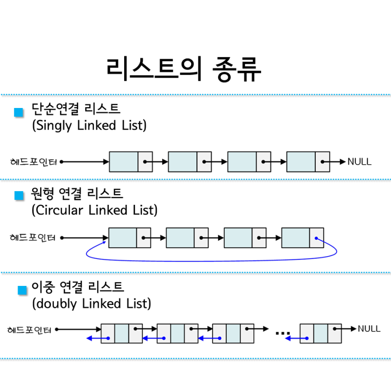

# 자료 구조 
> ### 대량의 데이터를 효율적으로 관리하기 위해 `데이터를 저장 및 정렬`하는 방식

<br>

## 자료구조의 분류
  

자료구조는 크게 선형 자료 구조, 비선형 자료 구조로 나뉜다
> 선형 자료 구조:
> * 리스트, 스택, 큐, 덱 등
> 비선형 자료 구조:
> * 그래프, 트리, 힙 등

---
<br>

## Array(배열)
`고정된 크기`를 갖는 `같은 자료형`의 원소들이 메모리에 연속적으로 저장되어 있는 자료구조
 * 인덱스(index)를 통한 임의접근 가능 (Random Access)
 * 데이터의 개수가 확실하게 정해져 있으며 접근이 빈번한 경우 효율적
 * 하지만 삽입 또는 삭제의 경우 연속적인 형태 유지를 위해 shift 연산을 해야하기 때문에 시간이 오래 걸린다 O(n)

배열의 크기는 `정적(static)`으로 생성후 변하지 않는다.   
> 처음 크기가 10이라면 저장된 데이터가 5개여도 실제 배열의 크기는 10으로 변하지 않는다
> * 제한적인 크기를 가지며 메모리의 Stack 영역에 할당된다.

<br>

  

<br>

## 동적 배열 (Dynamic Array)
`같은 자료형`의 원소들이 메모리에 연속적으로 저장되어 있는 자료구조

 * 정적 배열과는 다르게 `고정된 크기`를 가지지 않는다
 * C++ 에서는 `vector`가 있고 java에서는 `arraylist`가 존재한다

<br>

## C++ Vector
> `동적 배열`로 원소들이 메모리 상에서 실제로 순차적으로 저장되어 있다

 * LIFO (Last In First Out) 구조이다.
 * 주로 균형 이진 트리나 해시 함수를 사용해 구현된다
 * 임의의 위치에 있는 원소에 접근하는 것이 빠르다
 * 여유분을 두고 메모리를 할당하고 부족할 경우 새로운 메모리를 할당한다

<br>

  

<br>

### vector 사용
> vector<TYPE> 이름

``` cpp
vector<int> v;          // 벡터의 선언

// 벡터에 삽입하는 push_back()
v.push_back(1);         // 벡터에 1 삽입
v.push_back(2);         // 벡터에 2 삽입
v.push_back(3);         // 벡터에 3 삽입 

v.pop_back();           // 마지막 원소 삭제
```

<br>

### ***동적 배열은 크기를 어떻게 늘릴까?***
> 배열의 크기를 늘리는 것은 불가능하고 새로운 메모리를 할당하여 기존의 배열을 복사하는 방식이다

 * 배열의 크기를 조금씩 늘리면 배열이 증가할수록 복사하는 횟수가 증가하기 때문에 비효율적이다.

---
<br>

## List(리스트)
> 배열의 문제점을 해결하기 위한 자료구조로 `빈틈없는 데이터의 적재`라는 장점을 가진다 

* 배열에서 인덱스는 유일무이한 `식별자`이지만 리스트에서는 몇 번째 데이터인지 정도의 의미를 가진다.
* 빈 엘리먼트는 허용하지 않는다
* 크게 ArrayList, LinkedList로 나뉜다

### 언어별로 list의 지원 여부가 다르다
> * C: 리스트 지원 x
> * JavaScript: 배열에 리스트 기능 포함
> * Python: 기본 리스트, 배열 지원 x
> * Java: 배열과 리스트 모두 지원, ArrayList와 LinkedList로 나뉜다

<br>

## Array List(선형 리스트)
배열처럼 데이터들이 순서대로 늘어선 구조
* 배열의 특성을 공유
    > 데이터 접근이 용이하지만 삽입, 삭제가 느리다
* 리스트는 배열처럼 크기가 제한되어 있기 때문에 크기 변경시 많은 비용이 발생한다.
    > 자바의 경우 자동으로 사이즈를 관리한다 -> 동적 배열(Dynamic Array)

<br>

## Linked List(연결 리스트)
연결리스트는 노드와 포인터로 구성된 여러개의 노드가 연결된 구조
 * 크기가 가변적인 리스트로 배열의 단점을 보완했다
 * 노드를 가르키는 포인터를 저장할 저장공간이 따로 필요하다
 * 배열과는 다르게 임의접근이 아닌 순차접근으로 탐색은 불리하지만 삽입, 삭제가 용이하다
> 첫번째 노드를 헤드(head), 마지막 노드를 테일(tail)이라고 하며 각각을 가르키는 포인터가 따로 존재한다

<br>

  

<br>

### 연결리스트 구현
``` c
#include<stdio.h>
#include<stdlib.h>

typedef struct NODE{
    int data;
    struct NODE* next
}node;

void addNode(node *, int);
void deleteNode(node *);

int main(int argc, char * argv[])
{
    node * head = (node *)malloc(sizeof(node));
    head->next = NULL;

    node * cur = head->next;
    while(cur != NULL)
    {
        printf("%d\n", cur->data);
        cur = cur->next;
    }
    return 0;
}

void addNode(node * head, int data)
{
    node * newnode = (node *)malloc(sizeof(node));
    newNode->data = data;
    newNode->next = head->next;
    head->next = newNode;
}

void deleteNode(node *)
{
    node * delete = head->next;
    head->next=delete->next;
    free(delete);
}
```
<br>

## Stack(스택)
LIFO(Last In Last Out) 후입선출 방식으로 데이터를 저장하는 자료구조
 * 스택의 맨 윗부분을 가르키는 top 포인터가 존재한다
 > 데이터의 입력과 출력은 스택의 top에서만 가능하다

<br>

  

<br>

## Queue(큐)
FIFO(First In First Out) 선입선출 방식으로 데이터를 저장하는 자료구조
 * 큐에 저장된 맨 앞의 데이터를 가르키는 front와 맨 뒷 데이터를 가르키는 rear 포인터가 존재한다

<br>

   

<br>

## Deque(덱)
 double-ended queue의 줄임말로서 큐의 front와 rear에서 모두 삽입과 삭제가 가능한 큐

<br>

  

<br>


# 면접 질문

### 1. ArrayList와 LinkedList의 차이점은 무엇인가요 ?
ArrayList
* 원하는 데이터에 임의접근 가능
* 리스트의 크기가 제한되어 있으며, 리스트의 크기를 재조정하는 것은 많은 비용이 발생
* 데이터의 삽입, 삭제에 시간이 오래 걸린다

LinkedList
* 데이터의 삽입, 삭제가 용이
* 임의접근이 불가능하고 순차접근만 가능하다


### 2. Stack과 Queue의 차이점은 무엇인가요 ?