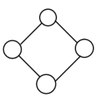
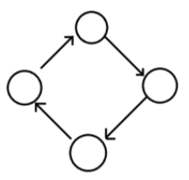
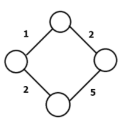
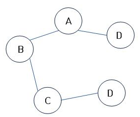
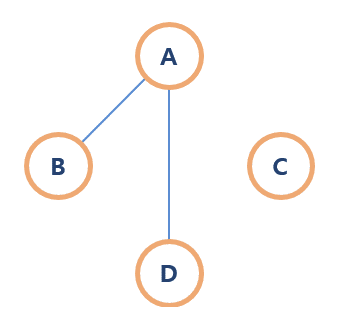
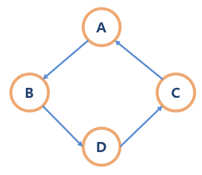
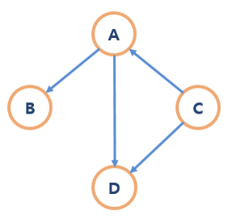
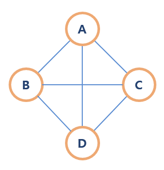
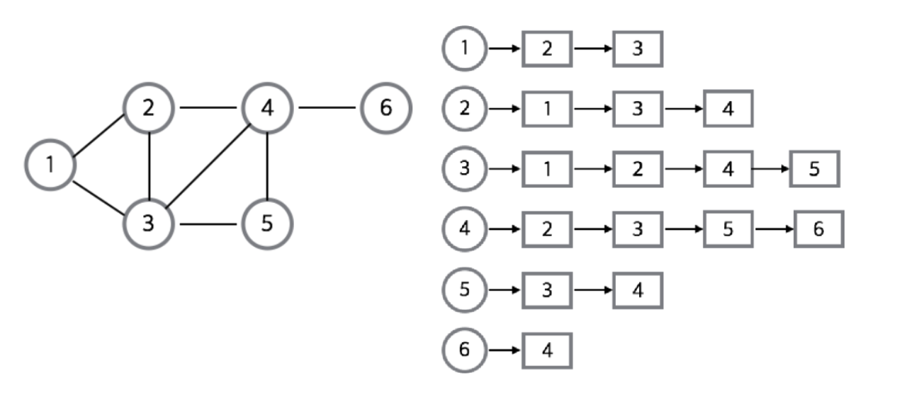
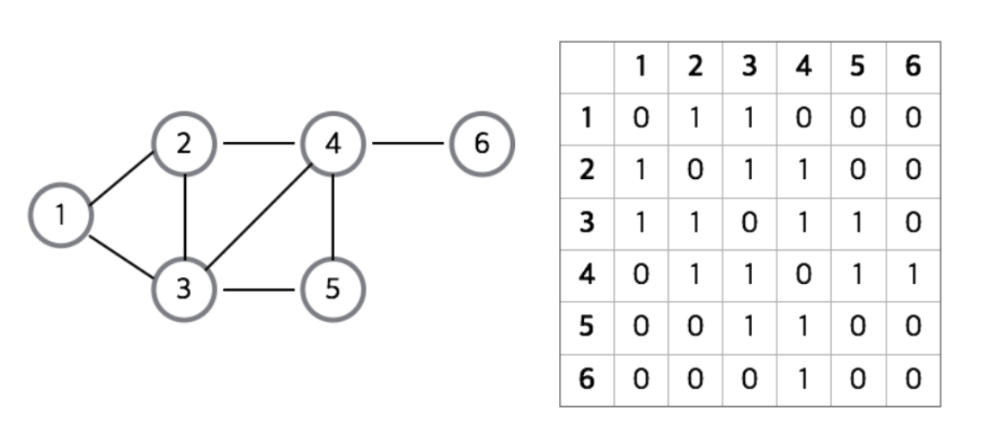

# 그래프(Graph)

## 그래프(Graph)란?

> 단순히 노드(N, node)와 그 노드를 연결하는 간선(E, edge)을 하나로 모아 놓은 자료구조

- 연결되어 있는 객체 간의 관계를 표현할 수 있다. ex) 지도, 지하철 노선도, 도로, 전기 회로 등
- 그래프는 여러 개의 고립된 부분 그래프로 구성될 수 있다.

 

## 그래프와 트리의 차이

|  | 그래프 | 트리 |
| --- | --- | --- |
| 정의 | 노드와 그 노드를 연결하는 간선을 하나로 모아 놓은 자료구조 | 방향성이 있는 비순환 그래프의 한 종류 |
| 방향성 | 방향 그래프와 무방향 그래프 모두 존재 | 방향 그래프 |
| 사이클 | 사이클 가능   자체 간선 가능   순환 그래프 or 비순환 그래프 | 사이클 불가능   자체 간선 불가능   비순환 그래프 |
| 루트 노드 | 루트 노드의 개념이 없음 | 한 개의 루트 노드 존재   모든 자식 노드는 한 개의 부모 노드를 가짐 |
| 부모 - 자식 | 부모 - 자식의 개념이 없음 | 부모 - 자식 관계로 이루어짐 |
| 모델 | 네트워크 모델 | 계층 모델 |
| 순회 | DFS, BFS | DFS, BFS 내 전위, 중위, 후위 |
| 간선의 수 | 그래프에 따라 간선의 수가 다름   간선이 없을 수도 있음 | 노드가 N인 트리는 항상 N-1의 간선을 가짐 |
| 경로 | - | 임의의 두 노드 간의 경로는 유일 |
| 예시 및 종류 | 지도, 지하철 노선도, 도로, 전기 등 | 이진 트리, 이진 탐색 트리, 균형 트리 등 |

 

## 그래프 관련 용어

- 정점(vertex): `위치`의 개념이며, 데이터가 저장된다. (node 라고도 부른다.)
- 간선(edge): 위치 간의 `관계`, 즉 노드를 연결하는 `선`이다. (link, branch 라고도 부른다.)
- 인접 정점(adjacent vertex): 간선에 의해 `직접 연결된 정점`
- 정점의 차수(degree): `무방향 그래프`에서 하나의 정점에 `인접한 정점`의 수
    - 무방향 그래프에 존재하는 정점의 모든 차수 합 = 그래프의 간선 수 * 2
- 진입 차수(in-degree): `방향 그래프`에서 `외부에서 오는` 간선의 수 (내차수 라고도 부른다.)
- 진출 차수(out-degree): `방향 그래프`에서 `외부로 향하는` 간선의 수 (외차수 라고도 부른다.)
- 경로 길이(path length): `경로를 구성`하는 데 사용된 간선의 수
- 단순 경로(simple path): 경로 중에서 `반복되는 정점이 없는` 경우
- 사이클(cycle): 단순 경로의 `시작 정점과 종료 정점이 동일`한 경우

 

---

## 그래프의 종류

### 무방향 그래프

- 간선에 방향성이 존재하지 않는 그래프이다.
- 정점 A와 정점 B를 연결하는 간선은 (A, B)와 같이 표현한다. (A, B) = (B, A)
- ex) 양방향 통행

### 방향 그래프

- 간선에 방향성이 존재하는 그래프이다.
- 정점 A와 정점 B를 연결하는 간선은 <A, B> 또는 <B, A>와 같이 표현한다. <A, B> != <B, A>
<A, B>는 A → B, <B, A>는 B → A를 나타낸다.
- ex) 일방 통행

### 가중치 그래프

- 간선에 비용이나 가중치가 할당된 그래프이다.
- 네트워크(Network) 라고도 한다.
- ex) 도로의 길이, 통신망의 사용료 등

### 연결 그래프

- 무방향 그래프에 있는 모든 정점 쌍에 대해서 항상 경로가 존재하는 그래프이다.
- ex) 트리(Tree) → 사이클을 가지지 않는 연결 그래프

### 비연결 그래프

- 무방향 그래프에서 특정 정점 쌍 사이에 경로가 존재하지 않는 그래프이다.

### 순환 그래프(사이클)

- 단순 경로의 시작 정점과 종료 정점이 동일한 그래프이다.

### 비순환 그래프

- 사이클이 형성되지 않는 그래프이다.

### 완전 그래프

- 속해 있는 모든 정점이 서로 연결되어 있는 그래프이다.
- 무방향 완전 그래프의 정점 수 = n → 간선의 수 = n * (n - 1) / 2

 

---

## 그래프의 구현

### 인접 리스트

- 인접 리스트로 그래프를 표현하는 것이 가장 일반적인 방법이다.
- 연결 리스트를 사용하여 구현한다.
- 모든 정점을 인접 리스트에 저장한다. → 각각의 정점에 인접한 정점들을 리스트로 표현한 것
- 배열과 배열의 각 인덱스마다 존재하는 또 다른 리스트, 연결리스트를 이용해서 인접 리스트를 표현한다.
- 인덱스를 통해 각 정점의 리스트에 쉽게 접근할 수 있다.

#### 장점

- 필요한 만큼의 메모리만 사용하기 때문에 메모리 낭비가 없다.
- 정점들의 연결 정보를 확인하는 데, 시간이 적게 걸린다. → O(n)

#### 단점

- 특정 두 점이 연결되어있는지 확인하려면 인접 행렬에 비해 시간이 오래걸린다. → O(n)
- 구현이 어렵다.

### 인접 행렬

- 2차원 배열을 사용하여 구현한다.
- 간선이 존재하는 두 정점 칸은 1, 존재하지 않는 칸은 0으로 채운다.
가중치 그래프의 경우, 해당 가중치로 채운다.

#### 장점

- 2차원 배열에 그래프의 정보가 모두 담겨있기 때문에 간선의 존재 여부나 가중치를 바로 참조할 수 있다. → O(1)
- 인접 리스트에 비해 구현이 쉽다.

#### 단점

- n x n의 2차원 배열을 사용하기 때문에 메모리를 필요 이상으로 많이 사용할 수 있다.
ex) 10000개의 정점으로 구성된 그래프 내에 간선이 5개만 존재할 경우
- 모든 간선 정보를 대입하는 시간이 오래 걸린다. → O(n^2)

 

---

## 면접 대비

- 연결 그래프와 완전 그래프의 차이점은?
- 인접 리스트와 인접 행렬의 장단점은?