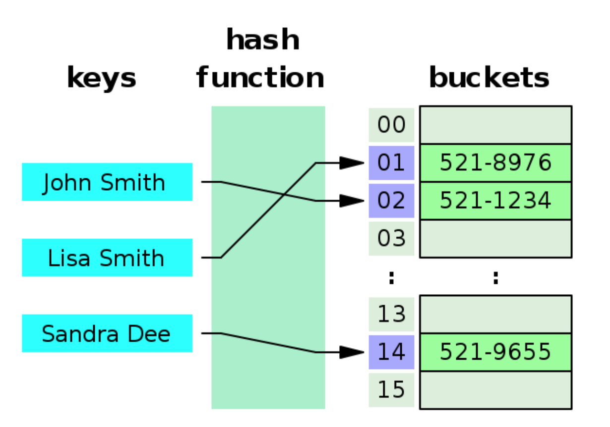
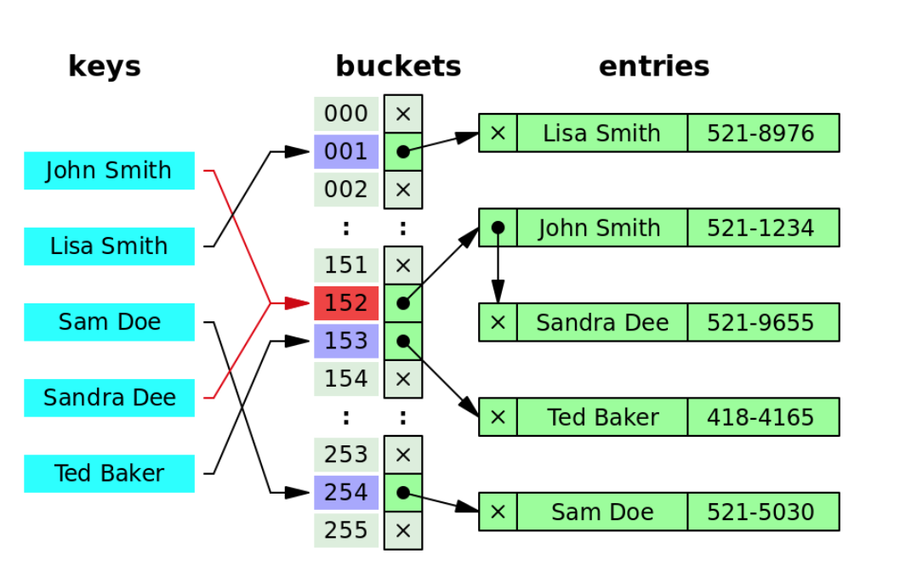

# Hash
> 효율적인 데이터 관리를 위해, 데이터를 고정된 길이의 데이터로 바꾸어 저장하는 것



## 해싱(Hashing)
- 키에 산술 연산을 적용하여 나온 결과를 주소로 하여 값에 접근하는 방법
- 해시 테이블을 이용한 탐색
- 키와 값을 매핑시키는 과정  

## 해시 테이블

> 해시함수를 사용하여 키를 해시값으로 변환하고, 이 해시값을 인덱스로 하여 데이터를 키와 함께 저장하는 자료구조
- m개의 버킷(bucket)으로 이루어져 있으며, 하나의 버킷은 s개의 슬롯(slot)을 가질 수 있다.
- 자료를 저장하는데 배열을 사용한다.  


## 해시 함수

> 키값을 고정된 길이의 해시로 변경해주는 함수
- 키값을 그대로 저장소의 색인으로 사용할 경우 키의 길이만큼의 정보를 저장할 공간도 마련해야하기 때문에, 고정된 길이의 해시로 변경한다.
- 좋은 해시함수의 조건

     1. 충돌 확률이 적은 함수
     2. 값을 테이블 내에 고르게 분포할 수 있는 함수
     3. 계산이 빠른 함수   

## 해시 충돌  


> 서로 다른 키가 해싱 후 같은 해시 주소를 가지는 현상
- 해시 충돌이 빈번히 일어나서 빈 버킷이 남지 않으면 오버플로우가 일어난다 -> 해시테이블에 값을 저장할 수 없게 된다.
- 해시 충돌을 줄이는 것이 아주 중요  

---   

## 해싱의 장점
- 원하는 항목이 들어 있는 위치를 알고 있다면 매우 빠르게 자료에 접근 가능하다.

    ->이상적인 해싱의 경우, O(1)의 시간복잡도를 가진다.
- 키와 값 사이에 연관성이 없어 보안에도 많이 사용된다.

## 해싱의 단점  
- 데이터가 저장되기 전에 미리 공간을 만들어놔야하기 때문에 공간 효율성이 떨어진다.
- 충돌이 일어날 경우버킷 내부의 순차탐색 시간이 길어져 탐색 성능이 저하될 수 있다. 
- 충돌이 버킷에 할당된 슬롯 수보다 많이 발생하게 되면 오버플로우가 발생한다.  
---
## 이상적인 해싱
- 키와 값의 모든 경우의 수를 버킷으로 가지고 있는 경우

    -> 해시 함수를 계산하는 시간만 필요로한다. ( 추가적인 배열 탐색이 필요없다.)  
## 실제의 해싱
- 해시 테이블의 크기가 제한되어 있기 때문에, 하나의 키당 하나의 공간을 할당하는 것은 불가능하다.
- 공간 낭비를 고려하여, 실제로는 더 작은 해시테이블을 만들어주는 해시함수를 이용한다. -> 충돌이 일어나는 이유
- 실제의 해싱의 경우 오버플로우가 자주 발생하기 때문에 시간복잡도가 O(1)보다 떨어진다.   
---
## 충돌 해결 방법
1. 개방 주소법(open addressing): 충돌이 일어난 항목을 해시 테이블의 다른 위치에 저장하는 방법. 비어있는 버킷을 찾는다.
    - 선형 조사법: 충돌이 일어난 버킷의 다음 버킷이 비어있는지 확인하는 방법
        - h(k), h(k)+1, h(k)+2 ... 순으로 탐색
        - 조사를 시작했던 곳으로 되돌아올 때까지 확인을 계속한다.
        - 키들이 집중되어 저장되는 현상이 자주 발생하며, 최악의 경우 집중된 항ㅁ고이 결합하는 현상도 발생한다.
        - 오버플로우가 자주 발생하면 집중과 결합에 의해 탐색 효율이 크게 저하된다.  
        
        ```  
        //선형 조사법을 이용하여 테이블에 키 삽입. 테이블이 가득 찼을 경우 종료
        #define empty(item) (strlen(item.key==0))
        #define equal(item1, item2) (!strcmp(item1.key, item2.key))

        void hash_lp_add(element item, emelent ht[])
        {
            int i, hash_value;
            hash_value=i=hash_function(item.key);
            while(!empty(ht[i])){
                if(equal(item, ht[i])){
                    fprintf(stderr, "탐색키가 중복되었습니다.\n");
                    exit(1);
                }
                i=(i+1)%TABLE_SIZE;
                if(i==hash_value){
                    fprintf(stderr, "테이블이 가득찼습니다.\n");
                    exit(1);
                }
            }
            ht[i]=item;
        }
        ```  

    - 이차 조사법: `(h(k)+inc*inc)mod M for inc=0, 1, ..., M-1` 의 식을 통해 다음 조사 위치를 결정하는 방법
        - h(k), h(k)+1, h(k)+4, h(k)+9 ... 순으로 탐색
        - 선형 조사법의 집중과 결함을 크게 완화시킬 수 있다. 

        ```  
        void hash_qp_add(element item, emelent ht[])
        {
            int i, hash_value, inc=0;
            hash_value=i=hash_function(item.key);
            while(!empty(ht[i])){
                if(equal(item, ht[i])){
                    fprintf(stderr, "탐색키가 중복되었습니다.\n");
                    exit(1);
                }
                i=(hash_value+inc*inc)%TABLE_SIZE;
                inc=inc+1;
                if(i==hash_value){
                    fprintln(stderr, "테이블이 가득찼습니다.\n");
                    exit(1);
                }
            }
            ht[i]=item;
        }
        ```  
    - 이중 해싱법(재해싱): 원래의 해시함수와 다른 별개의 해시 함수를 이용해 다음 위치를 정하는 방법
        - h(k), h(k)+h'(k), h(k)+2*h'(k) ... 순으로 탐색. (여기서 h'(k)=C-(k mod C), C는 테이블 크기보다 약간 작은 소수)
        - 다른 방법들보다 테이블에 값을 균일하게 분포시킬 수 있어 효과적이다. 

            ->충돌이 발생했을 때 해시값에 일정 값을 더하는 다른 방법들은 조사 위치가 항상 일정한 것에 반해 키를 참조하여 값을 더하는 이중해싱법은 조사 순서가 달라지기 때문.
        ```  
        void hash_dh_add(element item, emelent ht[])
        {
            int i, hash_value, inc;
            hash_value=i=hash_function(item.key);
            inc=hash_function2(item.key);
            while(!empty(ht[i])){
                if(equal(item, ht[i])){
                    fprintf(stderr, "탐색키가 중복되었습니다.\n");
                    exit(1);
                }
                i=(i+inc)%TABLE_SIZE;
                if(i==hash_value){
                    fprintln(stderr, "테이블이 가득찼습니다.\n");
                    exit(1);
                }
            }
            ht[i]=item;
        }
        ```  

2. 체이닝(chaining): 해시테이블 하나의 위치가 여러 개의 항목을 저장할 수 있도록 해시테이블의 구조를 변경하는 방법.   
    - 충돌이 발생하면 새로운 노드를 생성하여 저장한다.
    ```
    typedef struct{
        int key;
    } element;
    struct list{
        element item;
        struct list *link;
    };
    struct list *hash_table[TABLE_SIZE];

    //체인법을 이용하여 테이블에 키를 삽입하는 코드
    void hash_chain_add(element item, struct list *ht[]){
        int hash_value = hash_function(item.key);
        struct list *ptr;
        struct list *node_before = NULL, *node=ht[hash_value];
        for(;node;node_before=node, node=node->link){
            if(node->item.key==item.key){
                fprintf(stderr, "이미 탐색키가 저장돼 있음.\n");
                return;
            }
        }
        ptr=(struct list*)malloc(sizeof(struct list));
        ptr->item=item;
        ptr->link=NULL;
        if(node_before) node_before->link=ptr;
        else ht[hash_value]=ptr;
    }
    ```


