# 트리
> 일반적으로 대상 정보의 각 항목들을 계층적으로 구조화할 때 사용하는 비선형 자료구조

* `데이터 저장`의 의미보다는 `저장된 데이터를 더 효과적으로 탐색`하기 위해 사용된다
* 사이클이 없는 그래프라고도 한다

부모-자식 관계의 노드들로 이루어진다
> 계층적인 구조 표현   
> 디렉토리 구조   
> 인공지능의 의사결정트리

 

## 디렉토리 구조
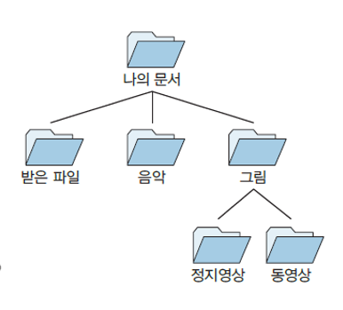  

 

## 의사결정트리
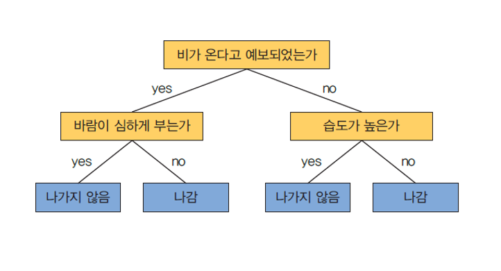  

 

### 트리의 용어
> * 노드(node): 트리의 구성요소
> * 루트(root): 부모가 없는 노드(최상위 노드)
> * 서브 트리(subtree): 하나의 노드와 그 노드들의 자식들로 이루어진 트리
> * 단말노드(terminal node, leaf node): 자식이 없는 노드
> * 비단말노드: 적어도 하나의 자식을 가지는 노드
> * 레벨(level): 트리의 각 층의 번호
> * 높이(height): 트리의 최대 레벨
> * 차수(degree):  노드가 가지고 있는 자식 노드의 개수
> * 내부노드(internal node): 자식이 없는 노드로 leaf node라고도 함
> * 외부노드(external node): leaf node를 제외한 모든 노드, 자식이 있는 노드

 

## 트리의 순회

 

## 1. 전위 순회(preorder)
> 루트노드 -> 왼쪽 서브트리 -> 오른쪽 서브트리 순서로 순회하는 방식 
> * `깊이 우선순회` 라고도 한다

  
 <b>순회 방법 

  

 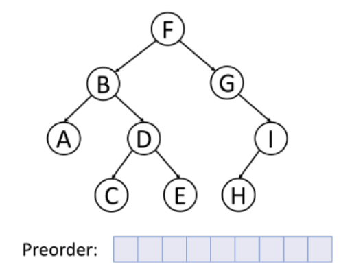  
  

 

## 2. 중위 순회(inorder)
> 왼쪽 서브트리 -> 노드 -> 오른쪽 서브트리 순서로 순회하는 방식
> * `대칭 순회` 라고도 한다

  
 <b>순회 방법 

  

 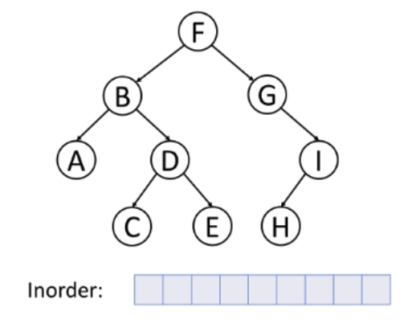  
  

 

## 3. 후위 순회(postorder)
> 왼쪽 서브트리 -> 루트노드 -> 오른쪽 서브트리 순서로 순회하는 방식

  
 <b>순회 방법 

  

 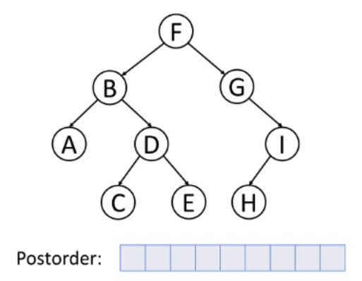  
  

 

## 이진트리
> 모든 노드가 2개 이하의 자식 노드를 가지는 자료구조

### 편향 이진 트리
> 모든 노드들이 자식을 하나만 갖는 이진트리

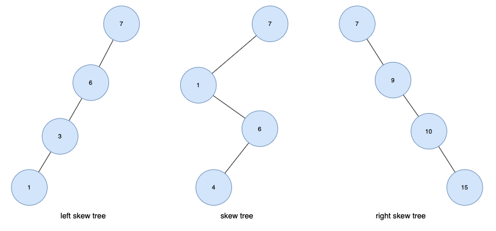

 

### 포화 이진 트리
> 용어 그대로 트리의 각 레벨에 노드가 꽉 차있는 이진트리

 

### 완전 이진 트리 
> 마지막 레벨을 제외하고 모든 노드가 채워져 있는 이진트리
> * 포화 이진 트리와 노드 번호가 일치

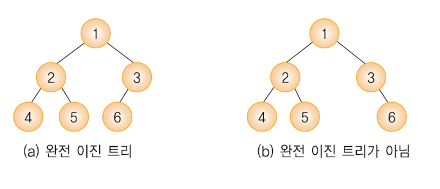

 

## 이진 탐색 트리
> 탐색을 효율적으로 하기 위한 이진 트리 기반의 자료구조
> * 탐색이 트리의 높이만큼 시간이 필요하다

* 데이터는 right>=root>=left 로 저장된다
* 모든 노드는 중복된 값을 가지지 않는다
* 이진 탐색을 중위순회하면 오름차순으로 정렬된 값을 얻을 수 있다.

 

  
 <b>이진 탐색 트리를 만드는 과정 

  

   
  

 

  
 탐색 과정 

  

   
  

 

## RBT(Red-Black-Tree)
> 균형 이진 탐색 트리로 O(logn)의 시간복잡도를 가진다
> * 이진 탐색 트리에 한 쪽으로 값이 편향되게 들어온다면 굉장히 비효율적인 퍼포먼스를 보이기 때문에 이를 보완하기 위한 방법 

* root node 보다 작은 값은 reft node로 큰 값은 right node로 배치하는 균형트리

### RBT의 조건
> * Root Property: 루트노드는 검정(Black)이다.
> * External Property: 모든 external node들은 검정이다.
> * Internal Property: 빨강(Red)노드의 자식은 검정이다.
> * Depth Property: 모든 leaf node에서 black depth는 같다
>   * leaf에서 root까지 가는 경로에서 만나는 black node의 개수는 같다

 

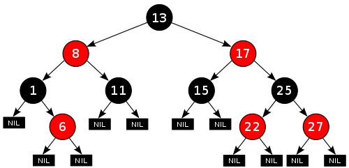

  

# 그래프 
> 연결되어 있는 객체 간의 관계를 표현하는 자료구조

 

### 오일러 문제
> 모든 다리를 한 번만 건너서 처음 출발했던 장소로 돌아오는 문제
> * 한붓그리기 
> * 오일러 정리: 모든 정점에 연결된 간선의 수가 짝수이면 오일러 경로 존재

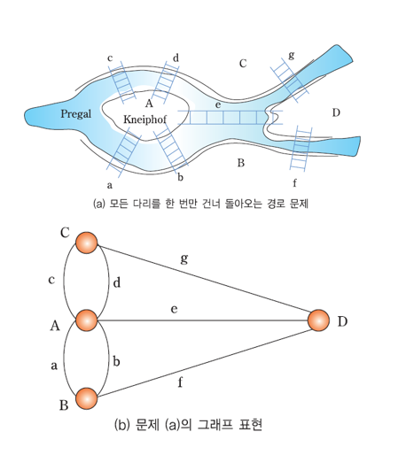

 

 * 위치: 정점(Vertex)
 * 다리: 간선(Edge)

### 그래프 예시

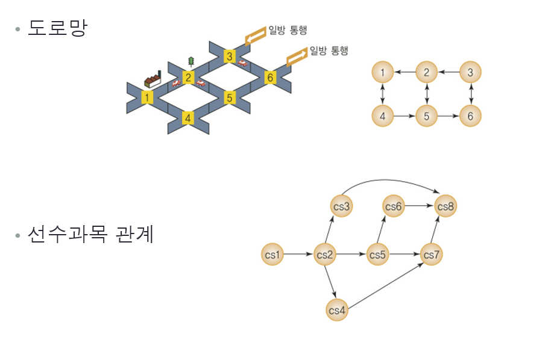

### 그래프 G는 (V, E)로 표시

 

## 그래프 관련 용어

 

### 정점(Vertex)
> * 여러 가지 특성을 가질 수 있는 객체
> * V(G): 그래프 G의 정점들의 집합
> * 노드(node) 라고도 불림

 

### 간선(Edge)
> * 정점들 간의 관계를 의미
> * E(G): 그래프 G의 간선들의 집합
> * 링크(link) 라고도 불림

* 인접 정점(Adjacent Vertex): 간선에 의해 직접 연결된 정점
* 단순 경로(Simple Path): 한분그리기와 같이 같은 간선을 지나가지 않는 경로
* 차수(Degree): 무방향 그래프에서 하나의 정점에 인접한 정점의 수
* 진입 차수(Out-Degree): 방향 그래프에서 외부에서 들어오는 간선의 수 
* 진출 차수(In-Degree): 방향 그래프에서 외부로 향하는 간선의 수
* 경로 길이(Path Length): 경로를 구성하는데 사용된 간선의 수
* 사이클(Cycle): 단순 경로의 시작 정점과 종료 정점이 동일한 경우

  
 <b>그래프 표현 예시 

  

 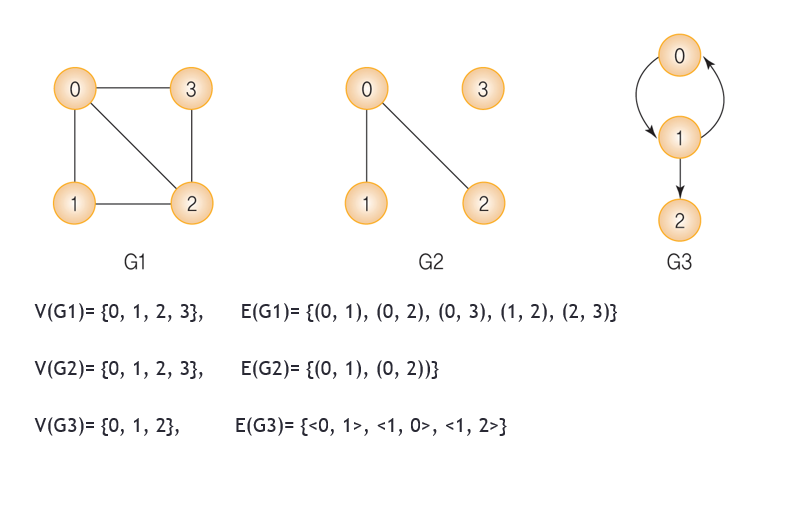  
  

 

  
 <b>방향 그래프 

  

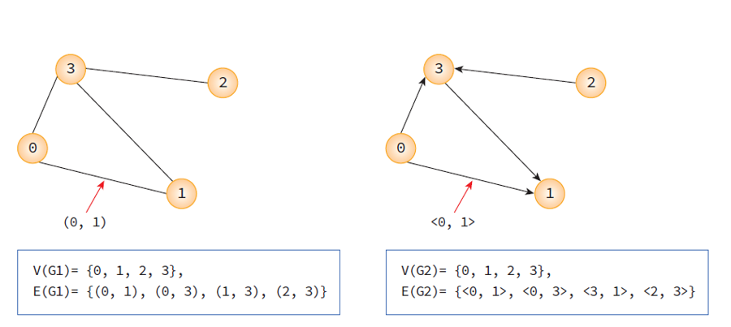
  

 

  
 <b>가중치 그래프 

  

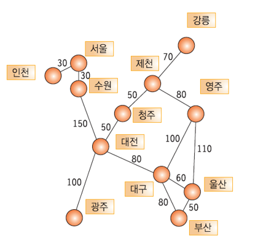
  

> 간선에 비용이나 가중치가 할당된 그래프

 

  
 <b>부분 그래프 

  

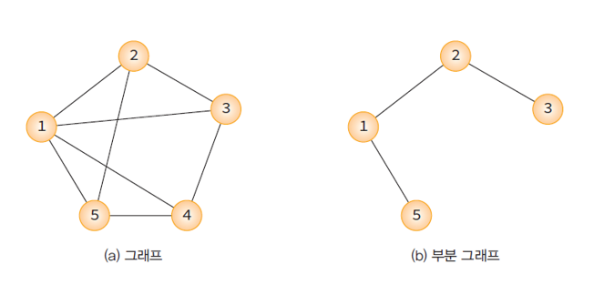
  

 

  
 <b>연결 그래프 

  

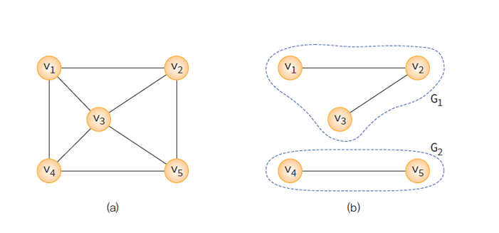
  

 

  
 <b>완전 그래프 

  

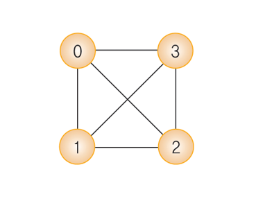
  

 

## 그래프 표현 방법

 

### `인접 행렬 방법`

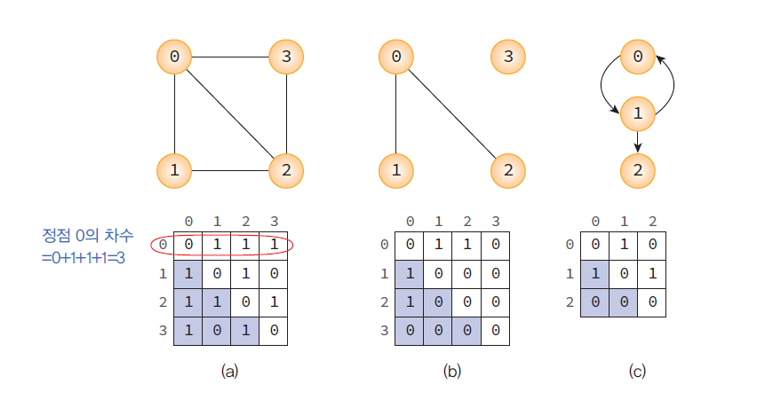

* 간선 (i,j)가 그래프에 존재 하면 M[i][j]=1, 그렇지 않으면 M[i][j]=0

 

### `인접 리스트 방법`

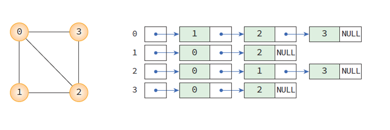

* 각 정점에 인접한 정점들을 연결리스트로 표현

  

## 그래프와 트리의 차이

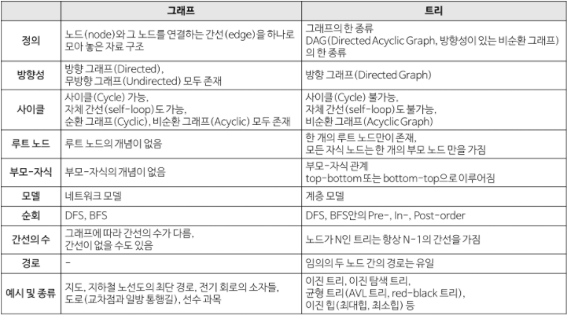

  

# 면접 질문

### BST(Binary Search Tree)와 Binary Tree에 대해서 설명하세요.

  
 <b>정답 보기 

  

   
이진트리(Binary Tree)는 자식 노드가 최대 두 개인 노드들로 구성된 트리이고,
이진 탐색 트리(BST)는 이진 탐색과 연결 리스트를 결합한 자료구조입니다.
이진 탐색의 효율적인 탐색 능력을 유지하면서, 빈번한 자료 입력과 삭제가 가능하다는 장점이 있습니다. 
이진 탐색 트리는 왼쪽 트리의 모든 값은 반드시 부모 노드보다 작아야 하고, 오른쪽 트리의 값은 부모 노드보다 커야 하는 특징이 있습니다.
이진 탐색 트리의 탐색 연산은 트리의 높이에 영향을 받아 높이가 h일 때 시간 복잡도는 O(h)이며,
트리의 균형이 한쪽으로 치우쳐진 경우 worst case가 되고 O(n)의 시간 복잡도를 가집니다. 
이런 worst case를 막기 위해 나온 기법이 RBT(Red-Black Tree)입니다.
   
  

### RBT(Red-Black-Tree)에 대해서 설명하세요.

  
 <b>정답 보기 

  

RBT(Red-Black Tree)는 BST를 기반으로 하는 트리 형식 자료구조이며,
 RBT는 BST의 삽입, 삭제 연산 과정에서 발생할 수 있는 문제점을 해결하기 위해 만들어졌습니다.
BST를 기반으로 하기 때문에 당연히 BST의 특징을 모두 갖습니다.
노드의 child가 없을 경우 child를 가리키는 포인터는 NIL 값을 저장합니다. 이러한 NIL들을 leaf node로 간주합니다.
모든 노드를 빨간색 또는 검은색으로 색칠하며, 연결된 노드들은 색이 중복되지 않습니다.
  

  

ref)
* https://velog.io/@kimdukbae/%EC%9E%90%EB%A3%8C%EA%B5%AC%EC%A1%B0-%ED%8A%B8%EB%A6%AC-Tree
* https://dev-coco.tistory.com/159
