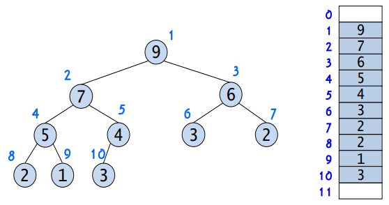
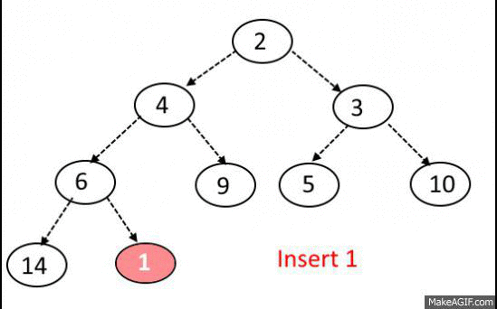

# 우선순위 큐 (Priority Queue)
> 힙(Heap)을 통해 구현되며 FIFO(First In First Out)인 Queue와는 다르게 우선순위가 높은 데이터가 먼저 나가는 형태의 자료구조이다.

<br>

## 힙(Heap)
> 완전이진트리로 최댓값, 최솟값 탐색이 빠르다

 * 이진탐색트리(BST)와는 다르게 중복된 값이 허용된다
 * 최대 힙(Max Heap): 부모 노드의 키 값이 자식 노드보다 크거가 같은 완전이진트리
 * 최소 힙(Min Heap): 부모 노드의 키 값이 자식 노드보다 작거나 같은 완전이진트리

<br>


> 힙은 동적배열로 구현되며 완전이진트리기 때문에 그림과 같은 idx를 갖는다

<br>

### 힙은 일반적으로 배열을 이용하여 구현한다.
 * idx 0은 root 노드를 의미한다
 * i번째 왼쪽 자식 노드의 idx: (i * 2) + 1
 * i번째 오른쪽 자식 노드의 idx: (i * 2) + 2
 * i번째 자식 노드의 root 노드 idx: (i / 2)
 * 원소 삽입/삭제: O(logn)
 * 원소 탐색: O(1)

<br>

### ***원소를 추가한 이후에 Heap을 만족시키기 위해서 정렬하는 과정이 존재한다***

<br>

### 데이터 삽입후 정렬
``` cpp
// 힙에 데이터 삽입
_heap.push_back(data);

// 삽입된 데이터 추출
int now = static_cast<int>(_heap.size()) - 1;
	// 루트 노드까지
	while (now > 0)
	{
	    // 부모 노드와 비교해서 더 작으면 패배
		int next = (now - 1) / 2;
		if (max(_heap[now], _heap[next]))
			break;

		// 데이터 교체
		::swap(_heap[now], _heap[next]);
		now = next;
		}
```
 * 힙 구조에 맞게 배열의 가장 마지막에 데이터를 삽입한다
 * 이후 부모노드와 비교해서 부모노드보다 크다면 데이터를 계속해서 교체해나간다.

<br>

## 우선순위 큐
> 일반적으로 완전이진트리의 일종인 힙으로 구현되며 우선 순위를 가진 원소들로 이루어져있다.

<br>



<br>

### 우선순위 큐의 구현
``` cpp
#include <iostream>
#include <vector>
#include <queue>
using namespace std;

template<typename T, typename Container = vector<T>, typename Predicate = less<T>>
class PriorityQueue
{
public:
	void push(const T& data)
	{
		// 우선 힙 구조부터 맞춰준다
		_heap.push_back(data);

		// 도장깨기 시작
		int now = static_cast<int>(_heap.size()) - 1;
		// 루트 노드까지
		while (now > 0)
		{
			// 부모 노드와 비교해서 더 작으면 패배
			int next = (now - 1) / 2;
			if (_predicate(_heap[now], _heap[next]))
				break;

			// 데이터 교체
			::swap(_heap[now], _heap[next]);
			now = next;
		}
	}

	void pop()
	{
		_heap[0] = _heap.back();
		_heap.pop_back();

		int now = 0;

		while (true)
		{
			int left = 2 * now + 1;
			int right = 2 * now + 2;

			// 리프에 도달한 경우
			if (left >= (int)_heap.size())
				break;

			int next = now;

			// 왼쪽과 비교
			if (_predicate(_heap[next], _heap[left]))
				next = left;

			// 둘 중 승자를 오른쪽과 비교
			if (right < (int)_heap.size() && _predicate(_heap[next], _heap[right]))
				next = right;

			// 왼쪽/오른쪽 둘 다 현재 값보다 작으면 종료
			if (next == now)
				break;

			::swap(_heap[now], _heap[next]);
			now = next;
		}
	}

	T& top()
	{
		return _heap[0];
	}

	bool empty()
	{
		return _heap.empty();
	}

private:
	Container _heap = {};
	Predicate _predicate = {};
};


int main()
{
	PriorityQueue<int, vector<int>, greater<int>> pq;

	pq.push(100);
	pq.push(300);
	pq.push(200);
	pq.push(500);
	pq.push(400);

	while (pq.empty() == false)
	{
		int value = pq.top();
		pq.pop();

		cout << value << endl;
	}
}
```