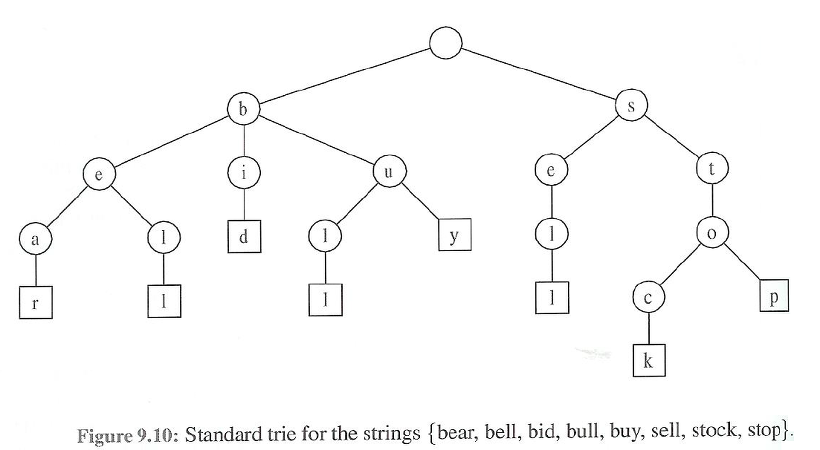
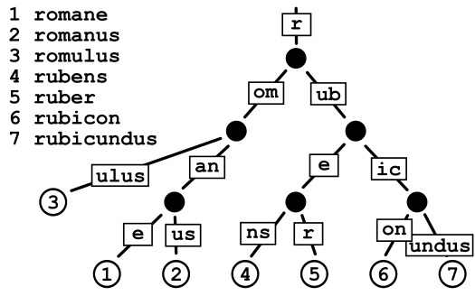
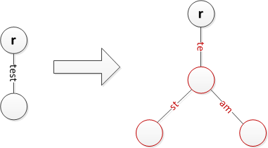

# 트라이 (Trie)



<br>

## 트라이란?
> 문자열 검색 및 저장을 효율적으로 할 수 있게 해주는 트리 형태의 자료구조   
- 검색어 자동완성에 사용
- 링크드 리스트 사용

<br>

## 트라이의 작동 원리
> 생성  
1. 주어진 문자열의 맨 앞 문자부터 순차적으로 가져온다.
2. 현재 문자로 이루어진 노드가 존재하면, 그 노드로 다음 문자열을 탐색하고, 노드가 없으면 노드를 새로 생성한 후 다음 문자열을 탐색한다.
3. 마지막 문자열이 현재 문자가 될 때까지 반복한다.
4. 더이상 삽입할 문자가 존재하지 않는다면, 끝난 문자열임을 표시한다.
> 탐색
1. 탐색하고자 하는 문자열의 첫 번째 문자를 가져온다.
2. 현재 노드(루트노드)의 자식 노드에 해당 문자의 노드가 있으면 다음 문자로 넘어간다.
    -  만약 현재 노드의 자식 노드에 해당 문자의 노드가 존재하지 않는다면 트라이에 삽입되지 않는 문자열이다.
3. 위의 과정을 문자열의 마지막까지 반복한다.
4. 마지막 문자열까지 노드에 존재할 경우, 끝난 문자열 표시를 확인한다. 
    - 만약 문자열이 끝났다는 표시가 되어있으면 해당 문자열은 트라이에 존재한다. 그러나 그렇지 않다면 해당 문자열은 트라이에 존재하지 않는 문자열이다.


<br>


---

<br>


## 트라이의 장점
- 빠른 문자열 검색이 가능하다.
- 시간복잡도 측면에서 효율적이다.
    - 생성 시간 복잡도 -> O(M*L)
    - 탐색 시간 복잡도 -> O(L) 
    - M은 총 문자열의 수, L은 가장 긴 문자열의 길이
- 정렬되어 저장된다.

<br>

## 트라이의 단점
- 저장 공간의 크기가 크다.

<br>

---

<br>

## 코드로 구현하기 (C)
노드 구조
```
typedef struct node{
    int fin; //끝난 문자열임을 알리는 변수
    struct node *child[26] //알파벳 26개(자식이 될 수 있는 모든 경우의 수)
}node;
```
노드 생성
```
node *newNode(){
    node* new=(node *)malloc(sizeof(node));
    new-> fin=0;
    for(int i=0;i<26;i++) new->child[i]=0; //0으로 초기화
    return new;
}
```
삽입
```
void insert(node *root, const char* str){
    int len=strlen(str);
    node* now=root;
    for(int i=0;i<len;i++){
        if(!now->child[str[i]-'a']) now->child[str[i]-'a']=newNode(); //해당 문자를 가진 노드가 없다면 자식노드 생성
        now=now->child[str[i]-'a']; //문자 저장
    }
    now->fin=1; //길이만큼 저장하면, 끝난 문자열임을 알린다
}
```
탐색
```
int search(node *root, const char* str){
    node* now=root;
    for(int i=0;i<strlen(str);i++){
        if(!now->child[str[i]-'a']) return 0;
        now=now->child[str[i]-'a'];
    }
    return now->fin;
}
```

---



## radix Trie
- 트라이에서 메모리 효율성을 좋게 만든 자료구조.
- compact prefix tree라고도 함
- 홀로 있는 자식인 경우, 부모노드와 합쳐서 공간 최적화를 함.
- radix Tree와 혼용해서 사용되기도 함
<br>



<br>

---

참고자료<br>
https://yabmoons.tistory.com/379
https://en.wikipedia.org/wiki/Radix_tree
https://brunch.co.kr/@springboot/75