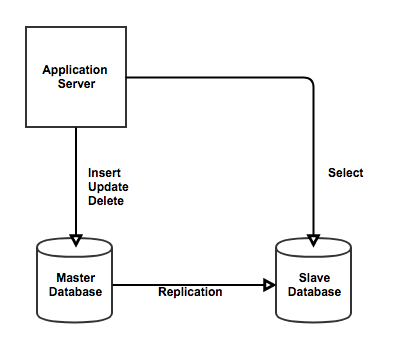
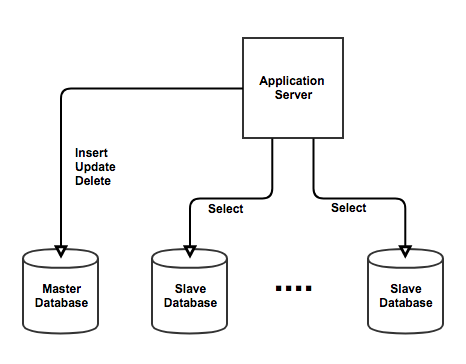

# 데이터베이스 리플리케이션(Database Replication)
> 데이터베이스 리플리케이션은 실시간 복제본 데이터베이스 서버를 운용하는 것을 의미한다

* 두 개 이상의 DBMS 시스템을 `Master / Slave`로 나눠서 동일한 데이터를 저장하는 방식

 

* `마스터 서버`: 기준이 되는 서버
* `리플리카(Replica) 서버`: 마스터 서버와 동일한 내용을 갖는 또 다른 서버

 

 

어플리케이션은 데이터베이스에 SQL query을 보내 데이터의 삽입/삭제/변경이 이루어진다
 * 마스터 서버는 SQL query를 수신하면 리플리카 서버에도 동일하게 SQL query를 전송한다
 * 따라서, 마스터 서버와 리플리카 서버의 데이터가 동일한 상태로 유지된다

 

### 데이터베이스 리플리케이션의 목적
> 데이터가 손상되었을 때 할 수 있는 가장 기초적인 대처는 가장 최신의 백업본을 복구하여 사용하는 것이다. 하지만 백업본을 이용한 대처에는 큰 단점이 존재한다

 * 데이터 백업을 주기적으로 자동으로 되도록 해놓았다고 하더라도 백업된 시간과 장애가 발생한 시간 사이의 데이터 변경 사항들은 모두 소실된다
 * 이러한 단점을 극복하기 위해 리플리케이션을 사용할 수 있다
 * 리플리케이션은 기본적으로 데이터의 `안정성`의 목적으로 사용된다

 

* 리플리카 서버는 `아주 약간의 딜레이가 있지만` 거의 실시간으로 마스터 서버와 동일한 데이터를 갖고 있기 때문에 장애 복구 시 데이터 소실이 최소화된다
* 리플리카 서버는 마스터 서버로 승격이 가능하기 때문에 마스터 서버를 대체할 수 있다
* 리플리카 서버를 마스터 서버로 승격한 후 새로운 마스터 서버에 대한 리플리카 서버를 생성한다

 

### 리플리케이션의 장점
> 리플리카 서버는 기본적으로 읽기전용(Readonly)로 운용된다.   
> 이러한 특성을 활용하여 데이터베이스 서버의 부하를 줄일 수 있다

 

* SQL Query의 대부분은 `select`가 차지하고 있다
* 읽기전용 작업을 리플리카 서버에서 부담하도록 한다
* 이를 통해서 `select` 성능 향상과 마스터 서버의 부담을 줄일 수 있다

 

 