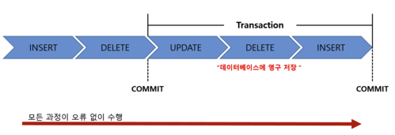
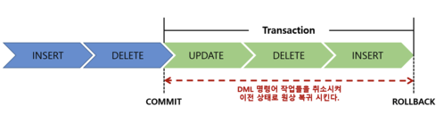

# 트랜잭션(Transaction)

> 은행 ATM이나 데이터베이스 등의 시스템에서 사용되는 더 이상 쪼갤 수 없는 업무 처리의 최소 단위
> 
- 하나 이상의 CRUD 작업들을 마치 하나의 실행 단위인 것처럼 묶어주는 기능이다.
- 주로 하나의 업무를 처리하기 위해 여러 개의 CRUD 작업이 순서대로 실행되어야 할 때 사용되며, DBMS가 CRUD 다음으로 중요하게 다루는 기능이다.
- DBMS가 제공하는 트랜잭션은 연관된 여러 개의 CRUD 작업을 묶어 단일 작업처럼 수행할 수 있도록 해준다.   
→ CRUD 작업들을 트랜잭션으로 묶으면 하나의 CRUD를 실행하는 것처럼 처리할 수 있어 논리적 작업 단위(LUW, Logical Units of Work)라고 부르기도 한다.
- 단순한 트랜잭션의 경우 하나의 CRUD 작업으로 구성되기도 하지만, 대부분의 트랜잭션은 여러 개의 CRUD 작업으로 이루어져 있다.

## 트랜잭션의 필요성

- 상용 서비스 환경에서 복잡한 기능이나 업무를 처리하다 보면 단건의 CRUD만으로는 업무의 완결성을 갖지 못하는 경우가 생긴다.   
ex) 하나의 데이터를 쪼개어 여러 곳에 저장하기 위해 여러 번의 CRUD 작업을 실행해야 하는 경우,    
기존에 입력된 데이터를 읽고 그 내용에 따라 저장과 수정 혹은 삭제 중 하나를 선택해서 처리해야 하는 경우   
⇒ 따라서, 업무의 완결성을 갖기 위해서는 여러 개의 연관된 CRUD 작업이 함께 수행되어야 한다.

## 트랜잭션의 사례: 계좌이체

- 계좌이체는 여러 개의 CRUD가 모여서 이루는 하나의 논리적 작업 단위, 즉 트랜잭션이다.
- 두 계좌 간에 백만 원을 이체하는 계좌이체 거래를 처리한다면, 은행 데이터베이스에서는 다음과 같은 순서에 따라 데이터의 CRUD 작업이 발생하게 된다.

1. A의 계좌에 백만 원 이상의 잔고가 있는지 확인한다.
2. A의 계좌 잔액에서 백만 원을 뺀다.
3. 차감된 금액을 A의 계좌에 기록한다.
4. B의 계좌 잔액에 백만 원을 더한다.
5. 계산된 잔고를 B의 계좌에 기록한다.

- 이 때, 업무 1~5까지를 쪼개어 보면 개개별로는 아무런 의미도 없을 뿐더러, 개별로 실행될 경우 오히려 문제가 생길 수 있다.
- 1~5를 하나의 업무 단위로 묶어 처리해야만 비로소 A의 계좌에서 인출한 백만 원이 B의 계좌로 이동한다는 전후 관계가 성립되고, 논리적으로 의미 있는 단위인 `계좌이체`라는 업무가 만들어진다.
- 이렇게 연관된 업무를 묶어 놓은 것이 바로 `트랜잭션`이다.

## 트랜잭션의 처리 구조

- 트랜잭션은 실행해야 할 여러 개의 단위 작업을 터널로 연결하듯 하나로 묶어 원자성을 부여함으로써 완전한 성공 또는 완전한 실패를 보장한다.
- 트랜잭션 실행 중간에 단위 작업이 하나라도 실패하면 아예 아무것도 실행되지 않은 처음 상태로 되돌린다.

## 트랜잭션의 연산

### 커밋(commit)

> 모든 작업들을 정상적으로 처리하겠다고 확정하는 명령어
> 

- 처리과정을 데이터베이스에 영구적으로 저장하는 것이다.
- 커밋을 수행하면 하나의 트랜잭션 과정을 종료하는 것이다.
- 커밋을 수행하면 이전 데이터가 완전히 업데이트된다.

### 롤백(rollback)

> 작업 중 문제가 발생하여 트랜잭션의 처리과정에서 발생한 변경사항을 취소하는 명령어
> 

- 트랜잭션의 일부가 정상적으로 처리되더라도 트랜잭션의 원자성을 구현하기 위해 이 트랜잭션이 행한 모든 연산을 취소한다는 특징이 있다.
- 트랜잭션이 시작되기 이전의 상태로 되돌린다. 즉, 마지막 커밋을 완료한 시점으로 다시 돌아간다.
- 커밋하여 저장한 것만 복구한다.
- 롤백 시에는 해당 트랜잭션을 재시작하거나 폐기한다.

### 세이브포인트(save point)

- 임시 저장과 같다고 생각하면 된다. 자세한 설명은 생략한다.

## 트랜잭션의 4대 원칙(ACID)

- 다양한 DBMS에서 각자의 기술로 구현된 트랜잭션이 신뢰성있게 동작하기 위해서는 4가지의 공통 원칙을 준수애햐 한다.

### 원자성(Atomicity)

> 하나의 트랜잭션 내에 정의된 작업들은 모두 수행되든지, 아니면 아무것도 수행되지 않아야 한다는 원칙
> 
- 4대 원칙 중에서도 가장 핵심적인 원칙이다.

### 일관성(Consistency)

> 성공적으로 수행된 트랜잭션은 정당한 데이터만을 데이터베이스에 반영해서 무결성을 유지해야한다는 원칙
> 
- 데이터베이스는 트랜잭션의 전후에서 일관성있는 데이터 상태를 유지해야 한다.

### 격리성(Isolution)

> 각각의 트랜잭션은 독립성을 지녀야 하며, 하나의 트랜잭션이 실행되는 동안 트랜잭션 내부에 다른 트랜잭션이 접근할 수 없어야 한다는 원칙
> 
- 데이터베이스는 기본적으로 여러 사람이 동시에 사용할 수 있는 시스템이기 때문에 동시다발적으로 트랜잭션이 발생하는 상황을 상정해야 한다.

### 지속성(Durability)

> 트랜잭션이 일단 성공적으로 완료되어 데이터베이스에 커밋되고 나면, 하드웨어나 소프트웨어에 오류가 발생했더라도 트랜잭션의 결과가 데이터베이스에 계속 보존되어야 한다는 원칙
> 
- 오류가 있어 재실행할 때마다 데이터가 되돌아간다면 신뢰성이 매우 떨어진다.