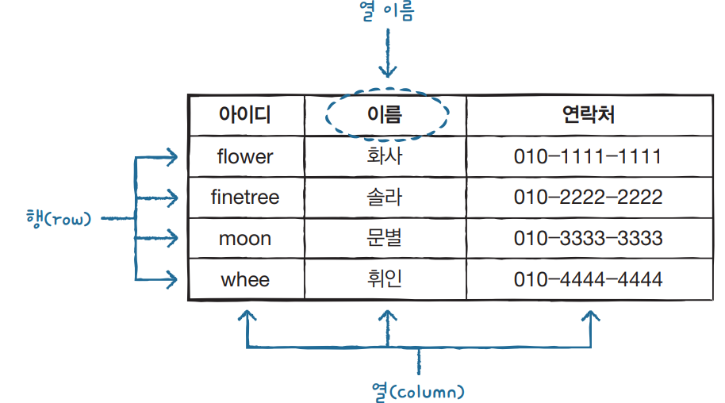
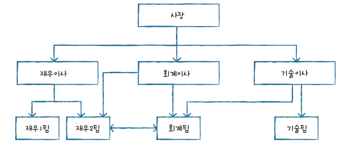
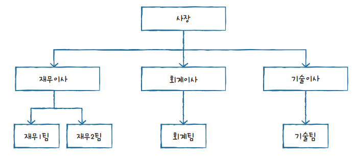
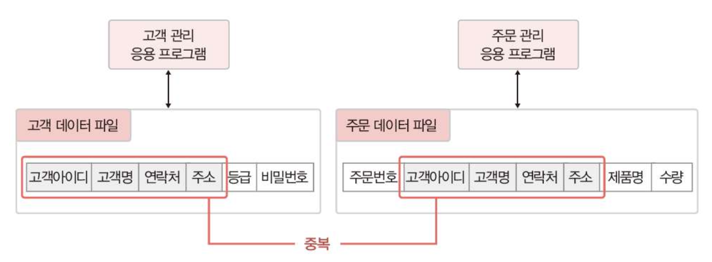
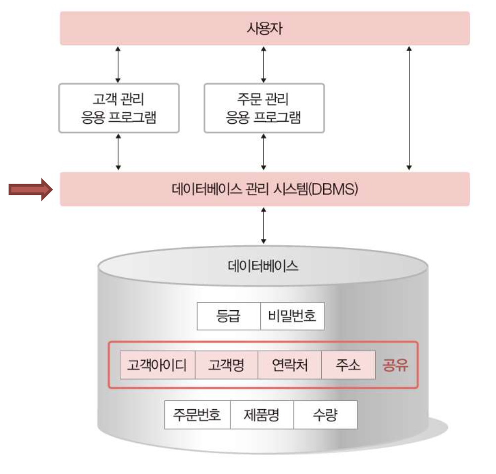
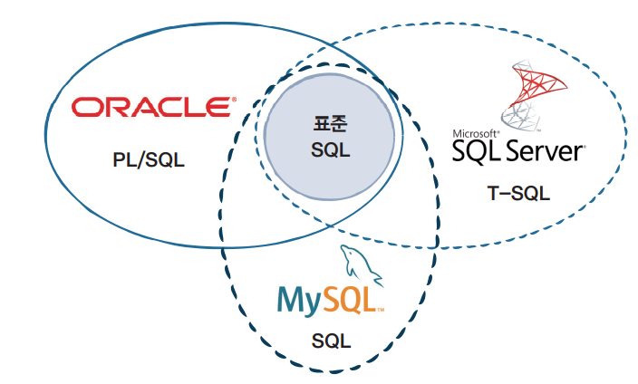

# 데이터베이스(Database)와 SQL


## 데이터베이스(Database)란?   
-> 데이터 저장소, 줄여서 DB   
한마디로 데이터의 집합이다. 데이터베이스에는 일상생활 정보의 대부분이 저장되고 관리된다. 

### **데이터베이스의 정의**
1. 통합 데이터 : 자료의 중복을 최소화하고 통제가 가능한 중복한 허용하는 데이터
2. 저장 데이터 : 컴퓨터가 접근할 수 있는 매체에 저장된 데이터
3. 운영 데이터 : 조직의 업무를 수행하는 것에 있어서 꼭 필요하고 지속적인 유지가 필요한 데이터
4. 공용 데이터 : 여러 응용 시스템들이 공동으로 소유하고 이용하는 데이터


### **데이터베이스의 특징**
1. 동시 공유 : 사용자들의 원하는 데이터를 동시에 공유
2. 계속적인 변화 : 생성, 수정, 삭제를 통하여 항상 최신의 데이터를 유지
3. 실시간 접근성 : 사용자의 질의에 대한 즉각적인 처리와 응답
4. 내용에 의한 참조 : 사용자가 원하는 데이터를 주소가 아닌 내용에 따라 참조
 
 📌 동계실내로 외우기 ! 

### **데이터의 분류**
1. 정형 데이터 : 미리 정해진 구조에 따라 저장된 데이터
> excel의 스프레드 시트, RDBMS의 테이블
2. 반정형 데이터 : 구조에 따라 저장된 데이터지만 데이터 내용 안에 구조에 대한 설명이 존재
> html, xml, json 문서들, 웹 로그
3. 비정형 데이터 : 정해진 구조가 없이 저장된 데이터
> 텍스트, 영상, 이미지 


### **데이터베이스의 유형**
-> 크게 관계형(RDB), 비관계형(NoSQL)으로 나뉜다.

1. 관계형 데이터베이스   

<출처 : 우재남, 『혼자 공부하는 SQL』, 한빛미디어(2021),p15-16>

> 데이터베이스의 주류이다. 데이터를 행(Row),열(Column)의 Table 형태로, 정해진 데이터 스키마에 따라 테이블에 저장한다. 데이터의 종속성은 관계로 표현한다. 이렇게 표현된 데이터를 SQL을 사용하여 데이터 관리 및 접근을 한다. 

2. 네트워크형 데이터베이스 

<출처 : 우재남, 『혼자 공부하는 SQL』, 한빛미디어(2021),p15-16 >

> 계층형의 문제를 개선하기 위해 등장, 계층과는 달리, N:N(다 대 다)처리가 가능하다. 그러다 계층형과 마찬가지로 구조 변경이 어렵다.

3. 계층형    

<출처 : 우재남, 『혼자 공부하는 SQL』, 한빛미디어(2021),p15-16 >

> 데이터 간의 관계가 트리 형태의 구조, 트리는 부모-자식 관계로 표현되며 1대N(일 대 다)으로 구성된다.
구조가 간단해 구현, 수정, 검색이 쉽지만, N:N(다 대 다) 처리가 불가능하고 구조 변경이 어렵다.

---


### **기존의 파일시스템**
기존에는 데이터를 파일로 관리하기 위해 파일을 생성,삭제,수정,검색하는 기능을 제공하는 소프트웨어인 **파일시스템(Filt System)** 을 사용했지만, 프로그램마다 필요한 데이터를 별도의 파일로 관리했기 때문에 같은 내용의 데이터가 여러 파일에 중복 저장되는 문제가 발생한다. 이 문제를 해결하기 위해 DBMS라는 소프트웨어가 제시된다. 



### **DBMS**
데이터베이스는 응용 프로그램과는 다른 별도의 미들웨어에 의해 관리되는데, 이를 **데이터베이스 관리 시스템, DBMS(Database Management System)** 이라고 한다. 사용자들은 DMNS에 의해 데이터베이스 내에 있는 데이터에 접근할 수 있다. 




### **DBMS의 기능**
1. 데이터 정의 : 데이터의 구조를 정의하고 데이터 구조에 대한 삭제 및 변경 기능 수행
2. 데이터 조작 : 데이터를 조작하는 소프트웨어가 요청하는 데이터의 삽입, 수정, 삭제 작업 지원
3. 데이터 제어 : 데이터베이스 사용자를 생성하고 모니터링하며 접근을 제어, 백업과 회복, 동시성 제어 등의 기능 수행
4. 데이터 추출 : 사용자가 조회하는 데이터 혹은 응용 프로그램의 데이터를 추출

### **DBMS의 종류**
- MySQL
- MariaDB
- PostgreSQL
- Oracle
- SQL Server 
- DB2
- Access
- SQLite
<br>
---

## SQL
DBMS를 사용하기 위해 필요한 언어가 SQL이다. SQL은 관계형 데이터베이스 관리 시스템을 조작할 때 사용한다.

SQL은 국제 표준화 기구에서 SQL에 대한 표준을 정해놓고 있다. 하지만 DBMS를 만드는 회사는 여러 곳이기 때문에 각 회사는 표준 SQL을 따르면서 자신들의 제품에 특성을 반영하여 SQL을 사용한다.


<출처 : 우재남, 『혼자 공부하는 SQL』, 한빛미디어(2021),p16 >


<br><br>

### **SQL 명령의 종류**
1. DML(Data Manipulation Language) : 데이터베이스에 데이터를 추가, 삭제, 갱신하는 등의 기본적인 조작을 할 때 사용하는 명령어
> CREATE, ALTER, DROP, TRUNCATE, COMMENT, RENAME
2. DDL(Data Definition Language) : 데이터를 정의하는 명령어로 데이터를 관리하는 객체를 만들거나 삭제하는 명령어
> SELECT, INSERT, UPDATE, DELETE, MERGE, CALL 
3. DCL(Data Control Language) : 데이터를 제어하는 명령어로 데이터에 접근할 수 있는 권한을 관리하는 명령어
> GRANT, REVOKE
4. TCL(Transaction Control Language) : 트랜잭션을 다루는 명령어로 DML로 실행한 변경 사항을 저장하고 관리
> COMMIT, ROLLBACK, SAVEPOINT

## SQL 기본 문법
<br>

### SHOW 
``` sql
SHOW DATABASES; -- 서버에 있는 DB를 보여줌
USE databaseName; -- 사용할 DB 지정
SHOW TABLE; -- 현재 USE하고 있는 DB의 테이블 보여줌
SHOW TABLE STATUS -- DB의 테이블 정보 조회
DESCRIBE tablename; -- 테이블에서 각 열에 대한 정보 조회
DESC tablename; -- 위와 같음(테이블에서 각 열에 대한 정보 조회)
```

### SELECT
``` sql
SELECT * FROM tablename; -- 테이블 전체 조회
SELECT table1, table2 FROM tablename; -- 테이블에 있는 열1,열2 조회
SELECT * FROM tablename WHERE fieldname = '내용'; -- 해당 필드에서 값이 내용인 레코드 조회
SELECT * FROM tablename WHERE fieldname LIKE '%문자열%'; -- 문자열 포함된 레코드 조회
SELECT DISTINCT fieldname FROM tablename; // 해당 필드 기준으로 중복된 레코드제거
```

### CREATE and DROP

``` sql
CREATE databasename; -- 데이터베이스 생성
DROP DATABASES databasename; -- 데이터베이스 삭제
DROP TABLE tablename; -- 테이블 삭제
```

### Table 생성

``` sql
CREATE TABLE tablename(
    필드명 데이터타입(보이는 자리수) 조건;
    필드명 데이터타입 조건;
    PRIMARY KEY(key로 정한 필드명)
)
```


### INSERT 

```sql
INSERT INTO tablename VALUES(1,2,3,4,5,,); 
INSERT INTO tablename (field1, field2) VALUES (fieldvalue1, fieldvalue2); -- 테이블에 새 레코드 추가
```


### UPDATE 
```sql
UPDATE tablename SET fieldname1 = fieldvalue1 WHERE 조건; -- 테이블에서 조건에 해당하는 레코드 수정
```

### DELETE 
```sql
DELETE FROM tablename WHERE 조건; -- 테이블에서 조건에 해당하는 레코드 삭제
```