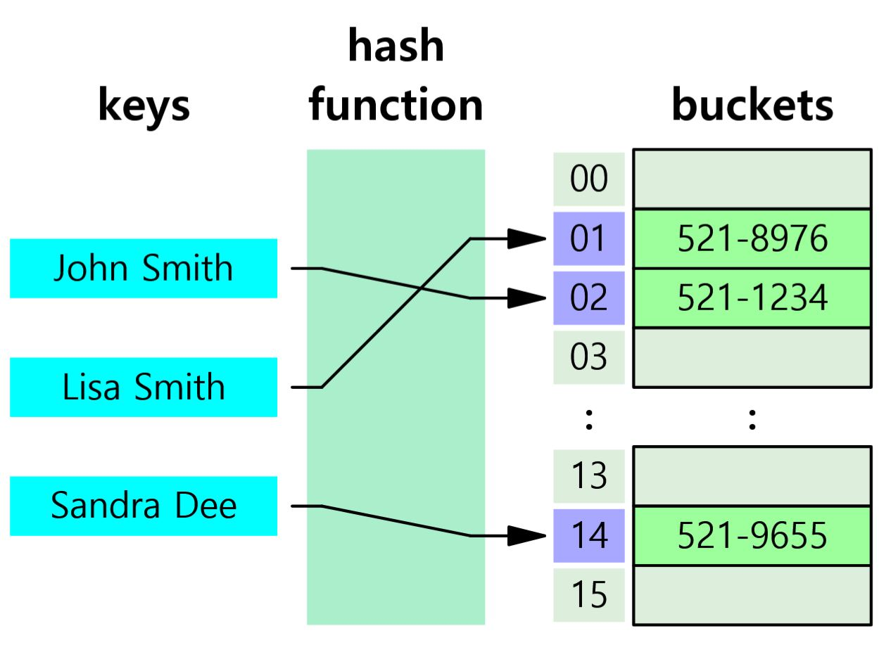
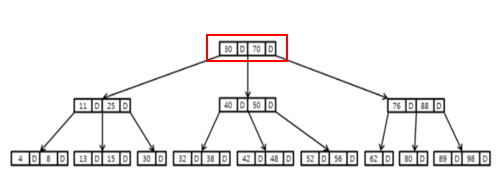
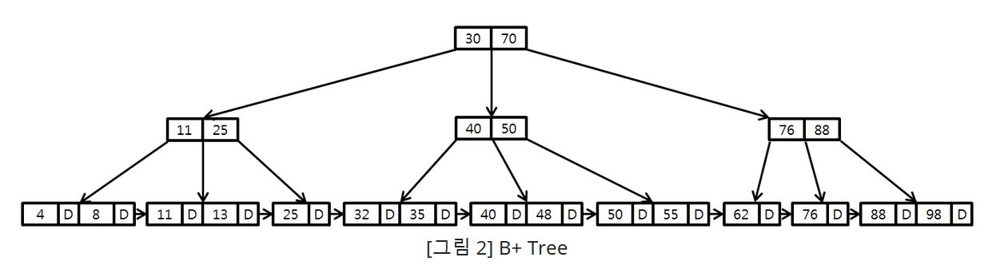

# Index(인덱스)

= 책의 색인
-> 데이터베이스의 검색 속도를 향상시키기 위한 자료구조

* 데이터 베이스에서도 테이블의 모든 데이터를 검색하는 것은 시간이 오래 걸리기 때문에 데이터의 위치를 포함한 자료구조를 생성(인덱스를 생성)하여 효율적인 조회가 가능    
* 인덱스를 활용하면 조회가 필요한 명령어(SELECT, UPDATE, DELETE 등)의 성능이 향상

--- 

## Index의 관리

- DBMS는 항상 index를 최신의 상태로 유지한다. 이를 위해 인덱스가 적용된 각 연산(INSERT, UPDATE, DELETE 등)이 수행되면 그에 따라 추가적인 작업이 필요하기 때문에 오버헤드(overhead)가 발생할 수 있다.

---

### 장점
- 데이터가 정렬되어 있다.   
- 전반적인 시스템의 부하를 감소시킨다.
- 인덱스를 통해 테이블을 조회하는 시간을 단축시킬 수 있다.
> **ex**
>1. WHERE절을 통한 조건 검색 
순서 없는 테이블을 WHERE절로 데이터를 검색하기 위해서는 *Full Table Scan이 필요하다. 햐지만 Index Table시에는 인덱스들이 이미 정렬되어 저장되어 있기 때문에 조건에 맞는 데이터들의 빠른 검색이 가능하다.
>2. *ORDER BY절을 통한 정렬
ORDER BY는 가장 부하가 많이 걸리는 연산이다. 하지만 인덱스를 사용하면 이미 정렬이 되어 있기 때문에 ORDER BY연산 작업 자체를 피할 수 있다.
>3. Min, Max의 효율적인 처리
데이터가 정렬되어 있기 때문에 가장 처음 값과 가장 끝의 값만 가져오면 효율적인 처리가 가능하다.

##### Full Table Scan - 테이블의 모든 데이터를 검색하는 것, Full Scan이라고도 함
##### ORDER BY - 내림차순 혹은 오름차순으로 정렬된 데이터들이 필요할 때 사용하는 연산

 

### 단점
- 인덱스를 관리하기 위해 DB에 추가적인 저장 공간이 필요하다. 
- 인덱스를 관리하기 위한 추가적인 작업이 필요하다. 
> INSERT, UPDATE, DELETE와 같은 연산의 경우 데이터가 수정,삭제, 삽입되었을 때 정렬을 다시 해줘야 한다.

- 인덱스를 잘못 사용 할 경우 성능 저하의 역효과가 발생할 수 있다.

> UPDATE, DELETE와 같은 명령어의 경우 기존의 존재하는 인덱스를 삭제하는게 아닌 사용하지 않음으로 처리하기 때문에, DELETE와 같은 연산이 수시로 발생하는 경우에 인덱스가 엄청나게 불어나 성능에 영향을 미칠 수 있다.

- 테이블의 크기에 따라 인덱스 스캔 사용 여부가 결정된다.
> 만약 테이블이 매우 작은 경우 굳이 인덱스 스캔을 사용하지 않아도 FULL SCAN이 더 빠르기 때문에 인덱스 스캔을 사용할 필요가 없다.

---

## 인덱스는 언제 생성할까? 
- 조건절(WHERE)이 자주 사용되는 컬럼
- ==으로 비교되는 컬럼
- 중복되는 데이터가 최소한일 때
- ORDER BY절에서 자주 사용되는 컬럼
- JOIN조건으로 자주 사용되는 컬럼

---

## 인덱스의 구조

### Hash Table 

해시 테이블은 데이터를 저장하는 자료구조이다. 빠른 데이터 검색이 필요할 때 사용한다. 해시 테이블에 붙은 key값을 이용해 고유한 index를 생성하여 그 index 저장된 값을 꺼내오는 방식 

해시 테이블 기반의 db인덱스   
>key, value = 컬럼의 값, 데이터의 위치   

-> 컬럼의 값으로 생성된 해시, 따라서 **시간복잡도 = O(1)**

***그러나 Hash Table은 사용이 제한적***

-> 해시는 등호(==) 연산만 수행 가능, 이때문에 부등호 연산이 사용되는 데이터 검색에는 해시 테이블 사용 x 

--- 

### B - Tree 

B-Tree란 자식 노드가 2개 이상인 트리.   
이진검색 트리처럼 각 Key의 왼쪽 자식은 항상 Key보다 작은 값을, 오른쪽 자식은 큰 값을 가진다.

- 노드 하나에 여러 데이터 저장
- 각 노드에 있는 데이터는 항상 정렬된 상태, 노드에 저장된 범위를 사용해 자식 노드를 가짐 (n+1)
- 각 노드에는 여러개의 key를 가지고 각 key에 대응하는 data도 함께 가짐
- 항상 정렬된 상태로 부등호 연산에 문제 x
- pointer 접근이 아닌 실제 메모리 디스크에서 다음 인덱스로 접근
- 그러나 모든 데이터를 순회하는 경우에 비효율적 -> 이를 개선한 것이 B + tree

**시간 복잡도 = O(logn)** 

---

### B + Tree 

DB의 인덱스를 위해 자식노드가 2개 이상인 b-tree를 개선시킨 자료구조 

- 데이터 노드만 인덱스와 함께 데이터를 가진다.
- 인덱스 노드들은 데이터를 위한 인덱스만을 가진다.
- 데이터 노드 크기는 인덱스 노드의 크기와 같지 않아도 된다.
- 리프 노드들은 연결 리스트로 연결, 순차검색 용이 

 **시간복잡도 = O(log2𝑛(2의 n))**
