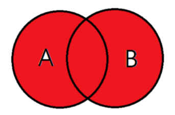

# 조인(Join)

### **Join의 기본 개념**
두개 이상의 테이블(Table)을 결합하여 데이터를 검색하는 방법.

- 관계형 데이터베이스에서는 중복 데이터를 피하기 위해서 데이터를 쪼개 여러 테이블로 나눠 저장하는데, 이렇게 분리되어 저장된 테이블에서 원하는 결과를 다시 도출하기 위해서 여러 개의 테이블을 조합해야할 때가 있습니다. 그래서 관계형 데이터베이스에서는 Join연산자를 이용하여 관련 있는 컬럼 기준으로 행을 합쳐줍니다. 

예를 들어, 아래와 같은 테이블이 있다고 생각해보겠습니다. 만약 이 경우에 모종의 이유로 학생의 나이가 바뀌었다면 각 행의 모든 학생 나이를 바꿔주어야 할 것입니다. 

| 강의명       | 분반 | 학생이름 | 학생나이 |
|--------------|------|----------|----------|
| 데이터베이스 | A    | 홍길동   | 20      |
| 알고리즘     | B    | 홍길동   | 20     |

그렇다면 이번에는 위의 테이블을 두개의 테이블로 분리시켜 보겠습니다.

*Table1

| 강의명       | 분반 | 학생이름 |
|--------------|------|----------|
| 데이터베이스 | A    | 홍길동   |
| 알고리즘     | B    | 홍길동   |

*Table2

| 학생이름 | 학생나이 |
|----------|----------|
| 홍길동   | 20     |
| 김유신   | 21      |

이 경우에는 학생의 나이가 변경되어도, Table2의 학생나이를 변경해준다면 끝입니다.

이러한 이유로 관계형 데이터베이스에서는 Join연산을 사용합니다.


---

**1. Inner Join**


이너 조인은 두 개의 테이블에서 공통된 요소들을 통해 결합하는 방식입니다. 가장 일반적인 방법으로, 명령어 사용시 INNER JOIN 대신 JOIN만을 입력해도 INNER JOIN이 사용됩니다. 두 테이블 간의 공통된 데이터가 존재하지 않을 시(ex : NULL)엔 출력되지 않습니다.


밑의 표처럼 학생명이라는 공통된 컬럼을 가진 두개의 테이블이 있다고 가정해보겠습니다.   

*Table1
| 강의명       | 분반 | 학번 |
|--------------|------|--------|
| 데이터베이스 | A    | 001 |
| 알고리즘     | B    | 002 |
| 자료구조      | AB  | NULL | 

*Table2

| 학생명 | 나이 | 학번 |
|--------|------|------|
| 홍길동 | 22   | 001  |
| 김유신 | 20   | 002  |
| 김춘추 | 21   | 003   |

이때 조인 명령을 입력해보겠습니다.

``` sql
SELECT Table1.강의명, Table2.학생명 
FROM Table1 JOIN Table2 ON Table1.학번 = Table2.학번
```

위의 명령을 실행한 결과는 다음과 같습니다.


| 강의명       | 학생명 |
|--------------|--------|
| 데이터베이스 | 홍길동 |
| 알고리즘     | 김유신 |

📌 (강의명)자료구조의 경우, 학번이 누락되어 있기 때문에 공통된 데이터가 아닙니다. 그래서 INNER JOIN 명령을 실행해도 출력되지 않습니다.


---

**2. OUTER JOIN** 

INNER JOIN은 공통된 부분이 있는 행만 출력이 되었다면, OUTER JOIN은 공통된 부분이 없는 데이터도 보고 싶은 경우에 사용합니다.
OUTER JOIN은 크게 LEFT JOIN과 RIGHT JOIN으로 나뉩니다. LEFT JOIN과 RIGHT JOIN은 방향만 다를 뿐 거의 같습니다.

**2-1. LEFT JOIN**


LEFT JOIN은 공통적인 부분과, LEFT 테이블에 있는 것만 출력합니다. LEFT 테이블이라 함은 위의 사진에서 테이블 A(왼쪽 테이블)를 말합니다. 

INNER JOIN에서는 공통된 부분만 출력했던 반면에, LEFT JOIN은 공통되지 않은 부분도 함께 출력합니다.

위의 Table1 과 Table2를 예시로 들었을 때, LEFT JOIN 명령을 실행한다면 어떤 값을 예상할 수 있을까요?

``` sql
SELECT Table1.강의명, Table2.학생명
FROM Table1 LEFT JOIN Table2 
ON Table1.학번 = Table2.학번
```

위의 쿼리를 실행한 결과는 다음과 같습니다.

| 강의명       | 학생명 |
|--------------|--------|
| 데이터베이스 | 홍길동 |
| 알고리즘     | 김유신 |
| 자료구조     | NULL   |

저료구조애는 공통된 데이터가 없기 때문에 학생명을 출력하지 못하지만, LEFT 테이블에 있는 데이터는 모두 출력하기 때문에 강의명에 있는 모든 데이터가 출력됩니다.

**2.2 RIGHT JOIN**


RIGHT JOIN은 LEFT JOIN과 방향만 다를 뿐 형식은 같습니다. 
RIGHT 테이블에만 있는 것을 출력하고 싶을 때 사용합니다.

위의 예시 테이블을 RIGHT JOIN 연산으로 수행했을 때 어떤 값을 예상할 수 있을까요?

```sql
SELECT Table1.강의명, Table2.학생명
FROM Table1 RIGHT JOIN Table2
ON Table1.학번 = Table2.학번
```

위의 쿼리를 실행한 결과는 다음과 같습니다. 

| 강의명       | 학생명 |
|--------------|--------|
| 데이터베이스 | 홍길동 |
| 알고리즘     | 김유신 |
| NULL     | 김춘추   |

LEFT JOIN과 반대의 결과를 볼 수 있습니다.

**2.3 FULL OUTER JOIN**



FULLL OUTER JOIN은 A테이블과 B테이블의 모든 값을 출력합니다. 쉽게 말해 LEFT JOIN과 RIGHT JOIN을 합친 결과라고 볼 수 있습니다.


```sql
SELECT Table1.강의명, Table2.학생명
FROM Table1 FULL OUTER JOIN Table2
ON Table1.학번 = Table2.학번
```

> 📌 Mysql에서는 FULL OUTER JOIN 연산을 제공하지 않습니다. FULL OUTER JOIN이 필요할 때는 UNION연산을 사용합니다.   

✅ UNION을 FULL OUTER JOIN과 동일한 기능으로 사용하기
```sql
SELECT Table1.강의명, Table2.학생명
FROM Table1 LEFT JOIN Table2
ON Table1.학번 = Table2.학번
UNION
SELECT Table1.강의명, Table2.학생명
FROM Table1 RIGHT JOIN Table2
ON Table1.학번 = Table2.학번
```

위의 쿼리문을 실행한 결과는 다음과 같습니다.

| 강의명       | 학생명 |
|--------------|--------|
| 데이터베이스 | 홍길동 |
| 알고리즘     | 김유신 |
| 자료구조     | NULL   |
| NULL      | 김춘추    |


---

**3. CROSS JOIN**

CROSS JOIN은 두 테이블 간의 가능한 모든 경우의 수에 대한 결과를 보여줍니다. 

```sql
SELECT Table1.강의명, Table2.학생명
FROM Table1 CROSS JOIN Table2
```

위의 쿼리문을 실행한 결과는 다음과 같습니다.


| 강의명       | 학생명 |
|--------------|--------|
| 데이터베이스 | 홍길동 |
| 데이터베이스 | 김유신 |
| 데이터베이스 | 김춘추 |
| 알고리즘     | 홍길동 |
| 알고리즘     | 김유신 |
| 알고리즘     | 김춘추 |
| 자료구조     | 홍길동 |
| 자료구조     | 김유신 |
| 자료구조     | 김춘추 |

위의 결과처럼 CROSS JOIN은 두 테이블의 행들을 서로 교차하여 곱합니다. 

**4. SELF JOIN**

SELF JOIN은 두개의 테이블이 아닌 자기 자신의 테이블을 참조하는 연산입니다.

예를 들어 테이블 A가 있다고 가정해봅시다. 
테이블 A는 자신의 정보와 팀원의 정보를 함께 가지고 있습니다. 이때 팀원의 학번은 확인할 수 있지만 팀원의 이름은 바로 확인할 수 없습니다. 

*Table A
| 번호 | 학생명 | 학번 | 조 | 팀원학번 |
|------|--------|------|----|----------|
| 1    | 홍길동 | 001  | A  | 002      |
| 2    | 김유신 | 002  | A  | 001      |
| 3    | 김춘추 | 003  | B  | 004      |
| 4    | 이순신 | 004  | B  | 003      |


이때, 팀원의 이름을 함께 보고 싶다면 SELF JOIN을 통해 확인할 수 있습니다. 

```sql
SELECT a.학번, a.학생명, b.학생명 
FROM A a
JOIN A b
ON a.학번 = b.팀원학번
```

위의 쿼리를 실행한 결과는 다음과 같습니다.

| 학번 | 학생명 | 팀원이름 |
|------|--------|----------|
| 2    | 김유신 | 홍길동   |
| 1    | 홍길동 | 김유신   |
| 4    | 이순신 | 김춘추   |
| 3    | 김춘추 | 이순신   |


---


