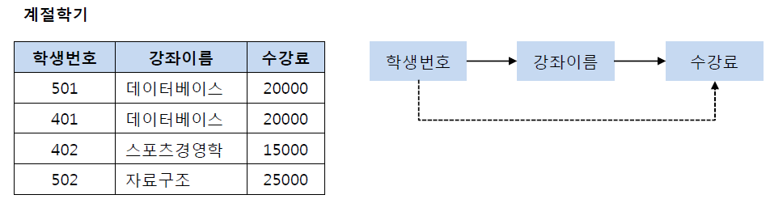

# 정규화(Normalization)

## 정규화(Normalization)란?
-> 데이터베이스의 설계에서 중복된 데이터가 최소화되도록 재구성하는 테크닉, 이상현상이 존재하는 릴레이션을 분해하여 여러개의 릴레이션을 생성하며, 이를 단계별로 구분하여 정규형이 높아질수록 이상현상은 줄어들게 된다. 

### **정규화의 목적(장점)**
- 테이블 간의 중복된 데이터를 허용하지 않음
- 중복을 허용하지 않으므로 데이터의 무결성을 유지
- 새로운 데이터 형의 추가로 인한 데이터 베이스 확장 시, 구조를 변경하지 않아도 되거나 일부만 변경 가능
- 삽입,갱신,삭제 시 발생할 수 있는 각종 *이상현상들을 방지 <-> 그러나 연산시간 증가

### **정규화의 단점**
- 릴레이션의 분해로 인해 릴레이션 간의 JOIN연산 증가
- JOIN이 많이 발생하여 성능저하가 나타나면 반정규화(De-normalization)를 적용 
---
## 📌 꼭 알아두고 갈 것!   
***이상현상 ?**   
-> 정규화되지 않은 상태에서 관계를 수정할 때, 발생할 수 있는 문제

1. 삽입 이상(Insert Anmoaly) : 튜플 삽입 시 특정 속성에 해당하는 값이 없어 NULL값이나 불필요한 값들을 입력해야하는 현상
2. 삭제 이상(Deletion Anmoaly) : 튜플 삭제 시 같이 저장된 다른 정보까지 연쇄적으로 삭제되는 현상
3. 갱신 이상(Update Anmoaly) : 튜플 갱신 시 중복된 데이터의 일부만 갱신되어 일어나는 데이터 불일치 현상

***함수 종속성 ?**   
-> 어떤 속성 A의 값을 알면 다른 속성 B의 값이 유일하게 정해지는 관계를 종속성이라고 한다.
- A->B로 표기하며 A는 B의 결정자라고한다. 
- A->B이면 A는 B를 결정한다고 하고, B는 A에 종속한다라고 한다.

**1. 완전 함수 종속**
- 기본키가 종속자이며 기본키가 여러 속성으로 구성되어 있을 경우 기본키를 구성하는 모든 속성이 포함된 부분집합 또한 종속자일 경우

    | 학번 | 이름   | 학년 | 학교       |
    |------|--------|------|------------|
    | 2021 | 홍길동 | 1    | 인천대학교 |
    | 2022 | 김춘향 | 2    | 인천대학교 |

> 이 릴레이션에서 기본키가 학번일 때, 이름,학년,학교의 정보는 학번을 알아야 식별이 가능하다. 이때 이름, 학년, 학교는 학번에 완전 함수 종속되어 있다고 볼 수 있다.

**2. 부분 함수 종속**
- 릴레이션에서 종속자가 기본키가 아닌 다른 속성에 종속되거나, 기본키를 구성하는 여러 속성들의 부분집합 중 일부에만 종속되어 있는 경우

    | 고객ID | 상품ID | 상품명 | 주문 수량 |
    |--------|--------|--------|-----------|
    | AA     | A1     | 티셔츠 | 1         |
    | AB     | B1     | 바지   | 2         |

> 기본키가 고객ID, 상품 ID로 구성된 릴레이션의 경우, 상품명은 상품 ID만 알아도 식별이 가능하다. 이때 상품명은 상품ID에게 부분 함수 종속되어 있다고 볼 수 있다.

**3. 이행적 종속**
- X,Y,Z라는 3가지 부분집합을 가진 릴레이션에서, X->Y이고, Y->Z일 때 Y->X가 아니라면 암스트롱의 공리에 의해 X->Z이다. 이때 X는 Z의 이행적 종속이다.

    | 번호 | 이름 | 나이   |
    |--|------|--------|
    | 01 | 홍길동   | 23 |
    | 02 | 김민정   | 22 |

> 이 릴레이션에서는 번호를 알면 이름을 알 수 있고, 이름을 알면 나이를 알 수 있다. 따라서 번호를 알면 나이를 알 수 있다. 이를 이행적 종속 관계라 한다. 

---
정규화된 결과를 정규형이라고 하며, 정규형은 기본 정규형과 고급 정규형으로 나뉜다.

기본 정규형 : 제1정규형, 제2정규형, 제3정규형, BCNF
고급 정규형 : 제4정규형, 제5정규형   
 

1. 제1정규형
> 릴레이션에 속한 모든 도메인이 더 이상 분해되지 않은 원자값으로만 구성된 정규형

 
<출처 : 망나니개발자 블로그 https://mangkyu.tistory.com/110>   

-> 위의 테이블에서 제1정규형을 만족하지 못하기 때문에 더 분해하여 제1정규형으로 만들 수 있다.

 
<출처 : 망나니개발자 블로그 https://mangkyu.tistory.com/110>

2. 제2정규형
> 제1정규형을 만족하면서 릴레이션에 존재하는 부분 함수적 종속을 제거하여, 모든 속성이 기본키에 완전 함수 종속이 되도록 만들어진 정규형

 
<출처 : 망나니개발자 블로그 https://mangkyu.tistory.com/110>

-> 위의 테이블에서, 학생 번호와 강좌 이름이 기본키일 때 성적의 결정자는 학생 번호이고 강의실의 결정자는 강좌 이름이기 때문에 이 릴레이션은 부분 함수적 종속성을 가진다. 

📌 부분함수적 종속성을 제거하기 위해, 모든 속성이 기본키에 완전 함수 종속이 되도록 테이블을 분리시킨다.
 
<출처 : 망나니개발자 블로그 https://mangkyu.tistory.com/110>

3. 제3정규형
> 제2정규형을 만족하면서 릴레이션을 구성하는 속성들 간의 이행적 종속관계를 분해하여 속성들이 비이행적 함수 종속관계를 만족하도록 만들어진 정규형, **한마디로 이헹적 종속 관계를 제거시킨다!**

 
<출처 : 망나니개발자 블로그 https://mangkyu.tistory.com/110>

-> 기본키인 학생번호는 강좌이름의 결정자이고, 강좌이름은 수강료의 결정자이다. 이는 이행적 종속 관계이므로 테이블을 분리하여 제거할 수 있다.

 
<출처 : 망나니개발자 블로그 https://mangkyu.tistory.com/110>

4. BCNF
> 제3정규형을 만족하면서 릴레이션의 모든 결정자가 후보키가 되도록 하는 정규형

 
<출처 : 망나니개발자 블로그 https://mangkyu.tistory.com/110>

-> 이 테이블에서 학생 번호와 특강 이름이 기본키일 때, 학생 번호와 특강 이름은 교수의 결정자이며, 교수는 특강 이름의 결정자이다. 하지만 그렇다고 교수는 후보키가 아니기 때문에, 테이블을 분해하여 교수 또한 후보키가 될 수 있도록 한다.

 
<출처 : 망나니개발자 블로그 https://mangkyu.tistory.com/110>

5. 제 4정규형   
> BCNF를 만족하면서 릴레이션에서 다치 종속 관계를 제거한 정규형   
*다치종속 : 두 속성이 1:다 대응이 되는 경우

6. 제5정규형
> 후보키를 통하지 않은 조인종속을 제거한 정규형

