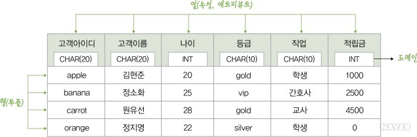
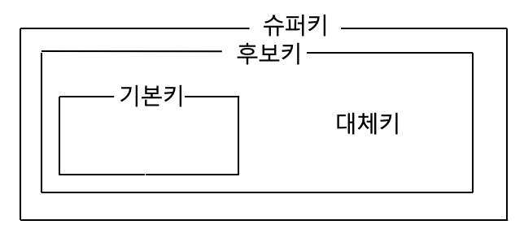

# 📌 데이터베이스 용어 정리
### 데이터베이스에서 자주 사용되는 용어들의 개념을 정리합니다. 

---

### 1. 스키마 (Schema)   
-> 전반적인 데이터베이스의 구조와 제약 조건에 대해 기술한 것으로, 데이터베이스를 구성하는 개체(Entity), 속성(Attribute), 관계(Relationship) 등을 정의하고 이들이 유지해야 하는 제약 조건들을 기술합니다. 관점에 따라 외부 스키마, 개념 스키마, 내부 스키마로 구분합니다.

- **외부 스키마(사용자 관점)** : 실세계에 존재하는 데이터들을 어떤 형식, 구조, 배치 화면을 통해 사용자에게 보여줄 것인지 결정합니다. 하나의 데이터베이스에는 여러개의 외부 스키마가 존재하며, 하나의 외부 스키마를 여러 개의 프로그램과 사용자가 공동으로 사용이 가능합니다.

- **개념 스키마(전체적인 관점)** : 데이터베이스의 전체적인 논리적 구조입니다. 모든 이용자가 필요로 하는 데이터를 총합한 조직 전체의 데이터 베이스이며,그렇기 때문에 하나만 존재합니다. 개체 간의 관계와 제약 조건, 데이터 베이스의 접근 권한, 보안 등에 대한 명세를 나타냅니다. 데이터 베이스 관리자에 의해 구성됩니다.   
📌 ***단순한 스키마라 함은 보통 개념 스키마를 나타냅니다.***

- **내부 스키마(물리장치 관점)** : 물리적인 저장장치 입장에서 DB가 저장되는 방법을 기술한 것입니다. 실제로 데이터베이스에 저장될 레코드의 물리적인 구조, 저장 데이터 항목의 표현 방법, 내부 레코드의 물리적 순서 등을 나타냅니다.   
📌 간단히 말해서, 데이터베이스의 물리적 저장 구조를 정의합니다.
---

### 2. 표(Table)
 

 

- **릴레이션(Relation, =Table)** : 관계형 데이터베이스에서 정보를 구분하여 저장하는 기본 단위입니다.

- **튜플(Tuple, =Record)** : 테이블에서 행을 의미합니다. 튜플은 릴레이션에서 같은 값을 가질 수 없습니다. 튜플의 수는 Cardinality라고 합니다.

- **속성(Attribute, =Field)** : 테이블에서 열을 의미합니다. 칼럼이라고도 하며 속성의 수는 Degree라고도 합니다. 

- **식별자(Identifier)** : 관계형 데이터베이스에서 각각을 구분할 수 있는 논리적인 개념을 말하며, 두가지의 특성을 가집니다.

> 1. 유일성(하나의 키값으로 튜플을 유일하게 식별할 수 있는 성질) : 하나의 릴레이션에서 모든 행은 서로 다른 키 값을 가져와야한다. 

> 2. 최소성 : 꼭 필요한 최소한의 속성들로만 키를 구성한다.

---

### 3. 키 (Key)

키(Key)는 데이터베이스에서 조건에 맞는 튜플을 찾거나 정렬할 때 다른 튜플들과 구분할 수 있는 기준이 되는 일종의 속성(Attribute)입니다.

1. 후보키(Candidate Key) : 릴레이션을 구성하는 속성들 중에서 튜플을 유일하게 식별하기 위해 사용되는 속성들의 부분집합이며, 언제든 기본키로 사용할 수 있습니다. 모든 릴레이션에는 하나 이상의 후보키가 존재하며, 유일성과 최소성을 만족시켜야 합니다.

2. 기본키(Primary Key) : 후보키 중에서 선택한 주요 키입니다. 한 릴레이션에서 특정 튜플을 유일하게 구별할 수 있는 속성입니다. 기본키로 선택된 속성은 null값을 가질 수 없으며, 동일한 값을 중복하여 저장할 수 없습니다.

3. 슈퍼키(Super Key) : 한 릴레이션 내에 있는 속성들의 집합으로 구성된 키를 말합니다. 릴레이션을 구성하는 모든 튜플 중 슈퍼키로 구성된 속성의 집합과 동일한 값을 나타내지 않습니다. 슈퍼키는 유일성의 특성을 만족하지만, 최소성은 만족하지 못합니다.

4. 대체키(Alternate Key) : 후보키가 두개 이상일 경우, 하나를 기본키로 선택한다면 남은 후보키는 대체키가 됩니다.

5. 외래키(Foreign Key) : 외래키는 다른 릴레이션의 기본키를 참조하는 속성 또는 속성들의 집합을 의미합니다. 한 릴레이션에 속한 속성 A와 참조 릴레이션의 기본키인 B가 동일한 도메인 상에서 정의되었을 때의 속성 A를 외래키라고 합니다. 외래키로 지정되면 참조 릴레이션의 기본키에 없는 값은 입력할 수 없습니다. 