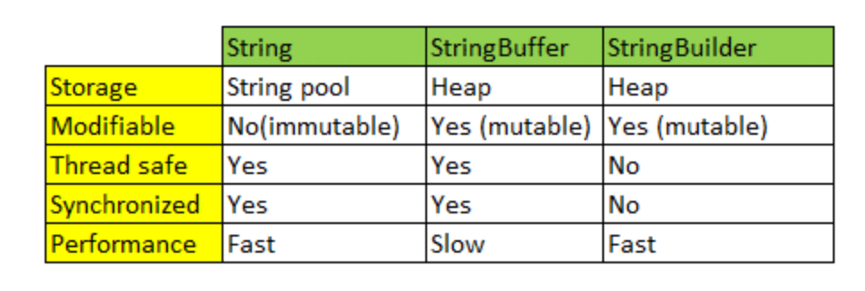
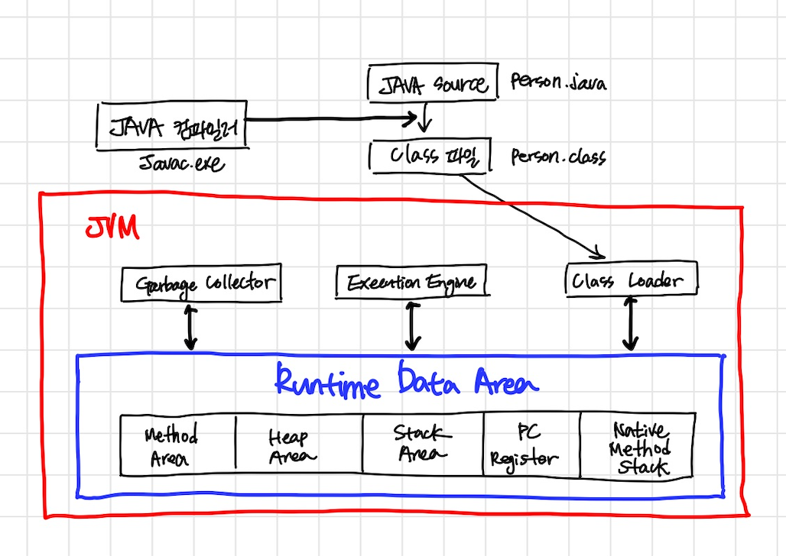
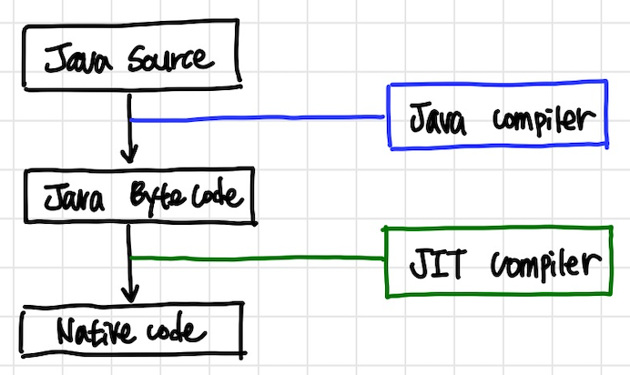

# Java

## 객체지향

- OOP, Object Oriented Programming
- 컴퓨터 프로그램을 명령어의 목록으로 보는 시각에서 벗어나 여러 개의 독립된 단위, 즉 **"객체"** 들의 **모임** 으로 파악하고자 하는 것이다.
각각의 **객체** 는 메시지를 주고받고, 데이터를 처리할 수 있다.(협력)
- 객체지향 프로그래밍은 프로그램을 **유연** 하고 **변경** 이 용이하게 만들기 때문에 대규모 소프트웨어 개발에 많이 사용된다. (유지보수, 재사용성)
- 역할, 협력, 책임

---

## 객체지향의 특징 4가지

- `캡슐화(Encapsulation)`
  - 정보 은닉(information hiding)
  - 변수와 메소드를 하나로 묶는다.
  - 데이터를 외부에서 직접 접근하지 않고 메소드를 통해서만 접근
  - 접근제어자(public, protected, default, private)

- `추상화(Abstraction)`
  - 인터페이스로 클래스들의 공통적인 특성(변수,메소드)들을 묶어 표현하는 것

- `상속(Inheritance)`
  - 상위 클래스의 특성을 하위 클래스에서 상속하고 거기에 필요한 특성을 추가한다.(`확장`해서 사용)
  - 상속은 캡슐화 유지, 클래스의 재사용성을 용이하게 해준다.

- `다형성(Polymorphism)`
  - 어떤 변수, 메소드가 상황에 따라 다른 결과를 내는 것
  
  - `오버라이딩(Overriding)` : 같은 메서드 이름, `같은 인자 목록` 으로 상위 클래스의 메서드를 `재정의`
  - `오버로딩(Overloding)` : 같은 메서드 이름, `다른 인자 목록` 으로 다수의 메서드를 `중복 정의` (생성자가 여러 개일 때 유용함)
  
  cf. 헷갈리면 오버라이딩은 덧대어 쓰다(=> 재정의)/ 오버로딩은 load(적재하다)=>중복 정의

---

## 객체지향 5대 원칙(OOP SOLID)

### SRP(단일책임원칙, Single Responsibility principle)

- 하나의 클래스는 하나의 책임만 가져야 한다.
- 하나의 책임이라는 것은 클 수 있고, 작을 수도 있으며, 문맥과 상황에 따라 다르다.
- `중요한 기준은 변경이다.` 변경이 있을 때 파급효과가 적으면 SRP를 잘 따른 것.
<br><br>
### OCP(개방-폐쇄 원칙, Open/Closed principle)

- 소프트웨어 요소에는 `확장에는 열려` 있으나 `변경에는 닫혀` 있어야 한다.
  - 확장에는 열려 있다 : 요구사항이 변경될 때 새로운 동작을 추가하여 애플리케이션 기능을 확장할 수 있다.
  - 변경에는 닫혀 있다 : 기존의 코드를 수정하지 않고 애플리케이션의 동작을 추가하거나 변경할 수 있다.
- OCP를 지키기 위해서는 추상화에 의존해야 한다.(다형성)
- 인터페이스를 구현한 새로운 클래스를 하나 만들어서 새로운 기능을 구현한다. (역할과 구현의 분리)

- 객체가 알아야 하는 지식이 많으면 결합도가 높아지고, 결합도가 높아질수록 개방-폐쇄의 원칙을 따르는 구조를 설계하기가 어려워진다.

```java
public class MemberService {
//  private MemberRepository memberRepository = new MemoryMemberRepository(); // 기존코드
  private MemberRepository memberRepository = new JdbcMemberRepository(); // 변경코드
}
```

위의 경우 스프링 프로젝트에서 사용했던 코드이다. 구현 객체를 변경하기 위해서 클라이언트 코드를 변경했기에, 분명 다형성을 사용했지만 OCP 원칙에 어긋난다.
스프링에서는 객체를 생성하고, 연관관계를 맺어주는 별도의 설정자를 사용해서 OCP를 준수하고자 했다.(어노테이션, 의존관계 주입, config 파일 등)
<br><br>
### LSP(리스코프 치환 원칙, Liskov substitution principle)

- 프로그램의 객체는 프로그램의 정확성을 깨뜨리지 않으면서 하위 타입의 인스턴스로 바꿀 수 있어야 한다.
- 다형성에서 하위 클래스는 인터페이스 규약을 다 지켜야 한다는 것, 다형성을 지원하기 위한 원칙, 인터페이스를 구현한 구현체는 믿고 사용하려면, 이 원칙이 필요하다.
- 단순히 컴파일에 성공하는 것을 넘어서는 이야기
- eg. 자동차 인터페이스의 엑셀은 앞으로 가라는 기능, 뒤로 가게 구현하면 LSP 위반, 느리더라도 앞으로 가야함.
  <br><br>
### ISP(인터페이스 분리 원칙, Interface segregation principle)

- 특정 클라이언트를 위한 인터페이스 여러 개가 범용 인터페이스 하나보다 낫다.
- 자동차 인터페이스는 운전 인터페이스, 정비 인터페이스로 분리
- 사용자 클라이언트는 운전자 클라이언트, 정비사 클라이언트로 분리
- 분리하면 정비 인터페이스가 변해도 운전 클라이언트에 영향을 주지 않는다.
- 인터페이스가 명확해지고, 대체 가능성이 높아진다.
  <br><br>
### DIP(의존관계 역전 원칙, Dependency inversion principle)

- 프로그래머는 "추상화에 의존해야지, 구체화에 의존하면 안된다." 의존성 주입은 이 원칙을 따르는 방법 중 하나다.
- 구현 클래스에 의존하지 말고, 인터페이스에 의존하라는 뜻
- `역할(Role)에 의존하게 해야 한다는 것과 같다.` 객체 세상도 클라이언트가 인터페이스에 의존해야 유연하게 구현체를 변경할 수 있다. 구현체에 의존하게 되면 변경이 아주 어려워진다. 

```java
MemberRepository m = new MemoryMemberRepository();
```
- 앞의 예제는 MemberService 클라이언트가 구현 클래스를 직접 선택한다.
- MemberRepository 인터페이스에 의존하지만, MemoryMemberRepository 구현 클래스도 동시에 의존한다.
- DIP 위반

<small>[ref] inflearn 김영한님의 스프링 강의 자료</small>

---

## String, StringBuilder, StringBuffer 차이점

-  Java에서 문자열을 다루는 대표적인 클래스들
- ️ 연산이 많지 않을 때는 어떤 클래스를 사용해도 이슈가 발생할 가능성이 낮다.
-  그러나 연산횟수가 많아지거나, 멀티스레드, Race condition 등의 상황이 자주 발생한다면, 각 클래스의 특징을 이해하고 적절한 클래스를 사용해야 한다.
 <br><br>
> String

- immutation(불변)

    ```java
    String str = "hello"; String str = new String("hello");
  str = str + "world"; // [hello world]
    ```  
  -  String 클래스의 참조변수인 str은 기존에 "hello"를 가리키다가,
"hello world"라는 값을 가지고 있는 `새로운 메모리 영역을 가리키게 변경된다.` <br>
  -  처음 선언했던 "hello"로 값이 할당되어 있던 메모리 영역은 GC(garbage collection)에 의해 사라지게 된다. <br>
  - String 클래스가 불변하기 때문에 문자열을 수정하는 시점에 새로운 String 인스턴스가 생성된 것.
  <br><br>
    

- String 문자열을 연산하는 과정에서 불변 객체의 반복 생성으로 퍼포먼스가 낮아짐.
- 변하지 않는 문자열을 자주 읽어들이는 경우 String을 사용하면 좋은 성능을 기대할 수 있다.

<br><br>
✔️ 이를 해결하기 위해 Java에서 `가변성(mutable)성`을 가지는 StringBuffer/StringBuilder 클래스를 도입!
<br><br>

> StringBuilder/StringBuffer 공통점
- mutation(가변)
- .append(), .delete() 등의 API를 이용하여 `동일 객체 내에서 문자열을 변경 가능`하다.
- 문자열의 추가, 수정, 삭제가 빈번하게 발생할 경우라면 String 클래스보다 StringBuffer/StringBuilder를 사용해야 한다.

```java
StringBuffer sb = new StringBuffer("hello"); // hello
sb.append("world"); // hello world (동일한 객체 수정)
```
<br><br>

> ️StringBuffer vs String Builder
- 둘의 차이점은 `동기화의 유무`
- `StringBuffer`는 동기화 키워드를 지원하여 멀티스레드 환경에서 안전하다.(**thread-safe**)
- `StringBuilder`는 동기화를 지원하지 않기 때문에 멀티스레드 환경에서 사용하는 것은 적합하지 않지만, 싱글스레드에서 속도가 빠르다.

cf. `String`도 불변성을 가지기 때문에 멀티스레드 환경에서 안전하다.(**thread-safe**)



<small>[ref] tuandevnotes.com</small>

---

## 접근지정자(Access Modifier)

- public : 모두가 접근 가능
- protected : `상속`받은 클래스 / `같은 패키지` 내의 클래스에서 접근 가능
- default : 기본 제한자, 같은 패키지 내의 클래스에서 접근 가능
- private : 외부 접근 불가능 / `같은 클래스` 내에서만 사용

---

## Java 컴파일 과정

1. 개발자가 자바 소스코드(.java)를 작성한다.
2. 자바 컴파일러가 `자바 소스 코드(.java) -> 자바 바이트 코드(.class)` 로 변환한다. [컴파일 타임 환경]
3. 컴파일된 `자바 바이트 코드(.class)`를 `JVM의 클래스로더(Class Loader)`에게 전달한다.
4. `클래스 로더`는 `동적로딩(Dynamic Loading)`을 통해 `필요한 클래스들`을 로딩 및 링크하여 `런타임 데이터 영역(Runtime Data area)`,
  즉, `JVM의 메모리`에 올린다.
5. `실행엔진(Execution Engine)`은 JVM 메모리에 올라온 바이트 코드들을 명령어 단위로 하나씩 가져와서 실행한다. <br> 
  이 때, 실행 엔진은 두 가지 방식으로 변경한다.
   - `인터프리터` : 바이트 코드 명령어를 하나씩 읽어서 해석하고 실행한다. 하나하나의 실행은 빠르나, 전체적인 실행 속도가 느리다는 단점을 가진다.
   - `JIT 컴파일러(Just-In-Time Compiler)` : 인터프리터의 단점을 보완하기 위해 도입한 방식. 바이트 코드 전체를 컴파일하여 바이너리 코드로 변경하고 이후에는 해당 메서드를 더이상 인터프리팅 하지 않고, 바이너리 코드로 직접 실행하는 방식이다. 
  바이트 코드 전체가 컴파일된 바이너리 코드를 실행하기 때문에 전체적인 실행속도는 인터프리터 방식보다 빠르다.
     
<small>[ref] https://gyoogle.dev/blog/computer-language/Java/%EC%BB%B4%ED%8C%8C%EC%9D%BC%20%EA%B3%BC%EC%A0%95.html</small>

---

## JVM 구조와 Java의 동작방식

### JVM의 구조



JVM은 크게 4가지로 구성된다. 
- Class Loader
- Execution Engine
- Garbage Collector
- Runtime Data Area

### 자바의 실행방식

- Java 컴파일러가 .java 소스 파일을 모두 JVM이 사용할 수 있는 .class 바이트코드로 컴파일한다. (컴파일 타임)
- JVM을 실행하면서 런타임 시점이 시작된다.
- JVM 내부에서는 애플리케이션을 실행하기 위해 Execution Engine이 필요한 클래스들을 Class Loader에 요청하고, Class Loader가 바이트코드의 .class에서 가져와 메모리에 올린다. <br>
  (로컬 디스크에서 .class 파일을 가져올 수도 있지만 네트워크를 통해서 가져올 수 있다. - URLClassLoader)
- 가져오는 클래스들의 바이트 코드들이 이상이 없는지, 자바의 보안 규칙을 위배하지 않는지 검사를 한다.<br>
  (자바는 네트워크를 통해 전송된 자바 프로그램이 컴퓨터를 훼손시키는 것을 방지 하기 위해 엄격한 보안 규칙을 가지고 있다.)
- Execution Engine이 메모리에 올라온 바이트코드를 실행하면서 애플리케이션이 실행된다.
- 계속 이런 방식이 동작을 하면서 애플리케이션이 동작한다.

### Class Loader
- 자바 애플리케이션이 실행되기 전에 Java 컴파일러가 Java 소스파일을 .class 파일(바이트 코드)로 컴파일한다.
- 그 이후 생성된 **클래스 파일들** 을 엮어서 `JVM이 운영체제로부터 할당받은 메모리 영역인 Runtime DataArea로 적재하는 역할`을 Class Loader가 한다.
- 자바 애플리케이션이 **실행 중** 일 때 이런 작업이 수행된다.

### Execution Engine
Class Loader에 의해 메모리에 적재된 바이트 코드의 .class 파일들을 기계어로 변환해 명령어 단위로 실행하는 역할을 한다.<br>
자바는 인터프리터 방식을 사용하는데, 인터프리터 방식은 한줄 한줄 읽어들여야 하는 방식이라 컴파일 방식에 비해 느리다. 

-> 그래서 자바는 `컴파일`과 `인터프리터` 방식을 모두 사용한다.

- `인터프리터`
  - 바이트 코드 명령어를 하나씩 읽어서 실행한다.
  - 하나하나의 해석을 빠르지만 전체적인 실행속도가 느리다.
  - JVM 안에서 바이트코드는 기본적으로 인터프리터 방식으로 동작한다.

- `JIT 컴파일러(Just-In-Time Compiler)`
  - 인터프리터의 단점을 보완하기 위해 도입된 방식
  - 바이트 코드(.class) 전체를 컴파일하여 바이너리 코드로 변경한다.
  - 이후에는 해당 메서드를 더이상 인터프리팅 하지 않고 바이너리 코드로 직접 실행하는 방식
  - 하나씩 인터프리팅하여 실행하는 것이 아니라 바이트 코드 전체가 컴파일된 네이티브 코드를 실행하는 것이기 때문에 전체적인 실행 속도는 인터프리팅 방식보다 빠르다.
  - 네이티브 코드는 캐시에 보관하기 때문에 한 번 컴파일된 코드는 캐시에서 바로 꺼내어 실행하기에 빠르게 수행된다.
  - 하지만 JIT 컴파일러가 컴파일하는 과정은 인터프리팅보다 훨씬 오래 걸리기 때문에 JVM은 내부적으로 해당 메서드가 얼마나 자주 호출되고 실행되는지 체크하고, 일정 기준을 넘었을 때만 JIT 컴파일러를 통해 컴파일하여 네이티브 코드를 생성한다.
  
### JAVA Compiler / JIT Compiler



### Garbage Collector

- GC는 Heap 메모리 영역에 생성된 객체들 중에 참조되지 않은 객체들을 제거하는 역할을 한다. <br>
- Garbage는 유효하지 않은 메모리 주소를 말한다. 
- 가비지 컬렉터는 메모리가 부족할 때 이런 가비지들을 메모리에서 해제시켜 다른 용도로 사용할 수 있도록 해주는 프로그램
- GC의 발생은 일정하게 정해져 있지 않기 때문에 언제 객체를 정리할지는 알 수 없다.
- C/C++ 같은 언어는 사용하지 않을 객체의 메모리를 개발자가 직접 해제해주어야 하지만, 자바에서는 GC가 잡아주어 편리하다.

### Runtime Data Area

JVM의 메모리 영역으로 Java 애플리케이션 실행시 사용되는 데이터를 적재하는 영역이다. 
<br>
크게 5가지 영역으로 구분된다.

- Heap
- Method
- Stack
- PC register
- Native Method Stack

### Heap

- 인스턴스화된 모든 클래스 인스턴스와 배열을 저장을 하는 공간
- 모든 JVM 스레드에 공유되는 공유 자원
- Heap에 저장된 할당된 메모리 회수 권한은 무조건 GC에 의해서만 회수가 가능하다.

### Method

- 클래스 수준의 정보를 저장하는 공간
- 모든 JVM 스레드에 공유되는 공유 자원
- 논리적으로 Heap 영역에 포함되는 영역

### PC register

- 스레드가 생성될 때마다 생성되는 영역, Program Counter
- 현재 스레드가 실행되는 부분의 주소와 명령을 저장하고 있는 영역, 여러 스레드를 제어할 수 있다.
- CPU에 직접 Instruction을 수행하지 않고 Stack에서 Operand를 뽑아내 이를 별도의 메모리 공간에 저장하는 방식을 취한다.
- 이러한 메모리 공간을 PC register라고 한다.

### Native Method Stack

- 자바 외 언어로 작성된 네이티브 코드를 위한 메모리 영역이다. 
- 보통 C/C++ 등의 코드를 수행하기 위한 스택


<small>[ref] https://err0rcode7.github.io/java/2021/05/16/JVM%EA%B3%BC%EC%9E%90%EB%B0%94%EC%9D%98%EC%8B%A4%ED%96%89.html</small> <br>
<small>[ref] https://d2.naver.com/helloworld/1230</small> <br>

---

## Java8에서 추가된 기능

- Lambda 표현식
- Functional 인터페이스
- Steam
- Optional
- 인터페이스의 Default method
- StringJoiner
- 날짜 관련 클래스들 추가
- 병렬 배열 정렬

### Lambda Expression

- 익명 클래스를 사용함으로써 가독성 등의 불편함을 보완하기 만들어진 람다 표현식
- 이 표현식은 인터페이스에 메소드가 하나인 것들만 적용 가능하다. (default method가 생긴 이유)
- 람다 표현식과 익명 클래스는 서로 전환 가능하다.

### Functional 인터페이스

- 하나의 메소드만 선언되어 있는 interface.
- 인터페이스 선언시 @FunctionalInterface 어노테이션을 사용하면 해당 인터페이스는 내용이 없는 하나의 메소드만 선언할 수 있다.
- 두 개 선언 시 컴파일 오류 발생

### Stream

- 자바의 스트림은 연속된 정보를 처리하는데 사용한다. 
- Stream()은 순차적으로 데이터를 처리한다. (index 순)

- 스트림에서 제공하는 주요 연산자 
  - filter(Predicate<T> predicate) : 데이터를 조건으로 거를 때 사용
  - map(Function<T,R> mapper) : 데이터를 특정 데이터로 변환
  - forEach(Consumer <? super T> action) : for 루프를 수행하는 것처럼 각각의 항목을 낼 때
  - reduce(BinaryOperator<T> accumulator) : 처음 두 요소를 가지고 연산한 결과를 가지고 그 다음 요소와 연산한다.
  
### Optional

- null 처리를 보다 간편하게 하기 위해서 만들어졌다.
- **Optional 객체 생성하기**
  - Optional.empty() : 데이터가 없는 Optional 객체 생성
  - Optional.ofNullable(data): null이 추가될 수 있는 상황
  - Optional.of(data) : 반드시 데이터가 들어갈 수 있는 상황

- **Optional 객체 꺼내기**
  - `get()` : 만약 데이터가 없을 경우에는 null 리턴
  - `ofElse()` : 값이 없을 경우에는 기본값을 지정할 수 있다.

### 인터페이스의 Default method

- interface 안에 구현된 메소드를 추가해야 할 때 `default` 키워드를 붙여준다.

- default method 만든 이유?
  - '하위 호환성'
  - 많은 사람들이 사용하고 있는 인터페이스에 새로운 메소드를 추가할 때 기존 방식대로 추가하면 
  이미 사용하고 있는 사람들은 전부 오류가 발생하고 수정해야하므로 이럴 때 사용한다.
  + Lambda 표현식을 사용하기 위해 만들어졌다. <br>
    (lambda 표현식은 메소드가 1개여야 하는데 그 외의 메소드는 default method로 처리!) 

<small>[ref] https://medium.com/@inhyuck/java-8%EC%97%90-%EC%B6%94%EA%B0%80%EB%90%9C-%EA%B2%83%EB%93%A4-8c66023cbbae</small> <br>


### StringJoiner

- 문자열 처리 class
  - String / StringBuilder / StringBuffer / Formatter / `StringJoiner`
- StringJoiner는 순차적으로 나열되는 문자열 사이에 특정 문자열을 넣어줘야 할 때 사용한다.
  (prefix(접두사), suffix(접미사) 설정도 가능)
  
- `StringJoiner` 에서 Delimiter(구분자), 접두사(Prefix), 접미사(Suffix)를 추가할 수 있다.
  
```java
@Test
public void testDelimiterPrefixSuffix() {
        int[] source = {1, 2, 3, 4};

        StringJoiner strJoiner = new StringJoiner(",", "[", "]");
        for (int el : source) {
        strJoiner.add(Integer.toString(el));
        }

        assertThat(strJoiner.toString()).isEqualTo("[1,2,3,4]");
        }
```

### 날짜 관련 클래스들 추가

- java.time.ZoneDateTime / java.time.LocalDate
- java.time.format.DateTimeFormatter
- java.time.DayOfWeek(enum) : 요일

### 병렬 배열 정렬(Parallel array sorting)

- Java 8에서는 parallelSort() 정렬 메소드가 제공된다.
- 일반적인 sort()의 경우 단일 스레도로 수행
- parallelSort()는 필요에 따라 여러 개의 스레드로 나뉘어 작업이 수행된다.
- CPU를 더 많이 사용하게 되겠지만 처리속도가 더 빠르다.

---

## 자바 어노테이션(Java Annotation)

- 애노테이션은 주석이란 의미 (JDK 1.5 버전 이상에서 사용 가능)
- 컴파일러에게 코드 작성 **문법 에러를 체크**하도록 정보 제공
- 소프트웨어 개발툴이 **빌드나 배치 시 코드를 자동으로 생성**할 수 있도록 정보 제공
- **실행 시(런타임 시) 특정 기능을 실행**하도록 정보를 제공

### 자바 코드에 적용되는 내장 어노테이션
- @Override
  - 선언한 메서드가 오버라이드 되었다는 것을 나타낸다.
  - 상위 클래스(or interface)에서 해당 메서드를 찾을 수 없다면 컴파일 에러 발생
- @Deprecated
  - 해당 메서드가 더 이상 사용되지 않음을 표시
  - 만약 사용할 경우 컴파일 경고를 발생
- @FunctionalInterface
  - Java8 부터 지원, 함수형 인터페이스를 지정하는 어노테이션
  - 만약 메서드가 존재하지 않거나, 2개 이상의 메서드(default 메서드 제외)가 존재할 경우 컴파일 오류 발생


<small>[ref] https://bangu4.tistory.com/199</small> <br>
<small>[ref] https://techblog.woowahan.com/2684/</small> <br>
---

## final keyword

- 변수, 메서드, 클래스 모두 사용 가능
- 무언가를 제한한다는 의미를 가진다는 것이 공통적

### 변수(variable)
- 변수에 final을 붙이면 이 변수는 수정할 수 없다는 의미
- 수정될 수 없기에 **초기화 값은 필수적** 
- 객체 안의 변수라면 생성자, static 블럭을 통한 초기화까지는 허용

- 다른 객체를 참조하거나 할 때 참조하는 객체의 내부의 값은 변경할 수 있다는 의미

...ing

<small>[ref] https://sabarada.tistory.com/148</small> <br>


---
