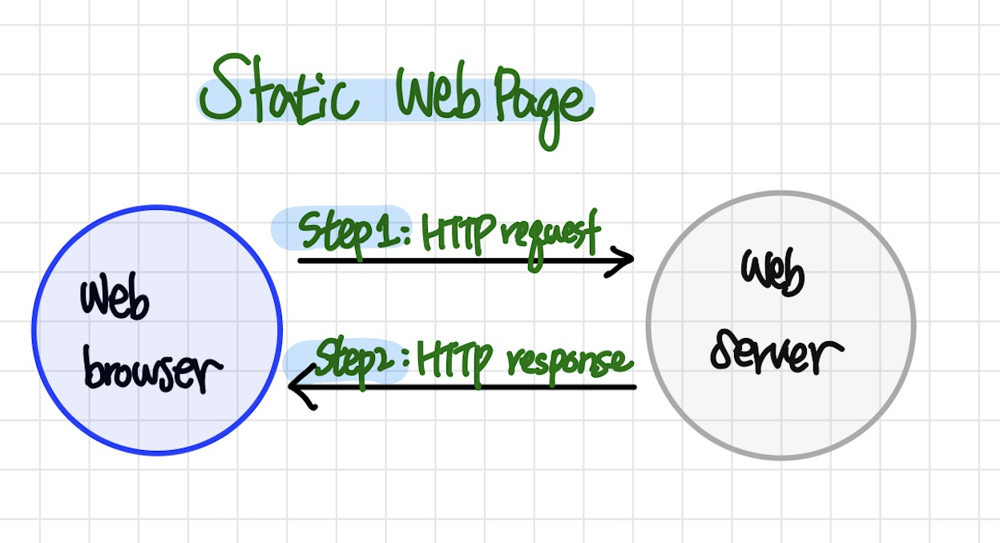
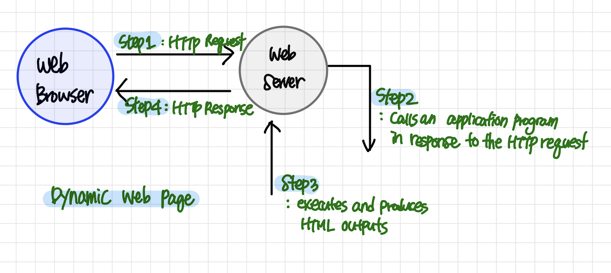
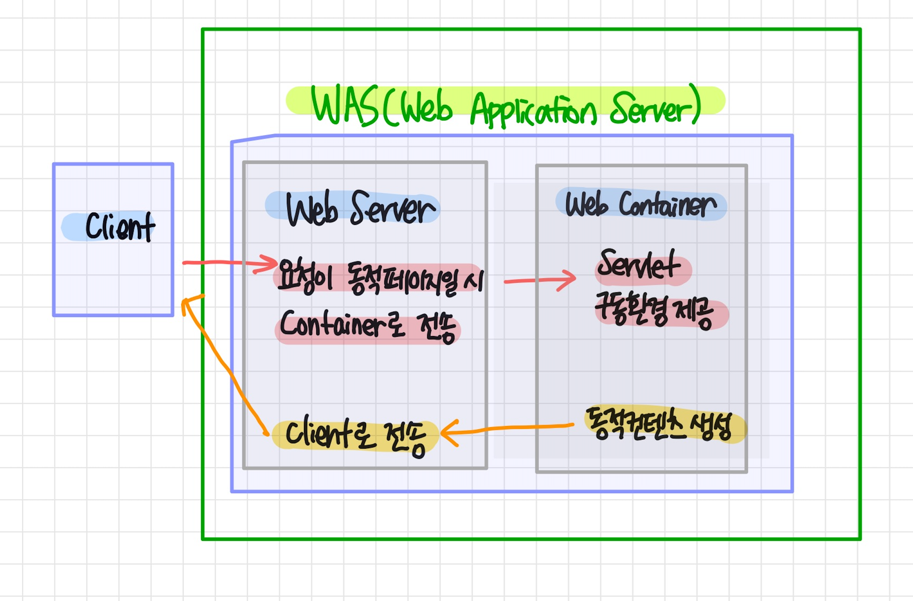
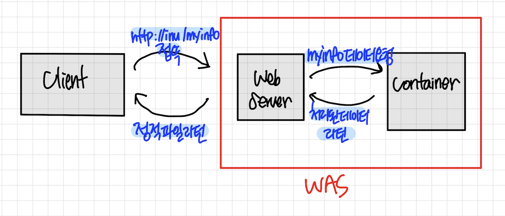
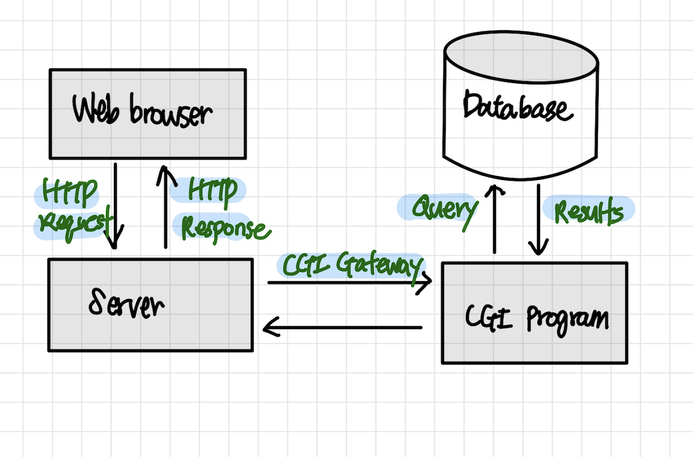
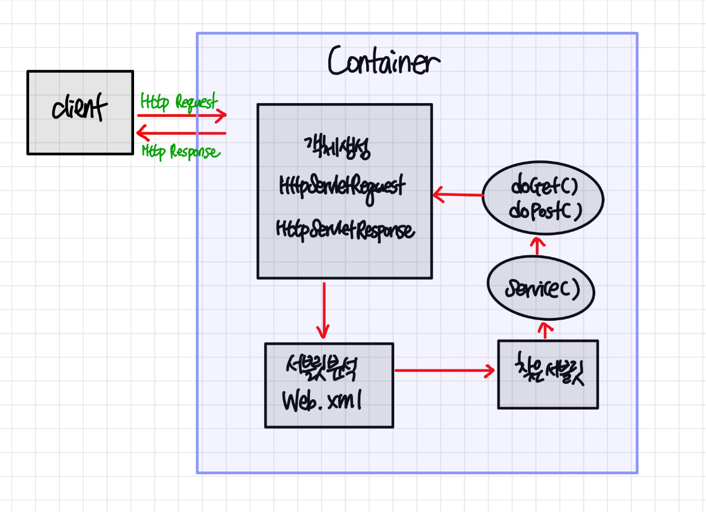

# 웹 서버와 WAS

## 웹 서버

### 정의
> 클라이언트(eg.웹 브라우저)로부터 HTTP 요청을 받아들이고 웹 페이지(HTML 문서)를 반환하는 컴퓨터 프로그램  
> 대표적으로 `Nginx, Appach HTTP Server, IIS`가 있다.

### 역할

- 클라이언트의 HTTP 통신에 대한 처리를 담당하는 서버
    
- `GET`과 같은 HTTP request가 들어오면 이에 대응하는 정보를 반환
    - eg. 사용자가 특정 웹페이지에 접속하면 웹서버가 해당 웹페이지의 HTML을 사용자에게 전달
    - 이 떄 웹서버는 클라이언트와 여러 connection을 만들어 여러 정보(HTML 템플릿, 이미지, 기타 데이터)들을 병렬적으로 전송
      
- `POST`, `PUT` 등과 같은 HTTP request가 들어오면 클라이언트가 서버에게 어떤 정보를 전달하게 되고, 웹서버가 클라이언트로부터 컨텐츠를 전달받는 역할을 한다.

---

## 정적 컨텐츠 vs 동적 컨텐츠

### 정적 컨텐츠

> 모든 클라이언트에게 동일한 웹페이지를 보여지게 하는 것을 의미

### 동적 컨텐츠

> 사용자에 따라 웹페이지가 달리 구성되는 것을 의미

### 동적 컨텐츠는 어떻게 처리되는가

웹 서버가 사용자의 정보에 따라 HTML을 구성하기 위해서는 사용자에 따라 특정 정보를 DB에서 불러와 내부 로직을 통해 정보를 처리해서 HTML에 넣어줘야 할 것이다.

하지만 기능에 따라 여러 DB에 따라 다르게 질의를 하고 다르게 데이터를 가공해서 전달해야 한다. 

즉 웹 서버 안에는 `동적 데이터 생성을 하기 위한 부분`과 `client 요청을 처리하고 이에 대한 응답을 하는 부분`이 공존하게 되고, 서버의 부하가 커지게 된다.

따라서 `웹 서버`에는 client의 요청과 응답에 대해서만 수행하는 부분(정적 컨텐츠 부분)만 남기고,  
다른 동적 컨텐츠를 위한 질의와 구성 등은 `WAS(Web Application Server)`로 분리하게 된 것이다.

`웹 서버`

1. HTTP 프로토콜을 통한 `정적인 콘텐츠` 제공
2. `동적인 요청`이 들어왔을 때, 해당 요청을 웹 서버에서 처리할 수 없기 때문에 `컨테이너(Container)로 보내주는 역할`

`컨테이너(Container)`

- 사용자의 요청이 들어오면 웹 서버는 정적인 요소만 클라이언트 측에 보낼 수 있고, 동적으로 처리해야 하는 부분은 처리할 수 없다.
- `컨테이너는 이런 부분을 대신 처리해서 웹 서버에 정적인 파일로 만들어서 보내주는  소프트웨어 모듈`  
  eg. 데이터베이스 조회, 로직 처리 등
- 클라이언트 측에서 어떠한 요청을 보내면, 해당 파일에서 처리해야할 부분을 처리하고 정적 파일로 만든 후에 클라이언트에게 보냈다고 볼 수 있다.
- jsp, servlet을 실행시킬 수 있는 소프트웨어
- 자바 계열에선 웹 애플리케이션 컨테이너(웹 애플리케이션이 배포되는 공간)라 부른다.

`WAS(Web Applciation Server)`

- `웹 서버로부터 오는 동적인 요청을 처리하는 서버`로 일반적인 웹 서버와 구별된다.
- 웹 서버 + 웹 컨테이너
- 프로그램 실행 환경과 데이터베이스 접속 기능을 제공한다.
- 비지니스 로직 수행 가능
  
- 웹 서버: Apache HTTP Server, nginx, IIS
- WAS(Application Server): Apache Tomcat, Jeus

`프로세스`:
WAS가 웹 서버로부터 처리 요청을 받으면, 프로그램의 실행결과를 웹 서버에 전달 ➡️ 웹 서버는 해당 결과를 웹 클라이언트에 전송

<small>Client - 웹 서버 - WAS 의 구조</small>

   

---

### CGI

> `공용 게이트웨이 인터페이스`의 약자로 `웹 서버들 간의 정보를 주고받는 일종의 규칙`

- `웹 서버`도 종류가 여러가지이고, `프로그램` 역시 다양하게 존재하기 때문에 서로 입출력을 주고 받을 표준이 필요하다.
- WAS는 CGI 규격에 맞게 설계된 서버라고 생각할 수 있다.

실제 CGI를 통해 동적인 콘텐츠를 전달하는 것을 간단하게 살펴보자

- 서버의 cgi-bin이라는 폴더를 만들어놓고, 그 내부의 스크립트 파일을 만들어놓는다.
- 웹 서버가 CGI를 통해 cgi bin에 접속해서 그 내부의 파일을 실행시키고, 그 결과를 클라이언트에 보낸다.

- CGI를 구동하는 대표적인 방법은 Apache HTTPd

---

## 아파치와 톰캣

### 아파치

> 월드와이드 웹 서버용 소프트웨어.
> 이를 통해 웹을 구축하려 할 때 쉽게 웹 서버를 수행할 수 있게 된다.

### 톰캣

> 아파치를 만든 아파치 소프트웨어 재단에서 만든 WAS 이다.

## 아파치와 톰캣의 차이점

CGI 규격을 맞출 수 있는 언어는 PHP, Perl, Python 등이 있고 `Java는 CGI 규격을 바로 맞출 수 없다`. 
그러나 많은 서버들이 Java로 구성되어 있고, Java 또한 이러한 CGI 규격을 맞추기 위한 기술을 가지고 있는데 이가 바로 `서블릿` 이다.

- 서블릿 컨테이너(Servlet Container)는 서블릿을 관리해주는 컨테이너

- 사용자가 URL을 입력하면 HTTP request가 Servlet Container로 전송한다.
- 요청을 전송받은 Servlet Container는 HttpServletRequest, HttpServletResponse 객체를 생성한다.
- web.xml을 기반으로 사용자가 요청한 URL이 어느 서블릿에 대한 요청인지 찾는다.
- 해당 서블릿에서 service 메소드를 호출한 후 클라이언트의 GET, POST 여부에 따라 doGet() 또는 doPost()를 호출한다.
- doGet() or doPost() 메소드는 동적 페이지를 생성한 후 HttpServletResponse 객체에 응답을 보낸다.
- 응답이 끝나면 HttpServletRequest, HttpServletResponse 두 객체를 소멸시킨다.

## 서블릿은 왜 컨테이너가 필요할까

서블릿은 클라이언트가 동적 컨텐츠를 생성할 때마다 생기게 된다.   
즉 클라이언트가 많아질수록 수많은 서블릿을 만드는 것은 어렵기 떄문에, 이러한 서블릿을 관리해주는 부분을 `서블릿 컨테이너`라고 한다.

### 서블릿 컨테이너의 특징

- 서블릿의 생명 주기를 관리
- 사용자의 요청에 따라 서블릿을 생성하고 이에 대응하는 서블릿 메소드를 호출
- HTTP 통신 지원
- 멀티 스레딩 지원
- 서블릿의 요청에 따라 여러 프로세스를 만들어 관리를 한다면 요청마다 다수의 프로세스가 생성되고 이에 따라 서버의 로드가 커질 수 밖에 없다. 따라서 서블릿은 많은 서블릿 메소드에 대해 멀티 스레드로 관리하게 된다.

---

<small>
[ref] 
https://me-analyzingdata.tistory.com/entry/%EC%9B%B9-%EC%84%9C%EB%B2%84%EC%99%80-WAS  
https://velog.io/@seanlion/cgi 
https://melonicedlatte.com/web/2019/06/23/210300.html 
https://www.youtube.com/watch?v=NyhbNtOq0Bc 

</small>