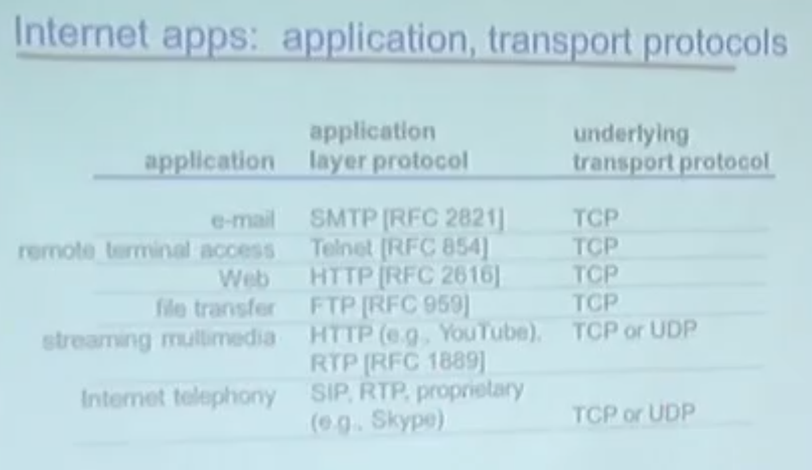
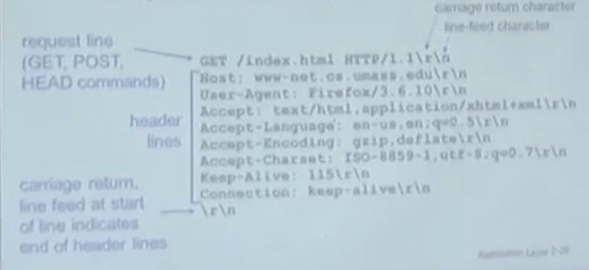
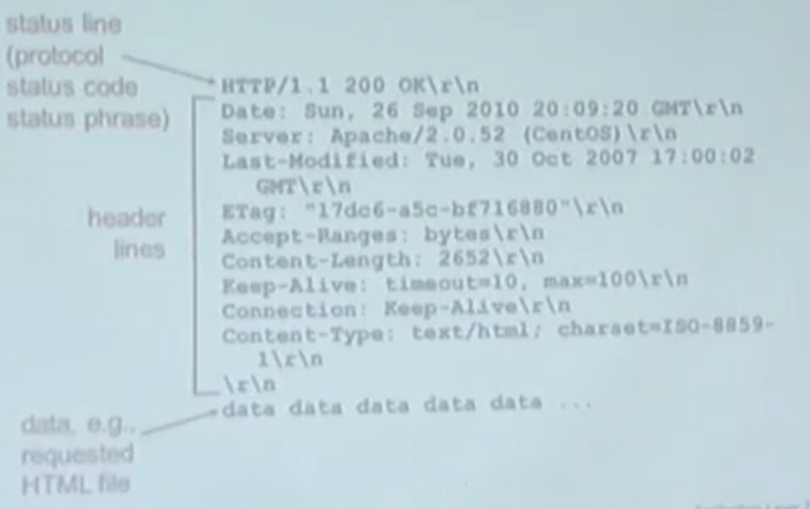
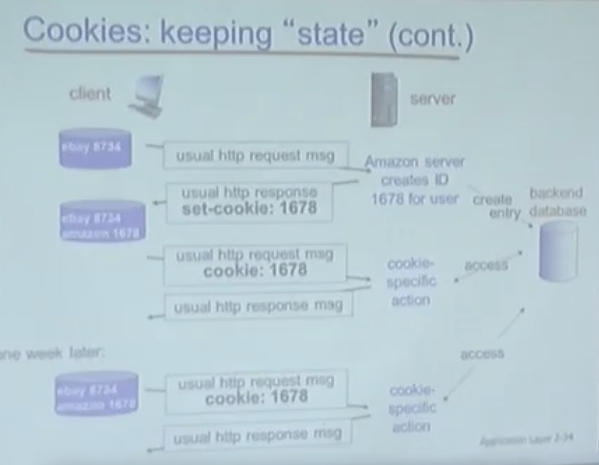

# Application Layer

## 애플리케이션 모델

### Client-Server architecture

- `server`
    - always-on host
    - permanent IP address (서버는 항상 고정된 주소를 가진다.)
    - data centers for scaling
- `clients`
    - communicate with server
    - may be intermittently connected
    - may have dynamic IP addresses
    - do not communicate directly with each other

---

### Processes communicating

`process` : program running within a host

- within same host, two processes communicate using `inter-process communication` (IPC defined by OS)
- processes in different hosts communicate by exchanging messages

cf.
`IPC`  
:  프로세스와 프로세스 간의 communication(메시지 교환)인데, 프로세스가 단지 서로 다른 머신에 존재한다.
이 communication이 가능하게 해주는 것은 OS가 이런 서비스를 제공해주기 때문이다.
  
애플리케이션 관점에서 얘기를 하자면, OS가 IPC를 위한 (socket 이라 불리는) 인터페이스를 제공해준다.
  
cf. 
`시스템콜`:  운영체제가 사용자 프로그램들을 편리하게 사용할 수 있도록 제공해주는 API  
`Socket`: 운영체제가 제공해주는 네트워크 관련 API

---

### How To address 특정한 프로세스?

지구 상에 존재하는 프로세스의 개수는 무수히 많고, 이 수많은 프로세스 중에 특정한 프로세스에게 전송하기 위해선 해당 프로세스의 주소가 필요하다.

그 주소가 바로 process의 애플리케이션 계층에 있는 socket 인터페이스의 주소이다.  
`socket 인터페이스의 주소`는 `IP 주소`를 통해서 이 프로세스가 동작하는 `머신`을 지칭하게 된다.

그러나 이 머신 안에는 또 수많은 프로세스가 동작하게 되므로, IP 주소만으로는 부족하다. 
한 건물 안에 호실 번호가 다 다르듯, 그 호실 번호에 해당하는 것이 `port` 번호이다.

=> 즉, 이 socket을 정확하게 지칭해야 배달이 되는데, 지칭하는 주소는 
`IP address + port 번호` 이다.

그러나 서버-클라이언트 구조에서 서버의 주소는 클라이언트가 찾아갈 수 있도록 항상 고정되어 있어야 한다.
 
e.g.  
www.naver.com 은 고정된 주소라고 보면 된다. 실제로는 웹 브라우저에서 DNS 프로토콜을 통해 우리를 대신해서 IP 주소를 가져오게 되고, 추가로 포트번호까지 필요하다.
고정되어있는 서버 주소의 포트번호를 가져오는 것은 귀찮으므로 HTTP(웹) 서버의 port는 80으로 약속한다. 어떤 머신이든 웹 서버 포트는 80번 포트로 사용하자고 약속한 것!
  

---

### Addressing processes

- to receive messages, process must have `identifier`
- host device has unique 32-bit IP address
- `identifier` includes both `IP address and port numbers` associated with process on host.
- example port numbers:
    - HTTP server: 80
    - mail server: 25
- to send HTTP message to gaia.cs.umass.edu.web server:
    - IP address: 128.119.245.12
    - port number: 80
- 애플리케이션마다 명시적으로 포트번호를 고정시켜놨다. 웹 서버는 80번, 이메일 서버는 25번으로 명시적인 포트번호를 정해놨다.

---

### Internet transport protocols services

### TCP service

- `reliable transport` between sending and receiving process
- `flow control`: sender won’t overwhelm receiver
- `congestion control`
- `does not provide` : timing, minimum throughput guarantee, security
- `connection-oriented`: setup required between client and server processes

### UDP service

- `unreliable data transfer` between sending and receiving process
- `does not provide`: reliability, flow control, congestion control, timing, throughput grarantee, security, orconnection setup

-> `둘의 차이? 신뢰성이 있게 할 것인가, 아닌가`

 
<small>-> tcp, udp를 사용하는 대표적인 애플리케이션 계층 프로토콜</small>

---

✅ tip: 
 프로토콜을 이해한다는 것은 `프로토콜의 이름을 이해 / 그 프로토콜에 사용되는 메시지 포맷 / 그 메시지가 어떤 필드들로 구성되어 있고 / 그 필드들이 어떤 의미를 가지는지를 이해하는 것`! (especially header structure)
  단, HTTP는 프로토콜의 이름을 이해하는 것으로 충분하다.

### Web and HTTP

`HTTP(HyperText Transfer Protocol)`

- 애플리케이션 프로토콜로 web이라 불린다.(web browsing)
- hypertext는 text인데 링크들이 있는 것으로, 다른 object들을 링크하고 전송하는 프로토콜이다.
  
- `HTTP request` : PC running Firefox browser(client) → running Apache Web server(server)
- `HTTP responses`: running Apache Web server(server) → PC running Firefox browser(client)
    
- 애플리케이션 프로토콜이기 때문에 하위 계층인 transport layer에서 서비스를 제공받는다.
- `HTTP`는 그 중에서 `TCP 기반`으로 동작한다. 중간에 유실되지 않고 서버와 통신할 수 있다는 뜻이다.
    
- 그 대신 TCP를 사용하기 때문에 network resources에 대해서 UDP 보다 비싼 비용을 내야 한다.
    
- 또, `HTTP request를 보내기 이전`에 클라이언트와 서버 사이의 `TCP connection`이 이뤄져야한다.
   (client OS와 server OS 사이에 왔다갔다하는 메시지 connection)

---

### `uses TCP`

- client initiates TCP connection (creates socket) to server, port 80
- server accepts TCP connection from client
- HTTP messages(applicatioin-layer protocol messages) exchanged between browser(HTTP client) and Web server (HTTP server)
- TCP connection closed

---

### `HTTP is “stateless”`

- server maintains no information about past client requests
- 상태가 없다. → request와 response 이후에 서버는 클라이언트에 대한 어떤 기억도 하지 않는다. 클라이언트도 서버에 대해 어떤 기억도 하지 않는 단순한 프로토콜.
- 서버는 요청한 파일에 대해 전송하고 끝. 많은 사용자들을 빠른 속도로 처리할 수 있다는 장점이 있다. request에 대한 응답 response 주고 끝!

---

### HTTP connections

`HTTP request 이전에 TCP connection이 이뤄져야 하는데 request를 보낼 때마다 connection을 할건지, 아니면 쭉 사용할건지`

- `non-persistent HTTP` (매번 새롭게, 좀 더 비효율적)
    - at most one object sent over TCP connection
        - connection then closed
    - downloading multiple objects required multiple connections
- `persistent HTTP` (재사용으로 좀 더 효율적)
    - multiple objects can be sent over single TCP connection between client, server

cf.

suppose user enters URL:

http://www.inu.ac.kr edu/someDepartment/home.index (contains text references to 10 jpeg images)

클라이언트가 서버한테 home.index 라는 하이퍼링크에 요청.  
해당 하이퍼링크는 파싱해보니까 10개의 레퍼런스를 가리키고 있다.(images 10개)   
base html 안에 image가 10개가 있다는 것이 아닌 10개의 이미지를 reference하는 링크가 있다는 뜻.  

`html파일을 브라우저에 띄울 때 어떤 메커니즘인가?`

- base html을 브라우저가 받아들이고, 
- 브라우저가 파싱해서 해석하면서 여기서 그림을 하이퍼링크하는, 
- 레퍼런스하는 링크가 있다면 그 그림을 request 해서 가져와서 띄우는 것.

---

### HTTP request message

- two types of HTTP messages: request, response
- `HTTP request message`
    
    - ASCII(human-readable format)
 
      
       

    <small>-> 여러가지 field(줄 별로)로 구성되는데, 첫번째 줄이 가장 중요하다.  
    어떤 파일을 어떤 방식으로 요청할건지에 대한 의미고, 그 뒤에는 서버에 브라우저가 특화된 페이지를 요청하기 위한 부가정보이다.</small>

---

### HTTP response message

 
<small>마찬가지로 header field 중 가장 첫 줄이 중요하다. 200 OK (요청한 파일 다 찾아서 전송했다는 의미)</small>

---

### HTTP response status codes

- status code appears in 1st line in server-to-client response message.
- some sample codes
    - `200 OK`
        - request succeeded, requested object later in this msg
    - `301 Moved Permanently`
        - request object moved, new location specified later in this msg(Location: )
    - `400 Bad request`
        - request msg not understood by server
    - `404 Not Found`
        - requested document not found on this server
    - `505 HTTP Version Not Supported`
    
---

### User-server state: cookies

many Web sites use cookies

항상 stateless가 좋은 것은 아니다. stateless를 보안하기 위해 나온 trick이 `cookies`다.
 

 

`client가 http://amazon.com 웹 브라우저로 접속했을 때, 해당 서버로 처음 접속한다고 가정`해보자.

아마존 서버와 클라는 처음으로 관계를 맺는다고 생각하고 cookie를 1678로 set 해준다.

이 때 이 정보를 http response message header에 적혀서 들어가게 될 것이다.

마찬가지로 또 클라→서버로 request를 보낼 때는 http request message에 cookie 번호가 적혀서 들어가게 될 것이고, 서버에는 해당 클라에 대한 쿠키번호로 요청에 대한 정보들을 모아서 저장하게 될 것이다. 해당 정보들을 바탕으로 예를 들어 클라이언트가 cs 전공 서적들을 구매했던 유저라면 1주 뒤에 해당 클라가 또 다시 접속했을 때 cs 전공서적을 바탕으로 한 추천을 깔아줄 것이다.

→ `stateless를 보안하기 위해 cookie라는 번호로, trick으로 쓸 수 있다.`

cf.
웹 브라우저 관리하는 디렉토리 영역에 쿠키파일이 존재해서 쿠키파일에는 웹사이트에서 부여한 번호들이 있다. 일련 번호들을 통해 유저들은 추적당하고 있다. 추적을 피하고 싶다면 http request에 쿠키를 disabled 하면 된다.

---

### Web caches (proxy server)

web browsing(http)에는 클라와 서버, request와 response로 구성되지만,
사실 클라이언트와 서버 사이에는 web caches(proxy server)가 동작하고 있다.

http request는 web proxy를 거치게 되고, request하는 파일이 여기있다면 즉석에서 response가 되고 없다면 origin server로 요청하게 된다.

이 구조는 널리 퍼진 구조이다. 어떤 장점이 있을까?

- 클라 / 서버 / 네트워크 운영자(인천대)도 행복해진다.
- 인터넷도 사용량만큼 돈을 내는데 이런 입장에서 돈을 덜 낸다.
    - 학생들 ↔ 인천대 ↔ KT ↔ ATLT
  
- 그러나 장점도 있는만큼 단점도 존재한다. 캐시가 등장하면 무조건 나오는 이슈가 있다.
    
- 캐시는 자주 사용하는 것을 주변에 원본에 대한 카피본을 가져다 두는데, origin server에 정보가 업데이트가 되었을 때 프록시 서버에 있는 정보에 대한 `일관성 문제`가 존재한다.
- 이에 대한 해결책을 고려해야한다는 것!

[ref]

[kocw 컴퓨터 네트워크](http://www.kocw.net/home/search/kemView.do?kemId=1312397)

