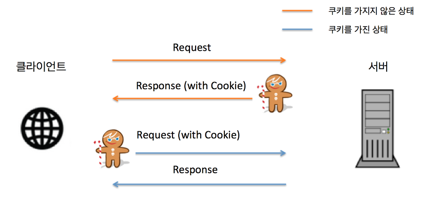
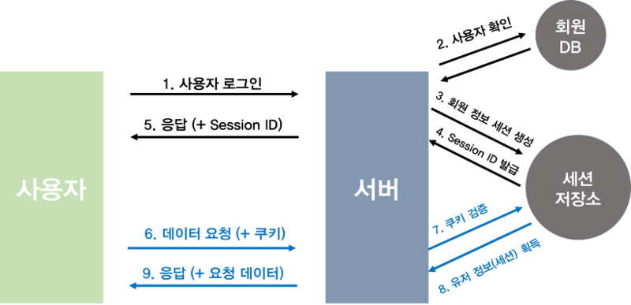

# 쿠키와 세션
> HTTP 프로토콜 환경은 `Connections less`, `Stateless` 특성을 가지기 때문에 서버는 클라이언트가 누구인지 매번 확인해야하는데 이를 보완하기 위해 쿠키와 세션을 사용한다

 

### Connectionless의 특징
 * 클라이언트가 요청을 한 후 응답을 받으면 연결을 종료한다
 * 클라이언트가 request를 서버에 보내면 서버는 요청에 맞는 response를 보내고 접속을 종료한다

 

### Stateless의 특징
 * 통신이 종료되면 클라이언트의 상태를 유지하지 않는다
 * 연결이 종료되는 순간 클라이언트와 서버의 통신이 종료되며 상태 정보를 유지하지 않는다
 * 쿠키와 세션은 위의 두 가지 특징을 해결하기 위해 사용된다

---
 

## 쿠키(Cookie)
> 쿠키란 웹 사이트에 접속할 때 서버에 의해 사용자의 컴퓨터에 저장되는 정보를 의미한다

 * 사용자의 컴퓨터에 마치 과자 부스러기가 남아 있는 것과 같다고 해서 `쿠키(Cookie)`라는 명칭이 붙었다
 * 클라이언트 PC 로컬에 저장되는 키와 값이 들어있는 작은 데이터 파일
 * 사용자 인증이 유효한 시간을 명시할 수 있으며, 유효 시간이 정해지면 브라우저가 종료되어도 인증이 유지된다
 * 쿠키는 클라이언트의 상태 정보를 로컬에 저장했다가 참조한다
 * 로그인 정보나 장바구니 정보를 저장하는 용도로 많이 활용되고 있다

 

### ***하지만 사용자의 정보가 컴퓨터에 고스란히 남기 때문에 보안에 취약하다***

 

### 쿠키의 동작 방식

 * 클라이언트가 페이지를 요청한다
 * 서버에서 쿠키를 생성한다
 * HTTP 헤더에 쿠키를 포함 시켜 응답한다
 * 브라우저가 종료되어도 쿠키 만료 기간이 있다면 클라이언트에서 보관한다
 * 같은 요청을 할 경우 HTTP 헤더에 쿠키를 함께 보낸다
 * 서버에서 쿠키를 읽어 이전 상태 정보를 변경 할 필요가 있을 경우 쿠키를 업데이트하여 변경된 쿠키를 HTTP 헤더에 포함시켜 응답한다

---
 

## 세션(Session)
> 세션이란 웹 사이트의 여러 페이지에 걸쳐 사용되는 사용자 정보를 저장하는 방법을 의미한다

 * 사용자가 브라우저를 닫아 서버와의 연결을 끝내는 시점까지를 세션이라고 한다
 * 클라이언트별로 세션 ID를 부여하고 상태 정보를 유지한다 -> `Stateful`
 * 사용자에 대한 정보를 서버에 두기 때문에 쿠키보다 보안에 강하지만 사용자가 많아질수록 서버 메모리를 많이 차지한다
 * 접속 시간에 제한을 두어 일정 시간 응답이 없다면 정보가 유지되지 않게 설정할 수 있다

 

쿠키는 클라이언트 PC에 모든 데이터를 저장하는 반면 세션은 서비스가 돌아가는 서버 측에 데이터를 저장하고, 세션의 키 값만을 클라이언트 측에 남겨둔다. 
브라우저는 필요할 때 마다 해당 키 값을 이용하여 서버에 저장된 데이터를 사용할 수 있다

 

### 세션의 동작 방식

> 출처: https://tansfil.tistory.com/58

 * 클라이언트가 서버에 접속 시 세션 ID를 발급 받는다
 * 클라이언트는 세션 ID에 대해 쿠키를 사용해서 저장하고 가지고 있는다
 * 클라이언트는 서버에 요청 시, 쿠키의 세션 ID를 같이 서버에 전달해서 요청한다
 * 서버는 세션 ID를 전달 받아서 별다른 작업 없이 세션 ID로 세션에 있는 클라이언트 정보를 가져와서 사용한다
 * 클라이언트 정보를 가지고 서버 요청을 처리하여 클라이언트에게 응답한다

 

### ***세션은 보안에 취약한 쿠키를 보완해주는 역할을 하고 있다***

---
 

## 쿠키와 세션의 차이

 

||쿠키|세션|
|---|---|---|
|저장 위치|클라이언트 PC|웹 서버|
|저장 형식|Text|Object|
|만료 시점|쿠키 저장시 설정   브라우저가 종료되도 만료시점이 지나지 않으면 자동 삭제되지 않음|브라우저 종료시 삭제(기간 지정 가능)|
|리소스|클라이언트 리소스|웹 서버 리소스|
|용량 제한|총 300개 하나의 도메인 당 20개 하나의 쿠키 당 4KB|서버가 허용하는 한 용량제한 없음|
|속도|세션보다 빠름|쿠키보다 느림|
|보안|세션보다 취약함|쿠키보다 좋음|

 

### 세션을 사용하면 좋은데 왜 쿠키를 사용할까?

 

세션은 서버의 자원을 사용하기 때문에 무분별하게 사용하게되면 서버의 메모리에 부하가 생기게 되고 이로 인한 서버의 성능 저하가 우려된다. 쿠키와 세션을 적절히 병행하여 사용하는것이 유리한 경우가 있다

 

### 쿠키, 세션과 캐시는 다르다

 

 * 캐시는 웹 페이지 요소를 저장하기 위한 임시 저장소이며 웹 페이지의 빠른 렌더링을 도와준다
    * 이미지, 비디오, 오디오, css, js파일 등 데이터나 값을 미리 복사해 놓는 리소스 파일들의 임시 저장소
 * 쿠키, 세션은 정보를 저장하기 위해 사용되며 사용자의 인증을 도와준다 

---
 

## JWT(JSON Web Token)
> JWT는 이러한 문제를 해결하기 위해 도입된 클라이언트 기반의 인증 방식이다

 * 토큰 자체에 사용자의 권한 정보나 서비스를 사용하기 위한 정보가 포함된다
 * 인증 시에 해당 토큰의 유효성을 검증할 모듈 하나만 있으면 세션 저장소 전체를 대체하는 수단이 될 수 있다

 

### JWT의 동작 방식

> 출처: https://tansfil.tistory.com/58

 * 클라이언트 사용자가 아이디, 패스워드를 통한 웹 서비스 인증
 * 서버에서 서명된 JWT를 생성하여 클라이언트에 응답으로 전달
 * 클라이언트가 서버에 데이터를 추가적으로 요구할 때 JWT를 HTTP 헤더에 첨부하여 요청한다
 * 서버는 클라이언트에게 전달받은 JWT를 검증한다

 

JWT는 사용자의 고유성을 입증할 만한 데이터를 포장하여 토큰을 생성한다 
해당 토큰을 클라이언트에게 전송받았을 때, 해당 토큰안에 들어있던 고유 데이터로 사용자를 식별하여 별도의 인증 과정없이 바로 작업을 수행할 수 있게 된다
 * 단, 해당 토큰은 클라이언트에 저장된다는 점에 보안이 취약할 유려가 있기 때문에 사용자에 대한 민감한 정보를 저장하는 것은 권장하지 않는다고 한다

 
 
### `JWT에 대한 자세한 정보`
 * https://pronist.dev/143