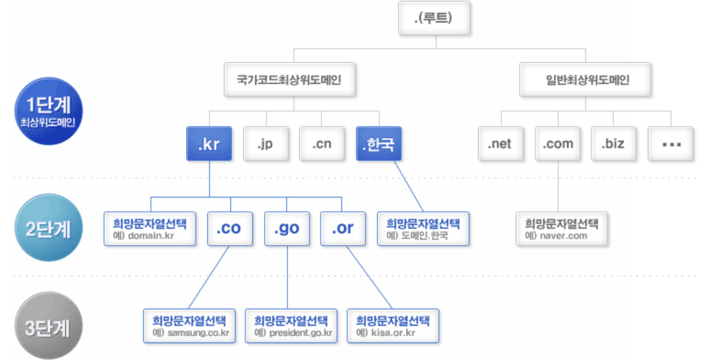
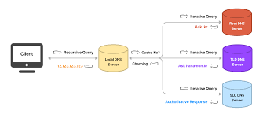

# DNS

 

## DNS(Domain Name System) 란?
> 도메인 이름(e.g. www.naver.com)을 IP 주소로 변환하는 시스템 

 - 사람이 쉽게 읽을 수 있는 인터넷 전화번호부
 - 도메인을 IP 주소로 변환하여 접속하는 과정을 지원한다

 

### ***DNS는 계층 구조를 가지는 `분산 데이터베이스 구조`이다***

 

### DNS의 구성 요소

1. Domain Name Space
 - 도메인 이름을 분산해서 저장하는 방법
 - 도메인에 해당하는 IP를 저장할 데이터베이스가 필요하고 분산된 데이터가 어디에 저장되어있는지 명확하게 하기 위해 사용된다

 

 
 - [이미지 출처](https://xn--3e0bx5euxnjje69i70af08bea817g.xn--3e0b707e/jsp/resources/dns/dnsInfo.jsp)

 * 도메인 네임 스페이스는 DNS가 저장 관리하는 계층적 구조

 

### Root DNS
- ICANN(국제인터넷주소관리기구) 에서 직접 관리하는 서버
- Top-Level Domain 서버 IP 주소를 저장하고 안내하는 역할을 한다

 

### Top-Level Domain
- 도메인 등록 기관이 관리하는 서버
- Authoritative DNS 서버의 주소를 저장하고 안내하는 역할
    - Authoritative DNS 서버: 실제 개인 도메인 IP 주소의 관계가 기록/저장/변경 되는 서버

 

### Second-Level Domain (Authoritative DNS 서버)
- 실제 개인 도메인과 IP 주소의 관계가 기록/저장/변경 되는 서버
- DNS 설정이 변경되면 도메인 등록 기관으로 전달된다

 

2. Name Server
 - 도메인에 해당하는 IP 주소를 찾는 서버로 DNS 서버를 뜻한다 

 

3. Resolver
 - DNS와 클라이언트간의 상호작용을 담당한다
 - 클라이언트의 DNS 요청을 네임 서버로 전달하고 찾은 정보를 클라이언트에게 제공하는 기능을 수행한다
 - 어떤 네임 서버에 요청을 보내야하는지, 캐시에 저장되어 있는지 확인하고 응답한다
 - 대표적으로 ISP(국내 통신 3사 KT/LG/SKT)와 구글, 클라우드 플레어 같은 Public DNS가 있다

 

### Recursive DNS Server
 - 재귀 DNS 서버가 클라이언트의 요청을 받아 관련 IP 주소에 다른 DNS 서버와 통신하여 해당 IP주소를 찾아 클라이언트에 반환하는 서버
 - 재귀 DNS 쿼리는 클라이언트가 서버에게 해당 IP주소를 찾아서 반환할 때까지 다시 연락하지 말라고 알리는 것

 

### 재귀와 반복의 차이
 - 재귀는 조건이 충족될 때 까지 반복적으로 자신을 호출하는 반면 반복에서는 조건이 충족될 때까지 일련의 명령이 반복된다

 * 재귀 DNS 쿼리는 서버가 클라이언트에 반환할 IP 주소가 있을 때까지 다른 DNS 서버에 계속 쿼리를 날린다.
 * 반복 DNS 쿼리는 서버가 클라이언트에게 직접 찾을 수 있도록 조회 과정에서 다음 DNS 서버 주소를 반환한다

 

### DNS 동작 방식

1. 클라이언트가 Local DNS 서버(ISP)에 요청(쿼리)을 보낸다
    - www.naver.com의 IP를 알려주세요
2. ISP는 root DNS 서버에 요청한다
    - www.naver.com의 IP를 알고있나요?
3. root DNS 서버가 응답한다
    - .com 도메인을 관리하는 네임서버의 이름과 IP를 알려드릴게요
4. 해당 네임 서버에 쿼리를 보낸다
    - www.naver.com의 IP를 알고있나요?
5. 네임 서버가 응답한다
    - 저는 모르지만 해당 웹은 w.g.naver.com이라는 이름으로 통해요. g.naver.com 도메인을 관리하는 네임서버의 이름과 IP 주소를 알려줄게요
6. 해당 네임서버에 쿼리를 보낸다
    - www.g.naver.com의 IP 주소를 알고있나요?
7. 네임 서버가 응답한다
    - 네 www.g.naver.com의 IP 주소는 xxx.xxx.xxx.xxx 입니다
8. Local DNS 서버(ISP)가 클라이언트에게 응답한다
    - www.naver.com의 주소는 xxx.xxx.xxx.xxx 입니다

 

### DNS 동작과정

- [이미지 출처](https://hanamon.kr/dns%EB%9E%80-%EB%8F%84%EB%A9%94%EC%9D%B8-%EB%84%A4%EC%9E%84-%EC%8B%9C%EC%8A%A4%ED%85%9C-%EA%B0%9C%EB%85%90%EB%B6%80%ED%84%B0-%EC%9E%91%EB%8F%99-%EB%B0%A9%EC%8B%9D%EA%B9%8C%EC%A7%80/)

---
 

## DNS Load Balancing
- 별도의 하드웨어 장비나 소프트웨어 없이 DNS 서버에 대한 트래픽을 분산시키는 방법

---
 

## Round Robin
- 프로세스 사이에 우선순위를 두는 것이 아닌 시간단위(Time Quantum)로 CPU를 할당하는 방식의 CPU 스케줄링 알고리즘

 

## DNS Round Robin
- 도메인에 대한 IP 요청 쿼리 시 Round Robin 방식으로 IP를 반환하는 것
- DNS 서버에 대한 쿼리를 RR 방식으로 해결하게 되면 따로 Load Balancing이 필요 없다
- Time Quantum에 따라 자동적으로 스케줄링이 되기 때문

 

### 장점
1. 간편하다
2. 하드웨어 장비가 필요없다

 

### 단점
1. 서버의 수 만큼 공인 IP 주소가 필요
    - DNS 쿼리를 분산 할 서버가 필요하고 해당 서버에 공인 IP 가 필요하다
2. 서버에 장애가 발생해도 감지하지 않고 부하를 분산시킴
    - 일반적인 Load Balancing은 Health Check를 통해 장애를 추적한다
3. DNS 결과를 캐싱해서 재사용하기 때문에 균등한 분산이 어렵다

### ***RR 방식은 로드 밸런싱 방법 중 하나일 뿐 단점을 보완해야한다***

---
 

## 다양한 분산 알고리즘

 

### Least Connection
- 접속 클라이언트 수가 가장 적은 서버를 선택하는 방법
- 로드 밸런서에서 실시간으로 connection수를 관리하고 서버에서 알려주어야 함

 

### L4 스위치
- L4의 부하 분산 방법 중 WBR(Weighted Round Robin)을 통해 웹 서버의 가중치를 설정하여 분산 비율을 조정
- 성능이 좋은 서버에 더 많은 트래픽을 할당하는 방법

 

### Response Time
- 가장 응답시간이 빠른 쪽의 서버를 알려준다

 

### Hash
- 클라이언트 IP를 기반으로 서버를 배정

 

### Bandwith based Load Balancing
- 서버들과의 대역폭을 고려하여 분산

