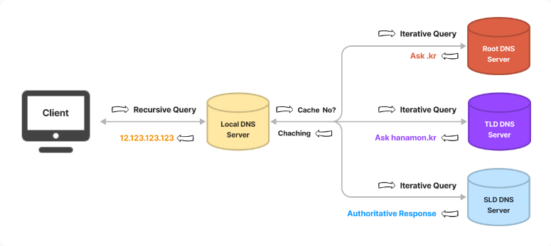

# DNS Round Robin

## DNS(Domain Name System) 란?
> 도메인 이름(e.g. www.naver.com)을 IP 주소로 변환하는 시스템 

 - 사람이 쉽게 읽을 수 있는 인터넷 전화번호부
 - 도메인을 IP 주소로 변환하여 접속하는 과정을 지원한다

 

### ***DNS는 계층 구조를 가지는 `분산 데이터베이스 구조`이다***

 

### DNS의 구성 요소

1. Domain Name Space
 - 도메인 이름을 분산해서 저장하는 방법
 - 도메인에 해당하는 IP를 저장할 데이터베이스가 필요하고 분산된 데이터가 어디에 저장되어있는지 명확하게 하기 위해 사용된다

 

 
 - [이미지 출처](https://xn--3e0bx5euxnjje69i70af08bea817g.xn--3e0b707e/jsp/resources/dns/dnsInfo.jsp)

 

2. Name Server
 - 도메인에 해당하는 IP 주소를 찾는 서버로 DNS 서버를 뜻한다 

 

3. Resolver
 - DNS와 클라이언트간의 상호작용을 담당한다
 - 클라이언트의 DNS 요청을 네임 서버로 전달하고 찾은 정보를 클라이언트에게 제공하는 기능을 수행한다
 - 어떤 네임 서버에 요청을 보내야하는지, 캐시에 저장되어 있는지 확인하고 응답한다
 - 대표적으로 통신 3사(KT/LG/SKT)와 같은 ISP와 구글, 클라우드 플레어 같은 Public DNS가 있다
 - Resolver = Recursive DNS Server = Local Server(of ISP) = Recursor 라고 할 수 있다

 

### Recursive DNS Server
 - 재귀 DNS 서버는 클라이언트의 요청을 받아 관련 IP 주소에 대해 권한이 있는 DNS 서버에서 얻은 레코드를 확인하는 DNS 서버

 

- [이미지 출처](https://hanamon.kr/dns%EB%9E%80-%EB%8F%84%EB%A9%94%EC%9D%B8-%EB%84%A4%EC%9E%84-%EC%8B%9C%EC%8A%A4%ED%85%9C-%EA%B0%9C%EB%85%90%EB%B6%80%ED%84%B0-%EC%9E%91%EB%8F%99-%EB%B0%A9%EC%8B%9D%EA%B9%8C%EC%A7%80/)

---
 

## Round Robin

---
 

## DNS Round Robin

---
 

## Load Balancing