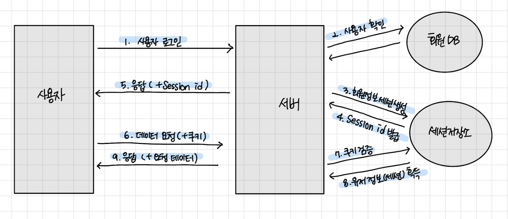
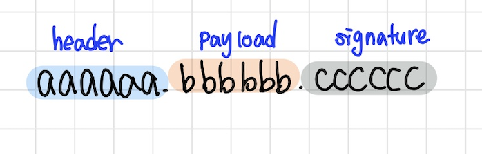
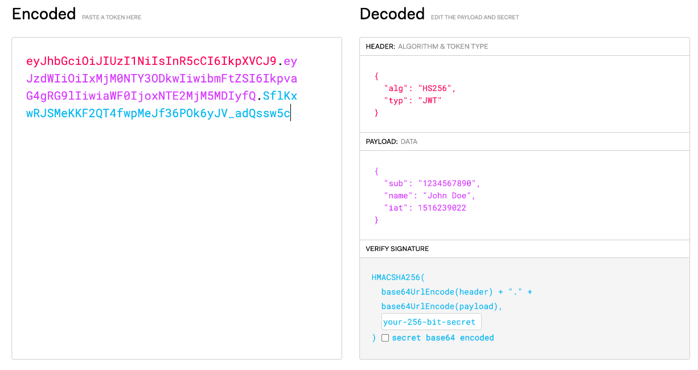
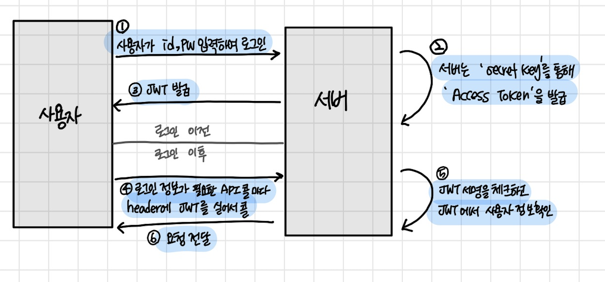
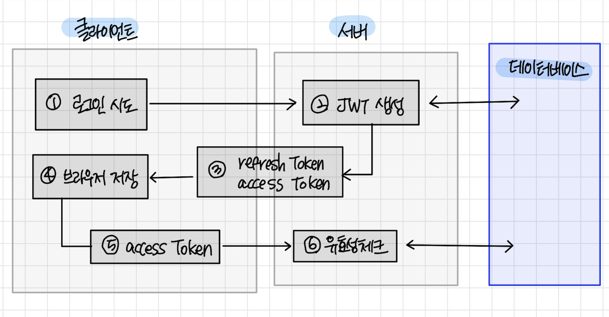

# JWT (JSON Web Token)

> 로그인 기능을 구현하기 위한 JWT

## HTTP 통신

> "로그인" 과정은 서버와 클라이언트가 데이터를 주고받는 통신 방법이 필요하다. 그 통신 방법으로 HTTP 프로토콜이 있다.


### HTTP의 특징

- `connectionless`
    - 연결을 유지하지 않는다.
    - 서버와 클라이언트가 한 번 통신하면 연결이 끊어진다.
      <br><br>
- `stateless`
    - 상태를 유지하지 않는다.
    - 서버와 클라이언트는 첫 번째 통신을 하고나서 두 번째 통신을 할 때는 이전의 통신에 대한 정보를 가지고 있지 않는다. 새롭게 갱신을 해주어야 한다.

  -> 이런 이유로 "로그인" 구현 시 사용자가 매번 서버에 요청할 때마다 <br>
  `자신이 누구인지 계속해서 인증을 해주어야 하는 번거로움`과 `매번 요청을 보내기 때문에 웹페이지가 느려지는 원인`이 발생한다.
  <br><br>
  그렇기에 우리는 사용자가 누구인지 계속해서 인증하는 것 대신에 다른 방식으로 로그인 정보를 유지시킬 방법이 필요하다.

---

## 로그인을 처리하는 방법

### 1. 유저에게 ID/Password를 받아서, 서버의 데이터베이스와 비교하는 방법

- 로그인 유지가 안된다.
- 정보가 유지되지 않으면, 매번 페이지를 이용할 때마다 로그인을 다시하거나 데이터가 제대로 저장되지 않는 경우가 발생한다.

---
> 세션과 토큰 방식은 사용자의 로그인 정보에 대한 것을 어디에 유지, 저장 하느냐에 따라 차이이다.
### 2. 세션 (session)


<br>

- `서버`에 유지하는 방식
- 서버의 메모리, 데이터베이스와 같은 서버 자원을 사용해서 사용자의 정보를 유지시키는 방법
- 장점은 토큰방식보다 보안이 강하다.
- 단점은 서버의 확장성이 떨어진다.
    - 세션을 저장하고, 유지할 공간인 서버의 자원이 많이 필요하다.
    - 세션이 서버에 저장이 되었을 때, 트래픽 분산을 위해서 여러 대의 서버를 사용한다고 할 때, <br>
      만약 사용자가 로그인했을 때는 만들어진 세션을 참조해야하기 때문에 처음 로그인한 그 서버에만 요청을 보내야한다는 단점이 있다.

-> 이러한 방식 때문에 `토큰` 방식을 사용한다.

---

### 3. 토큰 (token)

- `클라이언트`에 유지하는 방식
- 사용자가 로그인하면 서버에서 발행해주는 토큰(JWT)을 가지고 브라우저의 저장소에 토큰을 유지시키는 방법
- 서버에 저장되지 않아서 서버의 확장성이 있다.
    - 로그인 했을 때 해당 서버에만 요청을 보내는 것이 아닌,
      <br>요청이 들어왔을 때 `해당 토큰이 유효한지만 체크`하면 되기 때문에 어떤 서버로 요청을 보내도 상관이 없다.

---

## JWT (웹 토큰, JSON Web Token)

두 개체 사이에서 안정성 있게 정보를 교환하기 좋은 방법으로 JWT는 웹표준(RFC 7519)으로, 전자서명된 URL-safe의 JSON 이다.

## JWT의 구성

`.` 을 기준으로 세 파트로 나뉜다.


<br>

- `Header(헤더)`
  ```json
    {
      "alg": "서명 시 사용하는 알고리즘",
      "kid": "서명 시 사용하는 키를 식별하는 값",
        "typ": "타입"
    } 
    ```

    - JWT를 어떻게 검증하는지에 대한 내용이 들어가있다.
    - 토큰의 타입, 암호화 알고리즘이 어떤 알고리즘인지에 대한 정보가 들어가있다. (e.g.해시 알고리즘의 이름)
      <br><br>
- `Payload`
    ```json
    {
      "sub": "nahyeon.kim",
      "exp": 1623235123,
      "iat": 1532341234
    } 
    ```
    - 토큰에 담아서 우리가 `보내고자 하는 데이터`가 이 곳에 담겨져 있다.
    - 이 정보의 조각을 `클레임(claim)`이라 하고, `key-value`의 한 쌍으로 구성한다.
    - payload에는 여러 개의 클레임을 담을 수 있고, 클레임을 공개(public) 혹은 비공개(private) 할 것인지 등록(registered) 할 것인지 결정할 수 있다.
      <br><br>
- `signature(시그니처)`
    - 시그니처에는 위의 헤더(header)와 페이로드(payload)를 합친 문자열을 서명한 값이 들어있다.
    - 서명은 헤더의 'alg'에 정의된 `알고리즘`과 `secret key`를 이용해 생성하고,
    - Base64 URL-safe로 인코딩한다. (secret key를 포함해서 암호화가 되어있다.)

        

    - 생성된 JWT는 Encoded 된 값처럼 점(.)을 구분자로 헤더, 페이로드, 시그니처로 나눠서 서로 전달하게 된다.
    - 서버는 헤더의 alg, key 속성과 공개키를 이용해 검증할 수 있다.
    - 검증(이 토큰이 신뢰할 수 있는 토큰인가)이 성공하면 페이로드의 값을 접근할 수 있다.

---

## 공개 키(public key)와 비밀 키(secret key)

- JWT에서는 기본적으로 `공개 키 암호 방식(PKC, Public Key Cryptography)`를 사용
- `비대칭 암호 방식`을 이용해 `공개 키와 비밀 키`를 생성하고 이 키들을 상황에 따라 나누어 가지고 통신
  <br>

```
    서명
    : 비밀키를 가진 극소수(주로 한 명)만 데이터에 서명할 수 있다. 공개 키를 가진 아무나 데이터의 서명을 검증할 수 있다.
    
    암호화 
    : 공개 키를 가진 아무나 데이터를 암호화할 수 있다. 비밀 키를 가진 극소수만 데이터를 복호화해 확인할 수 있다.
```
---

## JWT의 장단점

### 장점

    1. 세션 방식과 다르게 별도의 인증 저장소가 필요없어서 서버와의 커뮤니케이션을 최소화 할 수 있다.
    2. 트래픽에 대한 부담감 저하
    3. 세션과 다르게 독립적인 느낌의 JWT를 활용한다는 것

### 단점

    1. JWT의 크기가 커질수록 모든 요청에 대해 전송되므로 데이터 트래픽 크기에 영향을 미칠 수 있다.
    2. 토큰은 클라이언트에 저장되기 때문에 DB에서 사용자 정보 수정해도 토큰에 직접 적용할 수 없다.

---

## JWT 프로세스

### ONLY "Access Token"



1. 사용자는 id, pw를 입력하고 서버에 로컬 요청을 보낸다.
2. 서버는 비밀 키(secret key)를 통해서 서명을 하고, 공개 키(public key)로 암호화 시킨 Access Token을 발급한다.
3. Access Token을 사용자(클라이언트)에게 보낸다.<br><br>
   --- 사용자 로그인 ---<br><br>
4. 사용자 정보가 필요한 API call 마다 토큰을 실어 보낸다.
    - 사용자(클라이언트)는 API를 요청할 때 Authorization Header에 Access-Token을 담아서 보낸다.
5. 서버에서는 사용자가 보낸 토큰을 공개 키(public key)로 서명에 체크하고, 안에 담긴 정보를 확인한다.
    - 서버는 secret key로 사용자가 보낸 토큰의 서명을 복호화해서 유효한 토큰인지 확인한다.
6. 서버가 요청에 대한 응답을 사용자(클라이언트)에게 전달한다.

### WITH "Refresh Token"

Access token만을 사용했을 때 보안 문제를 해결하기 위해 나온 refresh token

- only 'access token'만 있을 때 문제점 <br>
  : access token을 탈취당했을 때
  <br><br>
- 유효시간이 긴 token: 그 시간동안 정보를 탈취 당하게 되고
- 유효시간이 짧은 token: 사용자가 로그인을 여러 번 해야하는 번거로움

=> 그래서 나온 것이 `refresh token`



- 'access token', 'refresh token'은 모두 JWT
- 로그인 했을 때 서버에서 Access Token, Refresh Token을 동시에 보내준다.
- 단, 둘의 유효시간을 다르게 해서 보내준다.
- e.g.<br>
  refresh token은 1달, access token은 하루로 잡았다면,<br>
  access token의 기간이 다 되어도 refresh token의 기간이 남아있기 때문에 <br>
  사용자는 로그인 없이 다시 access token을 발급받을 수 있다.(로그인 유지)

=> `즉, refresh token은 access token을 다시 발급받기 위한 JWT`

---

## 보안은 어떻게 뚫리는가

1. `XSS 공격`

- 공격자가 클라이언트 브라우저에 JavaScript를 삽입해 실행하는 공격
- 즉, 공격자의 코드가 내 사이트의 로직인척 행동하는 것

2. `CSRF 공격`

- 공격자가 다른 사이트에서 우리 사이트의 API 콜을 요청해 실행하는 공격
- API 콜을 요청할 수 있는 클라이언트 도메인이 누구인지 서버에서 통제하고 있지 않다면 CSRF가 가능한데,
- 이 때 공격자가 클라이언트에 저장된 유저 인증 정보를 서버에 보낼 수 있다면,
  <br> 제대로 로그인한 것처럼 유저의 정보를 변경하거나 유저만 가능한 액션들을 수행할 수 있다.
- e.g.<br>
  CSRF에 취약한 은행 사이트가 있다면 로그인한 척 계좌번호를 바꾸거나 송금을 보낼 수 있는 것.

---

## 브라우저 저장소 종류

1. `local storage 저장 방식`
    - 브라우저에 저장 방식
    - 공격자가 클라이언트 브라우저에 스크립트를 삽입해 공격하는 XSS(cross-site scripting)에 취약하다.
      <br><br>
2. `쿠키 저장 방식`
- 브라우저에 쿠키로 저장되는데, 클라이언트가 HTTP 요청을 보낼 때마다 서버에 자동으로 쿠키가 전송되는 방식
- XSS(Cross-site scripting) & CSRF(Cross-site request forgery): 다른 도메인에서 우리 도메인으로 API Call을 날리는 공격 둘 다에 취약해질 수 있다.
  <br>
3. `secure httpOnly 쿠키 저장방식`
    - 브라우저에 쿠키로 저장되는건 같지만, JavaScript 내 접근은 불가능하다.
    - secure을 적용하면 https 접속에서만 가능하다.
    - CSRF 공격에 취약하다.

---

## 그래서 로그인은 어떻게 할까?

-> id를 브라우저에 저장하는 방식(e.g. local storage 혹은 cookie)은 어떤 방식이던지 보안 위험요소가 있다.

그래서 `JWT를 이용한 인증방식`을 이용할 것.

- refresh token만을 secure httpOnly 쿠키에 저장해 CSRF 공격을 방어할 것.
- access token은 웹 애플리케이션 내 로컬변수에 저장해 사용하며,
  <br>API를 요청할 때 Authorization 헤더에 넣어 보내준다.
- xss 취약점을 이용한 API 공격 요청은 클라이언트와 서버에서 추가적으로 방어한다.

---

## 결론

- HTTP의 stateless, connectionless 특성에 의해 로그인 정보를 유지시키기 위한 알맞은 방법이 필요했다.
- JWT는 암호화, 복호화를 통해 두 객체 사이에서 정보를 안전하게 주고받을 수 있는 좋은 수단.


[Ref]<br>
https://velog.io/@junghyeonsu/%ED%94%84%EB%A1%A0%ED%8A%B8%EC%97%90%EC%84%9C-%EB%A1%9C%EA%B7%B8%EC%9D%B8%EC%9D%84-%EC%B2%98%EB%A6%AC%ED%95%98%EB%8A%94-%EB%B0%A9%EB%B2%95
<br><br>
https://velog.io/@yaytomato/%ED%94%84%EB%A1%A0%ED%8A%B8%EC%97%90%EC%84%9C-%EC%95%88%EC%A0%84%ED%95%98%EA%B2%8C-%EB%A1%9C%EA%B7%B8%EC%9D%B8-%EC%B2%98%EB%A6%AC%ED%95%98%EA%B8%B0#-%EB%B8%8C%EB%9D%BC%EC%9A%B0%EC%A0%80-%EC%A0%80%EC%9E%A5%EC%86%8C-%EC%A2%85%EB%A5%98%EC%99%80-%EB%B3%B4%EC%95%88-%EC%9D%B4%EC%8A%88
<br>