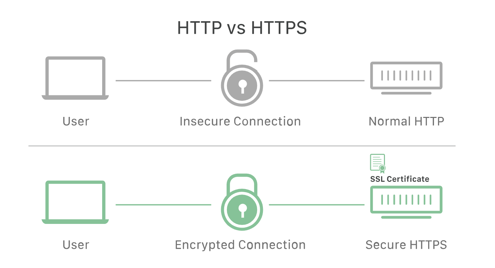
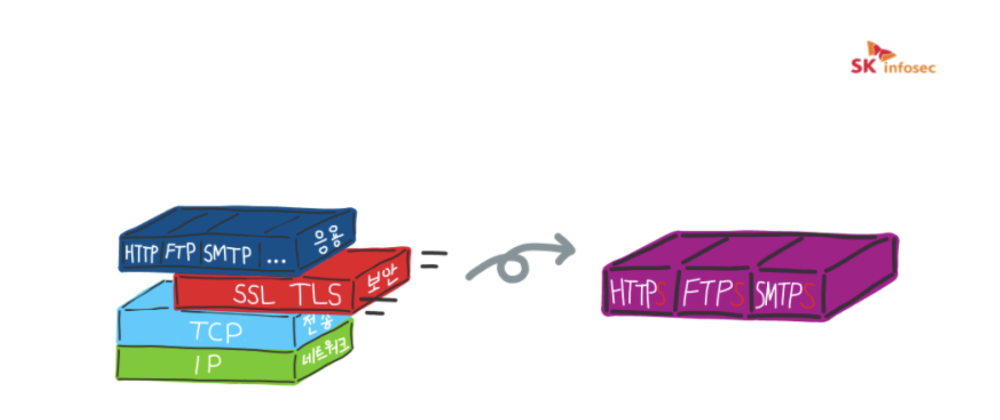
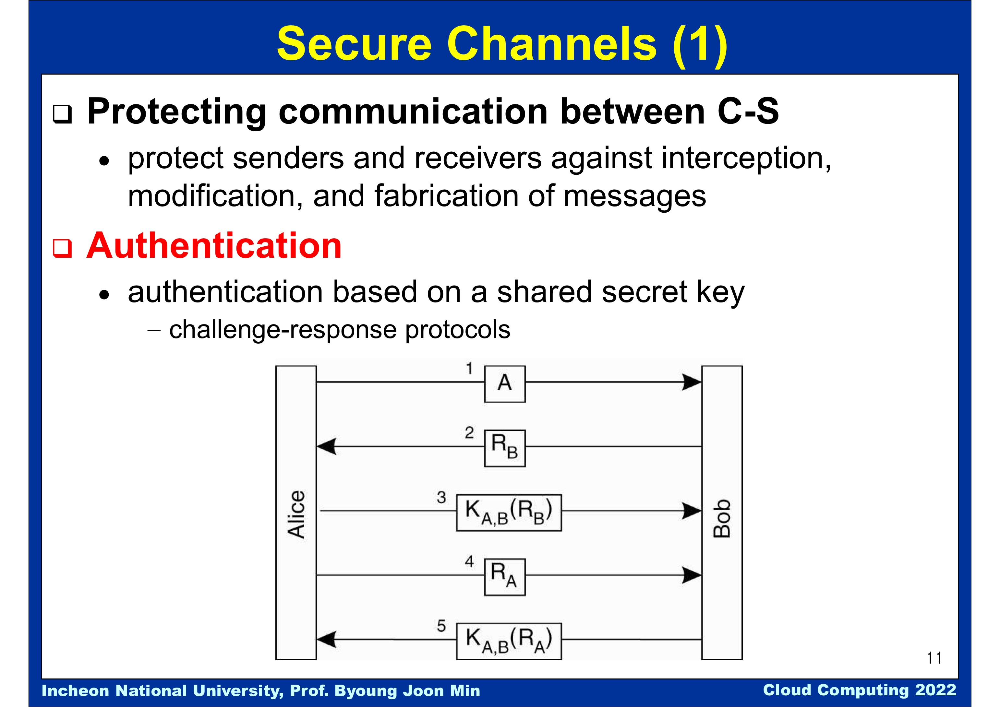
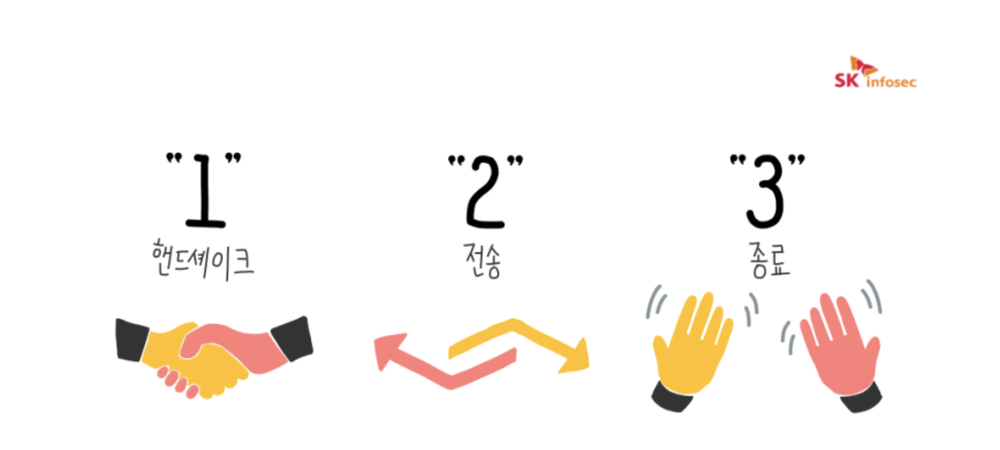

# SSL (Secure Sockets Layer)

## SSL 이란?

- 암호화 기반 인터넷 프로토콜이다. 
- 인터넷 통신의 개인정보 보호, 인증, 데이터 무결성을 보장하기 위해 Netscape가 1995년 처음 개발했다.
- SSL은 현재 사용 중인 TLS 암호화의 전신이다.
- SSL/TLS 를 사용하는 웹사이트의 URL은 "HTTP" 대신 "HTTPS"가 있다. 보안이 향상된 웹 통신을 하기 위함이 목적으로 이때 뒤에 붙는 S는 보안(Secure)을 나타낸다.
- 즉 SSL 암호화 통신은 `SSL(Secure Socket Layer)` 또는 `TLS(Transport Layer Security)`라는 보안 프로토콜을 통해 클라이언트(브라우저)와 서버(웹서버)가 보안이 향상된 통신을 하는 것을 말한다./

## SSL / TLS는 어떻게 작동할까?

- SSL은 높은 수준의 개인정보 보호를 제공하기 위해, 웹에서 전송되는 데이터를 암호화한다. 
    따라서 데이터를 가로채려는 자는 거의 해독할 수 없는 복잡한 문자만 보게 된다.
- SSL은 두 통신 장치 사이에 인증 프로세스인 핸드쉐이크를 시작하여 두 장치의 ID를 확인한다.
- 데이터 무결성을 제공하기 위해 데이터에 디지털 서명하여 데이터가 의도된 수신자에 도착하기 전에 조작되지 않았다는 것을 확인한다.

## SSL/TLS은 왜 중요할까?

- 원래 웹 상의 데이터는 메시지를 가로채면 누구나 읽을 수 있는 텍스트 형태로 전송되었다.
  
    - e.g. 신용 카드 번호를 입력할 때, 해당 신용 카드 번호가 숨겨지지 않은 채 인터넷을 이동
- SSL은 이 문제를 바로잡고, 사용자 개인 정보를 보호하기 위해 제작되었다. 
사용자와 웹 서버 사이를 이동하는 모든 데이터를 암호화하여, 누군가 데이터를 가로채더라도 무작위 문자만 볼 수 있게 한다.

- 특정한 유형의 사이버 공격도 차단한다. SSL은 웹 서버를 인증하는데, 공격자들이 사용자를 속여 데이터를 훔치기 위한 가짜 웹 사이트를 만드는 일이 있기 때문에, 이러한 인증이 중요하다.
또한 공격자가 전송 중인 데이터를 조작하지 못하게 막기도 한다.
  
## SSL과 TLS

- SSL은 TLS(Transport Layer Security)이라는 또 다른 프로토콜의 바로 이전 버전이다. 
- 1999년 IETF(Internet Engineering Task Force)는 SSL에 대한 업데이트를 제안했고, IETF가 이 업데이트를 개발하고 Netscape는 더 이상 참여하지 않게 되면서, 이름이 TLS로 바뀌었다.
- SSL의 최종버전(3.0)과 TLS 첫 버전 차이는 크지 않으며, 이름이 바뀐 것은 소유권 변경을 나타내기 위한 것이다.
- 이들은 긴밀하게 연계되어 있어 두 용어를 혼합되어 사용되는 경우가 많다. TLS를 아직 SSL이라 부르기도 하고, SSL의 인지도가 높으므로 'SSL/TLS 암호화'라 부르기도 한다.

## SSL과 HTTPS

- SSL과 TLS는 '보안 계층'이라는 독립적인 프로토콜 계층을 만들어, 응용 계층과 전송 계층 사이에 속하게 된다.
- HTTPS는 SSL 또는 TLS 위에 HTTP 프로토콜을 얹어 보안된 HTTP 통신을 하는 프로토콜이다. 
- SSL과 TLS는 HTTP 뿐만 아니라 FTP, SMTP와 같이 다른 프로토콜에도 적용할 수 있다.
- HTTPS는 TLS와 HTTP가 조합된 프로토콜만을 가리키는 것

## 지금도 SSL이 최신 상태일까?

- SSL은 1996년 SSL 3.0 이후 업데이트 되지 않았으며, 앞으로 사라지게 될 것이라 여겨지고 있다.
- SSL 프로토콜에는 알려진 취약성이 여러 가지 있으며 보안 전문가들은 SSL의 사용을 중단하라고 권장한다.
- 실제로, 최신 웹 브라우저는 대부분 이제 SSL을 지원하지 않는다.
  
- TLS는 현재 온라인으로 실행되고 있는 최신 암호화 프로토콜인데, 아직 이를 'SSL 암호화'라고 부르는 경우도 있다.
- 현재 'SSL'을 제공하는 업체는 사실 상 TLS 보호를 제공하는 것으로, 거의 20년 동안 업계 표준으로 자리 잡고 있다.

## SSL 인증이란?

- SSL은 SSL 인증서 (공식적으로 'TLS 인증서')가 있는 웹사이트만 실행할 수 있다.
- SSL 인증서는 사람의 신원을 확인하는 신분증이나 배지와 같으며, 웹사이트나 애플리케이션 서버가 웹에 저장하고 표시한다.

- SSL 인증서에 포함된 가장 중요한 정보는 웹사이트의 공개 키가 있다. 이 공개 키 덕분에 암호화가 가능하다.
- 사용자의 장치는 공개 키를 보고 이를 이용하여 웹 서버와 안전한 암호화 키를 수립한다. 
- 웹서버에는 기밀로 유지하는 개인 키가 있다. 개인 키는 공개 키로 암호화된 데이터를 해독한다.
- CA(인증 기관)는 SSL 인증서 발행을 담당한다.

---

### Symmetric & Asymmetric Cryptosystem

- `Symmetric cryptosystem`

대칭 암호방식, 암호키가 같은 걸 사용해서 암호화 하는 것

비트 단위의 XOR 연산이 대부분 포함되어있다.  중요한 것은 같은 키를 사용, A가 암호화하고 B가 복호화 하는. → 공유 비밀 키 (shared secret key)

⇒ 연산속도가 굉장히 빠르다./ 키배분의 문제, 관리의 문제

⇒ 메시지의 기밀성을 부여해야 할 때 주로 사용

- `Asymmetric cryptosystem`

비대칭 암호방식(→공개키 암호방식)

모든 사람에게 공개키, 비밀키가 있다. 키값이 암호화하는데 사용하고 복호화하는데 사용하는데 하나를 알고 있어도 둘의 짝을 맞추지 못한다는 것이 센세이셜 하기 때문에 이 방식을 공개키 암호방식이라고 보통 얘기한다.

⇒ 쓰임새가 다르기 때문에 두 가지 방식을 사용한다.

⇒ 내가 어떤 사람의 공개키로 암호화해서 보냈으면, 그걸 풀었다면 그 사람이란 소리고. 그 사람이 나의 공개키를 암호화해서 와서 내가 풀었다면 나라는 걸 그 사람이 알 수 있다.
  

- 이런 것들을 이용해서 하고자 하는 것 중 하나가 클라이언트-서버 간의 안전한 채널을 만들어내는 것이 암호 기술을 사용하는 이유
/ 기밀성을 유지하기 위함.
    
- Alice가 Bob하고 메세지를 주고받으려하는데 상대방이 그 사람이 맞는지 확인하기 위해 인증과정이 필요하고,
상대방에 대한 인증, 앞으로 메시지를 주고받을텐데 메세지를 암호화해서 보내게 될 것. 용량이 큰 메시지를 보낼 땐 대칭키 암호화 방식을 사용한다.
  
- 공유-비밀키를 나눠 가져야 한다. 일방적으로 이런 키는 장기간이 아닌 메시지를 주고받을 때 쓰는 것이 일반적.
    
- process
    - Alice와 Bob 사이에 공유 비밀키를 나눠 가지고 있는 상황.
    - Alice가 나 A라고 통보를 해주는 것.
    - Alice는 상대방이 Bob이란 걸 확인하고, 키 값으로 암호화해서 확인하는.

---

## SSL 암호화 통신 방식

- 공개키와 대칭키를 혼합해서 사용한다.
- 클라이언트와 서버가 주고 받는 실제 정보는 대칭키 방식으로 암호화하고, 대칭키 방식으로 암호화된 실제 정보를 복호화 할 때 사용하는 대칭키는 공개키 방식으로 암호화해서 클라이언트와 서버가 주고 받는다.
    - 실제 데이터 : 대칭키
    - 대칭키의 키 : 공개키
    
총 세 단계로 나뉘어진다. 

- 가장 먼저 SSL handshake를 수행한다. 이때 데이터를 주고받기 위해 어떤 방법을 사용해야 하는지 서로의 상태를 파악한다.
- SSL은 80번 포트를 사용하는 HTTP와 달리 443번 포트를 기본으로 사용하는 TCP 기반의 프로토콜 TCP 기반이기 때문에 SSL handshake 전에 TCP 3-way handshake 또한 수행한다.
- 서로 간 협상 완료되면, SSL 세션이 생성되고 클라이언트와 서버는 원하는 데이터를 주고받을 수 있게 된다.
- 데이터 전송의 끝을 서로에게 알리며 세션을 종료한다.

**references** 
https://www.cloudflare.com/ko-kr/learning/ssl/what-is-ssl/  
https://m.blog.naver.com/PostView.naver?isHttpsRedirect=true&blogId=skinfosec2000&logNo=222135874222  
https://m.blog.naver.com/PostView.naver?isHttpsRedirect=true&blogId=skinfosec2000&logNo=222135874222