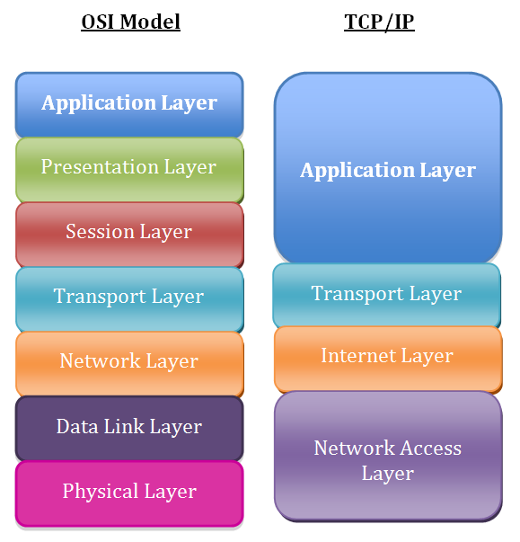
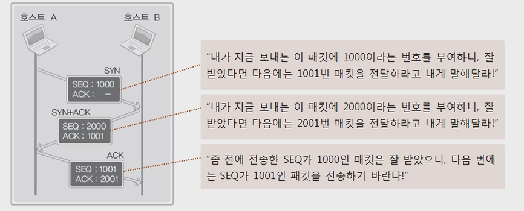
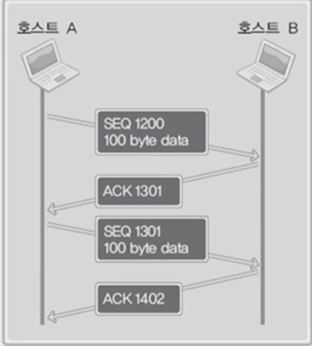
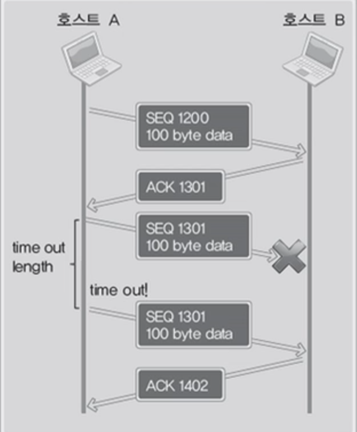
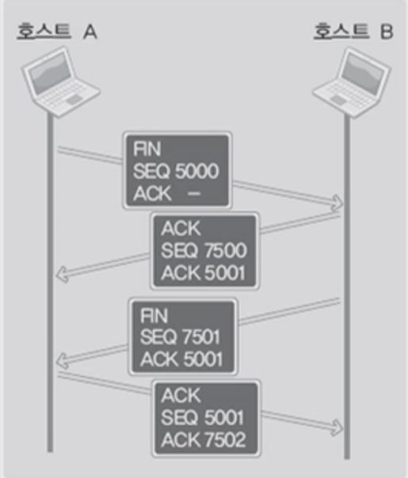

# TCP/IP
> 서로 다른 시스템을 가진 컴퓨터들을 서로 연결하고, 데이터를 전송하는 데 사용하는 통신 프로토콜들의 집합으로 인터넷 프로토콜 슈트라고도 불린다

 

### 인터넷 프로토콜 슈트(Internet Protocol Suite)
> TCP/IP를 시초로 하는 인터넷의 표준 프로토콜의 집합
 
 

* 가장 많이 사용되는 핵심 프로토콜인 TCP/IP를 포함한 각종 프로토콜의 총칭
* 1980년 초 미국 국방부가 제정하여 유닉으 운영체제 내에 채용되고 인터넷에도 사용되었다
* 네트워크상에서 데이터를 전송하는 표준이 되었다

 

## 프로토콜 스택(Protocol Stack)
> TCP/IP는 네트워크 액세스 계층, 인터넷 계층, 전송 계층, 응용 계층의 4계층으로 구성되어 있다

 

 

### 응용 계층(Application Layer)
> 일반적으로 사용자가 접하는 웹 서비스, 원격 파일 전송, 메일 전송 등의 서비스를 제공한다

 * HTTP(HyperText Transfer Protocol)
 * SMTP(Simple Mail Transfer Protocol)
 * FTP(File Transfer Protocol) 

 

### 전송 계층(Transport Layer)
> TCP 프로토콜은 응용 계층 메시지를 목적지 호스트까지의 종점간 연결과 데이터 전달을 담당한다

 * 이를 위해 어플리케이션의 메시지를 좀 더 작은 패킷으로 나누고 수신된 패킷들을 원래대로 재조립하는 일을 수행한다
 * TCP는 재전송이나 오류제어 등을 통해 메시지 전달을 보장하고 흐름제어 및 혼잡제어와 같은 서비스를 제공한다
 * UDP는 목적지까지의 메시지 전송을 보장하지 않는 비연결형 서비스이며 재전송이나 흐름제어 등의 서비스를 제공하지 않는다

 

### ***UDP는 다른 데이터에 비해 안전하게 보호되어야 할 필요가 없는 실시간 응용 프로그램에서 흔히 이용된다***

 

### 인터넷 계층(Internet Layer)
> IP 프로토콜은 IP주소를 기반으로 각 패킷이 목적지까지 가는 길을 찾아 목적지에 정확하게 도착할 수 있는 라우팅(Routing)을 담당한다

 * 하나의 상위 계층(전송 계층) 패킷은 IP 프로토콜을 이용해 여러 개의 패킷으로 나뉘어 서로 다른 경로를 통해 전달될 수 있다
 * 최종 목적지에서 패킷이 재조립된다
 * IP 프로토콜 이외에 ICMP, ARP등의 프로토콜을 포함한다

 

### ICMP(Internet Control Message Protocol)
> 인터넷 환경에서 오류에 관한 처리를 지원하는 용도로 사용되며, IP 패킷의 데이터 부분에 캡슐화되어 송신 호스트에게 전달된다

 * TCP/IP 기반의 통신망에서 전송 과정에 문제가 발생하면 라우터에 의해 ICMP 메시지가 자동으로 발생하여 패킷 송신 호스트에게 전달된다

 

### ARP(Address Resolution Protocol)
> IP 주소를 통해서 수신 호스트의 MAC 주소를 얻을 때 사용된다

 * ARP request 패킷을 브로드캐스팅하여 네트워크의 모든 호스트에게 전송하고 수신 호스트는 ARP reply 패킷을 사용해 자신의 MAC 주소를 회신한다

 

### ***데이터를 전송할 때 마다 ARP를 사용하여 패킷을 브로드캐스팅하면 네트워크 트래픽이 증가한다***

 

 * ARP를 사용하는 호스트에서는 가장 최근에 얻은 IP 주소와 MAC 주소 매핑 값을 보관하는 캐시 정보를 이용한다
 * 또한 ARP request 패킷을 브로드캐스팅하는 과정에서 패킷을 수신한 모든 호스트는 송신 호스트 IP 주소와 MAC 주소 매핑 값을 자동으로 얻을 수 있다

 

## TCP(Transmission Control Protocol)의 내부동작

 

### TCP의 특징
 * 연결형 서비스로 가상 회선 방식을 제공한다
 * 3-way handshake를 통해 연결하고 4-way handshake를 통해 해제한다
 * 흐름 제어 및 혼잡 제어를 제공한다
 * 높은 신뢰성을 보장한다

 

### 1. 3-way handshake를 통한 소켓 연결

 

 

### 2. 상대 소켓과의 데이터 송수신

 

 * ACK 번호 = SEQ 번호 + 전송된 바이트 크기 + 1

 

### ***ACK의 값을 전송된 바이트 크기만큼 증가시키는 이유는 패킷의 전송유무 뿐만 아니라 데이터의 손실유무까지 확인하기 위함이다***

 

 * SEQ 전송 시 타이머가 작동되고 SEQ에 대한 ACK를 일정시간 전송받지 못할 경우 데이터를 재전송한다

 

### 4-way handshake를 통한 소켓 연결 해제

 

 * 일방적인 종료로 인한 데이터의 손실을 막기 위함이다

 

## UDP(User Datagram Protocol)
> 데이터그램이란 독립적인 관계를 지니는 패킷으로 비연결형 프로토콜이다

 

### UDP의 특징
 * 비연결형 서비스로 데이터그램 방식을 제공한다
 * 정보를 주고 받을 때 정보를 보내거나 받는다는 신호 절차를 거치지 않는다
 * UDP헤더의 CheckSum 필드를 통해 최소한의 오류만 검출한다
 * 신뢰성이 낮고 TCP보다 빠르다
 * 신뢰성보다는 연속성이 중요한 실시간 서비스(streaming)에 자주 사용된다

