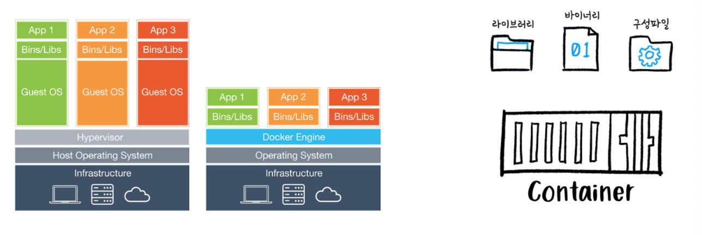

# Virtualization

### 가상 머신(VM)

- [Server -> HostOS -> Hypervisor -> 각각의 Guest OS가 설치된 VM 구동]
  
- 장점
    - Host OS가 Window 여도, Guest OS로 Linux를 사용 가능
    - 보안적으로, Guest OS가 뚫렸을 경우, 다른 Guest OS와 Host OS가 완벽하게 분리되어 있기 때문에, 각각의 VM에 피해가 가지 않는다.

- 단점
    - VM마다 무거운 Guest OS를 띄우기 때문에, Container에 비해 속도가 느리다.
    
- 호스트 운영체제 위에 하이퍼바이저 레이어를 얹어 사용하는 가상화 방식
- 상대적으로 무겁다.
- 가상화에 따른 퍼포먼스 오버헤드 가능성
- 각각의 VM은 호스트 OS와는 전적으로 다른 자신만의 운영체제 커널 및 사용자 공간을 가지므로 
    사용하는 리소스와 크기가 컨테이너에 비해 상대적으로 크다.
- 프로비저닝 및 서버 복제에 시간이 필요하다.

    cf. 프로비저닝(Provisioning)  
    사용자의 요구에 적합하게 시스템 자원을 할당, 배치, 배포해두었다가 필요 시 시스템을 즉시 사용할 수 있는 상태로 미리 준비해 두는 것  
    ex. 서버 자원 프로비저닝, OS 프로비저닝, 소프트웨어 프로비저닝, 스토리지 프로비저닝 등

### 컨테이너
- [Server -> HostOS -> Docker Engine -> Container 구동]
- 장점
    - 하나의 HostOS를 공유하기 때문에, Container 별로 무거운 OS를 띄우지 않아, Container의 속도가 훨씬 빠르다.
    - 컨테이너는 독립적이고, 동적이다.
    - 어떠한 Java 앱이 인기가 많아지면, 트래픽에 따라 java 컨테이너의 수를 늘리고 줄일 수 있다.
    - docker 덕분에, 매번 새로운 서비스를 만들 때마다 새로운 서비스를 설정할 필요가 없다.
- 단점
    - 보안적으로, Container 가 뚫렸을 경우, 다른 Container와 Host OS가 위험해질 수 있다.
    
- 호스트 OS와 커널 공간, 모듈 및 드라이버를 공유하는 방식
- 가상머신 대비 가볍다.
- 운영체제가 아닌 프로세스를 구동
- 가벼운 커널 namespaces
- 빠른 namespaces와 프로세스 생성
- 쉬운 마이그레이션(이식성)

---

### 컨테이너

 

- 리눅스는 프로세스별 자원을 격리해서 사용하는 cgroup과 특정 디렉터리로 권한을 제한하는 chroot 등 격리 환경 구성이 가능하다.
- 여기에 디스크의 파일 변경 사항을 레이어 형태로 저장하는 파일 시스템을 합해 컨테이너 개념이 탄생

 

- 도커를 이용하면 간단한 명령으로 컨테이너 이미지를 만들고, 저장소에 저장 가능
- 도커를 설치한 호스트에 해당 컨테이너 이미지를 다운로드해서 컨테이너를 실행

<strong>`컨테이너 장점`</strong>
- 컨테이너가 등장하기 전에는 호스트에도 개발 환경에 필요한 설정을 똑같이 해야 했으며, 이 과정에서 여러 장애 요소가 많이 발생하는 어려움이 있었다.
- 컨테이너를 이용하면 개발 환경과 운영 환경의 차이 때문에 일어나는 장애를 막을 수 있으며, 개발 환경에서 실행했던 컨테이너를 컨테이너 런타임(ex.도커)만 있다면 실제 서버 어디에서나 실행이 가능하다.

<strong>`컨테이너 단점`</strong>
- 실제 상용 서비스는 서버 하나에 장애가 발생했을 때 서비스에 영향을 받지 않도록 여러 대 서버를 통해 동시에 운영된다.
- 상용 서비스 구성에 컨테이너만 단독으로 사용된다면 장애 발생 시 서비스에 영향을 받는다.
- 컨테이너 이미지를 만들고 여러 대 서버에 컨테이너를 배포하는 전체 과정을 수동으로 제어해야 한다.
- 서버에 장애가 발생했을 때 해당 서버의 컨테이너를 다른 서버로 옮기는 등의 작업을 수동으로 제어해야 한다.

### 컨테이너 오케스트레이션 시스템

 

- 컨테이너 오케스트레이션 시스템을 사용하면, 수동 제어 부분 모두를 자동화 가능하다.
- 컨테이너 오케스트레이션 시스템을 사용 서비스에 사용할 서버들을 클러스터로 구성하면, 서버 1대든 100대든 컨테이너를 한 번에 명령으로 자동 배포
- 사용 중인 클러스터 일부에 장애가 발생하면 오케스트레이션 시스템은 알아서 장애가 발생한 서버에 있는 컨테이너들을 정상 운영 중인 다른 서버로 옮겨서 실행한다.
- 장애가 발생한 서버로 향하는 트래픽도 자동으로 중지시키고 새로 옮긴 컨테이너로 이관
- 개발자는 상용 서비스의 안정성을 컨테이너 오케스트레이션에 맡겨 두고 장애가 발생한 서버만 확인
  
- 쿠버네티스는 '컨테이너 오케스트레이션 툴'이다.
- 다른 컨테이너 오케스트레이션 툴로는 '도커스웜', 'ECS', 'Nomad' 등이 있다.

--

## 쿠버네티스

 

### 자동화된 복구(self-healing)

- 컨테이너들을 모니터링하며, 컨테이너 중 하나라도 죽으면 쿠버네티스는 그것을 빠르게 재시작 시킵니다.

### 로드 밸런싱(Load balancing)

- 만약 1만명의 유저가 접속하지만, 당신의 웹/앱은 준비가 되지 않았을 경우
- 쿠버네티스는 해당 웹사이트의 니즈를 수용할 수 있도록 자동으로 새로운 컨테이너들을 만들 수 있습니다.
- 니즈가 줄어들면 컨테이너의 숫자를, 지정해둔 최소 숫자로 자동으로 조절합니다.
- 이전에는 수동으로 했던 작업들을 쿠버네티스가 자동으로 도와주는 것입니다.

### 무중단(Fault tolerance-FT) 서비스

- 기업에서는, 서버 업데이트를 위해서 사용자들이 잠든 새벽 시간을 활용하거나, 긴급 점검의 형태로 서비스를 일시 중단해왔습니다.
- 하지만, 쿠버네티스는 점진적 업데이트를 제공하기 때문에, 서비스를 중단하지 않고도 애플리케이션을 업데이트할 수 있습니다.

### 호환성(Vendor Lock In 해결)

- 고객이 A사의 클라우드를 사용하다가 I사의 클라우드로 환경을 이전하고 싶을 때,
- 서로 다른 업체(Vendor)의 클라우드 제품 간에 호환 문제가 발생하여 이전하기 어려운 상황을 Vendor Lock In 이라고 합니다.
- 쿠버네티스는 도커 컨테이너를 기반으로 하는 오픈소스이기 때문에, 사용자들이 특정 업체에 종속되지 않고 클라우드의 환경들을 이전할 수 있습니다.
- 또한, 한 번 쿠버네티스를 익히면 provider 회사에 상관없이 공통된 마이크로서비스 아키텍쳐 개발이 가능합니다.

---

- 도커와 쿠버네티스는 상황마다 다르게 사용된다.
- 한 개의 컨테이너만 사용한다면 쿠버네티스는 필요 없다.
- 쿠버네티스는 많은 컨테이너 관리에 유용하다.

[ref] 
https://wooono.tistory.com/109