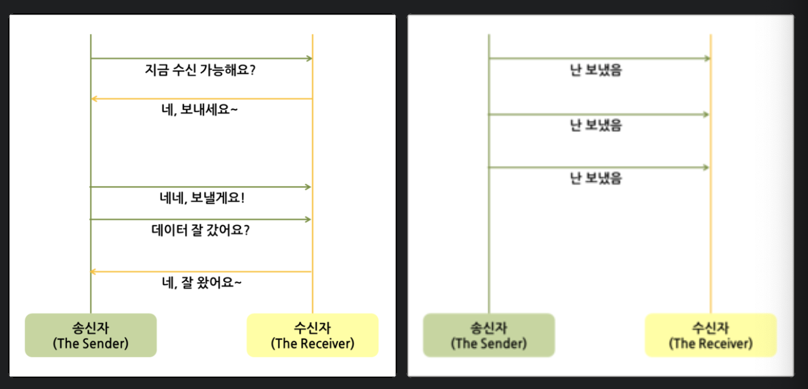
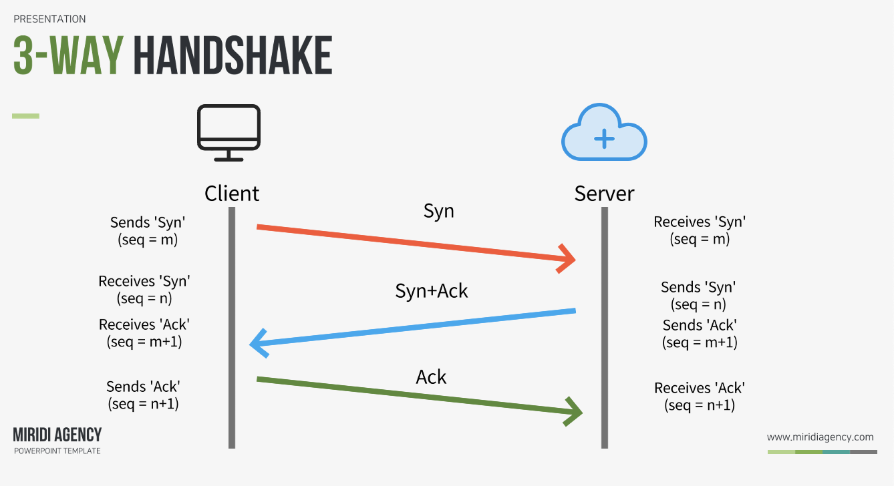

# Network

## 📖 HTTP의 특징

- `HTTP(Hyper Text Transfer Protocol`
    - 데이터를 주고 받기 위한 프로토콜 (응용 계층에 속하는 프로토콜)
      cf. `응용 계층`: 서로 다른 엔드 시스템의 프로세스끼리 정보를 교환할 수 있도록 도와주는 계층 / 유저가 직접 체험할 수 있는 계층 / HTTP, FTP, DHCP 프로토콜 등
    - 서버/클라이언트 모델
      
    - 특징
        - Stateless 프로토콜
            : 커넥션을 끊는 순간 클라이언트와 서버의 통신이 끝나며 상태 정보는 유지하지 않는 특성이 있다. 
                하지만 실제로는 데이터 유지가 필요한 경우가 많다.
          
        - Connectionless 프로토콜(비연결 지향)
            : 클라이언트가 서버에 요청(request)을 했을 때, 그 요청에 맞는 응답(Response)을 보낸 후 연결을 끊는 방식
    
    - 장점
        - stateless, connectionless 특징 덕분에 서버 디자인이 간단하다.
        - 각각의 HTTP 요청에 대해 독립적으로 응답만 보내주면 괜찮다.
    - 단점
        - 이전 통신에 대한 정보를 저장하지 않기 때문에 매번 인증을 해줘야 한다.
        - 이를 해결하기 위해 쿠키(cookie)나 세션(session)을 사용하여 데이터를 처리한다.
    
=> 서버와 클라이언트가 통신을 할 때 통신이 연속적으로 이어지지 않고 한 번 통신이 되면 끊어진다. 
따라서 서버는 클라이언트가 누구인지 계속 인증을 해줘야 한다. 이런 번거로움을 해결하는 방법이 '쿠키'와 '세션'이다.

## 📖 HTTP와 HTTPS의 차이점

- `HTTP`
    - 평문 데이터를 전송하는 프로토콜로, HTTP로 중요한 정보를 주고 받으면 제 3자에 의해 조회될 수 있다.
    - HTTP는 원래 TCP와 직접 통신
    
  
- `HTTPS`
    - HTTP에 암호화가 추가된 프로토콜로, SSL의 껍질을 덮어쓴 HTTP라 할 수 있다.
    - HTTPS는 HTTP는 SSL과 통신하고 SSL이 TCP와 통신함으로써 암호화와 안전성 보호를 이용할 수 있게 된다.

cf. SSL(Secure Socket Layer): 인터넷을 통해 전달되는 정보를 보호하기 위해 개발한 통신 규약

## 📖 쿠키(Cookie)와 세션(Session)

- `쿠키`
    - 사용자의 컴퓨터에 저장하는 작은 기록 정보 파일 
    - HTTP에서 클라이언트의 상태 정보를 PC에 저장했다가 필요시 정보를 참조하거나 재사용할 수 있다.   
    
    - 이름, 값, 만료일(저장기간), 경로 정보로 구성
    - 클라이언트에 총 300개의 쿠키를 저장할 수 있다.
    - 하나의 도메인 당 20개의 쿠키를 가질 수 있다.
    - 하나의 쿠키는 4KB(=4096byte)까지 저장 가능하다.

    - `저장 위치`: 클라이언트(=접속자 PC)
    - `저장 형식`: text
    - `만료 시점`: 쿠키 저장시 설정(브라우저가 종료되도, 만료시점이 지나지 않으면 삭제되지 않음)
    - `사용하는 자원(리소스)`: 클라이언트 리소스
    - `속도`: 세션보다 빠름
    - `보안`: 세션보다 안좋음
    
    - 쿠키의 동작 순서
        - 사용자가 웹사이트에 접근함으로써, 클라이언트가 페이지를 요청한다.
        - 웹 서버는 쿠키를 생성한다.
        - 생성한 쿠키에 정보를 담아 HTTP 화면을 돌려줄 때, 같이 클라이언트에게 돌려준다.
        - 넘겨받은 쿠키는 클라이언트가 가지고 있다가(로컬 pc에 저장) 다시 서버에 요청할 때 요청과 함께 쿠키를 전송한다.
        - 동일 사이트 재방문 시 클라이언트의 PC에 해당 쿠키가 있는 경우, 요청 페이지와 함께 쿠키를 전송한다.
    - e.g.
        - "아이디와 비밀번호를 저장하시겠습니까?"
        - 팝업창을 통해 "오늘 이 창을 다시 보지 않기" 체크
    
- `세션`
    - 일정 시간동안 같은 사용자로부터 들어오는 일련의 요구를 하나의 상태로 보고, 그 상태를 유지시키는 기술
    - 방문자가 웹 서버에 접속해 있는 상태를 하나의 단위로 보고 그것을 세션이라 한다.   
      
    - 웹 서버에 웹 컨테이너의 상태를 유지하기 위한 정보를 저장한다.
    - 웹 서버의 저장되는 쿠키(=세션 쿠키)
    - 브라우저를 닫거나, 서버에서 세션을 삭제했을 때만 삭제가 되므로, 쿠키보다 비교적 보안이 좋다.
    - 서버 용량이 허용하는 한에서 저장데이터에 제한이 없다.
    - 각 클라이언트에 고유 Session ID를 부여한다. Session ID로 클라이언트를 구분해 각 요구에 맞는 서비스를 제공한다.

    - `저장 위치`: 웹 서버
    - `저장 형식`: Object
    - `만료 시점`: 브라우저 종료시 삭제(기간 저장 가능)
    - `사용하는 자원(리소스)`: 웹 서버 리소스
    - `속도`: 쿠키보다 느림
    - `보안`: 쿠키보다 좋음
    
    - 세션의 동작 순서
        - 사용자가 웹사이트에 접근함으로써, 클라이언트가 페이지를 요청한다.
        - 서버는 접근한 클라이언트의 Request-Header 필드인 Cookie를 확인하여, 클라이언트가 해당 session-id를 보냈는지 확인한다.
        - session-id가 존재하지 않는다면 서버는 session-id를 생성해 클라이언트에게 돌려준다.
        - 서버에서 클라이언트로 돌려준 session-id를 쿠키를 사용해 서버에 저장한다.
        - 클라이언트는 재접속 시, 이 쿠키를 이용해 session-id 값을 서버에게 전달
    - e.g.
        - 화면을 이동해도 로그인이 풀리지 않고 로그아웃하기 전까지 유지

## 📖 쿠키와 세션의 차이

- 쿠키와 세션은 비슷한 역할을 하며, 동작 원리도 비슷하다. 세션도 결국 쿠키를 사용하기 때문이다.
- 큰 차이점은 사용자의 정보가 저장되는 위치이다. 쿠키는 서버의 자원을 전혀 사용하지 않으며, 세션은 서버의 자원을 사용한다.
- 쿠키는 클라이언트 로컬에 저장되기 때문에 변질되거나 request에서 스니핑 당할 우려가 있어서 보안에 취약하다.
- 세션은 쿠키를 이용해서 session-id만 저장하고 그것으로 구분하여 서버에서 처리하기 때문에 비교적 보안성이 높다.
  
- `라이프 사이클`은 쿠키도 만료기간이 있지만 파일로 저장되기 때문에 브라우저를 종료해도 정보가 유지될 수 있다. 또한 만료기간을 따로 지정해 쿠키를 삭제할 때까지 유지할 수도 있다.
- 반면 세션도 만료기간을 정할 수 있지만, 브라우저가 종료되면 만료기간에 상관없이 삭제된다.
  
- 쿠키는 쿠키에 정보가 있기 때문에 서버에 요청 시 속도가 빠르다.
- 세션은 정보가 서버에 있기 때문에 처리가 요구되어 비교적 느린 속도를 낸다.

## 📖 세션을 사용하면 좋은데 왜 쿠키를 사용할까?

세션이 쿠키에 비해 보안이 높은 편이나 쿠키를 사용하는 이유는, 
세션은 서버의 자원을 사용하기에 서버 자원의 한계가 있고, 속도가 느려질 수 있기 때문에 자원 관리 차원에서 쿠키와 세션을 병행 사용하여  
서버 자원의 낭비를 방지하며 웹 사이트의 속도를 높일 수 있다.

## 📖 HTTP Method

: 클라이언트가 서버에게 사용자 요청의 목적을 알리는 '수단'

- GET: 데이터 조회(READ)
- POST: 요청 데이터 처리(CREATE)
- PUT: 데이터 전체적으로 변경(UPDATE)
- PATCH: 데이터 일부 변경(UPDATE)
- DELETE: 데이터 삭제

## 📖 웹 동작 방식의 이해 (www.google.com에 접속할 때 생기는 과정에 대해 설명하라)

1. 사용자가 브라우저에 URL(www.google.com)을 입력
2. DNS 서버에 도메인 네임으로 서버의 진짜 주소를 찾음
3. IP 주소로 웹 서버에 TCP 3-way handshake로 연결 수립
4. 클라이언트는 웹 서버로 HTTP 요청 메시지를 보냄
5. 웹 서버는 HTTP 응답 메시지를 보냄
6. 도착한 HTTP 응답 메시지는 웹 페이지 데이터로 변환되고, 웹 브라우저에 의해 출력

## 📖 TCP와 UDP의 차이를 설명하라

    TCP(Transmission Control Protocol)

        - 연결형 서비스
        - 3-way handshaking 과정을 통해 연결을 설정
        - 4-way handshaking 과정을 통해 연결을 해제
          
        - 흐름 제어(Flow control): 데이터 처리 속도를 조절하여 수신자의 버퍼 오버플로우를 방지
        - 혼잡 제어(Congestion control): 네트워크 내의 패킷 수가 과도하게 증가하지 않도록 방지
          
        - 높은 신뢰성을 보장
        - 속도가 비교적 느림
        - 신뢰성이 중요한 파일 교환 같은 경우 사용
        - 패킷 교환 방식 : 가상 회선 방식
        - 전송 순서 보장
        - 수신 여부 확인
        - 통신 방식 : 1:1 통신

        - 연속성보다 신뢰성이 있는 전송이 중요할 때 사용되는 프로토콜

    UDP

        - 비연결형 서비스
        - 3-way handshaking을 사용하지 않기 때문에 `낮은 신뢰성`
        - 데이터 수신 여부를 확인하지 않기 때문에 `빠른 속도`
        - 패킷 교환 방식 : 데이터그램 방식
        - 전송 순서가 바뀔 수 있음
        - 수신 여부를 확인하지 않음
        - 통신 방식 : 1:1 OR 1:N OR N:N 통신

        - 신뢰성보다는 연속성이 중요한 실시간 스트리밍과 같은 서비스에 자주 사용된다.
    

## 📖 TCP 3 way-handshake와 4 way-handshake

### 3 way-handshake (TCP의 연결 과정)

1. 먼저 open한 클라이언트가 SYN(내 말 들려?)를 보내고 SYN_SENT 상태로 대기
2. 서버는 SYN-RECEIVED 상태로 바꾸고 SYN과 응답 ACK(어 잘 들려! 내 말은 들려?)를 보낸다.
3. SYN과 응답 ACK를 받은 클라이언트는 ESTABLISHED 상태로 변경하고 서버에게 응답 ACK(잘 들려!)를 보낸다.
4. 응답 ACK를 받은 서버는 ESTABLISHED 상태로 변경한다.

### 4 way-handshake (TCP의 연결 해제 과정)

1. 먼저 close를 실행한 클라이언트가 FIN(연결 끊자!)을 보내고 FIN_WAIT-1 상태로 대기
2. 서버는 CLOSE-WAIT으로 바꾸고 응답 ACK(알겠어! 잠시만~)를 전달. 동시에 해당 포트에 연결되어 있는 애플리케이션에게 close를 요청
3. ACK를 받은 클라이언트는 상태를 상태를 FIN-WAIT-2로 변경
4. close를 요청 받은 서버 애플리케이션은 종료 프로세스를 진행하고 FIN(나도 끊을게!)을 클라이언트로 보내 LAST_ACK 상태로 바꾼다.
5. FIN을 받은 클라이언트는 ACK(알겠어!)를 서버에 다시 전송하고 TIME-WAIT으로 상태를 바꾼다.
 
TIME-WAIT에서 일정 시간이 지나면 CLOSE 된다. ACK를 받은 서버도 포트를 CLOSED로 닫는다.

cf. `TIME-WAIT` 
- 먼저 연결이 끊는 쪽에서 생성되는 소켓
- 혹시 모를 전송 실패에 대비하기 위해 존재하는 소켓
- TIME-WAIT이 없다면, 패킷의 손실이 발생하거나 통신자 간 연결 해제가 제대로 되지 않을 수 있다.

## 📖 세션 기반 인증과 토큰 기반 인증의 차이에 대해 얘기하라

- `세션 기반 인증`
    - 클라이언트로부터 요청을 받으면 클라이언트의 상태 정보를 저장하므로 Stateful한 구조를 가짐
    - 서버에 세션을 저장하기 때문에 사용자가 증가하면 서버에 과부하를 줄 수 있어 확장성이 낮다.
    - 해커가 훔친 쿠키를 이용해 요청을 보내면 서버는 올바른 사용자가 보낸 요청인지 알 수 없다. (세션 하이재킹 공격)
     
- `토큰 기반 인증`: 상태 정보를 서버에 저장하지 않으므로 Stateless한 구조를 가진다.

## 📖 세션 기반 인증과 토큰 기반 인증은 각각 어느 경우에 적합한가

- `단일` 도메인 -> 세션 기반 인증 사용
- `여러` 도메인 -> 토큰 기반 인증 사용

-> 세션을 관리할 때 사용하는 쿠키는 `CORS 문제`로 단일 도메인 및 서브 도메인에서만 작동하도록 설계되어 있기 때문에 여러 도메인에서 관리하는 것이 어렵다.

## 📖 JWT 토큰(JSON Web Token)

- JSON 포맷을 이용하는 Claim 기반의 웹 토큰
- 토큰 자체를 정보로 사용하는 Self-Contained 방식으로 정보를 안전하게 전달
- `헤더(Header).내용(Payload).서명(Signature)`로 구성, 각 파트를 .(점)으로 구분
    - `헤더(Header)`: 토큰의 타입과 해시 암호화 알고리즘(방식 지정)으로 구성
    - `내용(Payload)`: 토큰에 사용자가 담고자 하는 정보를 담는다. 내용에는 Claim이 담겨져 있고, JSON(key: value)형태의 한 쌍으로 이루어짐
    - `서명(Signature)`: 토큰을 인코딩하거나 유효성 검증할 때 사용하는 고유한 암호화 코드, 헤더와 내용의 값을 인코딩
    
cf.  
- `서버 기반 인증 시스템`
    - Session / Cookie
    - 세션 기반의 인증 시스템 (서버 측에서 사용자들의 정보를 기억하기 위해 세션을 유지)
    - 메모리, 디스크, 데이터베이스 등을 통해 관리
    - Stateful한 구조

- `토큰 기반 인증 시스템`
    - JWT
    - 토큰 기반 인증 시스템
    - 인증받은 사용자에게 토큰을 발급해주고, 서버에 요청을 할 때 HTTP 헤더에 토큰을 함께 보내 인증받은 사용자(유효성 검사)인지 확인
    - 인증에 필요한 정보를 암호화시킨 토큰
    - Stateless한 구조 (사용자의 인증정보를 서버에 저장하지 않고, 클라이언트의 요청으로만 인가를 처리) 
    

## 📖 Connection Timeout과 Read Timeout의 차이에 대해 설명하라

- `Connection Timeout` : 서버 자체에 클라이언트가 어떤 사유로 접근을 실패했을 시 적용되는 것
    
- `Read Timeout` :   
  클라이언트가 서버에 접속을 성공했으나 서버가 로직을 수행하는 시간이 너무 길어 제대로 응답을 못 준 상태에서 클라이언트가 연결을 해제하는 것.   
  이 경우는 클라이언트는 해당 상황을 오류로 인지하고, 서버는 계속 로직을 수행하고 있어 성공으로 인지해 
  양 사이드 간 싱크가 맞지 않아 문제가 발생할 확률이 높다.

## 📖 공인(public) IP와 사설(private) IP의 차이에 대해 설명하라

- `공인 IP`: ISP(인터넷 서비스 공급자)가 제공하는 IP 주소로, 외부에 공개되어 있는 IP 주소
- `사설 IP`: 일반 가정이나 회사 내 등에 할당된 네트워크 IP 주소, IPv4의 주소 부족으로 인해 서브넷팅된 IP이기 때문에 라우터에 의해 로컬 네트워크 상의 PC나 장치에 할당된다.
- 사설 IP 주소만으로는 인터넷에 직접 연결할 수 없고, 라우터를 통해 1개의 공인 IP를 할당하고, 라우터에 연결된 개인 PC는 사설 IP를 각각 할당 받아 인터넷에 접속할 수 있다.

[ref]
https://dev-coco.tistory.com/61  
https://dev-coco.tistory.com/144  
이미지 출처: @coderyard  

