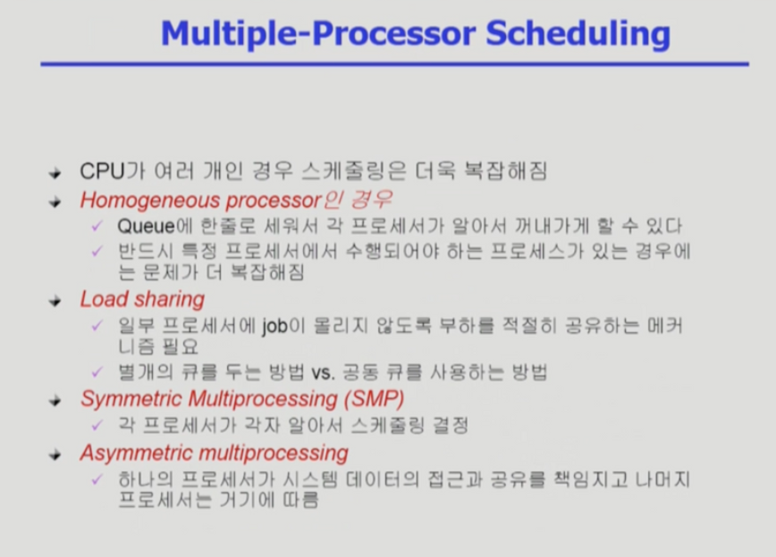

# CPU Scheduling
## CPU and I/O Bursts in Program Execution

## CPU bound process, I/O bound process

프로세스는 CPU bound process와 I/O bound process로 크게 두 종류로 나뉜다.

`CPU bound process` 
  
- CPU burst가 큰 프로세스
- I/O로부터 처리해야 할 필요가 별로 없고 CPU가 거의 모든 작업을 처리해줘야 하는 경우
- 사용자가 수행되는 것을 관여하지 않는다.
- e.g. 기상청에서 날씨를 예측하는 일, CPU에서 엄청난 수학 계산이 필요할테니까 이 경우에 CPU bound process.

`I/O bound process`
  
- I/O burst가 큰 프로세스
- 사용자와 대화형으로 동작하는 프로세스는 다 I/O bound process
- e.g. 압축을 한 다음에 디스크에 쓰고, 다시 디스크에서 데이터를 읽어오는 작업

---

## CPU, I/O Burst Time 

`프로세스`는 `CPU burst`와 `I/O burst`가 왔다갔다 서로 바뀌면서 프로그램을 실행한다.

- `CPU burst` : cpu 명령을 실행하는 것
- `I/O burst` : I/O를 요청한 다음 기다리는 시간
  
- cpu burst가 짧은 프로그램들은 사람들과 interaction을 하는 Job이기 때문에 
응답시간이 길어지면 사람이 오래 기다려야 하는 답답함이 발생된다.
- `cpu 스케줄링`은 ready queue에 들어와있는, 즉 cpu를 얻고자하는 프로세스들 중에서 어떤 프로세스에게 cpu를 줄 것인지 결정하는 메커니즘.

---

## CPU-burst Time의 분포

- 여러 job(=process)이 섞여 있기 떄문에 CPU 스케줄링이 필요하다.
    - Interactive job에게 적절한 response 제공 요망
    - CPU와 I/O 장치 등 시스템 자원을 골고루 효율적으로 사용
- CPU Burst가 짧다는 것은 I/O가 중간에 많이 끼어있다는 뜻이다.

---

## CPU 스케줄링의 중요한 두 가지 이슈

1. cpu burst에 들어온 프로그램이 여럿이 있는데 누구한테 당장 cpu를 줄 것인가.  
2. cpu를 이 프로그램한테 줬으면, cpu를 다 썼을 때 I/O를 하러 갈 때까지 cpu를 계속 주느냐 아니면 중간에 cpu를 뺏어서 다른 프로세스한테 cpu를 넘거줄 것인가.  
  
- cpu를 다 쓰고 나갈 때까지 기다리게 하는 경우는, 긴 프로세스 하나가 cpu를 계속 안 내놓으면 그 뒤에 친구들이 계속해서 줄 서서 기다려야 한다.
    
- 그래서 cpu 스케줄링은 I/O bound job, 특히 사람들하고 interaction 하는 job들이 지나치게 오래 기다리지 않게 하는 방향으로 하는 것이 중요하다.
- 효율적인 스케줄링을 결정하는 메커니즘이 필요하다.

---

## CPU 스케줄링

- nonpreemptive scheduling(비선점형 스케줄링)  
    - 일단 cpu를 한 번 줬으면, 다 쓰고 I/O를 할 때까지 자진반납할 때까지 cpu를 보장해주는 방법
  
- preemptive scheduling(선점형 스케줄링)  
    - 프로그램이 cpu를 계속 쓰고싶지만 강제로 빼앗을 수 있는 방식.
    - 강제로 빼앗을 수 있는 방법으로는 timer라는 하드웨어를 두고 timer interrupt를 할 수 있다. 
    - 현대적인 cpu 스케줄링은 대부분 이 방식 사용

---
    
## Scheduling Criteria

어떤 스케줄링 알고리즘이 좋은지, `성능 척도`, `Performance Index` 
<strong>cpu를 쓰러 ready queue에 들어온 프로세스</strong>가 대상이 된다.

- `시스템 입장`에서의 성능 척도 (최대한 일을 많이 시키면 좋은 것)
    - <strong>utilization(이용률)</strong>
        - 전체 시간 중에서 cpu가 놀지 않고 일한 시간의 비율.
        - 전체 시간 중에서 일한 시간의 비율을 높게 하는 것이 시스템 입장에서 cpu를 잘 쓰는 방법
           
    - <strong>throughput(처리량)</strong>
        - 주어진 시간동안에 과연 몇 개의 일을 처리했는가
        - 가능한 많은 일을 처리하면 좋다.
            
- `프로그램(고객) 입장`에서의 성능 척도 (내가 cpu를 얻어서 빨리 끝내면 좋은 것, 시간 관련)
    - <strong>turnaround time(소요시간, 평균시간)</strong>
        - cpu를 쓰러 들어와서 다 쓰고 나가는데까지 걸리는 전체 시간
        - cpu를 기다리는 시간, 쓰는 시간, 다시 기다리는 시간, 쓰는 시간... 을 전부 합친 시간을 말한다. 
    - <strong>waiting time(대기 시간)</strong>
        - cpu를 쓰고자 순수하게 기다린 시간
        - 특정 프로세스가 실행되면서 반복되는 모든 대기시간을 합친 것을 말한다. 
    - <strong>response time(응답 시간) ⭐️ </strong>
        - cpu를 쓰겠다고 ready queue에 들어와서, 해당 프로세스가 처음으로 cpu를 얻기까지 걸린 시간
        
  
선점형 스케줄링은 cpu를 얻었다고 끝까지 쓰는게 아니라,  
프로세스가 cpu를 얻으면 한번에 쭉 쓰는 것이 아니라 뺴앗겼다가 다시 얻는 과정을 반복하게 된다.
          
## Scheduling Algorithms

- FCFS (First-Come First-Served)
- SJF (Shortest-Job-First)
- SRTF (Shortest-Remaining-Time-First)
- Priority Scheduling
- RR (Round Robin)
- Multilevel Queue
- Multilevel Feedback Queue

## FCFS (First-Come First Served) Scheduling

- 비선점 스케줄링
- 먼저 cpu를 요청하는 프로세스에 먼저 cpu가 할당된다.
- FIFO queue를 사용해 쉽게 구현할 수 있다.
- 문제점) `convoy effect`: 먼저 들어온 어떤 프로세스의 CPU 처리 시간이 길 경우 다른 모든 프로세스들이 기다림으로써 더 짧은 프로세스가 먼저 진행될 수 있는 경우보다 cpu 및 장비 사용률이 낮아지는 현상

## SJF (Shortest-Job-First) Scheduling

  
  
  

- `비선점 스케줄링 방식` :   
  - cpu burst time이 가장 작은 프로세스에게 먼저 cpu를 할당한다.
  - cpu burst time이 같은 경우 FCFS 방식을 적용한다.
    

- `선점 스케줄링 방식` :  
    
    - `Shortest-Remaining Time-First (SRTF)`
        - 현재 수행중인 프로세스의 남은 burst time보다 더 짧은 새로운 프로세스가 들어오면 cpu를 뺴앗김.
    - `average time` 측면에서 가장 `optimal` 하다.
    - 문제점) `starvation` : cpu 사용시간이 긴 프로세스는 계속해서 cpu를 할당받지 못하는 문제가 발생할 수 있다.
    
## Priority Scheduling (우선순위 스케줄링)

- `preemptive`  
    - 더 높은 우선순위 스케줄링이 오면 선점당하는 방식
        
- `nonpreemptive`  
    - 정수 값으로 우선순위를 부여받게 되는데, 더 작은 순위가 우선순위가 높다. 
    - 추상적인 개념이기 때문에 SJF도 일종의 우선순위 스케줄링 (cpu 사용시간이 더 작을수록 높은 우선순위를 갖는)
    
- cf. 우선순위 스케줄링의 문제점은 `starvation`  
computer system에서 효율성을 중요시하지만 특정 프로세스가 지나치게 차별되는 것을 막아야할 필요가 있다.  
  -> aging(노화) 기법 도입, 아무리 우선순위가 낮은 프로그램이라도 오래 기다리면 우선순위를 조금씩 높여주는 기법
  
## Round Robin (RR)

- 현대적인 컴퓨터 시스템에서 사용하고 있는 스케줄링은 RR에 기반하고 있다.
- cpu를 줄 떄 그냥 주는 것이 아니라, 할당시간을 세팅해서 넘겨주고 할당 시간이 끝나면 timer interruupt가 걸려서 빼앗기는 것이 전부 round robin을 바탕으로 한 것이다. 이는 모두 선점형(preemptive) scheduling 이다.
    
- cpu를 줄 때 동일한 크기의 할당 시간(time quantum)을 가진다.
- 할당 시간이 지나면 프로세스는 선점(preempted)당하고 ready queue의 제일 뒤에 가서 다시 줄을 선다.
    
- 누가 cpu를 오래 쓸지 모르는 상황에서 굳이 예측할 필요 없이,  
cpu를 짧게 쓰는 프로세스가 빨리 cpu를 쓰고 나갈 수 있게 하는 것이 round robin 스케줄링의 장점이다.
    
- 현재 queue에 n개의 프로세스가 있고, 각 프로세스에게 주어진 시간이 q라고 할 때,  
특정 프로세스가 적어도 (n-1)*q 만큼 기다리면 적어도 내 차례가 한 번 돌아올 것.
    
- q를 짧게 할 수록 더 빠르게 내 차례가 다가올 것이고, 짧게 쓰는 프로세스는 더 빨리 cpu를 쓰고 나가게 된다.  
  (응답시간이 빨라지는 것이 RR의 장점)
    
- RR은 CPU를 오래 쓰는 프로세스는 그만큼 반복해서 기다려야 하니까 기다리는 시간이 길어지고, 
짧게 쓰는 프로세스는 기다리는 시간이 짧아진다. <strong>즉 cpu를 사용하는 시간에 비례하게 기다리는 나름대로 공정한 스케줄링이다.</strong>
    
- 할당시간이 길어지면 FCFS와 같은 성능을 띄게 될 것이고,  
할당시간이 짧아지면 RR 측면에서는 이상적이지만, context switch 오버헤드로 시스템 전체 성능이 낮아지는 문제점이 생길 수도 있다.  
  그래서 적당한 크기로 지정해주는 것이 좋고, 그 크기가 10-100 millisecond 로 알려져있다.

 

Time Quantum(할당 시간)이 20인 경우의 RR 예제이다.

- P1, P2, P3, P4 를 번갈아가면서 쓰지만,  
P2는 할당시간보다 짧기 때문에 더 빨리 쓰고 나가버리고,  
나머지는 계속해서 쓰다가 본인이 쓸 만큼 다 쓰면 빠져나가는 방식이다.
    
- SJF 보다 average turnaround time은 길지만 최초로 기다려야하는 대기시간인 response time은 더 짧다.
    
- 만약 cpu 사용시간이 모두 동일한 프로세스들일 때 (e.g. 4개의 프로세스의 burst time이 전부 100초일 때),  
400초 시점에서 모든 프로세스가 다 끝나고 나가게 된다.  
- 그런데 이 경우엔 그냥 순서대로 실행시켰다면 적어도 한 프로세스가 먼저 실행하고 나갔을 텐데 
RR은 모든 프로세스들이 마지막까지 cpu를 조금씩 제공받으면서 waiting time이 굉장히 길어지게 되고, 그런 측면에선 RR이 좋지 않다. (RR에 호의적이지 않은 예)
    
- 하지만 일반적으로는 짧은 프로세스와 긴 프로세스가 섞여있다.
    

CPU 스케줄링이 필요한 이유라 하면,  

컴퓨터 시스템 안에 있는 job들이 Homogeneous 하지 않고, 
I/O bound job 특히 사람들과 interaction 하는 job과 cpu만 오랫동안 사용하려는 job들이 섞여있기 때문에 필요하다.

cf. 
Homogeneous : 같은 플랫폼, 같은 종류, 같은 환경
Heterogenous : 다른 제품, 다른 환경, 다른 종류 (클라우드 환경에서는 서로 다른 환경을 Heterogenous 라고 표현)

## Multilevel Queue

- ready queue에 cpu를 기다리는 줄은 여러 줄로 줄서기를 한다.
- 맨 윗 즐이 우선순위가 높은 줄이고, 아래로 갈 수록 우선순위가 낮아진다.
- cpu가 여러 개 있으면 모르겠지만, cpu가 하나라면 이 줄에서 어느 하나의 job만 나와서 cpu를 받을 것이다.
    
- 이 예시는 우선순위가 5개 나뉘어져있는데 가장 우선순위가 높은 것이 system processes. 아래로 갈 수록 우선순위가 낮아진다. (완전히 계급제)
cf. batch processes: cpu만 오래 사용하는 그런 job들
    
- 즉, cpu는 가장 높은 계급을 갖고 있는 프로세스 차례가 오고, 윗 줄의 프로세스가 없다면 아랫 줄의 프로세스에게 cpu를 주는 스케줄링 방식이다.
    

    
- ready queue를 여러 줄로 줄 세우기를 한다고 했는데, 여기선 queue가 두 개이다.
    
- foreground queue에는 interactive한 job들
- background queue에는 batch, no human interaction한 job들
    
- 각 줄 마다 스케줄링 방식이 필요한데  
foreground에 줄 서 있는 프로세스가 있다면 이 친구들은 RR 방식으로 스케줄링할 것인가  
background job은 cpu만 오랫동안 사용하는 프로세스들이고 응답시간이 빠르다고 좋을 것이 없기에 중간에 cpu를 얻었다가 빼앗는 context switching으로 발생하는 오버헤드를 줄이기 위해서 FCFS 스케줄링. 즉, 먼저 온 순서대로 처리하는 것이 더 효율적일 수 있다.  
  -> 즉, 줄의 특성에 맞는 스케줄링 방식을 채택해야 한다.
    
- 또 어느 queue에게 cpu를 줄 것인지, 이번엔 어느 줄에게 cpu를 줄 것인지, 그 줄 안에서는 어떤 프로세스에게 cpu를 줄 것인지 결정해야 한다.
    
- 우선순위를 강하게 적용하는 방식에서는 `starvation` 문제가 발생할 수 있다. (발생하지 않도록 스케줄링이 가능해야 할 것)
    
- RR은 공정한 스케줄링이라면 Multilevel은 상대적으로 차별이 존재하는 스케줄링 방식이다.
    
  
## Multilevel Feedback Queue

- 큐를 몇 개 둘 것인가
- 각 큐에선 어떤 스케줄링을 사용할 것인지
- 우선 순위가 높은 곳에서 낮은 곳으로 떨어지는 기준은 어떻게 정할 ㅓㄱㅅ인가
- 승격되는 기준은 어떻게 정할 것인가
- 처음 프로세스 들어갈 땐 어느 큐로 들어갈 것인가

이런 식으로 여러 기준이 정해져야 할 것이다.

## Multilevel Queue vs Multilevel Feedback queue

- `Multilevel queue`는 각각 프로세스의 중요도에 따라 queue로 나누고 각 queue에서 다른 알고리즘을 적용해 효율을 높일 수 있다는 장점이 있다. 
단점은 한 번 해당 큐에 들어가면 프로세스는 다른 큐로 이동되거나 변경되는 것이 거의 불가능하다. 즉, 스케줄링 오버헤드가 낮은 대신에 inflexible 유연하지 못하다.
    
- `Multilevel Feedback Queue` 는 큐에 영구적으로 할당되는 멀티레벨큐 알고리즘과 다르게 큐 간의 이동이 허용된다.  
Multilevel queue의 확장버전이라 생각하면 된다.
    

`Multilevel queue`가 우선순위에 따라 들어가는 입구가 달랐다면, 

`Multilevel Feedback queue`는 그림과 같이 모든 프로세스들이 제일 위에 있는 큐로 일단 들어온다.  
만약 제일 위에 있는 queue는 RR로 스케줄링한다고 할 때, time-quantum을 8로 스케줄링 한다. 자신의 time quantum을 다 채우지 못한 process는 냅두고, 다 채운 프로세스는 그 밑의 레벨에 있는 큐로 들어가게 된다.
그 밑에 있는 큐는 time-quantum의 크기를 첫 번째 있는 큐의 두 배로 돌린다. 
마지막 queue는 백그라운드 프로세스를 돌리는 것처럼 FCFS로 처리된다.  

- 이 특징은 cpu burst와 중요도의 상관관계에 있다. 보통 사용자와 interactive하지 않은, background process는 cpu burst가 매우 크다는 특징을 이용한 것이다.
<strong>즉, cpu burst가 큰 프로세스를 우선순위가 낮다고 판별하고, 사용자와 interactive한 프로세스는 CPU burst가 작다는 특징을 가지므로 우선순위가 높은 특징을 이용한 것이 `Multilevel Feedback Queue` 이다.</strong>
    
- time quantum을 다 채웠다는 것은 CPU burst process일 가능성이 높고, 그래서 한 번 더 밑으로 내려봤을 때 16일 때도 다 채웠을 경우엔 CPU bound process 임을 알 수 있다. 그러니까 아예 밑으로 내려서 CPU bound processes는 사용자와 대화형으로 동작하는 것이 아니므로 context switching을 안하고 그대로 쭉 수행시켜주는 것이 유리하므로 FCFS로 하는 것이다.
즉, 다음 단계로 넘어갈수록 CPU Burst가 큰 것이니까 우선순위가 점점 낮아진다 라는 룰이 생기는 것이다.
    
- Multilevel feedback queue의 문제점은 interactive한 즉, 우선순위가 높은 프로세스가 들어오면 queue 0만 계속 수행되고 우선순위가 낮은 프로세스는 밀리는 starvation 문제가 발생한다.
해결방안으로는 aging 방식을 도입해서 해결. (낮은 우선순위 큐에서 너무 오래 기다리는 프로세스는 높은 우선순위 큐에 다시 갖다놓는 것)
    
- 장점으로는 유연성이 뛰어나고, SJF 알고리즘처럼 turnaround 평균 시간을 줄일 수 있다. (더 짧은 프로세스가 먼저 돌게 해주므로) 또한 interactive한 프로세스가 앞에 오니까 response time이 짧아진다.

## Multiple-Processor Scheduling

CPU가 여러 개 있을 때의 스케줄링으로는,

- <strong>SMP</strong>
모든 CPU들이 대등한 것으로, cpu가 알아서 스케줄링을 해주는 경우

- <strong>Asymmetric multiprocessing</strong>
CPU가 여러 개 있는데 그 중에서 하나의 cpu가 전체적인 컨트롤을 담당하는 것.(데이터의 접근 같은 것들을 책임진다) 나머지는 따르게 된다.

### Real-Time Scheduling

real time job은 어떤 deadline이 있는 job으로, 정해진 시간 내에 반드시 실행이 되야 하는 job들이다.

cpu 스케줄링을 할 때도 real time job은 반드시 deadline을 보장해줘야 하므로, cpu를 주는 순서가 중요한 것이 아닌 <strong>deadline 내에서 끝나는 것을 보장</strong>해야 한다.
CPU를 그때그때 스케줄링을 하기보다는 real time job들이 주어져있고 미리 스케줄링해서 deadline이 보장될 수 있도록 적재적소에 배치하는 것이 중요하다.

soft real-time은 영화를 보는 것을 예시로 둘 수 있다. deadline이 존재하지만 조금 어겨도 큰 문제가 없는 시스템들이다. 다른 프로세스에 비해 우선순위만 좀 높여줘서 cpu를 먼저 받을 수 있게끔 해주면 된다.

### 면접 질문
1. 스케줄링 알고리즘의 평가 기준들
2. 다단계 피드백 큐 스케줄링의 특징과 왜 그런 특징을 갖는지 (다단계 큐 스케줄링과 비교해서)
3. 비선점형 스케줄링의 특징과, 선점형 스케줄링의 특징. 그리고 스케줄링 예시들

[ref]
https://jhnyang.tistory.com/156
https://murphymoon.tistory.com/entry/CPU-%EC%8A%A4%EC%BC%80%EC%A4%84%EB%A7%81-%EC%95%8C%EA%B3%A0%EB%A6%AC%EC%A6%98-%EC%9A%B4%EC%98%81%EC%B2%B4%EC%A0%9COS-%EB%A9%B4%EC%A0%91-%EC%A7%88%EB%AC%B8-4

  