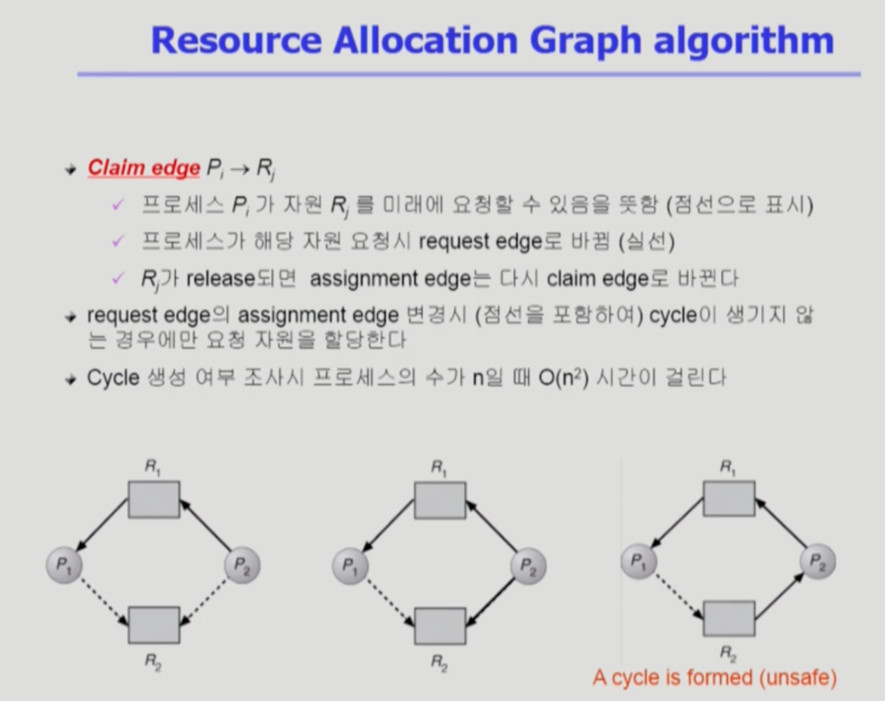

# DeadLock(데드락)

> 일련의 프로세스들이 서로가 가진 자원을 기다리며 block 된 상태

## 정의
- 현재 서로 원하는 자원이 상대방에게 할당되어 있어서, 프로세스가 무한정 wait 상태에 빠져있는 것.
- 주로 multi-programming 환경에서 한정된 자원을 사용하려고 서로 경쟁하는 상황에서 발생한다.
- Deadlock == '교착 상태'

---

## Deadlock 발생의 4가지 조건

1) Mutual exclusion(상호 배제)
    - 매 순간 하나의 프로세스만이 자원을 사용할 수 있다.
       
2) No preemption (비선점)
    - 프로세스는 자원을 스스로 내놓는 것이지 강제로 빼앗기는 것이 아니다.
       
3) Hold and wait (보유대기)
- 자원을 가진 프로세스가 다른 자원을 기다릴 때 보유 자원을 놓지 않고 계속 가지고 있다.
   
4) Circular wait (순환대기)
- 자원을 기다리는 <strong>프로세스 간에 사이클이 형성</strong>되어 있다.
- 프로세스 p0, p1, p2, ... , pn 이 있을 때,  
  p0은 p1이 가진 자원을 기다리고, 
  p1은 p2가 가진 자원을 기다리고, 
  Pn-1은 Pn이 가진 자원을 기다리고, 
  Pn은 P0이 가진 자원을 기다린다. 

---

## Deadlock 처리 방법
-> <strong>prevention, 예방</strong> /  <strong>avoidence, 회피</strong>

-> <strong>Prevention, Avoidance</strong>가 Deadlock이 발생하지 않도록 미리 예방하는 방법이라면,  
-> <strong>Detection and recovery, Ignorance</strong>는 Deadlock의 발생을 일단 냅두는 것.

### 1. Deadlock Prevention (교착상태 예방)
- 자원 할당 시 Deadlock의 4가지 필요 조건 중에 어느 하나가 만족되지 않도록 하는 것,
- 애초부터 Deadlock이 발생하지 않도록.

### 2. Deadlock Avoidance (교착상태 회피)
- 자원 요청에 대한 부가적인 정보(eg.최대한 사용할 MAX 자원)를 이용해서 deadlock의 가능성이 없는 경우에만 자원을 할당
- 시스템 state 가 원래 state 로 돌아 올 수 있는 경우에만 자원 할당 (eg. cpu, memory)

- 자원 당 인스턴스가 하나일 때 -> Resource Allocation Graph algorithm
- 자원 당 여러 개의 인스턴스일 때 -> Banker's Algorithm

-> 위의 두 가지 prevention => Utilization 저하, throughput 감소, starvation 문제  
-> 데드락의 발생을 원천적으로 막을 순 있지만, 자주 생기지도 않을 데드락을 생각해서 이렇게 제약조건을 많이 달아놓으면 상당히 비효율적.

### 3. Deadlock Detection and recovery (교착상태 탐지와 회복)
- Deadlock 발생은 허용하되 그에 대한 detection 루틴을 두어 deadlock 발견 시 recover
- 빈번히 발생하는 이벤트가 아닌 데드락을 미연에 방지하기 위해서 비효율적인 방법을 쓸 바엔,  
  냅두다가 갑자기 시스템이 느려지거나 상황이 이상하다싶으면, 그 때 Deadlock detection을 하고 recovery 하는 방법

### 4. Deadlock Ignorance
- Deadlock을 시스템이 책임지지 않음
- UNIX를 포함한 대부분의 OS가 채택

---

## Deadlock Avoidance
교착 상태 회피

> 자원 요청에 대한 부가적인 정보를 이용해서 언제나 safe state를 유지하는 것

### safe state
시스템 내의 프로세스들에 대한 safe sequence가 존재해서, 모든 프로세스가 끝까지 수행될 수 있는 상태.

cf. unsafe state라고 해서 deadlock은 아니다. 그러나 unsafe sate를 만들지 않고 언제나 safe state를 유지해서 데드락을 만들지 않게 안전하게 가자는 것이 Deadlock Avoidance이다.
(-> 미연에 방지하는 것)
- 시스템이 safe state에 있으면 => no deadlock
- 시스템이 unsafe state에 있으면 => possibility of deadlock
- Deadlock Avoidance => 시스템이 unsafe state에 들어가지 않는 것을 보장

### 2가지 경우의 Avoidance 알고리즘
- <strong>Single instance</strong> per resource types
    - Resource Allocation Graph algorithm 사용
- <strong>Multiple instance</strong> per resource types
    - Banker's algorithm 사용

### Resource Allocation Graph algorithm

- 자원 per 인스턴스 한 개.
- 점선은 지금 요청을 한 경우는 아니지만, 이 프로세스가 평생에 적어도 한 번은 요청할 수 있다는 의미
- 3번째 그림은 데드락이 아니다. 1번 프로세스가 요청할 수는 있지만 이 시점에 요청을 한 것은 아니기 때문에 실선으로 그려지면 데드락이 발생한 경우이다.  언젠가 1번 프로세스가 2번 리소스를 완전히 반납하면 2번 프로세스에게 내어줄 수 있을 것이다.

### Banker's Algorithm

- 자원 per 여러 개 인스턴스.
- 은행원 알고리즘 이라고도 부른다.
- 뱅커스 알고리즘은 이 프로세스들이 자원을 요청했을 때, 그 요청을 받아들일 것인지 않을 것인지만 결정하는 알고리즘이다.
- (가용자원으로 최대 요청자원(Max)이 충족되는지의 여부에 따라서, 언젠가 가용자원으로 충족될 때 그 프로세스의 요청을 들어준다.)
    
- Allocation은 이미 할당 된 것
- Available은 아무도 사용하지 않고 있는 가용 자원
- Max는 해당 프로세스가 최대로 자원을 요청할 때의 개수
- Need는 얼마나 더 최대로 요청할 수 있는지 (Max-Allocation)
    
- 은행원 알고리즘은 처음에 최대로 얼마나 자원을 사용할지(max) declare 한다.
- 가용자원(Available)이 Allocation을 충족시키지 못한다고 해서 데드락은 아니다.
- 현재 Allocation 받은 자원을 다 쓰고 반납할 수도 있고, 가지고 그대로 갈 수도 있기 때문이다.
- 그러나 뱅커스 알고리즘은 굉장히 보수적으로, 절대 데드락을 발생시키지 않으려는 알고리즘이다. (늘 safe state를 유지하려고 하는)
- 최대 요청을 받을 상황을 고려하고, 그 최대 요청이 현재 가용자원으로 충족되는가를 늘 고려한다.
- 최대 요청할 수 있는 자원의 개수는 Need를 벗어나진 않는다.
    
- 가용자원과 프로세스에게 반납받은 자원을 가지고 최대요청하는 자원을 다 만족시키며 프로세스를 끝까지 실행시킬 수 있는 순서가 존재하면, safe 상태라고 볼 수 있다.
- 위 그림의 경우 sequence <P1, P3, P4, P2, P0> 이 존재하므로 safe state.
- 뱅커스 알고리즘은 deadlock은 발생하지 않는다.
- 그러나 잘 발생하지도 않는 데드락을 미연에 방지하기 위해서 제공할 자원이 있음에도 불구하고 최대 요청자원을 늘 고려해서 제공하지 않기에 굉장히 비효율적이다.

---
## Deadlock Detection and Recovery

자원 당 인스턴스가 하나일 땐 그래프를, 여러 개일 땐 테이블을 사용한다. (그러나 하나일 때도 테이블 사용가능하다.)

- 여기서는 최대 요청자원을 알 필요 없다.
- 데드락인지 판별하려면, 아까와 다르게 상황을 낙관적으로 보면 된다.
    - 0번 프로세스는 추가로 요청할 수 도 있지만 B 1개를 가지고 있기 때문에 반납할거라 고려.
    - 2번 프로세스도 추가로 요청할게 없으니까 일단 반납한다고 가정하고 그럼 3,1,3 개가 생긴다.
    - 그러면 1번 프로세스가 가용자원으로부터 받아서, 추가로 요청할 수도 있지만 일단 쓰고나서 반납하다고 가정.
    - 4번도 마찬가지로 가용자원을 받아서 요청된 것들을 전부 허용을 하고 반납을 해서
    - 요청을 다 받아들이는 시퀀스가 존재하면 데드락이 없다고 본다.
        
- 데드락인지 판별하기 위해서는, 가용자원을 보고 처리할 수 있는 프로세스가 있는지를 본다.
- 요청하지 않은 프로세스들은(request가 없는) 가용자원으로 합쳐놓고, 그걸 가지고 처리가능한 프로세스가 있다면 처리하고 반납받으면서 끝까지 갈 수 있는지를 체크해보면 된다.
- 만약에 Deadlock이 발생하면, Recovery를 한다.
    

데드락이 detection되서 recovery를 할 적에는,

- `Process termination`: 데드락에 연루된 모든 프로세스를 사살하는 방식이 있다.
- `Resource Preemption`: 데드락에 연루된 프로세스를 하나씩 죽여보는 것. 데드락이 없어질 때까지.

특정한 프로세스를 비용 입장에서 고려해서 계속 그 프로세스만 자원을 뺏겨야한다면 그 프로세스만 계속 rollback 되야하므로 starvation 문제가 발생될 수 있기 때문에 횟수를 고려한다.

---
## Deadlock Ignorance

- Deadlock이 일어나지 않는다고 생각하고 아무런 조치도 취하지 않는 방식.
- 매우 드물게 발생하는 Deadlock에 대한 조치 자체가 더 큰 overhead일 수 있기 때문이다.
- 만약 시스템에 deadlock이 발생한 경우에는, 시스템이나 os에서 대처하는 것이 아니라 사람이 비정상적인 시스템을 느낀 후 직접 process를 죽이는 등의 방법으로 대처한다.
- UNIX 를 포함한 대부분의 범용 OS에서 채택한 방식.

---

## 면접 대비
1. 교착상태(Deadlock)가 무엇입니까?
2. 데드락의 4가지 필요조건 에 대해 설명하세요.
3. 교착 상태 해결 방법을 설명하세요.
4. Banker's algorithm 은 무엇입니까?