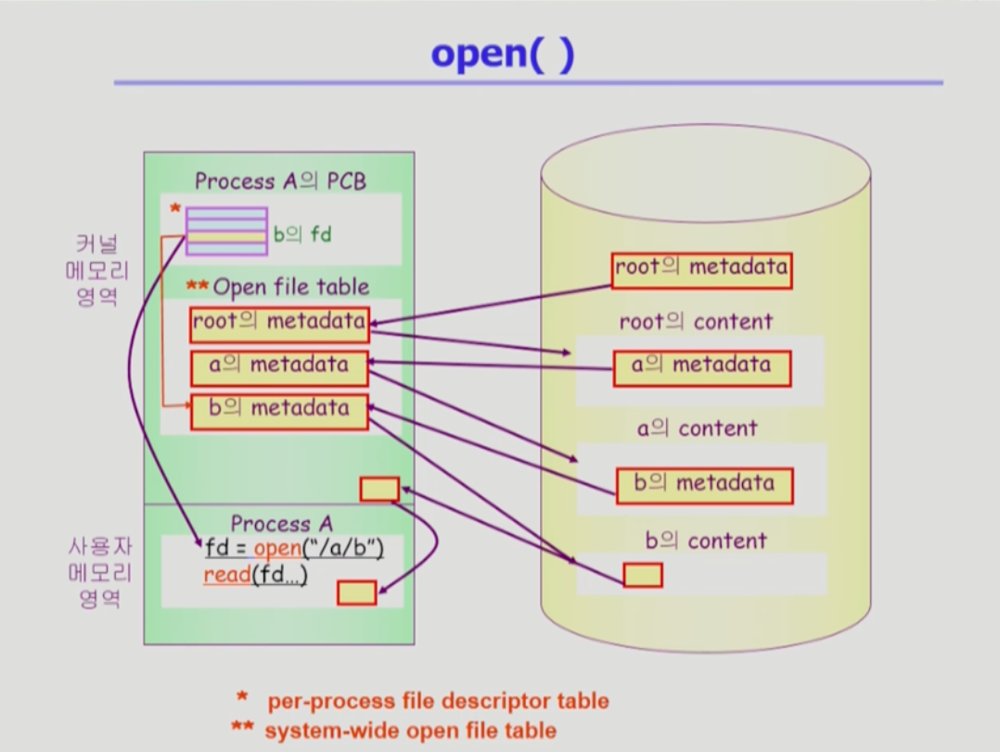
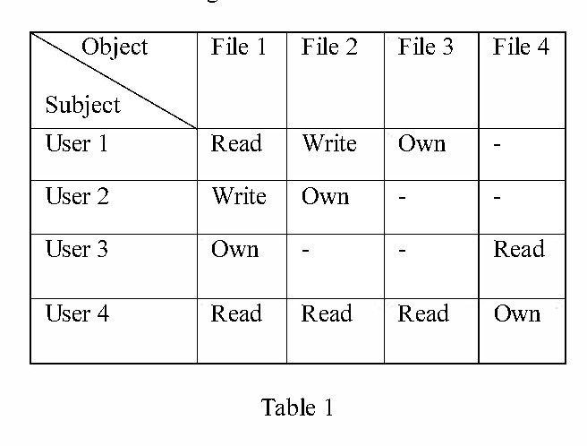
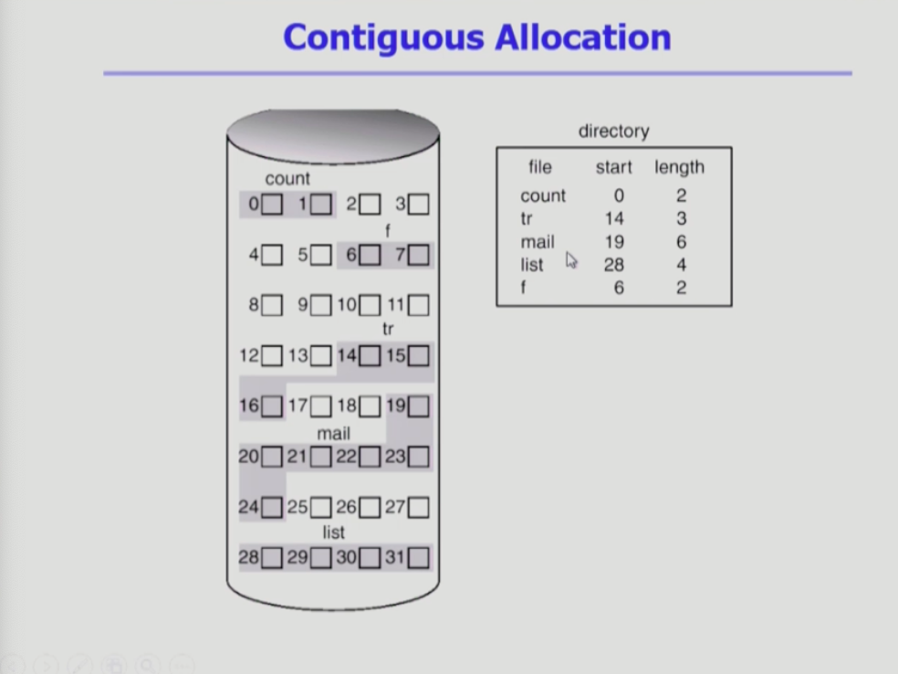
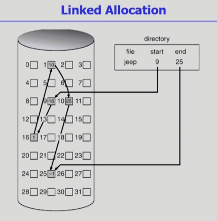
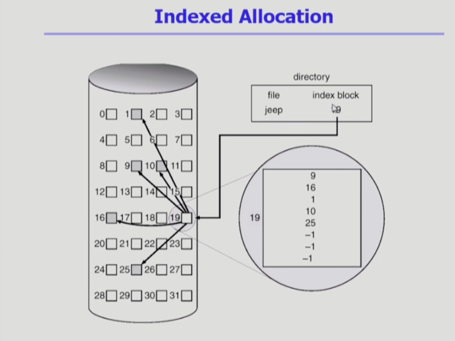
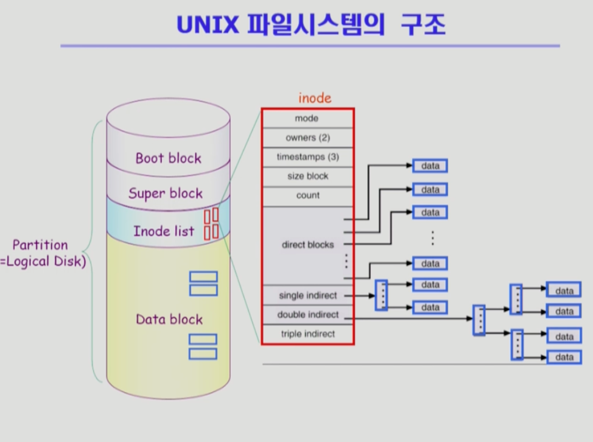
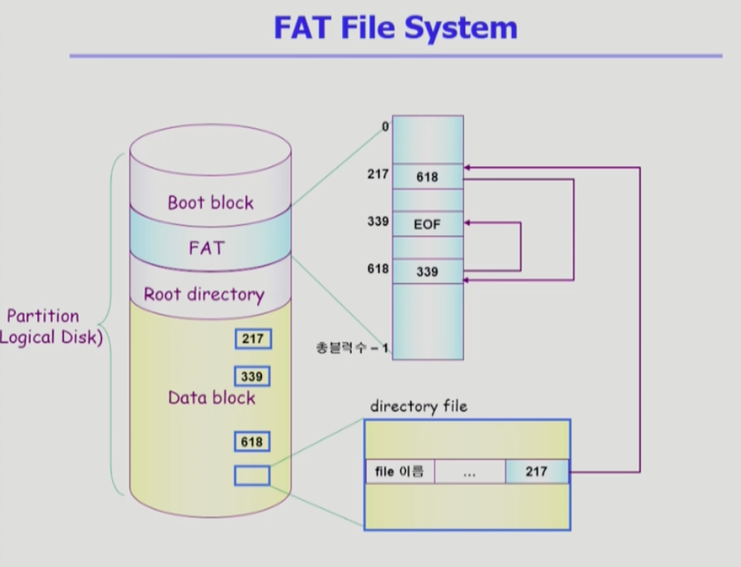
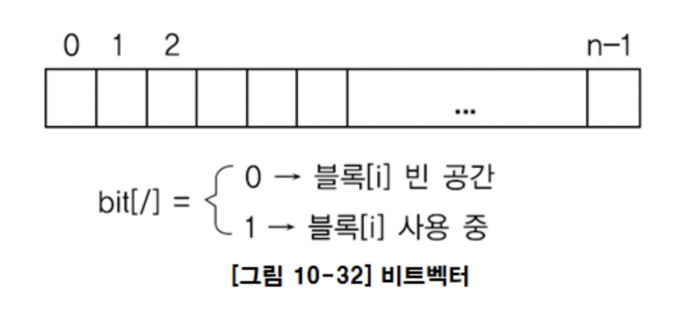
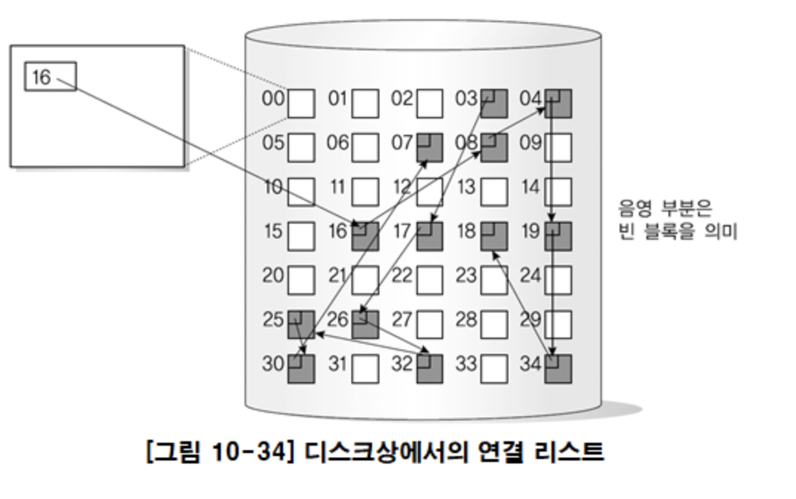
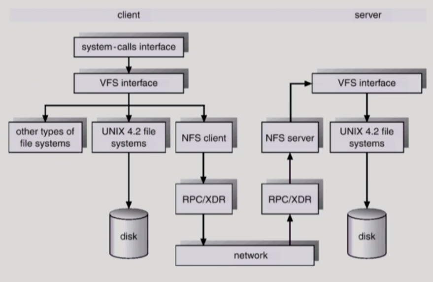

# 파일 시스템(File System)

- 컴퓨터 사용자의 응용 프로그램을 실행함으로서 생성하는 정보를 파일이라는 단위로 저장하는 서브 시스템
- 파일의 메타데이터, 디렉토리 정보 등을 관리
- 파일의 저장 방법 결정 
- 파일 보호

### 파일 시스템의 파일이란 ?

- 일반적으로 비휘발성의 보조 기억 장치에 저장 
- 운영체제는 다양한 저장 장치를 File이라는 동일한 논리적 단위로 볼 수 있게 해줌
- operation
> create,read,write,repostion(lseek),delete,open,close 

### 기능
1. 사용자가 파일을 생성, 수정, 제거 
2. 여러 사용자가 파일을 공유하여 사용
3. 백업과 복구 능력
4. 주기억장치와 보조기억장치 간의 파일 전송
5. 각 응용에 적합한 구조로 파일을 구성

---

### File의 metadata
- 파일을 관리하기 위한 각종 정보들 
> 파일의 유형, 파일의 크기, 저장된 위치, 이름   
접근 권한, 시간, 소유자

### Directory 
- 일종의 파일
- 파일의 메타데이터 중 일부를 보관하는 파일
- 디렉토리 밑에 있는 파일들의 메타데이터를 내용으로 하는 파일
- operation
> serch for a file, create a file, delete a file   list a directory, rename a file, traverse the file system

### Partition (Logical Disk)
- 하나의 물리적 디스크 안에 여러 파티션을 두는 것이 일반적
- 여러 물리적 디스크를 합쳐 하나의 파티션으로 구성하기도 함
- 각각의 파티션에 file system을 깔거나 swapping 로 사용할 수 있음

### open() 

--- 

### 파일 접근 File Protection 
- 각 파일에 대해 누구에게 어떤 유형의 접근을 허락할 것인가?
1. Access control Matrix

   

> 행(Access control list) : 파일 별로 누구에게 어떤 접근 권한이 있는지 표시
> 열(Capablity) : 사용자별로 자신이 접근 권한을 가진 파일 및 권한 표시   
***그러나 이 방식은 부가적인 오버헤드가 큼***

-> 일반적으론 Grouping 을 통해 파일의 접근을 제어함

2. Grouping 
- 전체 user를 세 그룹으로 나눔(owner, group, public)
- 각 파일에 대해 세 그룹의 접근 권한을 3비트로 표시
> owner group other   
   rwx   rw-   r--

3. Password 
- 파일마다 password를 두는 방법
- 모든 접근 권한에 대해 하나의 password : all-or-nothing
- 접근 권한별 password : 암기 문제, 관리

### Mounting of File system 
- 다른 파티션의 파일에 접근하고 싶을 땐 어떻게 해야 할까? 
-> 마운팅(mounting)연산 제공

### Acces  Methods 
- 시스템이 제공하는 파일 정보의 접근 방식
1. 순차 접근 
- 카세트 테이프를 사용하는 방식처럼 접근
- 읽거나 쓰면 offset은 자동적으로 증가
2. 직접 접근
- LP 레코드 판과 같이 접근하도록 함
- 파일을 구성하는 레코드를 임의의 순서로 접근함

---

## 파일 할당 Allocation of File Data in Disk 

- 디스크에 파일을 저장할 때, 동일한 크기의 sector단위로 저장하게 되는데, 이는 메모리의 페이징 기법과 비슷하다. 

### *1. Contiguous Allocation*
- 하나의 파일이 연속적으로 할당되는 방법   

**장점**   
> - fast I/O : 한번의 seek/rotation으로 많은 바이트 transfer
> - Realtime용이나, 이미 run중이던 process의 swapping용으로 적합
> - Direct access가 가능   

**단점**
> - external fragmentation(외부 단편화): 파일의 크기가 균일하지 않기 때문
> - File grow 어려움 : 파일 수정에 제약이 있음

### *2. Linked Allocation*
- 빈 위치에 아무데나 파일을 배치하는 방법

**장점**
> - external fragmentation 발생하지 않음   

**단점**  
> - Direct access 불가능
> - Reliability 문제 : 디스크의 sector 중 하나가 고장나면 많은 부분이 유실됨
> - pointer를 위한 공간이 block의 일부가 되어 공간 효율성 하락 ->  sector : 512 bytes, pointer : 4 bytes

-> linked allocation을 변형하여 더욱 효율적으로 사용 : File-allocation table(FAT) 

### *3. Indexed Allocation*
- 디렉토리에 파일의 위치 정보를 인덱스 블록으로 표시

**장점**
> - external fragmentation 발생하지 않음
> - 직접 접근 가능    

**단점**   
> - 작은 파일일 경우 공간 낭비 : 아무리 작은 파일이여도 블록이 2개 필요함
> - 매우 큰 파일의 경우 하나의 인덱스 블록으로 표현 불가능 -> linked scheme , multi-level index로 해결

---

### Unix 파일 시스템 구조 (가장 기본적인 파일 시스템 구조)
 

   
#### 중요 개념
- 기본적으로 indexed 파일 
1. Boot block 
- 부팅에 필요한 정보
2. Super block
- 파일 시스템에 관한 총체적인 정보
3. Innode 
- 파일 이름을 제외한 파일의 모든 메타 데이터를 저장
4. Data block
- 파일의 실제 내용을 보관

---

### FAT 파일 시스템 구조

#### 중요 개념

- Linked Allocation
- 파일의 이름을 비롯한 모든 정보(메타데이터) 는 모두 디렉토리에 있음
- FAT의 배열에 다음 block의 정보를 가지고 있음 
- direct access 가능
- Reliblity 문제 해결 가능

---

### 디스크 자유 공간 관리(Free Space Management)

1. Bit map or bit vector

> * 비어 있는 공간을 0으로 표시   
> 차지하고 있는 공간을 1로 표시

-> 연속적인 n개의 free block을 찾는데 효과적

2. Linked list
- 모든 free블록을 연결
- 공간의 낭비가 없음

   

-> 연속적인 free 블록 찾기 어려움, 각 블록을 모두 읽어야하므로 비효율적

3. Grouping (indexed allocation을 변형)
- 첫번째 free블록이 n개의 pointer를 가짐 

4. Counting 
- 프로그램들이 종종 여러개의 연속적인 block을 할당하고 반납한다는 성질에 착안
- 연속적인 free block을 찾기에 적합 

---

### 디렉토리 구현(Directory Implementation)

1. Linear list
- <file name, file의 metadata> 의 list
- 구현이 간단
- 디렉토리 내에 파일이 있는지 찾기 위해서는 linear search  필요

2. Hash Table
- linear list + hashing
- Hash table 은 file name을 이 파일의 linear list의 위치로 바꿔줌 
- search time을 없앰 
- Collsion 발생 가능

---

### VFS and NFS

1. VFS(Virtual File System)
- 서로 다양한 file system에 대해 동일한 시스템 콜 인터페이스(API)를 통해 접근할 수 있게 해주는 OS의 Layer

2. NFS(Netork FIle System)
- 분산 시스템에서는 네트워크를 통해 파일이 공유될 수 있음
- NFS에서는 분산 환경에서의 대표적인 파일 공유 방법

