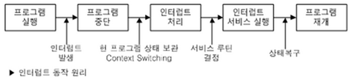
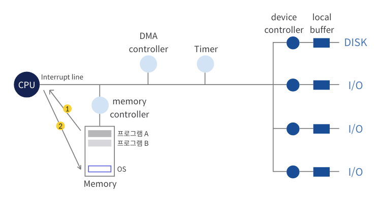

# 인터럽트(Interrupt)

## **인터럽트란?**
- CPU가 프로그램을 실행하고 있을 때, 입출력 하드웨어 등의 장치나 예외 상황이 발생하여 처리가 필요할 경우에 마이크로프로세서(micro processor)에게 알려 처리할 수 있도록 하는 것   

#### **하드웨어 인터럽트(외부 인터럽트)**
- 하드웨어가 발생시킨다. CPU가 아닌 다른 하드웨어 장치가 CPU에 어떤 사실을 알려주거나 CPU 서비스를 요청해야 할 경우 발생시킨다.
> ex) 타이머,키보드,프린터 등의 I/O 이벤트 발생 시, 기계 고장 등

#### **소프트웨어 인터럽트(내부 인터럽트)**
- 소프트웨어가 발생시키는 인터럽트로,프로그램이 오류를 범하여 Exception이 발생하거나 사용자 프로그램이 커널함수 사용을 위해 호출하는 Systeme Call이 발생하는 경우를 말한다.
> ex) 0으로 나누기, overflow, 잘못된 주소 접근 , 프로그램 상의 오류 등

### ***<관련 용어>***
**인터럽트 핸들러**  
>실제 인터럽트를 처리하기 위한 루틴으로 인터럽트 서비스 루틴이라고도 한다.운영체제의 코드 영역에는 인터럽트별로 처리해야 할 내용이 이미 프로그램이 되어 있다.

**인터럽트 벡터**   
>인터럽트 발생 시 처리해야 할 인터럽트 핸들러의 주소를 인터럽트 별로 보관하고 있는 테이블

## **인터럽트 처리 과정**

- CPU는 매번 프로그램 카운터가 지정하고 있는 주소의 명령을 수행하며, 다음 명령을 수행하기 전에 인터럽트 라인이 세팅되어있는지 확인한다.

1. 현재 진행 중인 기계어 코드를 완료한다.      
2. CPU의 특수 레지스터 중 하이로 인터럽트 마스크 비트를 보고 마스크되면 인터럽트를 무시한다.   
4. 인터럽트 벡터를 읽는다.ISR 주소 값을 얻는다.ISR로 점프한다. 이 때, PC(Program Counter)값을 자동 저장된다.   
5. 현재 진행중인 프로그램의 레지스터를 저장한다.   
6. 해당 코드를 실행한다.   
7. 해당 코드를 다 처리하면, 저장한 레지스터를 복원한다.   
8. ISR 끝에 IRET 명령어에 의해 인터럽트가 해제된다.   
9. IRET 명령어가 실행되면, 저장한 PC 값을 복원하여 이전 실행 위치로 이동한다.   

## **인터럽트와 특권 명령**

CPU가 수행하는 명령에는 ***일반 명령***과 ***특권 명령***이 있다.

> **일반 명령** : 메모리에서 자료를 읽어오고, CPU에서 계산을 하는 명령이며, 모든 프로그램이 수행이 가능하다.   
**특권 명령**: 보안이 필요한 명령으로, 입출력 장치, 타이머 등의 장치를 접근하는 명령이다. 오직 운영체제만이 수행할 수 있다. 모든 입출력 명령은 특권 명령이다.

### **시스템 콜(System Call)**

사용자 프로그램이 운영체제의 서비스를 받기 위해 커널 함수를 호출하는 것을 말한다. 제어권이 운영체제에로 넘어간다.

> I/O 명령은 특권 명령이기 때문에 사용자 모드 프로그램에서는 I/O명령을 처리하지 못한다. 그래서 사용자 프로그램은 커널 함수를 호출하는 system call을 이용한다.

### 사용자 프로그램의 I/O 과정
1. 사용자 프로그램이 운영체제에게 시스템 콜을 한다.
2. 소프트웨어 인터럽트를 통해 인터럽트 벡터의 위치로 이동한다.
3. 제어권이 인터럽트 벡터가 가르키는 인터럽트 서비스 루틴으로 이동한다.
4. 올바른 I/O 작업인지 확인 후, 실제 I/O를 수행한다.

---
## **면접 질문**

1. 인터럽트란 무엇인가?
2. 내부/외부 인터럽트에는 어떠한 상황들이 있는가?
3. 인터럽트 발생 시 처리 과정은? 

참고)
- KOCW 공개강의 (2014-1. 이화여자대학교 - 반효경)