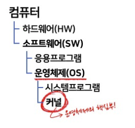
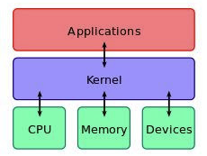
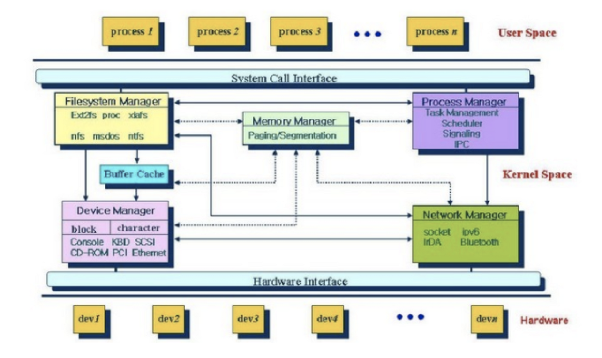
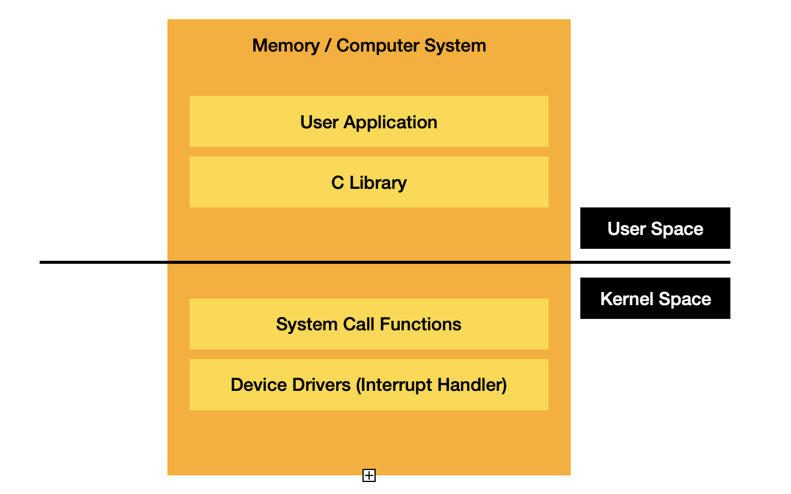

# 커널(Kernel)

## 커널이란?
> 운영 체제의 핵심으로써 H/W와 프로세스의 운용을 위한 소프트웨어
- 운영 체제의 다른 부분 및 응용 프로그램 수행에 필요한 여러 가지 서비스를 제공한다.
- 우리가 아는 운영 체제의 기능은 보통 커널이 담당한다.

 

## 운영체제와 커널의 차이

- 커널은 항상 `컴퓨터 자원`들만 바라보고 있다.
- 커널은 `사용자와의 상호작용은 전혀 지원하지 않는다.`
- 사용자와의 상호작용을 위해 시스템 프로그램이 필요하다. ex) Linux의 쉘(Shell)

||커널|운영 체제|
|---|---|---|
|기본|운영 체제의 중요한 부분|시스템 프로그램|
|인터페이스|S/W와 H/W 간의 인터페이스|H/W와 사용자 간의 인터페이스|
|유형|획일화된 커널과 마이크로 커널|단일 및 다중 프로그래밍 일괄 처리 시스템, 분산 운영 체제, 실시간 운영 체제 등|
|목적|메모리 관리, 프로세스 관리, 작업관리, 디스크 관리|커널의 기능 외에도 컴퓨터외 보호 및 보안 등|

 

## 커널의 존재 이유
- 컴퓨터의 전원을 켜면 운영체제는 이와 동시에 수행된다.   
S/W가 컴퓨터 시스템에서 수행되기 위해서는 메모리에 그 프로그램이 올라가 있어야한다.   
하지만, 운영체제처럼 규모가 큰 프로그램이 모두 메모리에 올라간다면 메모리 공간의 낭비가 심해진다.   
따라서, 운영 체제 중 `항상 필요한 부분`만을 전원이 켜짐과 동시에 메모리에 올려놓고 그렇지 않은 부분은 필요할 때 메모리에서 올려서 사용한다.   
이 때 `메모리에 상주되는 운영체제의 부분`을 커널이라고 한다.   
커널은 운영 체제의 핵심 부분이며, 운영 체제는 커널 뿐만 아니라 각종 시스템을 위한 유틸리티를 광범위하게 포함하는 개념이다.

 

## 커널의 역할

- 커널의 가장 큰 역할은 컴퓨터의 `물리적 자원과 추상화 자원을 관리`하는 것이다.
- 커널은 운영 체제가 하드웨어에 있는 자원에 접근할 수 있도록 `다리 역할`을 한다.
- 커널은 `H/W와 S/W 사이에 인터페이스를 제공`하여 `하드웨어 자원에 접근하고 관리`할 수 있게 한다.
- 커널은 하드웨어의 I/O를 관리하고 소프트웨어의 요청(System Call)을 컴퓨터 하드웨어(CPU, Memory, Devices)가 처리할 수 있도록 요청을 변환한다.

## 커널의 주요 기능

- 프로세스 관리: CPU를 어느 프로세스에 어떻게 할당할지 결정한다.
- 메모리 관리: 메모리 공간을 어떻게 사용할지 결정한다.
- 네트워크: 네트워크의 데이터 입출력을 받아 어플리케이션에 주거나 네트워크 장치를 통해 송수신한다.
- 파일 시스템 관리: 기록된 데이터를 물리적인 장치에 저장하거나 읽어주는 기능을 한다.
- 장치 드라이버: 컴퓨터에 연결된 장치들을 드라이버라는 매개체를 통해 제어하고 애플리케이션에서 제어할 수 있게 해준다.

 

## 시스템 콜(System Call)이란?

> 운영 체제의 커널이 제공하는 서비스에 대해, 응용 프로그램의 요청에 따라 커널에 접근하기 위한 인터페이스
- 우리가 일반적으로 사용하는 프로그램은 응용 프로그램이다. 유저 레벨의 함수들 만으로는 많은 기능을 구현하기 힘들기 때문에, 커널의 도움을 반드시 받아야 한다.
- 이러한 작업은 응용 프로그램으로 대표되는 유저 프로세스에서는 수행할 수 없기 때문에, 커널 모드로 전환을 해야만 해당 작업을 수행할 권한이 생긴다.
- 커널 모드에서 시스템 콜을 통해 중요한 작업을 수행할 수 있도록 설계되어있다.

### 커널 공간과 유저 공간

- 운영 체제에서 커널과 응용 프로그램은 CPU의 권한 수준이나 하드웨어 접근 능력이 다르다.
- 커널은 CPU 시스템의 물리주소가 일치하는 링커 구조를 가지고 특정 메모리 위치에서 동작한다.   
이 때 커널의 모든 주소는 물리 주소로 고정되어 컴파일되고 로드되어 실행된다.   
따라서 커널은 부팅 과정에서 전체메로리 리소스 중에 일정 부분을 점유하여 동작하고 인터럽트 등 모든 하드웨어 접근이 가능하다.
- 응용 프로그램은 커널이 제공하는 자원을 사용하므로 메로리에서 상황에 따라 다른 위치를 점유하고 실행되기 때문에 물리 주소를 확정할 수 없다.   
또한, 권한 수준이 사용자 공간(User space)에서 동작하며 특정한 기계어 명령어 실행이 불가능하기 때문에 커널에 의존해야만 한다.
- 응용 프로그램에서 커널의 서비스를 사용하는 방법이 `시스템 콜`이다.

### 특정 작업에서 권한이 필요한 이유

- 해커가 피해를 입히기 위해 악의적으로 시스템 콜을 사용하는 경우나 초보 사용자가 하드웨어 명령어를 잘 몰라서 아무렇게나 함수를 호출했을 경우, 시스템 전체를 망가뜨릴 가능성이 있기 때문이다.
- 따라서, 이러한 명령어들은 특별하게 커널 모드에서만 실행할 수 있도록 설계되었고, 유저 모드에서 시스템 콜을 호출할 경우에는 운영체제에서 불법적인 접근이라 여긴다.

### 시스템 콜의 유형

- 프로세스 제어(process control)
- 파일 조작(file manipulation)
- 장치 관리(device management)
- 정보 유지(information maintenance)
- 통신(communication)
