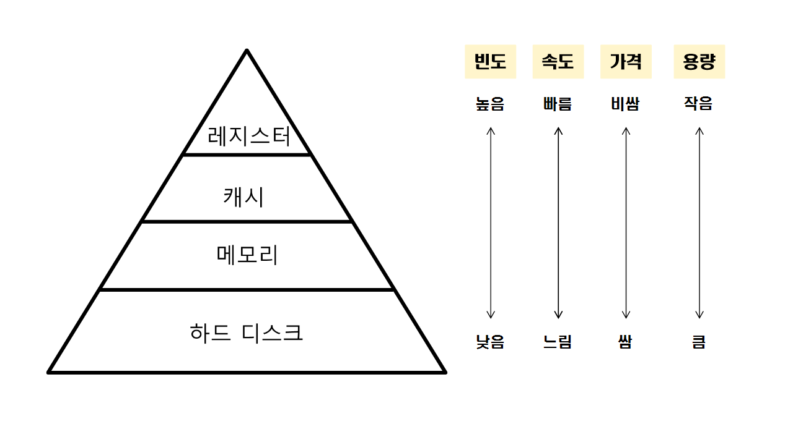
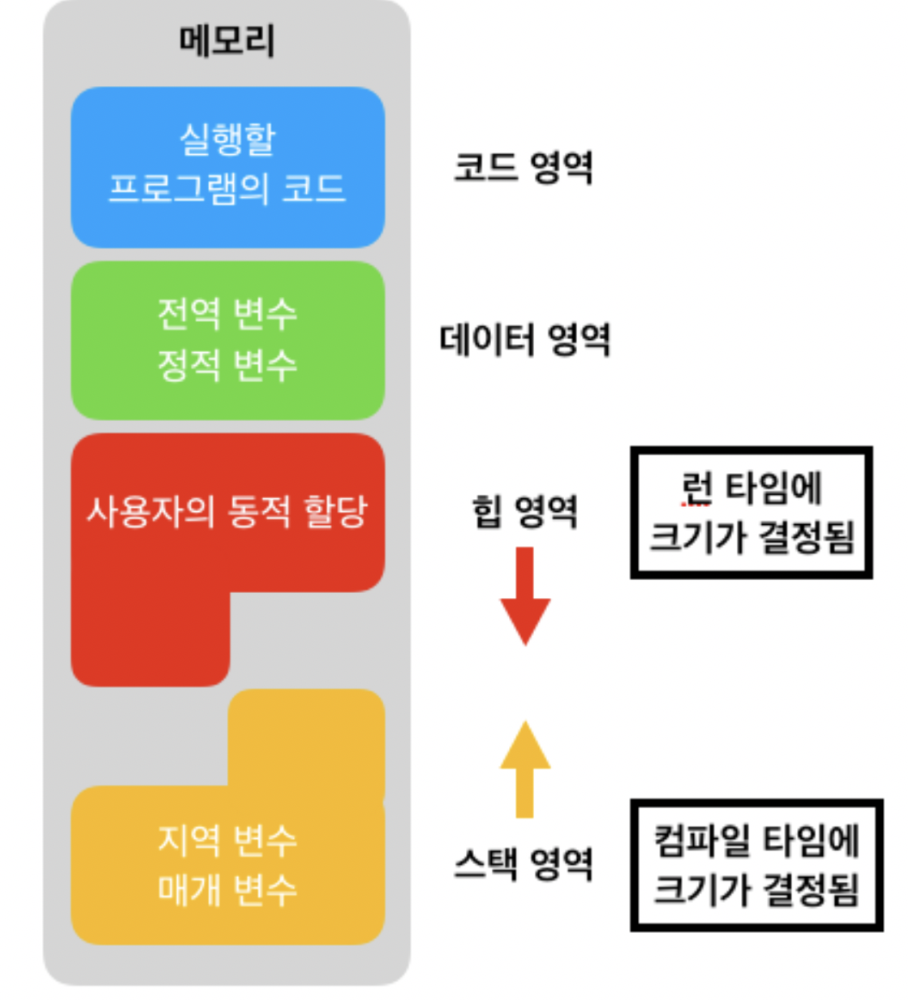

# Memory 

## Memory 란 
> 흔히 RAM(Random Access Memory)를 말하며 주기억장치 라고도 불린다.   
* 프로그램이 실행되는 동안 필요한 정보를 저장하는 기억장치  

### 램 용량이 크면 클수록 많은 프로세서의 정보를 메모리에 올려둘 수 있기 때문에, 해야할 일을 올려둘 수 있는 ***`책상`*** 에 많이 비유하곤 합니다.

### 메모리의 종류
* ### SRAM(Static RAM)
> SRAM은 각 비트를 이중안정(bistable) 메모리 셀에 저장한다. 이중안정 본성으로 인해 SRAM 메모리 셀은 자신의 값을 전원이 공급되는 한 유지한다. SRAM은 DRAM과 달리 refresh가 필요 없고, 외란에 민감하지 않다. 대신 DRAM보다 트랜지스터를 더 많이 사용하며 더 낮은 밀도를 가지고 더 비싸고 더 많은 전력을 소모한다
> * ex) 캐시메모리

* ### DRAM(Dynamic RAM)
> DRAM은 주기적으로 메모리의 모든 비트를 읽었다가 다시 써 주는 방식으로 refresh해야 한다. 또한 DRAM은 빛이나 전기적 잡음 같은 외란에 민감하다.
> * ex) 메인메모리, 그래픽 시스템의 프레임 버퍼

### 저장장치 계층구조

   

## 메모리 공간의 종류 
> * 코드 :  실행할 프로그램의 코드가 저장되는 텍스트 영역이다. CPU는 코드영역에서 저장된 명령어를 하나씩 가져가서 처리한다.
> * 데이터 :  전역변수와 정적변수가 이해 해당된다. 프로그램의 시작과 함께 할당되며 프로그램이 종료되면 소멸된다.
> * 스택   :  스택영역은 함수의 호출과 관계되는 지역변수와 매개변수가 저장되는 영역이다.   
> 함수의 호출과 함께 할당되며, 함수의 호출이 종료될때 해제된다.
> * 힙  :  힙 영역은 사용자가 직접 관리할 수 있는 메모리 영역이다. 힙 영역은 사용자에 의해 메모리공간이 동적으로 할당되고 해제된다.

   

# Memory Management
> 자원이 유한하기 때문에 

## Address Binding
>logical address를 physical address에 binding 

### compile time
> 
### load time

### execution time

## 1. swapping (현재 돌아가고있는 어플리케이션 위주로 돌림)

## 2. contiguous memory allocation (연속적으로 할당)

## 3. segmentation (메모리에 필요한 영역들만 올린다)

## 4. 

## 5. paging(일정한 크기로 쪼개서 올린다)

참고)
- KOCW 공개강의 (2014-1. 이화여자대학교 - 반효경)