# Memory 

## Memory 란 
> 흔히 RAM(Random Access Memory)를 말하며 주기억장치 라고도 불린다.   
* 프로그램이 실행되는 동안 필요한 정보를 저장하는 기억장치  

### 램 용량이 크면 클수록 많은 프로세서의 정보를 메모리에 올려둘 수 있기 때문에, 해야할 일을 올려둘 수 있는 ***`책상`*** 에 많이 비유하곤 합니다.

### 메모리의 종류
* ### SRAM(Static RAM)
> SRAM은 각 비트를 이중안정(bistable) 메모리 셀에 저장한다. 이중안정 본성으로 인해 SRAM 메모리 셀은 자신의 값을 전원이 공급되는 한 유지한다. SRAM은 DRAM과 달리 refresh가 필요 없고, 외란에 민감하지 않다. 대신 DRAM보다 트랜지스터를 더 많이 사용하며 더 낮은 밀도를 가지고 더 비싸고 더 많은 전력을 소모한다
> * ex) 캐시메모리

* ### DRAM(Dynamic RAM)
> DRAM은 주기적으로 메모리의 모든 비트를 읽었다가 다시 써 주는 방식으로 refresh해야 한다. 또한 DRAM은 빛이나 전기적 잡음 같은 외란에 민감하다.
> * ex) 메인메모리, 그래픽 시스템의 프레임 버퍼

### 저장장치 계층구조

   

## 메모리 공간의 종류 
> * 코드 :  실행할 프로그램의 코드가 저장되는 텍스트 영역이다. CPU는 코드영역에서 저장된 명령어를 하나씩 가져가서 처리한다.
> * 데이터 :  전역변수와 정적변수가 이해 해당된다. 프로그램의 시작과 함께 할당되며 프로그램이 종료되면 소멸된다.
> * 스택   :  스택영역은 함수의 호출과 관계되는 지역변수와 매개변수가 저장되는 영역이다.   
> 함수의 호출과 함께 할당되며, 함수의 호출이 종료될때 해제된다.
> * 힙  :  힙 영역은 사용자가 직접 관리할 수 있는 메모리 영역이다. 힙 영역은 사용자에 의해 메모리공간이 동적으로 할당되고 해제된다.

   

# Memory Management
### **한정적인 자원을 효율적으로 사용하기 위해 메모리를 관리하는 기법**

### Logical address(=virtual address)
> * 프로세스마다 독립적으로 가지는 주소 공간
> * 각 프로세스마다 0번지부터 시작
> * CPU가 보는 주소

### Physical address
> * 메모리에 실제로 올라가는 위치

## Address Binding
> 주소를 결정하는 것.   
> Symbolic Address -> `"Logical Address -> Physical Address"` 의 과정에서 결정

Symbolic Address
> 변수 이름, 함수 이름과 같이 프로그래머가 사용하는 주소   
> ex) int * a=&n;

  

### Compile time
> 물리적 주소가 컴파일 시 결정됨   
> 고정된 주소를 사용하기 때문에 프로세스의 시작 위치 변경되면 재컴파일 해야한다   
> 컴파일러는 절대 주소(absolute address) 생성   
> 논리적 주소와 물리적 주소가 동일함

* ***주소가 고정되어 있기 떄문에 메모리 상에 빈 공간이 발생할 가능성이 높아 비효율적이고 로드하려는 주소에 이미 다른 프로스세가 존재할 수 있다.***

### Load time
> Loader가 프로세스를 메모리에 load 하는 시점에 물리적 주소를 결정 
> 메모리상에 비어있는 위치에 언제든 올라갈 수 있도록 컴파일러가 재배치가능코드(relocatable code)를 생성해야 한다.

* ***프로세스 내에 메모리를 참조하는 명령어들이 많아서 주소를 다 바꿔주어야 하기 때문에 load 시간이 오래걸릴 수 있다.***

### Execution time(Run time)
> 프로세스가 실행될 떄 메모리 주소를 바꾸는 방법 즉, Runtime때 물리적 주소가 결정되며 실행 도중에 
> 주소가 바뀔 수 있다.   
> CPU가 주소를 참조할 때마다 address mapping table을 이용하여 binding을 점검한다   
> 하드웨어적인 지원이 필요하다
> * ex) base and limit registers, MMU(Memory Management Unit)
> * MMU는 논리적 주소를 물리적 주소로 매핑해주는 역할을 하며 논리적 주소에 base register의 값을 더하는 방식이다. 
> * base register는 하나이며 프로세스끼리 공유한다.

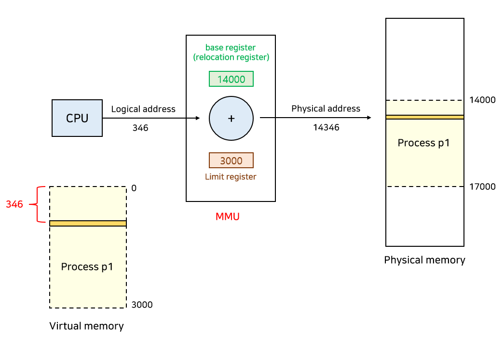  
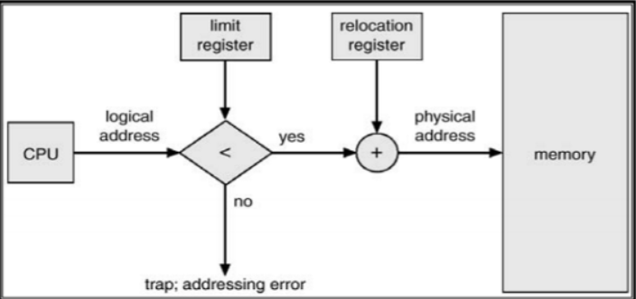  

### Base register(relocation register)
> 접근할 수 있는 물리적 주소의 최솟값을 나타낸다

### Limit register
> 논리적 주소의 최댓값이며, 프로그램 크기를 담고있다.   
> 잘못된 메모리를 참조하지 않도록 막아주는 기능을 한다.

### **`만약 커널모드인 경우에는 MMU가 논리적 주소를 그대로 사용한다. 따라서 커널 모드인지 체크하는 과정이 포함되어 있다.`**

## 1. swapping 
> 프로세스를 일시적으로 메모리에서 backing store(swap area, 디스크)로 쫓아내는 것.

### Swap in, Swap out
> * 일반적으로 중기 스케줄러(swapper)에 의해 swap out 시킬 프로세스를 결정한다. 우선순위가 낮은 프로세스는 
> swap out 시켜 디스크로 보내고 우선순위가 높은 프로세스를 메모리에 load 한다.   
> * swap in 될 때 compile time, load time 방식은 원래 메모리 위치로 load해야 한다.   
> * execution time 에서는 빈 메모리 영역 아무 곳에나 load할 수 있다.   
> * swap time은 swap되는 양에 비례하다.

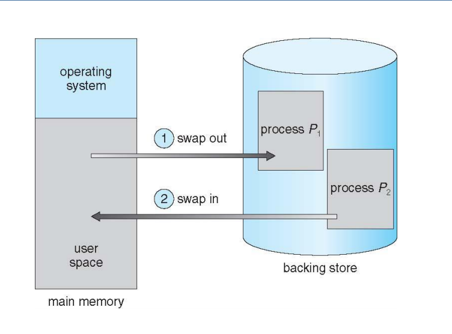  

### 메모리는 일반적으로 두 영역으로 나뉘어 사용되는데
> 1. 커널영역
>       * interrupt vetor와 함께 낮은 주소 영역 사용
> 2. 사용자 프로세스 영역

### 사용자 프로세스 영역의 할당 방법
> ### Contiguous allocation 
> * 각각의 프로세스를 메모리의 연속적인 공간에 할당시키는 방법.
> ### Noncontiguous allocation
> * 하나의 프로세스를 메모리의 여러 영역에 분산하여 할당하는 방법
> * Paging, Segmentation, Paged Segmentation

## 2. contiguous memory allocation 
> 말 그대로 프로세스들을 메모리에 연속적으로 할당시키는 방법이다.   
> ### Fixed partition allocation(고정 분할)
> * 메모리의 공간을 고정된 크기로 나누는 방식
> * 분할의 크기는 모두 동일하거나 다를 수 있고 동시에 메모리에 load되는 프로세스 개수가 고정되며 수행 
>  가능한 프로세서의 크기가 제한된다.
> * `internal fragmentation, external fragmentation 발생`
> ### Variable partition allocation(가변 분할)
> * 프로세스의 크기를 고려해서 할당하는 방식
> * 분할의 크기나 개수가 동적으로 변한다
> * 기술적 관리 기법이 필요하다.
> * `external fragmentation 발생`

  

### Dynamic Storage-Allocation Problem
> 가변 분할 방식에서 크기가 n인 프로세스가 들어갈 가장 적절한 hole을 찾는 문제로 3가지 방식이 있다.
> ### Hole
> * 가용 메모리 공간
> * 다양한 크기의 hole들이 메모리 여러 곳에 흩어져 있다.
> * 프로세스가 도착하면 수용 가능한 hole을 할당
> * 운영체제는 다음의 정보를 유지해야 한다.
>   * 1. 할당공간
>   * 2. 가용공간(hole)

### 1. First-fit
* 크기가 n 이상힌 hole 중 최초로 발견한 hole에 할당
### 2. Best-fit
* 크기가 n 이상인 가장 작은 hole을 찾아서 할당
* hole들의 리스트가 크기순으로 정렬되지 않은 경우 모든 hole의 리스트를 탐색해야 한다.
* 항상 거의 딱 맞는 크기를 할당하기 때문에 할당 후에 많은 수의 아주 작은 hole들이 생성된다.
### 3. Worst-fit
* 가장 큰 hole에 할당
* 모든 리스트를 탐색해야 하고 상대적으로 아주 큰 hole들이 생성된다.

### ***first-fit과 best-fit이 worst-fit보다 속도와 공간 이용률 측면에서 효과적인 것으로 알려져 있다***

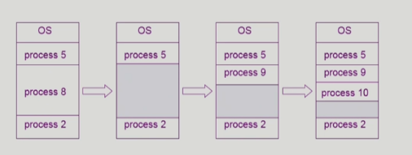  

## 3. Fragmentation

### Fragmentation(단편화)은 메모리에 적재되고 제거되는 일이 반복되면 프로세스들이 차지하는 메모리 틈 사이에 사용하지 못할만큼의 작은 공간들이 늘어나게 되는 현상을 말한다.
> ### external fragmentation
> * 외부 단편화는 프로세스가 들어갈 수 있는 메모리가 있음에도 불구하고 메모리가 연속하지 않아 사용할 수 없는 
> 경우를 말한다.
> ### internal fragmetation
> * 내부 단편화는 프로세스가 사용하는 메모리 공간보다 분할된 공간이 더 커서 메모리가 남는 경우를 말한다.

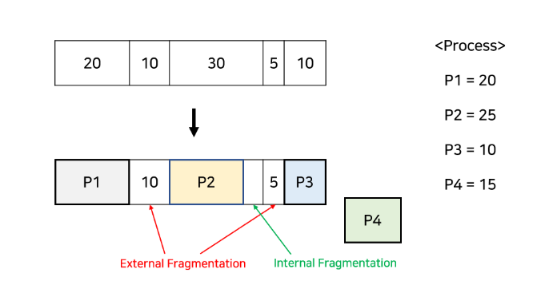  

### Compaction
> external fragmentation 문제를 해결하는 한 가지 방법으로 사용중인 메모리 영역을 한군데로 몰아넣고 
> hole들을 다른 한 곳으로 몰아 큰 hole을 만드는 것이다.
* 매우 높은 cost가 발생하며 최소한의 메모리 이동으로 compaction하는 방법이 매우 복잡하다.
* 프로세스의 주소가 실행 시간에 동적으로 재배치 가능한 경우에만 수행 가능하다.

## 4. Segmentation
> 프로그램을 의미 단위인 여러개의 segment 단위로 구성하는 방법
* 작게는 프로그램을 구성하는 함수 하나하나를 세그먼트로 정의
* 크게는 프로그램 전체를 하나의 세그먼트로 정의가 가능하다.
* 일반적으로는 code, data, stack 부분이 하나씩의 세그먼트로 정의됨
* 세그먼트 테이블을 이용해 주소변환

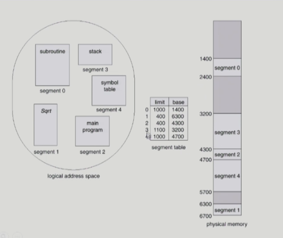  

### Logical address는 다음의 두 가지로 구성된다.
 `<segment-number, offset>`

 ### Segment Table
 > 각각의 테이블은 다음 두 가지를 가진다
 > * base: 세그먼트의 시작 물리적 주소
 > * limit: 세그먼트의 길이

 ### Segment-table base register(STBR)
 * 물리적 메모리에서의 segment table의 위치

 ### Segment-table length register(STLR)
 * 프로그램이 사용하는 segment의 수
 * segment number s is legal if s<STLR 
    * 세그먼트 번호가 세그먼트 길이보다 작아야 한다.

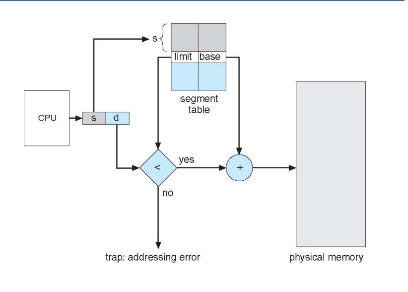  

> **Segmentation의 장점은 paging과 마찬가지로 segment들이 연속적으로 할당될 필요가 없고, stack과 heap이 독립적으로 커질 수 있으며, segment마다 protection을 따로 수행할 수 있는 등 paging과 유사한 장점을 가지고있다. 하지만, 각각의 segment는 반드시 연속적으로 할당해야 하는 단점이 있다.**

### Protection
> 각 세그먼트 별로 엔트리(Entry)에는 정보를 담고 있는 bit가 포함되어 있다
> * Valid-invalid bit: valid는 해당 주소의 세그먼트에 그 프로세스를 구성하는 유효한 내용이 있음. 
> invalid는 없음(접근 불가)
> * Protection bit: 세그먼트에 대한 Read/Write/Execution 권한 

### Sharing 
> segment를 공유할 수 있다.   
> 같은 segment 번호를 사용해야함
> * segment는 의미 단위이기 대문에 공유와 보안에 있어서 paging보다 훨씬 효과적이다.

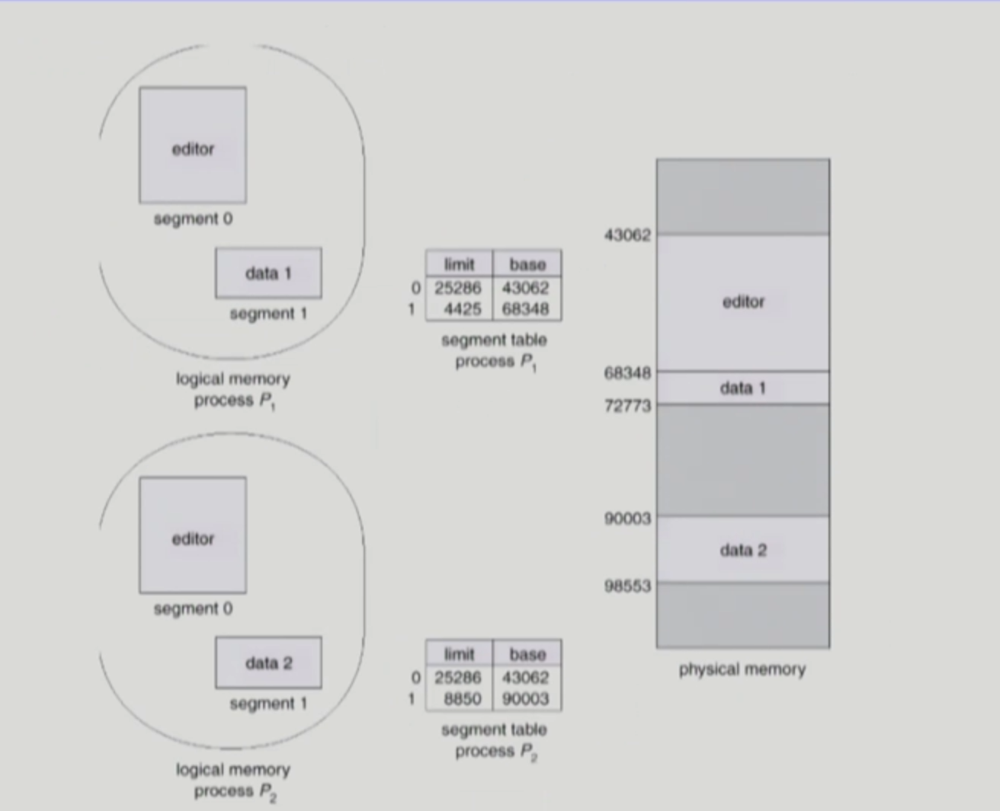  

### Allocation
> fitst-fit / best-fit 을 사용하기 때문에 외부 단편화(external fragmentation)가 발생한다.
> * segment의 길이가 동일하지 않으므로 가변분할 방식에서와 동일한 문제점들이 발생함

## 5. paging

> ### Paging(페이징)은 Noncontiguous Allocation 방식으로 외부 단편화의 압축 작업의 비효율성을 해결하기 위한 방법으로 메모리는 프레임(Frame), 프로세스는 페이지(Page)라 불리는 고정 크기의 블록(Block)으로 분리된다. 블록의 크기는 2의 거듭제곱 꼴이다.

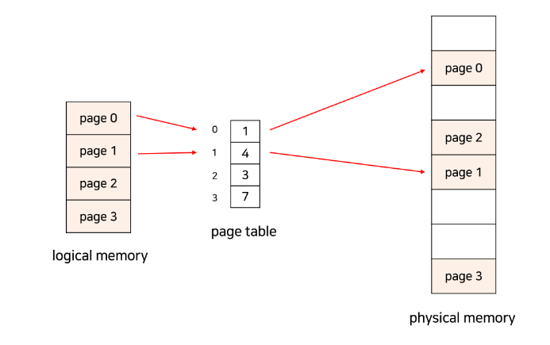  

### ***한 프로세스가 사용하는 공간은 여러 page로 나뉘어 관리되고, 각각의 page는 순서와 관계없이 메모리의 frame에 mapping되어 저장된다.***
* > 프로세스가 순서대로 메모리에 저장되지 않기 때문에 프로세스를 실행하기 위해선 page가 어느 frame에 들어있는지를 알아야 하기 때문에 이에 대한 정보가 page table이라는 테이블에 저장되어 있고, 이를 사용하여 논리적 주소를 물리적 주소로 mapping 한다.

### paging의 장점
> * page들이 연속할 필요가 없어 외부 단편화를 해결할 수 있다.
> * 할당과 해제가 빠르다.
> * swap out이 간단하다.
> * 코드를 쉽게 공유할 수 있다(Shared pages). 코드가 pure code라면 공유가 가능하며 read-only로 프로세스 
> 간에 하나의 코드만 메모리에 올린다.

### paging의 단점 
> * 내부 단편화를 해결하지 못한다
> * page table을 저장하기 위한 메모리가 추가로 소모된다
> * page table이 메모리에 상주하기 때문에 메모리에 접근하는 연산은 2번의 메모리 접근이 필요하게 되어 속도가 
> 느리다(page table 접근 + 메모리 접근)

### ***따라서 속도 향상을 위해 TLB(Translation Look-aside Buffer)라 불리는 캐시를 사용한다.***

### 논리적 주소는 다음 두 가지로 구성된다.
`page number, page offset`
> page number는 page table의 인덱스로써 page table에 접근할 때 사용된다.   
> page offset은 물리적 주소를 얻을 때 사용되고 page table의 abse address에 page offset을 더하면 물리적 주소를 구할 수 있다.

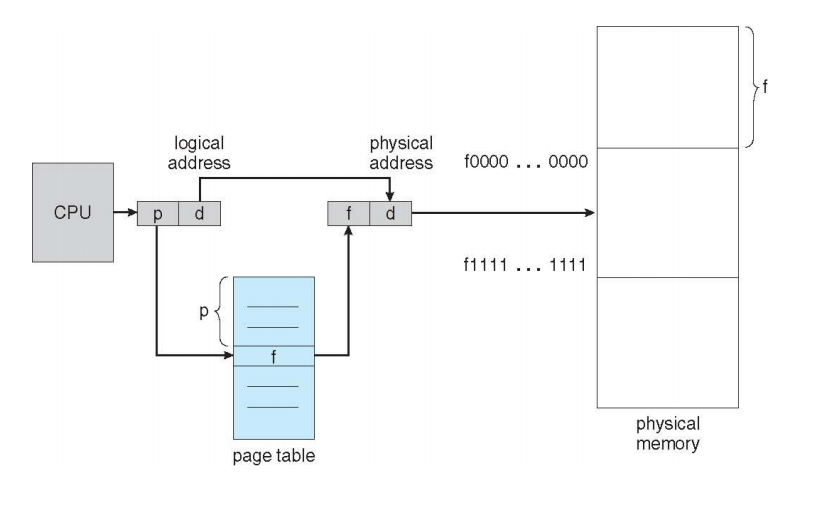  

 
page table은 메인 메모리에 저장하고 PTBR(Page-Table Base Register)라는 레지스터가 page table을 가리키도록 한다.
 * context switch 발생 시 이 레지스터의 내용만 변경하면 된다.

> page table의 각 엔트리(Entry)에는 정보를 담고 있는 bit가 포함되어 있다.
> * Protection bit: page에 대한 접근 권한 Read/Write/Read-only
> * Vaild-invalid bit: vaild는 해당 주소의 frame에 그 프로세스를 구성하는 내용이 있다. invaild는 없음(접근 불가)

***page의 크기가 작아질수록 내부 단편화가 감소하고 필요한 정보만 메모리에 load 할 수 있어 효율적이지만, page table의 크기가 증가하고 디스크 이동의 효율성이 감소한다.***

## 6. Translation Look-aside Buffer
> ### TLB는 메모리 주소 변환을 위한 별도의 캐시 메모리로 page table에서 자주 참조하는 일부 엔트리를 캐싱한다. TLB는 key-value 쌍으로 데이터를 관리하는 associative memory이며 key에는 page number, value에는 frame number가 대응된다.
* CPU는 page table보다 TLB를 우선적으로 참조하여 만약 원하는 page가 TLB에 있는 경우 곧바로 frame number를 얻을 수 있다. 이를 TLB hit 이라고 부른다.

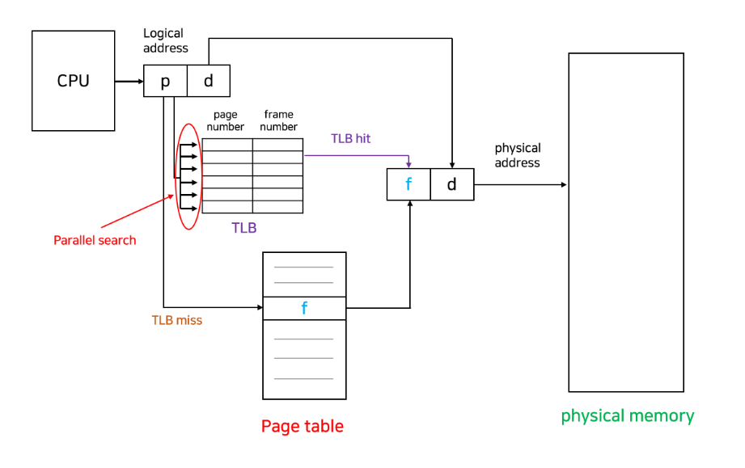 

 
### Effective Access Time
> TLB hit 비율을 a라고 하고, TLB를 탐색하는데 걸리는 시간을 b라고 하면, 메모리 접근 횟수의 기댓값은 
TLB hit + TLB miss = (b+1)*a + (b+2)*(1-a) = 2+b-a가 된다. 

* b는 일반적으로 매우 작은 값이고, a는 값이 크다. 실제로 Block이 어디에나 위치할 수 있어 Cache miss의 확률이 적기 때문이다. 따라서 기존의 메모리 접근 횟수인 2보다 훨씬 작은 값이 된다. 
 
 
### ***Context Switch가 발생하는 경우에는 TLB가 어떻게 처리될까?***
 
> 1. 매 Switch마다 TLB 전체를 비우는 방법이 있지만 캐시를 flush 하기 때문에 cost가 높다.
> 2. TLB의 각 엔트리가 어느 프로세스를 위한 것인지 추적하여 이용되지 않는 엔트리만 비운다. 이를 ASID를 이용하여 해결한다.

### ASID(Address Space Identifier)
> ASID는 Process ID와 유사하지만 8bit로, 32bit인 PID보다 가볍다. 동일한 ASID를 갖는 프로세스끼리는 TLB를 공유할 수 있기 때문에, 이런 경우엔 TLB를 비우는 오버헤드를 줄일 수 있다. 
 

### 참고)
* KOCW 공개강의 (2014-1. 이화여자대학교 - 반효경)
* https://rebro.kr/178