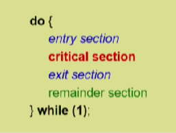
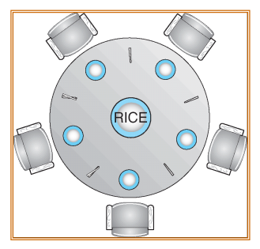
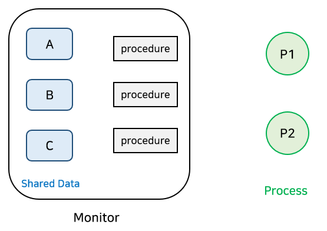
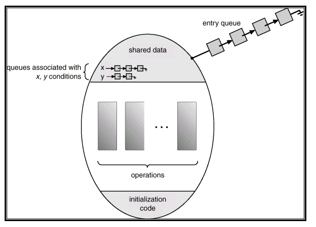

# 프로세스 동기화(Process Synchronization)
> 여러 프로세스들이 동시에 critical section에 진입하는 것을 막기위해 필요하다.

### 프로세스의 일반적인 구조
  


### ***`critical section(임계 구역)`은 코드 상에서 race condition이 발생할 수 있는 부분이다***

<br>

## Race Condition
Race Condition(경쟁 상태)은 


### 프로그램적 해결법의 충족 조건
1. Mutal Exclusion(상호 배제)
> 어떤 프로세스가 critical section을 수행 중이면 다른 모든 프로세스들은 critical section에 진입할 수 없다.
2. Progress
> 아무도 critical section에 없을 경우 critical section에 들어가고자 하는 프로세스가 있으면 들어가게 해주어야한다.
3. Bounded Waiting(유한 대기)
> crtical section에 들어가고자 하는 프로세스의 대기시간이 유한적이어야 한다.
> * 즉, 프로세스가 critical section에 들어가기 위해 무한대기를 하면 안된다.


## Synchronization Algorithm


### `Algorithm 1`
두 개의 프로세스 P_i, P_j가 있다고 가정하자.
<br>

Synchronization variable
> int turn;   
> intially turn=0; -> turn==i면 P_i는 critical section에 들어갈 수 있다

P_i's code
``` c
do{
    while(turn!=i); // my turn?
    critical section
    turn =j;        // now it's your turn
    remainder section
}while(1);

```

### `Mutual exclusion`은 만족하지만 `progress`는 만족하지 못한다.
> 반드시 한 번씩 교대로 들어가야 하기 때문에 특정 프로세스가 더 자주 critical section에 들어가야 한다면 대기시간이 길어지는 문제가 발생한다.


### `Algorithm 2`
두 개의 프로세스 P_i, P_j가 있다고 가정하자.
<br>

Synchronization variable
> boolean flag[2];   -> 어떤 프로세스가 critical section에 들어갈 지 결정
> intially falg[all]=false;  -> 어떤 프로세스도 critical section에 들어갈 수 없음
 * flag[i]==true면 Pi는 critical section에 들어갈 수 있다.


P_i's code
``` c
do{
    flag[i]=true;      // critical section 진입 요구
    while(flag[j]);    // P_j의 flag 확인
    critical section
    flag[i]=false;     // crtical section 종료 
    remainder section
}while(1);

```

### `Mutual exclusion`은 만족하지만 `progress`는 만족하지 못한다.
> flag[i], flag[j]가 모두 true라면 두 프로세스 모두 critical section에 들어가지 못하고 끊임없이 대기하는 상황이 발생한다.


### `Algorithm 3(Peterson's Algorithm)`
> 위의 두 알고리즘을 합친 방법으로 turn, flag 변수 모두 사용한다.

P_i's code
``` c
do{
    flag[i]=ture;     // critical section 진입 요구
    turn=j;           // 상대방 turn으로 변경
    while(flag[j]&&turn==j);   // 상대방의 turn이고, 상대방이 critical section 진입을 요구하면 대기한다
    critical section
    flag[i]=false;
    remainder section
}while(1);
```


### Mutual Exclusion, Progress, Bounded Waiting을 모두 만족한다.
> 하지만 계속 CPU와 Memory를 사용하면서 critical section 진입을 대기하기 때문에 `Busy Waiting(spin lock)`이 발생한다


## Synchronization Hardware

하드웨어적으로 Test & Modify를 atomic하게 수행할 수 있도록 지원하는 경우 앞의 문제들을 간단히 해결할 수 있다.
> atomic hardware instruction의 대표적인 예로는 Test_and_set 등이 있다.


이전까지의 알고리즘들은 데이터를 읽고 쓰는 것을 하나의 명령어로 처리할 수 없었지만, Test_and_set 명령어를 이용하면 데이터를 읽으면서 쓰는 것까지 하나의 명령어로 동시에 수행이 가능하기 때문에 간단하게 lock을 걸고 풀 수 있다.
> 데이터를 읽어옴과 동시에 lock을 건다

Synchronization variable
> boolean lock=false;


P_i's code
``` c
do{
    while(Test_and_Set(lock));   // 이미 lock이 걸려있는지 확인 
    critical section
    lock=false;
    remainder section
}while(1);
```


## Semaphores
세마포어(Semaphores)는 Busy Waiting이 필요 없는 동기화 도구이며 여러 프로세스나 스레드가 critical section에 진입할 수 있는 signaling 메커니즘이다.
> 앞의 방식들을 추상화함으로써 lock이나 공유자원 counting을 간단하게 하는 방법이다.
<br>

### 공유 데이터를 획득하는 연산 P(S)
``` c
P(S){
    while(S<=0 do no-ops);
    S--;
}
```
자원 S가 양수라면 자원을 할당받고 자원의 개수 감소


### 공유 데이터를 반납하는 연산 V(S)
``` c
V(S){
    S++;
}
```

Synchronization variable
> semaphore mutex;  -> intially 1: 1개의 프로세스가 critical section에 들어갈 수 있다.


P_i's code
``` c
do{
    P(mutex);        
    critical section
    V(mutex);
    remainder section
}while(1);
```

대기하는 과정에서 Busy Waiting의 발생으로 비효율적이기 때문에 `Block & Wakeup` 방식을 사용한다.


### Block & Wakeup 
> Block
> * 커널은 block을 호출한 프로세스를 suspend 시킴
> * 해당 프로세스의 PCB를 semaphore에 대한 wait queue에 삽입   
> wakeup(P)
> * block된 프로세스의 P를 wakeup 시킴
> * 해당 프로세스의 PCB를 ready queue에 삽입

### 세마포어를 다음과 같이 정의
``` c
typedef struct{
    int value;      // 세마포어 변수
    struct process *L;   // block된 프로세스들의 대기 Queue
}semaphore
```

### P(S)
``` c
void P(semaphore S){
    S.value--;
    if(S.value<0){
        add this process to S.L;  // block queue에 추가
        block();   // 자원이 없다면 block 상태로 진입
    }
}
```

### V(S)
``` c
void V(semaphore S){
    S.value++;
    if(S.value<=0){
        remove a process P from S.L;
        wakeup(P);  // 자원을 기다리는 프로세스를 깨워줌
    }
}
```
> S.value++ 로 자원을 내놓았음에도 불구하고 자원이 0이하라면 자원을 기다리고 있는 프로세스가 존재한다는 의미이다.

<br>

### Block & Wakeup overhead VS critical section 길이
* critical section의 길이가 긴 경우 block & Wakeup이 적당
* critical section의 길이가 매우 짧은 경우 block & wakeup 오버헤드가 busy-wait 오버헤드보다 커질 수 있다.
* 일반적으로는 block & wakeup이 더 좋다


<br>

세마포어에는 두 가지의 타입이 존재하는데
1. Counting semaphore
    * 도메인이 0 이상인 임의의 정수값
    * 주로 resources counting에 사용된다.
2. Binary semaphore(mutex)
    * bool 값만 가질 수 있다
    * 주로 mutual exclusion(lock/unlock)에 사용된다.


## Classical Problems of Synchronization


### 1. Producer-Consumer Problem(Bounded-Buffer Problem)
> Producer-Buffer-Consumer 구조일 때 생기는 문제점

### 생기는 문제점
1. 둘 이상의 생산자가 비어있는 버퍼에 동시에 데이터를 삽입하는 경우
2. 둘 이상의 소비자가 동일한 버퍼의 데이터에 접근하는 경우
> 두 경우 모두 버퍼에 접근할 수 없도록 락을 걸어주어야 한다.
3. 버퍼가 꽉 찬 경우
    * 생산자는 소비자가 버퍼의 데이터를 사용하여 비어있는 버퍼가 생길 때까지 대기
4. 버퍼가 모두 비어있는 경우
    * 소비자는 생산자가 비어있는 버퍼에 생산자가 데이터를 삽입할 때까지 대기 

<br>

Synchronization variable
> mutual exclusion: binary semaphore   
> resource count: integer semaphore(full/empty 버퍼의 개수)  
> semaphore full=0, empty=n, mutex=1(lock)

### Producer
``` c
do{
produce an item in x
P(empty);   // 빈 버퍼가 있으면 획득 없으면 wait
P(mutex);   // lock
...
add x to buffer  // 버퍼에 데이터 삽입
...
V(mutex);   // unlock
V(full);    // full buffer count++
}while(1);
```

### Consumer
``` c
do{
    P(full);  // 데이터가 들어있는 버퍼가 있으면 획득 없으면 wait
    P(mutex); // lock
    ...
    remove an item from buffer to y  // 데이터 추출
    ...
    V(mutex); // unlock
    V(empty); // empty buffer count++
    ...
    consume the item in y 
    ...
}while(1);
```


### 2. Readers-Writers Problem
> 한 프로세스가 데이터에 대해 write 작업을 수행할 떄 다 른 프로세스가 접근하면 안되고 read 작업은 동시에 여러 프로세스가 수행 가능하도록 하는 문제

<br>

solution
* writer가 데이터에 접근 허가를 얻디 못한 상태에서는 대기중인 reader들을 데이터에 대한 접근을 허가한다
* writer는 대기중인 reader가 하나도 없을 때 데이터에 접근이 허용된다
* writer가 데이터에 접근중이면 reader들은 접근이 금지된다
* writer가 데이터에 빠져나가야만 reader들의 접근이 허용된다


Synchronization variable
> shared data
> * int readcount=0, data 
> semaphore mutex=1, db=1
> * db: 공유 data에 대한 lock/unclok
> * mutex: 공유변수 readcount에 대한 lock/unlock


### writer
``` c
do{
    P(db);   // reader가 없다면 lock
    ...
    writing data is perforemd
    ...
    V(db);   // unlock
}while(1);
```

### Reader
``` c
do{ 
    P(mutex);     // readcount lock
    readcount++;
    if(readcount==1) P(db);  // 최초의 reader라면 data lock 
    V(mutex);     // readcount unlcok
    ...
    reading data is performed
    ...
    P(mutex);     // readcount lock
    readcount--;
    if(readcount==0) V(db);  // 마지막 reader라면 data unlock
    V(mutex);     // readcount unlock
}while(1);
```

***계속해서 writer나 reader가 들어오는 경우 한 쪽이 계속 대기하는 `starvation`이 발생할 수 있다***
> 큐에 우선순위를 두거나 timer를 통해 write와 read를 번갈아가면서 하도록 구현한다면 해결할 수 있다.

<br>

### 3. Dining-Philosophers Problem

5명의 철학자가 원탁에 둘러앉아있고, 5개의 젓가락이 있다

  

* 철학자는 두 가지 행동을 할 수 있*다
    1. 식사
    2. 생각


Synchronization variables
> semaphore chopstick[5];
> * intially all values are 1


``` c
do{
    P(chopstick[i]);      // 왼쪽 젓가락을 잡는다
    P(chopstick[(i+1)%5]);  // 오른쪽 젓가락을 잡는다
    ...
    eat();
    ...
    V(chopstick[i]);      // 왼쪽 젓가락을 내려놓는다
    V(chopstick[(i+1)%5]); // 오른쪽 젓가락을 내려놓는다
    ...
    think();
    ...
}while(1);
```

위와 같이 구현하면 매우 위험한 부분이 있다.
> Deadlock의 가능성   
> 모든 철학자가 동시에 배가 고파서 왼쪽 젓가락을 집은 경우
>   * 다른 철학자가 오른쪽 젓가락을 집을 수 없다.


solution
1. 4명의 철학자만이 테이블에 동시에 앉을 수 있도록 한다.
2. 젓가락을 두 개 모두 집을 수 있을 때에만 젓가락을 집을 수 있게 한다
3. 짝수/홀수 철학자는 왼쪽/오른쪽 젓가락을 먼저 집도록 한다.


<br>

세마포어의 문제점
1. 코딩하기가 힘들고
2. 정확성을 입증하기가 어렵다
3. 자발적 협력이 필요하다
4. 한번의 실수가 모든 시스템에 치명적 영향
> V(mutex)와 P(mutex)의 순서에 따라 deadlock이 생기거나 mutual exclusion이 깨질 수 있다.

## Monitor
Monitor(모니터)는 이러한 세마포어의 단점을 보안하기 위한 방법으로 
> 1. 동시 수행중인 프로세스 사이에서 추상 데이터의 안전한 공유를 보장하기 위한 High-level 동기화 구조이다.
> 2. 공유 데이터를 접근하기 위해서는 모니터 내부 procedure를 통해서만 접근할 수 있다.
> 3. lock을 걸 필요가 없다.


### 모니터의 구조

  

1. 공유 데이터 구조
2. 공유 데이터에 대한 연산을 제공하는 프로시저(Precedure)
3. 현재 호출된 프로시저간의 동기화를 캡슐화한 모듈(module)
>프로세스는 오직 모니터 내부의 프로시저를 통해서만 공유 데이터에 접근할 수 있다. 또한 한 번에 하나의 프로세스, 스레드만 모니터에 접근할 수 있다


  


모니터에 접근중인 프로세스가 있으면 다른 프로세스들은 `모니터 큐(Monitor Queue)`에서 대기한다.
 * 이 때 조건변수가 사용된다
 > 조건 변수는 어떤 값을 가지는게 아니라 프로세스를 sleep 혹은 wakeup 시키는 역할을 한다

 <br>

 ***조건 변수는 오직 wait와 signal 연산에 의해서만 접근 가능하다***
 


 # 면접 질문
 
 ### 1. 세마포어(semaphore)란 무엇입니까?


 ### 2. 뮤텍스(mutex)란 무엇입니까?
 


 ### 3. 세마포어와 뮤텍스의 차이점은 무엇입니까?


 참고)
 * KOCW 공개강의 (2014-1. 이화여자대학교 - 반효경)