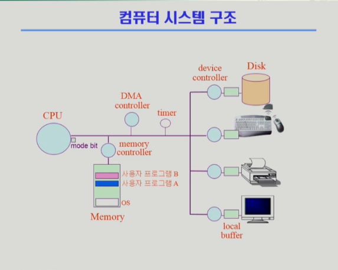
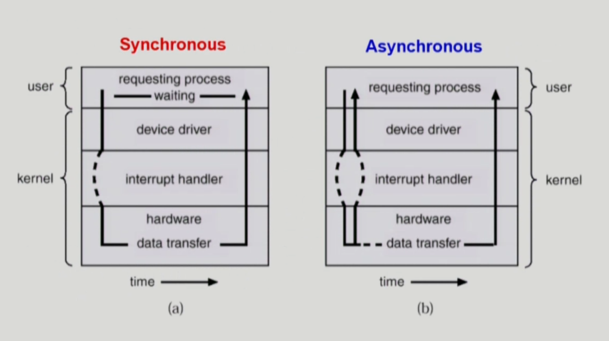
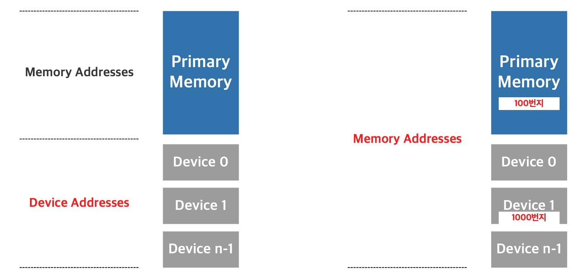

# 동기식 인터럽트와 비동기식 인터럽트 

### 인터럽트
> 인터럽트 당한 시점의 레지스터와 pc(program counter)를 저장한 후 cpu의 제어를 인터럽트 처리 루틴에 넘긴다.   
> * 인터럽트 발생시 cpu 제어권은 운영체제한테 넘어간다.   
> 넓은 의미의 인터럽트로는 두가지 종류가 있는데
> * 1. Interrupt(하드웨어 인터럽트): 하드웨어가 발생시킨 인터럽트
> * 2. Trap(소프트웨어 인터럽트)
>      - Exception: 프로그램이 오류를 범한 경우 (0으로 나누기, 커널 영역 접근 등 )
>      - System call: 프로그램이 커널 함수를 호출하는 경우 
>      - 인위적으로 interrupt line을 만든다.

### 인터럽트 관련 용어
> 인터럽트 벡터
> * 해당 인터럽트의 처리 루틴 주소를 가지고 있음
> * 어디서 인터럽트가 발생했는지, 메모리에 있는 어떤 명령어들을 실행해야하는가
> * 인터럽트 번호와 주소(인터럽트 루틴) 쌍을 가지고 있음 
>
> 인터럽트 처리 루틴(Interrupt Service Routine, 인터럽트 핸들러)
> * 해당 인터럽트를 처리하는 커널 함수 

  

### mode bit
> 사용자 프로그램의 잘못된 수행으로 다른 프로그램 및 운영체제에 피해가 가지 않도록 하기 위한 보호장치   
> mode bit 을 통해 하드웨어적으로 두 가지 모드의 operation 지원
> * 1 사용자모드: 사용자 프로그램 수행
> * 0 커널모드: OS 코드 수행
>
> 보안을 해칠 수 있는 중요한 명령어는 커널 모드에서만 수행 가능한 **`특권명령`** 으로 규정   
> interrupt나 exception 발생시 하드웨어가 mode bit을 0으로 바꿈   
> 사용자 프로그램에게 CPU를 넘기기 전에 mode bit을 1로 바꿈

### device controller
> I/O device controller 
> * 해당 I/O 장치유형을 관리하는 일종의 작은 CPU   
> * 제어 정보를 위해 control register, status register를 가짐   
> * local buffer를 가짐 (일종의 data register)
>
> I/O는 실제 device와 local buffer 사이에서 일어남   
> device controller는 I/O가 끝났을 경우 interrupt로 CPU에 그 사실을 알림   

device driver(장치 구동기)
* OS 코드 중 각 장치별 처리루틴 -> software

device controller(장치 제어기)
* 각 장치를 통제하는 일종의 작은 CPU -> hardware

# 동기식 입출력과 비동기식 입출력

### 동기식 입출력
* 동기식 입출력은 I/O 요청 후 I/O 작업이 완료된 후에야 제어가 사용자 프로그램에 넘어가는 것을 말한다.
* 프로세스가 I/O 요청시 CPU제어권은 커널로 넘어가게 되며 I/O 처리와 관련된 커널의 함수가 실행된다. 
> 이 때 I/O를 호출한 프로세스의 상태를 Blocked 상태로 바꾸어 I/O가 완료될 떄 까지 CPU를 할당받지 못하도록 wait queue에서 대기시킨다. I/O가 완료되면 I/O 컨트롤러가 CPU에게 인터럽트를 발생시켜 입출력이 완료되었음을 알려주고 blocked 상태인 프로세스에게 CPU를 할당 받을 수 있도록 ready queue에서 대기시킨다.

* 구현방법 1
> * I/O가 끝날 때까지 CPU를 낭비시킴
> * 매 시점 하나의 I/O만 일어날 수 있음
* 구현방법 2
> * I/O가 완료될 때까지 해당 프로그램에게서 CPU를 빼앗음
> * I/O 처리를 기다리는 줄에 그 프로그램을 줄 세움(waiting queue)
> * 다른 프로그램에게 CPU를 줌

### 비동기식 입출력
> CPU가 I/O 요청 후 I/O 장치에서 일어나는 작업을 고려하지 않고(I/O의 결과물을 확인하기 전에) CPU가 다른 작업을 실행하는 경우이다.
* I/O가 시작된 후 입출력 작업이 끝나기를 기다리지 않고 제어가 사용자 프로그램에게 즉시 넘어감   
* CPU의 제어권을 입출력 연산을 호출한 프로그램에게 곧바로 다시 부여한다.   
* I/O 결과와 관련 없는 연산이 있는 경우 주로 사용한다.
* CPU는 I/O 결과와 상관 없이 처리 가능한 작업부터 처리한다.
* I/O 연산이 완료되면 인터럽트를 통해 알린다.

### 입출력(I/O)의 수행
> * 모든 입출력 명령은 특권명령
> * 사용자 프로그램은 어떻게 I/O를 하는가?
>
> 시스템 콜(System call)
>   * 사용자 프로그램은 운영체제에게 I/O 요청      
> 
> 1. trap을 사용하여 인터럽트 벡터의 특정 위치로 이동   
> 2. 제어권이 인터럽트 벡터가 가리키는 인터럽트 서비스 루틴으로 이동   
> 3. 올바른 I/O 요청인이 확인 후 I/O 수행   
> 4. I/O 완료 시 제어권을 시스템콜 다음 명령으로 옮김

## 동기식 입출력 vs 비동기식 입출력
  

### ***두 경우 모두 I/O의 완료는 인터럽트로 알려줌***

## Memory Mapped I/O 
* 메모리와 I/O가 하나의 연속된 주소영역에 할당된다. 따라서 I/O가 차지하는 만큼 메모리의 용량이 감소한다. CPU 입장에서는 메모리와 I/O가 동일한 외부기기로 간주되므로 동일한 명령어에 의해 수행된다.
* 해당 방식의 가장 큰 장점은 포트 입출력을 구현할 때 부수적인 복잡성이 없어져서 CPU 내부적으로 로직이 덜 필요하고 이는 더 저렴하고 빠르고 쉬운 CPU를 만들 수 있게 한다. 이러한 특징은 **임베디드 시스템** 구현 시 장점으로 작용하는데 주소와 버스를 많이 사용하기 때문에 메인 메모리에 접근하는 것 보다 매핑된 장치에 접근하는 것이 더 느리다 
### 대표적인 프로세서: ARM, MIPS, PowerPC, M68K

### ***`해당 방식은 RISC가 추구하는 바와 같다.`***

> * 사용시 I/O 영역 변수는 volatile 타입으로 선언해야 한다. -> 컴파일러의 최적화 방지
> * I/O 영역은 Non-cacheable로 설정해야 한다. -> 캐시메모리로 접근할 경우 변경된 내용은 가져오지 못할 수도 있다.

## I/O Mapped I/O

* 메모리와 I/O가 별개의 주소영역에 할당된다. 따라서 메모리 용량에 영향을 끼치지 않는다. CPU의 입장에서는 메모리와 I/O를 구분해야 하기 때문에 I/O 명령 수행시 별도의 Input, Output 명령에 의해 수행된다.
* 해당 방식의 장점은 어드레싱 능력이 제한된 CPU를 사용할 때 이다. 입출력 접근을 메모리 접근과 분리하기 때문에 메모리용으로 주소영역 전체를 사용할 수 있다. 또한 어셈블리어상에서 소스를 볼 때 입출력 수행 루틴을 알아보기 쉽다.

### 주로 Intel 계열의 프로세서에서 사용된다.(x86)

  

### RISC(Reduced Instruction Set Computer)
> CPU 명령어의 갯수를 줄여 하드웨어 CISC보다 구조를 조금 더 간단하게 만드는 방법이다.

IBM의 System/6000 기종과 매킨토시 컴퓨터에 사용되고 있다.

### CISC(Complex Instruction Set Computer)
> 마이크로프로그래밍을 통해 사용자가 작성하는 고급언어에 각각 하나씩 기계어를 대응시킨 회로로 구성된 CPU의 한 종류이다. 
> * 명령어 집합이 커지고 가변길이의 다양한 명령어를 가지지만 주로 쓰이는 명령어는 일부에 불과하며, 구조가 복잡하므로 가격이 비싸고 전력소모가 크다는 단점이 있다.   
(주로 intel 계열 프로세서이다.)

> * ARM Processor는 임베디드 시스템상의 프로서세로 RISC 구조이며 Memory Mapped I/O 방식을 사용하고 있다.
> * ARM 어셈블러나 C로 작성할 때, 실제로 메모리 주소를 포인터로 접근하는 방식을 볼 수 있다

# 면접 준비
### 1. Sync와 Async의 차이는 무엇입니까?
> 일반적으로 동기와 비동기의 차이는 메소드를 실행시킴과 동시에 반환 값이 기대되는 경우를 동기 라고 표현하고 그렇지 않은 경우에 대해서 비동기 라고 표현한다. 동시에라는 말은 실행되었을 때 값이 반환되기 전까지는 blocking되어 있다는 것을 의미한다. 비동기의 경우, blocking되지 않고 이벤트 큐에 넣거나 백그라운드
스레드에게 해당 task 를 위임하고 바로 다음 코드를 실행하기 때문에 기대되는 값이 바로 반환되지 않는다.

참고)
- KOCW 공개강의 (2014-1. 이화여자대학교 - 반효경)