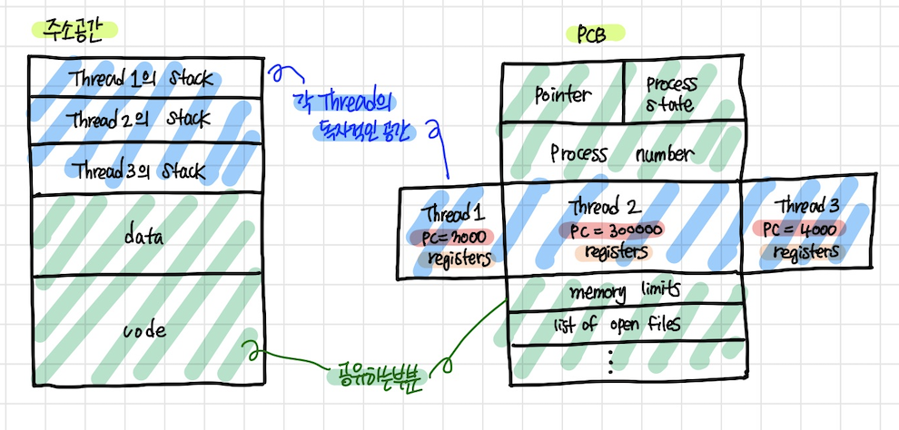
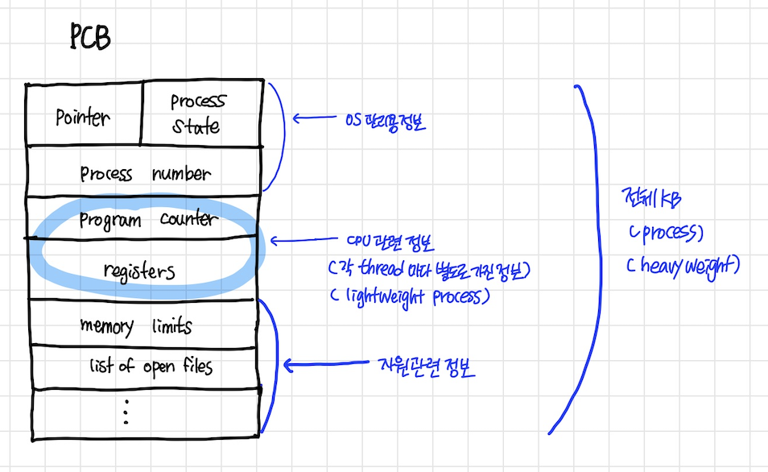
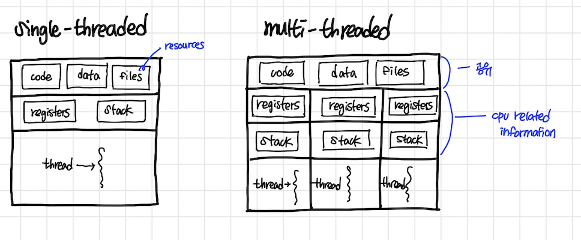

# 스레드(Thread)

## 프로세스란? 
- 프로세스란 실행 중인 프로그램이며, 사용자가 작성한 프로그램이 운영체제에 의해 메모리 공간을 할당받아 실행 중인 것을 말합니다. 

## 스레드의 개념
- 스레드란 프로세스 내에서 독립적인 작업을 수행합니다.
- 모든 프로세스에는 한 개 이상의 스레드가 존재하여 작업을 수행합니다.
- 프로세스에서 두 개 이상의 스레드를 가질 때, 멀티 스레드 프로세스(multi-threaded process)라고 표현합니다.
- 스레드에서는 프로세스의 고유한 값들(상태, 포인터, 메모리 등)은 공유하고, 이외의 값(레지스터, pc값, stack)은 별도로 가집니다.
  
- <b>프로세스 내 CPU 수행 단위가 여러 개 있는 경우, 즉 스레드는 `CPU를 수행하는 단위`</b>
- process를 별도로 두는 것보다 thread를 여러 개 두는 것이 가볍기에 `lightweight process` 라고도 표현한다.
- cf. 전통적인 process는 `heavyweight process`

### 주소공간과 PCB 에서의 스레드

- 주소공간은 code + data + stack 으로 구성되며, process 마다 주소공간이 존재한다.
- 동일한 일을 하는 프로세스가 여러 개 있을 때, 별도의 프로세스를 만들면 메모리 주소공간이 여러 개가 만들어지고 이는 메모리(자원) 낭비이다.
- 메모리 주소공간을 하나만 띄어놓고 현재 각 프로세스마다 가리키는 다른 부분의 코드를 실행할 수 있게 해주면 된다.
- 즉 process는 하나만 띄어놓고(code, data, stack), 현재 cpu가 어느 부분을 실행하고 있는가(pc가 어딜 가리키고 있는가) pc만 여러 개 두면 된다.
  
- => process 하나에 cpu 수행단위만 여러 개 두는 것을 `스레드` 라고 부른다.
- `공유할 수 있는건 최대한 공유하고 (메모리 주소공간, PCB), 별도로 가지고 있는 것은 cpu 수행과 관련된 정보들(pc, register, stack)이다.`
    

- PCB 내에 스레드 부분에서 pc와 register를 따로 관리하는 이유는 스레드가 각 cpu 수행단위(스레드)마다 현재 register에 어떤 값을 넣고, pc가 code 어느 부분을 가리키고 실행하고 있었는가를 별도로 유지해야하기 때문이다.
- 주소공간에서 스레드마다 stack이 있는 이유는 주소공간 내의 code 영역에서 code를 실행하다가 함수호출이 되고 return이 될 때까지 그와 관련된 정보를 stack에 쌓게 된다. 그런데 cpu 수행단위가 여러 개라면 stack도 별도로 둔다.

***프로세스와 스레드 ?***
- 프로세스는 운영체제로부터 자원을 할당받는 작업의 단위이고,
- 스레드는 프로세스가 할당받은 자원을 이용하는 실행의 단위입니다.

## 스레드의 구성

- <b>Thread 마다 독립적으로 가지고 있는 것들</b>
  
    -  program counter
        - 스레드는 cpu를 할당받다가 모두 실행하지 못하고 스케쥴러에 의해 선점 당합니다. 이때 스레드는 어느부분까지 수행했는지 기억해야하기 때문에 pc를 독립적으로 할당합니다.
    - register set
    - stack space
  
      
- <b>Thread가 동료 Thread와 공유하는 부분 (=task)</b>
   
  cf. 하나의 process에 thread가 여러 개 있다면, task는 한 개 있는 구조
   
    - code section
    - data section
    - OS resources

## 스레드의 생명 주기
1. Runnable(준비 상태)
스레드가 실행 하기 위해 준비하고 있는 상태를 말합니다. 이때 cpu는 할당되어 있지 않고, 실행을 위해 대기하고 있습니다.
2. Running(실행 상태)
스레드가 cpu점유권을 할당받아 실행 중인 상태입니다.
3. Dead(종료 상태)
스레드가 모두 실행을 마친 완료 상태입니다. 
4. Block(지연 상태)
스레드가 실헹 도중 스케줄러에 의해 cpu점유권을 빼앗겨 block되어있는 상태입니다. 
   
### PCB

### Single and Multithreaded processes

## Thread의 장점

- **응답성(Responsiveness)**  
  멀티 스레드 프로세스일 때 하나의 스레드가 block 상태이더라도 다른 스레드가 실행되어 빠른 응답성을 제공할 수 있습니다.
  
eg) multi-threaded web
    if one thread is blocked (eg. network, img resources를 불러오기 위해 blocked된 상태)
    another thread continues (eg. display, img를 불러오는 스레드가 아닌 다른 스레드가 이미 불러온 HTMl을 렌더링한다. -> user의 답답함을 줄일 수 있음, 응답성 측면 장점,  스레드를 활용한 비동기식)
  
- **자원 공유(Resources Sharing)**
  n threads can share binary code, data, resources of the process.
  별도의 프로세스를 두기보다 cpu 수행단위(스레드)를 여러 개 두면 자원을 효율적으로 쓸 수 있다.
  
- **경제성(Economy)** 
  - process creating과 CPU switching(context switching)은 overhead가 상당히 크다. 
    (cpu 관련 정보저장, cache memory flush 등 작업 수행 필요)
  - 반면에 thread의 경우 process 내부에서 thread 간의 switching이 일어나는 것은 오버헤드가 작고 간단하다.
    (공유하는 부분이 존재해서 문맥이 비슷하므로)
      
- **Utilization of MP Architectures**
 cf. MP : Multi processors
  
  - cpu가 여러 개 있는 경우에 해당하며 각 스레드가 다른 프로세서에서 병렬적으로 실행 가능하다.

  
**Context Switching ?**
##### 실행 중인 프로세스가 변경이 되면, CPU내의 레지스터들의 값이 변경되어야 되는데, 변경되기 전 프로세스의 데이터를 저장해주어야 한다. 이때 프로세스 switching의 경우 공유하는 데이터가 없기때문에 비용이 많이 들지만, 스레드 switching의 경우 공유하는 데이터가 있기 때문에 부담이 덜하다.

## 스레드를 구성하는 방법

**잠깐! 커널이 무엇인가요?**
##### 커널은 메모리에 상주하는 운영체제의 핵심 부분으로, 컴퓨터에 속한 자원들에 대한 접근을 중재합니다. 자원할당, 하드웨어 인터페이스, 보안, 인터럽트 제어, 네트워크 관리 등을 담당합니다.

### 1. User-Level Thread
- 커널 영역의 상위에서 지원되며 일반적으로 사용자 수준의 라이브러리를 통헤 구현됩니다.   
- Process 내 스레드가 여러 개 있다는 사실을 운영체제 커널은 모르고, user program이 사용자 수준에서 스스로 여러 개의 스레드를 관리합니다. 
- 커널이 볼 때는 일반적인 process로 보이는데 process 본인이 내부에서 cpu 수행 단위를 여러 개 두면서 관리를 하기 때문에 구현 상의 제약점이 존재할 수 있습니다.

**장점**
- 사용자가 생성하고 관리하므로 속도가 빠릅니다. 
- 커널의 개입을 받지 않기 때문에 다른 운영체제에서 사용할 수 있습니다.   
**단점**
- 하나의 스레드가 중단되면 모든 나머지 모든 스레드가 중단됩니다.

### 2. Kernel-Level Thread
운영체제가 지원하는 스레드 기능으로 구현되며, 커널이 스레드를 관리합니다.   

**장점**
- 커널이 스레드를 관리하므로 프로세스 내 스레드들이 병행으로 수행이 가능합니다.
- 병행으로 수행하므로 한개의 스레드가 중단되도 나머지 스레드들은 계속 수행이 가능합니다.   
- 
**단점**
- 사용자 스레드보다 생성 및 관리 속도가 느립니다.

### 3. 혼합형 스레드 
User-Level Thread와 Kernel-Level Thread를 합친 것입니다. 이는 두 방식의 단점을 극복합니다.   
**장점**
- 프로세스 내 스레드들이 병행으로 수행합니다.
- 스레드 풀링 기법을 통해 일대일 스레드 매핑에서의 오버헤드를 줄여줍니다.  

##### 스레드 풀링 기법이란?
##### 시스템의 부담을 줄이기 위해 미리 생성한 스레드를 재사용하여 스레드 생성 시간을 줄입니다. 또한 동시에 생성할 수 있는 스레드 수를 제한하여 시스템의 자원 소비를 줄입니다

----   

## 면접 대비
1. 스레드 생성과 프로세스 생성의 차이는 무엇인가? 
2. PC Register를 Thread마다 독립적으로 할당하는 이유는?
3. 커널 수준 스레드와 사용자 수준 스레드의 장단점은? 

