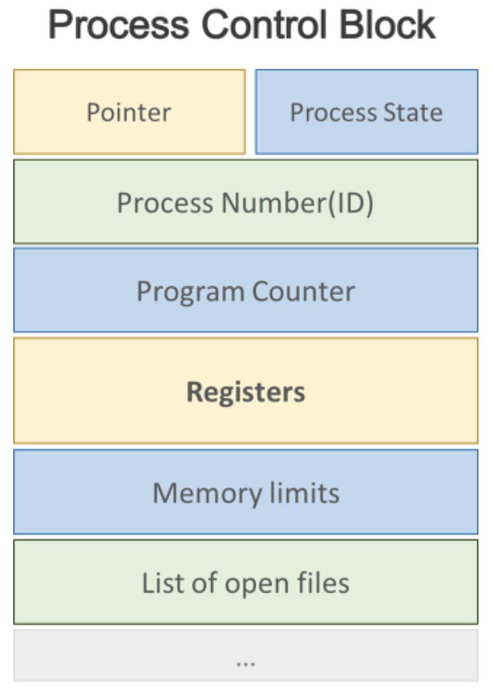

# 스레드(Thread)

## 프로세스란? 
- 프로세스란 실행 중인 프로그램이며, 사용자가 작성한 프로그램이 운영체제에 의해 메모리 공간을 할당받아 실행 중인 것을 말합니다. 

## 스레드의 개념
- 스레드란 프로세스 내에서 독립적인 작업을 수행합니다.
- 모든 프로세스에는 한 개 이상의 스레드가 존재하여 작업을 수행합니다.
- 프로세스에서 두 개 이상의 스레드를 가질 때, 멀티 스레드 프로세스(multi-threaded process)라고 표현합니다.
- 스레드에서는 프로세스의 고유한 값들(상태, 포인터, 메모리 등)은 공유하고, 이외의 값(레지스터, pc값, stack)은 별도로 가집니다.

***프로세스와 스레드 ?***
- 프로세스는 운영체제로부터 자원을 할당받는 작업의 단위이고,
- 스레드는 프로세스가 할당받은 자원을 이용하는 실행의 단위입니다. 

***PCB***

스레드는 pc,register를 별도로 가집니다.  

## 스레드의 구성
1. program counter
##### 스레드는 cpu를 할당받다가 모두 실행하지 못하고 스케쥴러에 의해 선점 당합니다. 이때 스레드는 어느부분까지 수행했는지 기억해야하기 때문에 pc를 독립적으로 할당합니다.
2. register set
3. stack space

## 장점
- **응답성(Responsiveness)** : 멀티 스레드 프로세스일 때 하나의 스레드가 block 상태이더라도 다른 스레드가 실행되어 빠른 응답성을 제공할 수 있습니다.
- **자원 공유(Resources Sharing)**: 하나의 프로세스 안에 같은 일을 수행하는 스레드를 여러개 두게 되면서 자원을 절약하고, 처리율을 높일 수 있습니다.
- **경제성(Economy)** : 프로세스 하나를 생성하고 cpu를 switching는 일보다는, thread를 생성하고 cpu를 switching하는 일이 훨씬 효율적입니다.

## 스레드를 구성하는 방법

**잠깐! 커널이 무엇인가요?**
##### 커널은 메모리에 상주하는 운영체제의 핵심 부분으로, 컴퓨터에 속한 자원들에 대한 접근을 중재합니다. 자원할당, 하드웨어 인터페이스, 보안, 인터럽트 제어, 네트워크 관리 등을 담당합니다.

### 1. User-Level Thread
- 커널 영역의 상위에서 지원되며 일반적으로 사용자 수준의 라이브러리를 통헤 구현됩니다. 커널은 프로세스 안에 스레드가 여러개 있다는 사실을 알지 못합니다.
**장점**
- 사용자가 생성하고 관리하므로 속도가 빠릅니다. 
- 커널의 개입을 받지 않기 때문에 다른 운영체제에서 사용할 수 있습니다.
**단점**
- 하나의 스레드가 중단되면 모든 나머지 모든 스레드가 중단됩니다.

### 2. Kernel-Level Thread
운영체제가 지원하는 스레드 기능으로 구현되며, 커널이 스레드를 관리합니다.
**장점**
- 커널이 스레드를 관리하므로 프로세스 내 스레드들이 병행으로 수행이 가능합니다.
- 병행으로 수행하므로 한개의 스레드가 중단되도 나머지 스레드들은 계속 수행이 가능합니다.
**단점**
- 사용자 스레드보다 생성 및 관리 속도가 느립니다.

### 3. 혼합형 스레드 
User-Level Thread와 Kernel-Level Thread를 합친 것입니다. 이는 두 방식의 단점을 극복합니다.
**장점**
- 프로세스 내 스레드들이 병행으로 수행합니다.
- 스레드 풀링 기법을 통해 일대일 스레드 매핑에서의 오버헤드를 줄여줍니다.

##### 스레드 풀링 기법이란?
##### 시스템의 부담을 줄이기 위해 미리 생성한 스레드를 재사용하여 스레드 생성 시간을 줄입니다. 또한 동시에 생성할 수 있는 스레드 수를 제한하여 시스템의 자원 소비를 줄입니다##

----   

## 면접 대비
1. 스레드 생성과 프로세스 생성의 차이는 무엇인가? 
2. PC Register를 Thread마다 독립적으로 할당하는 이유는?
3. 커널 수준 스레드와 사용자 수준 스레드의 장단점은? 

