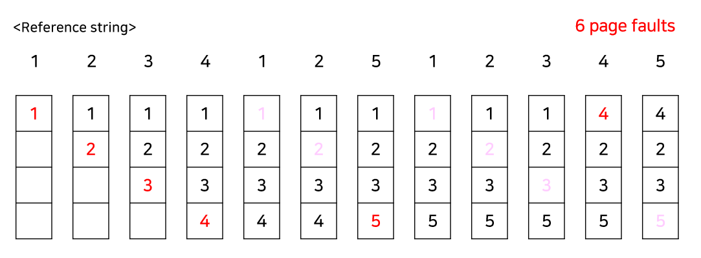
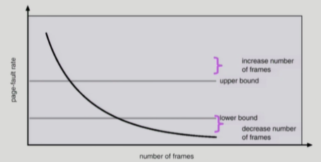

# 가상메모리

## 가상메모리란
> 물리적 메모리 크기의 한계를 극복하기 위해 나온 기술   
> 프로세스를 실행할 때 필요한 부분만 메모리에 로드하고 나머지는 디스크에 두는 것
> * ex) segmentation, paging

## Demanding Paging(요구 페이징)
> 필요한 페이지만 메모리에 올리는 것
> * I/O 양의 감소
> * Memory 사용량 감소
> * 빠른 응답 시간
> * 더 많은 사용자 수용

  

### demand paging의 page table은 다음과 같은 요소를 가지고 있다.
> frame number, vaild bit

* ### vaild-invaild bit
> Invalid
>   * 사용되지 않은 주소 영역인 경우
>   * 페이지가 물리적 메모리에 없는 경우
> 처음에는 모든 page entry가 invalid로 초기화 된다.   
> 주소 변환시에 invalid bit로 set되어 있다면 `page fault` 발생
   

### ***`만약 페이지가 메모리에 없다면?`***

  

### 주소변환 과정
> * 1. TLB에서 page가 있는지 확인한다.
> * 2. TLB hit인 경우 주소변환을 하고 TLB miss인 경우 page table을 확인한다.
> * 3. page table의 valid-invalid bit가 vaild이라면 TLB에 page table을 load한다. invaild이라면 page fault 발생
> * 4. page fault가 발생하면 MMU가 운영체제에 Trap을 발생시키고 커널모드로 들어가 ISR에 의해 page fault handler가 작동된다.
> * 5. 유효하지 않은 참조인 경우 프로세스를 종료시키고 그렇지 않다면 빈 page frame에 load한다. 빈 page frame이 없다면 victim page 를 
> 선택하여 대체한다
>   * victim page: backing store(disk)로 page out 되는 page
> * 6. 운영체제는 참조된 page를 디스크에서 메모리로 로드(I/O)하고, disk I/O가 끝날 때까지 해당 프로세스는 운영체제에게 CPU를 빼앗긴다.
> * 7. disk I/O가 끝나면 page table이 업데이트 되고 vaild-invaild bit가 valid로 바뀐다.
> 해당 프로세스는 ready queue에 들어간다.
> * 8. 프로세스에 cpu가 할당되면 다시 실행한다.

## Page Replacement Algorithm
* 메모리에 올라와있는 page를 관리하는 알고리즘   
> page in: backing store에서 메모리에 load 시키는 것   
> page out: 메모리에서 backing store로 out 시키는 것
> * page out되는 page를 victim page로 부름 
> page fault rate를 줄이기 위한 알고리즘
> * page fault시 발생하는 오버헤드가 크기 때문이다.

### ***`수정되지 않은 page를 고르는 것이 중요하다.`***
* 수정된 page는 backing store로 page out될 때 write 연산을 해야되기 때문이다.

### 1. OPT(Optimal Algorithm)
가장 먼 미래에 참조되는 page를 대체하는 방법으로 `항상 최적의 결과를 갖는다.`
> 다만 미래의 참조를 모두 알고 있어야 하므로 실제로 사용하기는 어렵고 다른 알고리즘의 성능에 의한 upper bound를 제공하는 역할을 한다.

  

### 2. FIFO(First In First Out)
먼저 들어온 page부터 page out 시키는 방법이다. 
> 미래를 모르는 경우에도 사용할 수 있고 모든 page가 frame에 평등하게 존재한다.

  

`balady's anomaly 존재`
 * 일반적으로 frame이 증가하면 page fault가 감소하지만 특정 구간에서 늘어나는 현상이 발생

   

### 3. LRU(Least Recently Used)
참조한지 가장 오래된 page를 page out 시키는 방법
> optimal에 근접한 방법이며 belady's anomaly가 존재하지 않는다.   
> 구현하기 어렵고 접근빈도를 고려하지 않는다.   
> 연결 리스트로 구현하면 O(1)만에 page를 찾고 삽입할 수 있다. 제일 최근에 찹조된 page를 가장 앞으로 옮기는 방식으로 연결 리스트를 구현하면 replace가 일어날 때 가장 뒤에 있는 page를 바꿔주면 된다.

  

### 4. LFU(Least Frequently Used)
참조 횟수가 가장 적은 page를 page out 시키는 방법
> page를 참조하는 빈도는 고려하지만 최근에 사용된 page는 반영하지 못한다.   
> 연결 리스트를 이용해서 구현하면 replace 될 page를 찾는데 O(n)의 시간이 걸리고 heap을 이용하면 O(logn)의 시간이 걸린다.
> * heap: 완전 이진 트리의 일종으로 우선순위 큐 형태의 자료구조이다.

### ***`그렇다면 LRU와 LFU가 실제로 사용 가능할까?`***
> 

### 5. Second Chance(Clock) Algorithm
> LRU와 LFU은 운영체제가 자료구조를 변경하고 유지하는 작업을 수행해야 하지만 page fault가 발생하지 않으면 운영체제에게 cpu가 넘어가지 않기 때문에 디스크에서 메모리로 page를 로드할 때 해당 page에 대한 정보를 업데이트 할 수 없다.
> * 운영체제가 page에 대한 참조 횟수, 최근에 참조한 page를 정확하게 알 수 없다.

해당 알고리즘은 LRU에 근사한 알고리즘으로 page에 대한 최근 참조 여부를 알 수 있도록 reference bit를 사용한다

  

reference bit가 0인 것을 찾을 때까지 시계처럼 포인터를 이동하다가 0인 것을 찾으면 page를 교체한다.
> 만약 reference bit가 1인 page를 만나면 0으로 바꾸어 주고 다시 한 바퀴 돌아왔을 때도 0이라면 page를 교체한다. 만약 돌아왔을 때 1로 바뀌어있다면 최근에 참조했다는 뜻이기 때문이다.

### ***modified bit를 추가한 Enhanced second chance algorithm***

* modified bit: page가 수정되었는지 여부를 판단
> page가 수정되었다면 page out시 disk I/O시 write 동작이 수행되기 때문에 cost가 발생

## Allocation of Frames

* 프로세스마다 얼마만큼의 page frame을 할당할지에 대한 문제
* Allocation의 필요성
> 명령어 수행을 위해 최소한 할당되어야 하는 frame의 수가 존재함.   
> Loop를 구성하는 page들은 한꺼번에 할당하는 것이 좋다
> * 최소한의 할당이 없다면 매 Loop마다 page fault 발생

할당하는 방식으로는 균일하게 할당하거나 특정 기준에 따라서 할당하는 방법이 있다.
> * Equal allocation: 모든 프로세스에 균등하게 할당
> * Proportional allocation: 프로세스 크기에 비례하여 할당
> * priority allocation: 프로세스의 우선순위에 따라 할당

page fault가 발생했을 때 교체되는 frame의 그룹에는 두 가지가 있다.

### Global Replacement
> Replace시 다른 프로세스에 할당된 frame을 빼앗아올 수 있다. 프로세스별로 frame 할당량을 조절하는 방법이 될 수도 있지만, 자신의 page fault rate를 조절할 수 있다.
* 일반적으로 더 좋은 처리량을 가지므로 가장 흔하게 사용되는 방법이다

### Local Replacement
> 자신에게 할당된 frame 내에서만 교체하는 방법이다. 알고리즘을 프로세스마다 독자적으로 운영하는 경우 가능하다
* 쉬고 있는 메모리를 사용할 수 없기 때문에 비교적 비효율적이다.

## Thrashing

프로세스가 원활한 실행에 필요한 최소한의 page frame을 할당받지 못해서 실행보다 swapping 하는 시간이 더 많은 경우
> * page fault rate 증가
> * CPU utilization 감소

### Thrashing의 발생 과정
1. page가 부족하여 page fault 발생
2. Swapping(I/O)가 발생하여 CPU utilization 감소
3. OS는 MPD(Multiprogramming Degree)를 증가시켜야 한다고 판단하여 프로세스를 메모리에 load시킨다
4. 프로세스당 할당된 page frame이 더 감소하여 page fault가 증가한다.
5. 프로세스는 Swapping으로 인해 매우 바빠져서 CPU 사용량이 감소한다
6. low throughput 발생

***`Thrashing을 예방하기 위해서는 프로세스에게 필요한 만큼 frame을 제공해야한다.`***

  

## Thrashing Prevention

### 1. Working Set Model
* 가능한 최대의 Multiprogramming Degree를 유지하면서 Thrashing을 막는 방법

> Locality of Reference(참조 지역성 원리)는 프로세스가 특정 시간 동안 일정 장소를 집중적으로 참조하는 성질을 말한다. Locality에 기반하여 프로세스가 일정 시간 동안 원활히 수행되기 위해 한꺼번에 메모리에 올라와있어야 하는 page들의 집합을 `working set`이라고 한다.

working set은 working set window라는 고정된 page 참조 횟수(시간)로 구한다

> **WSS_i**=working size of process **P_i**
즉, 가장 최근 window에서 프로세스 **P_i**가 참조한 page의 총 개수라고 정의하자   
> 이때, ∑WSS_i가 필요한 frame의 총 수가 되고 이 값이 사용가능한 총 frame보다 크다면 Thrashing이 발생할 것이다.

따라서 운영체제가 지속적으로 working set을 지켜보면서 충분한 frame을 할당해주고 필요한 총 frame이 사용가능한 총 frame보다 크다면 프로세스 중 하나를 종료시키고 해당 프로세스에게 할당되어 있던 frame을 다른 프로세스들에게 할당해줄 수 있다.

### 2. PFF(Page Fault Frequency) Scheme
* page fault의 상한선과 하한선을 두는 방법

> page fault rate가 상한선을 넘으면
>   * frame을 더 할당해준다.
> page fault rate가 하한선을 넘으면
>   * 할당된 frame을 줄인다.

  

> 가상 메모리 기법은 디스크를 메모리로 사용하는 디스크 페이징(스왑)과는 직접적으로 연관이 없다. 여기서 가상(Virtual) 의 의미는 디스크를 가상의 RAM 처럼 쓴다는 의미가 아니라, 각 프로세스마다 실제 물리 메모리가 아닌 가상의 주소 공간을 보이게 한다는 의미이다. 사실 넓게 보면 메모리의 내용을 디스크에 임시로 저장하는 개념 자체는 별로 특이한 것도 아니고 이론적으로는 가상 메모리를 사용하지 않는 시스템에서도 구현할 수 있다.이렇게 용어가 혼동되어 쓰이는 이유는 Windows 에서 이러한 디스크 스왑 설정을 "가상 메모리" 라고 번역 해놓았기 때문이다.   
> 출처 - 나무위키 가상메모리

# 면접 대비

### 1. 가상 메모리란 무엇입니까?
물리적 메모리 크기의 한계를 극복하기 위해 나온 기술로 프로세스를 실행할 때 필요한 부분만 메모리에 올려두고 나머지는 디스크에 두는 것이다.

### 2. 페이징이란 무엇입니까?
세그먼테이션과 가상 메모리를 고정된 크기로 나누어 메모리(가상메모리)를 관리하는 기법을 말한다. 자세하게 말하자면 커다란 크기의 작업을 일정한 크기로 나누어 잘게 쪼개어 처리하는 것이다. 따라서 불연속적인 메모리 요청 등에 유연하게 처리할 수 있다. 

세그먼테이션은 논리적 블록을 필요에 따라 다른 크기로 할당한 것이라면, 페이징은 고정된 크기로 나누는 것이다. 외부단편화는 해결하지만, 내부단편화가 발생할 수있다.

### 3. 메모리 단편화란 무엇입니까?
Fragmentation(단편화)은 메모리에 적재되고 제거되는 일이 반복되면 프로세스들이 차지하는 메모리 틈 사이에 사용하지 못할만큼의 작은 공간들이 늘어나게 되는 현상을 말한다.
> external fragmentation
> * 외부 단편화는 프로세스가 들어갈 수 있는 메모리가 있음에도 불구하고 메모리가 연속하지 않아 사용할 수 없는 경우를 말한다.
> internal fragmetation
> * 내부 단편화는 프로세스가 사용하는 메모리 공간보다 분할된 공간이 더 커서 메모리가 남는 경우를 말한다. 

### 4. 메모리 단편화 해결방법은? 
메모리 압축(디스크 조각 모음), 메모리 통합(단편화가 발생된 공간들을 모아 하나의 큰 공간으로 만드는 방법)

참고) 
* KOCW 공개강의 (2014-1. 이화여자대학교 - 반효경)