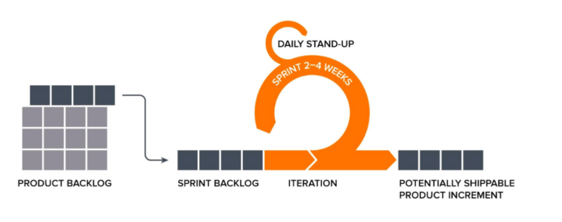

# Agile
> agile : 날렵한, 민첩한    

 

## 애자일이란?
날렵한, 민첩한 이라는 뜻을 가진 단어로, 짧은 단위의 사이클을 반복하여 개발을 진행하는 방법론

 

## 등장 배경
초기 sw개발 방법은 계획 중심의 프로세스였다. 그러나 소프트웨어 트렌드 변화 속도가 빨라지면서, 제품 수명이 짧아졌고 SW개발의 불확실성이 높아지게 되었다. 빠르게 변하는 비즈니스의 속도를 따라잡기 위해 일단 해보고 고쳐나가는 식의 방법론을 개발하게 되었다.

 

## 애자일 선언문
> 2001년 1월, "애자일 연합"이라는 그룹에서 만든 공동 선언서.   
우리는 소프트웨어를 개발하고, 또 다른 사람의 개발을 도와주면서 소프트웨어 개발의 더 나은 방법들을 찾아가고 있다. 
이 작업을 통해 우리는 다음을 가치 있게 여기게 되었다:   
공정과 도구보다  **_개인과 상호작용_** 을   
포괄적인 문서보다 **_작동하는 소프트웨어_** 를   
계약 협상보다 **_고객과의 협력_** 을   
계획을 따르기보다 **_변화에 대응하기_** 를   
가치있게 여긴다. 이 말은, 왼쪽에 있는 것들도 가치가 있지만, 우리는 오른쪽에 있는 것들에 더 높은 가치를 둔다는 것이다.

 

## 애자일 원칙
- 우리의 최고 우선순위는 가치 있는 소프트웨어를 일찍 그리고 지속적으로 전달함으로써 고객을 만족시키는 것이다.
- 비록 개발 후반부일지라도 요구사항 변경을 환영하라. 애자일 프로세스들은 변화를 활용해 고객의 경쟁력에 도움이 되게 한다. 
- 작동하는 소프트웨어를 자주 전달하라. 약 2주에서 2개월의 간격으로 하되, 간격이 짧을수록 좋다.
- 비즈니스 쪽의 사람들과 개발자들은 프로젝트 전체에 걸쳐 매일 함께 일해야 한다.
- 동기가 부여된 개인 중심으로 프로젝트를 구성하라. 그들이 필요로 하는 환경과 지원을 주고 일을 끝낼 수 있도록 신뢰하라. 
- 다른 개발팀에게 혹은 개발팀 내부에서 정보를 전달하는 가장 효율적이고 효과적인 방법은 마주보고 하는 대화이다.  
- 작동하는 소프트웨어가 진척의 주요 척도이다. 
- 애자일 프로세스들은 지속 가능한 개발을 장려한다. 스폰서, 개발자, 사용자는 일정한 속도를 계속 유지할 수 있어야 한다.  
- 기술적 탁월성과 좋은 설계에 대한 지속적 관심이 기민함을 높인다. 
- 간결함 : 하지 않아도 되는 일의 양을 최대화하는 기술이 필수적이다. 
- 최고의 아키텍처, 요구사항, 설계는 자기 조직화 되어있는 팀에서 나온다.
- 팀은 정기적으로 어떻게 더 효과적일 수 있을지 되둘아보고, 이에 따라 팀의 행동을 조율하고 조정한다.

 

## 애자일의 핵심
1. 협력
    - 혼자 얻은 통찰력을 다른 사람도 함께 얻을 수 있다.
    - 문제가 되는 것을 찾기 쉽다.
2. 피드백
    - 내부적으로는 내가 만든 것이 어떻게 됐는지 확인해본다.
    - 외부적으로는 내가 만든 것을 다른 사람이 사용해보고 이를 통해 다른 것을 배운다.

 

## 폭포수 방법론과의 차이점

 

1. 계획중심 vs 고객중심
    - 폭포수 방법론: 포르젝트를 시작하기 전, 프로젝트 전체에 대한 일정을 세우고 이에 따라 진행한다.
    - 애자일: 계획을 수립하되, 현재 시점에 중요하거나 확정된 내용을 중심적으로 수립한다.  
      프로젝트 상황에 따라 계획은 변경될 수 있다는 사실을 인지하며, 고객이 중요하게 생각하는 기능을 개발하는 것이 먼저이다.
2. 빅뱅 릴리즈 vs 작은 릴리즈
    - 폭포수 방법론: 프로젝트가 종료되는 시점에 모든 기능이 공개된다.
    - 애자일: 이터레이션이라는 일정 기간 단위로 완성되는 기능을 공개한다.
3. 산출물 중심 vs 동작하는 sw 중심
    - 폭포수: 계획된 단계별로 산출물이 작성되었는지 여부를 확인함으로써 프로젝트 진행을 체크한다.
    - 애자일: 소프트웨어가 제대로 동작하는지 여부를 확인함으로써 프로젝트 진행을 체크한다.

- 애자일 방법론을 도입하려는 이유
    - 제품을 적기에 출시하기 위해
    - 개발 비용을 줄이기 위해
    - 소프트웨어 품질 향상을 위해

 

## 애자일 방법론의 종류
- 스크럼(Scrum) : 켄 슈와버 / 제프 서덜랜드
- 적응형 소프트웨어 개발 방법론(Adaptive Software Development, ASD) : 짐 하이스미스
- 기능 주도 개발방법론(Feature Driven Development, FDD): 피터 코드/제프 드루카
- 동적 시스템 개발 방법론(Dynamic Systems Development Method: DSDM): 데인포크너
- 크리스탈 패밀리: 앨리스테어 코번
- 익스트림 프로그래밍: (eXtreme Programming, XP): 켄트, 벡/에릭 감마
- 린(Lean) 소프트웨어 개발 방법론: 메리 포펜딕 / 톰 포펜딕
- 애자일UP(Agile Inified Process, AUP): 스콧 앰블러   
이 중에서 세계적으로 널리 사용 중인 애자일 방법론은 **스크럼(SCRUM)** 이다.

  

# SCRUM
> 프로젝트 관리를 위한 애자일 방법론 중 하나이다.   

 

## 스크럼 진행 과정
1. 제품 백로그 작성
2. 스프린트 계획 미팅
3. 스프린트 백로그 작성
4. 일일 스크럼 미팅
5. 제품 개발
6. 스트린트 리뷰 미팅
7. 스프린트 회고
8. 다음 스프린트 시작

 

## 스크럼 역할자
1. 제품 책임자: 제품 기능 목록에 대한 제품 백로그를 만들고 우선순위를 조정하거나 새로운 항목을 추가하는 일을 관리.
2. 스크럼 마스터: 스크럼의 원칙을 지키며 스크럼 팀이 개발을 진행할 수 있도록 지원.
3. 스크럼 팀: 각 스프린트 기간동안 구현해야 할 기능을 사용자 스토리로 도출하고 구현. 보통 5-9명의 팀으로 구성됨.

  

## 스크럼 구성요소
1. 스프린트(Sprint) - 1~4주 단위의 반복 개발 기간
2. 3가지 미팅 - 일일 스크럼, 스프린트 계획, 스프린트 리뷰
    - 일일 스크럼 - 매일 진행되는 상황 공유 회의. 짧은 시간동안 진행된다.
    - 스프린트 계획 - 하나의 스프린트에 대한 목표를 설정함. 진행할 항목과 담당자를 배정
    - 스프린트 리뷰 - 해당 스프린트의 결과물을 확인하는 회의.해당 스프린트동안 제작된 모든 결과물에 대한 시뮬레이션을 돌려봄. 이후, 잘된 점과 개선 사항 등을 공유
3. 3가지 산출물 - 제품 백로그, 스프린트 백로그, 소멸 차트
    - 제품 백로그 - 기능의 우선순위를 정리한 것
    - 스프린트 백로그 - 하나의 스프린트 기간동안 개발할 목록
    - 소멸차트 - 개발 완료까지 남은 작업량을 보여주는 그래프

 

 

## 스크럼 특징
- 매 스프린트마다 생산되는 실행 가능한 제품을 통해 사용자와 의견 교류 가능
- 지속적인 소통으로, 발생하는 문제는 즉시 해결이 가능하므로 비용 절감이 되고 품질을 높일 수 있음
- 프로젝트 진행 상황 확인 가능
- 제대로 정의되지 않은 작업은 부정확한 결과 초래 가능

