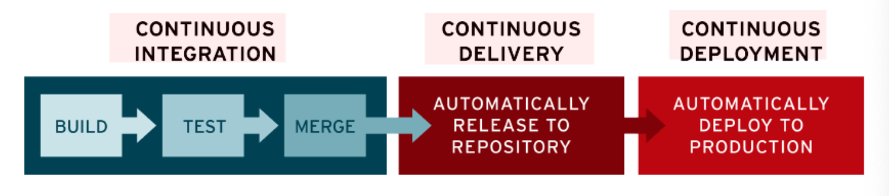

# CI / CD 개발 프로세스

> `Continuous Integration(지속적인 통합)` and `Continuous Delivery(지속적인 제공)` 혹은 `Continuous Deployment(지속적인 배포)`     
> 어플리케이션 개발 단계부터 배포 때까지 이 모든 단계들을 자동화를 통해서 조금 더 효율적이고 빠르게 사용자에게 빈번이 배포할 수 있도록 만드는 것

---
## CI (Continuous Integration, 지속적인 통합)

- `merge`, `build`, `test` 자동화 과정
- 버그 수정이나 새로 만드는 기능들이 main repository에 주기적으로 `빌드`되고 `테스트`되면서 `merge` 되는 것을 의미

1. 개발자들은 코드 변경사항을 `주기적으로 빈번하게` 머지해야 한다.
    - merge 충돌을 피하기 위해서 개발자들은 작은 단위로 개발하고 통합해나가야한다.
        
2.  통합을 위한 단계 (빌드, 테스트, 머지)의 자동화
    - 주기적으로 merge된 코드의 변경 사항이 자동으로 Build가 되어서 코드가 변경된 후에도 코드가 성공적으로 Build가 되는지 확인이 되야하고, 코드의 변경사항 뿐 아니라 시스템에 다른 버그를 초래하진 않았는지 자동으로 test까지 되어야 한다.
    - CI 구현 시 애플리케이션에 대한 새로운 코드 변경 사항이 정기적으로 빌드/테스트 되어 공유 리포지토리에 통합된다.
    - 커밋할 때마다 빌드와 일련의 자동 테스트가 이루어져 동작을 확인하고 변경으로 인해 문제가 생기는 부분이 없도록 보장한다.
    - 지속적 통합은 CI/CD 파이프라인을 구현하기 위한 첫 번째 단계이기도 하다.

1. 개발 변경사항을 main repo에 merge 한다.
2. merge 후 자동으로 팀에서 만든 CI script를 통해 추가된 코드와 함께 repository가 build가 된다.
3. build 성공 시 팀에서 작성한 Unit test, Integration test 등 여러가지 test들도 script를 통해서 실행이 된다.
4. 
    a. build/test 성공 후 green sign이 뜨면 배포할 때 반영된다.
    b. 새로 추가한 코드에 문제가 있어서 build 실패 혹은 build 성공 후 테스트 실패 시 red sign이 뜨면 문제를 일으킨 개발자에게 자동으로 알림을 준다.

---
## CD (지속적인 제공(Continuous Delivery) 또는 지속적인 배포(Continuous Deployment))

- 마지막 배포 단계에서 어떻게 하면 자동화해서 배포를 할 수 있을지 고민하는 단계 
- 위의 두 의미 모두 파이프라인의 추가 단계에 대한 자동화를 뜻하지만, 얼마나 많은 자동화가 이루어지고 있는지를 설명하기 위해 별도로 사용되기도 한다.
    - Deployment : 배포 단계를 자동화
        - CI를 마치고 릴리즈가 가능하다면 배포까지 자동으로 이루어지는 경우
    - Delivery : 배포 단계를 수동화
        - CI를 마치고 릴리즈가 가능하다면 배포 단계에서 사람(개발자 혹은 검증팀)의 검증을 통해 수동적으로 배포가 이루어지는 경우 
- 코드 변경이 파이프라인의 이전 단계를 모두 성공적으로 통과하면 수동 개입 없이 해당 변경 사항이 프로덕션에 자동으로 배포된다. (Continuous Deployment)
- 지속적 배포를 채택하면 품질 저하 없이 최대한 빨리 사용자에게 새로운 기능을 제공할 수 있다.

---

## CI/CD Pipeline

---

## CI/CD tools

- 젠킨스 (Jenkins)
- Buildkite
- Github Actions
- Circle CI
- AWS Code Deploy
- Travis CI
