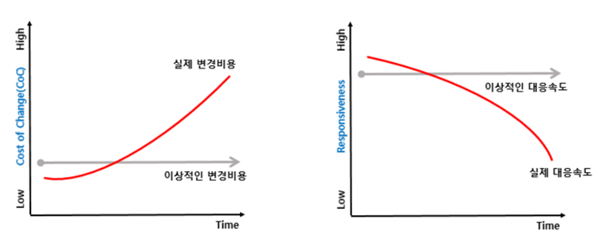
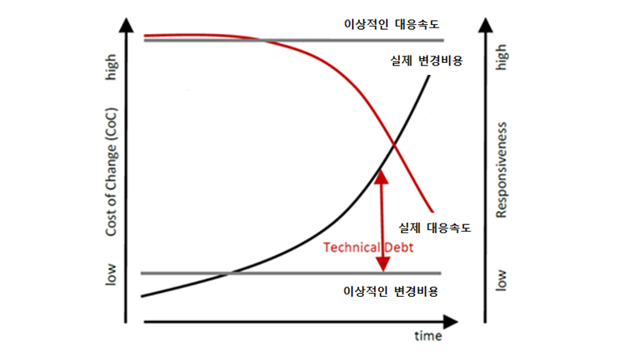

# 클린코드와 리팩토링

## 클린코드란?
가독성이 높은 코드. 모든 팀원이 이해하기 쉽도록 작성된 코드를 말한다.

<br>


## 클린 코딩을 해야하는 이유?
깔끔한 코드는 코드 리뷰, 코드 파악과 디버깅 시간을 단축시킨다.   
시간은 자원이며, 이는 돈으로 이어진다. 따라서 코드 유지보수 시간을 줄이게 되면 비즈니스 밸류를 창출할 수 있게 된다.   




클린 코딩을 하지 않으면, "technical dept"가 발생한다.

*) technical dept란?   
현 시점에서 더 나은 접근방식보다 더 쉬운 솔루션을 채택함으로써 발생되는 추가적인 재작업의 비용


<br>

## 클린 코드 구현 방법
1. 네이밍
    - 변수명/함수명을 보고 역할을 유추할 수 있어야 한다.
    ```
        int AAA(int a, int b){ //역할을 유추할 수 없는 함수 이름
            return a+b;
        }

        int sum(int a, int b){ //올바른 코드
            return a+b;
        }
    ```

    - 변수 이름을 지을 때, CamelCase를 사용하자.

    ```
        int customerid; //카멜케이스가 적용 안 된 변수명
        int customerId; //카멜케이스 적용
    ```
    - 상수는 전부 대문자이며, 띄어쓰기는 언더스코어(_)로 표현한다.
    ```
        final int MAX_COUNT = 1000;
    ```
    - 클래스 이름은 명사나 명사구가 적합하다. ex) Customer, Account
    - 함수 이름은 동사나 동사구가 적합하다. ex) getName, isChecked, Calculate

2. 함수 작성
    - 하나의 함수는 하나의 일만 해야 한다.
    - 파라미터의 개수는 적을수록 좋다.
    - 함수가 여러개라면, 가독성을 위해 함수와 함수 사이에 간격을 두어야 한다.
3. 주석 작성
    - 주석은 없는 것이 좋다. 최대한 코드만 보고도 이해할 수 있도록 작성한다.
    - todo 주석을 이용하여 상황을 기록한다.
4. 오류 처리
    - 가정문보단 try-catch문을 사용하자
    - null보단 빈 매열이나 0과 같은 값을 반환하자. null pointer exception의 발생을 막을 수 있다.
5. 단위 테스트
    - 가능한 모든 함수를 테스트 하자.
6. 클래스 생성
    - 클래스의 크기는 작을수록 좋다. 하나의 클래스는 하나의 역할만 가져야 한다.
    - 인스턴스 변수의 수가 작아야 한다.
7. 흐름 따르기
    - 왼쪽에는 변수를, 오른쪽에는 상수를 두고 비교한다.

    ```
    if(length >= 10)
    ```
    - 부정이 아닌 긍정을 다루자

    ```
    if( a == b ) { // a!=b는 부정

    } else {

    }
    ```

<br>

<hr>

<br>

## 리팩토링이란?
이미 작성을 완료한 코드를 더 나은 코드로 개선시키기 위해 내부 구조를 변경하는 것. 단, 외부 동작은 같아야 한다.

<br>


## 리팩토링을 하는 이유?
코드의 가독성을 높이고, 유지보수를 더 쉽게 하기 위함. 

<br>

## 리팩토링이 필요한 시기
- 같은 코드가 세 번 이상 반복이 될 때
- 새로운 기능을 추가할 때
- 코드 리뷰를 할 때
- 버그를 수정할 때

<br>

## 리팩토링을 하지 말아야 할 시기
- 코드를 처음부터 다시 작성해야 할 때
- 작성 마감일이 가까울 때

<br>

## 리팩토링 주요 기법

<table>
    <tr>
    <td>구분</td><td>기법</td><td>설명</td>
  </tr>
  <tr>
    <td rowspan="2">메소드 정리<td>Extract Method<td>그룹으로 묶을 수 있는 코드 조각이 있다면 메소드로 추출 </td>
  </tr>
  <tr>
    <td>Replace Temp With Query<td> 수식을 메소드로 만들고, 임시 변수 참조를 메소드 호출로 수정 </td>
  </tr>
  <tr>
    <td rowspan="2">객체간 기능 이동<td>Move Method<td>메소드가 자신이 정의된 클래스보다 다른 클래스에서 메소드를 더 많이 사용한다면 메소드를 이동</td>
  </tr>
  <tr>
  <td>Extract Method<td>두 개의 클래스가 해야 할 일을 하나의 클래스가 하고 있다면 클래스를 분리
  </tr>
  <tr>
  <td rowspan="2">메소드 호출 단순화<td>Rename Method<td>메소드 이름이 목적 표현을 못 할 때 이름 변경
  </tr>
  <tr><td>Remove Parameter<td>불필요한 파라미터 제거
  </tr>
  <tr>
    <td rowspan="2">클래스/메소드 일반화<td>Full up field<td>두 서브 클래스가 동일한 필드를 가지고 있다면 그 필드를 수퍼 클래스로 올림
  </tr>
  <tr><td>Full up Method<td>동일한 일을 하는 메소드를 여러 서브 클래스에서 가지고 있다면 이 메소드를 수퍼 클래스로 올림
  </tr>
    <tr>
    <td rowspan="2">기타<td>Encapsulation field <td>Public 필드가 있는 경우 그 필드를 Private로 만들고 접근자 제공
  </tr>
  <tr><td>Decompose Conditional <td>조건 논리를 단순화하여 표현
  </tr>
</table>

<br>

## 리팩토링 절차
1. 리팩토링 대상 식별
2. 테스트를 통한 적용
    - 작은 단위별로 리팩토링 후, 작동 확인 -> 작동이 될 경우 다음 단계, 안 될 경우 undo

<br>

<hr>


<br>

## 클린 코드와 리팩토링의 차이
리팩토링이 더 큰 의미를 가진다.   
클린 코드를 위한 리팩토링이라고 할 수 있다.
- 클린코드
    - 가독성을 높이기 위한 작업
    - 설계시에 필요
- 리팩토링
    - 클린 코드를 포함한 유지보수를 위한 코드 개선
    - 결과물이 나온 이후 추가작업시에 실행