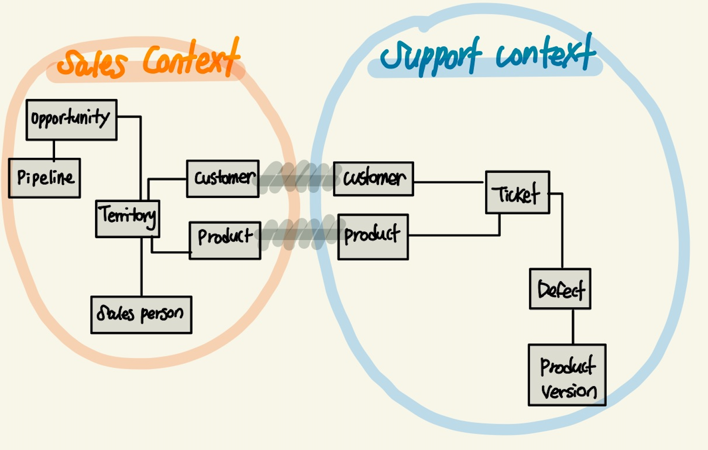
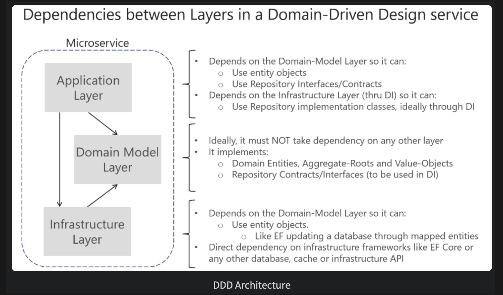
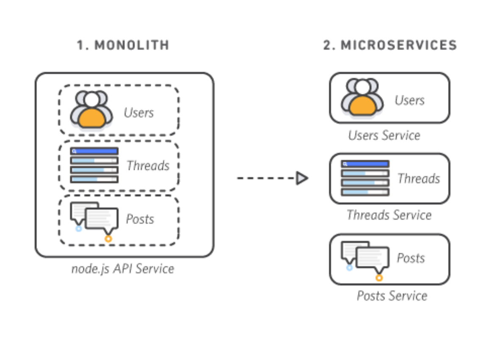
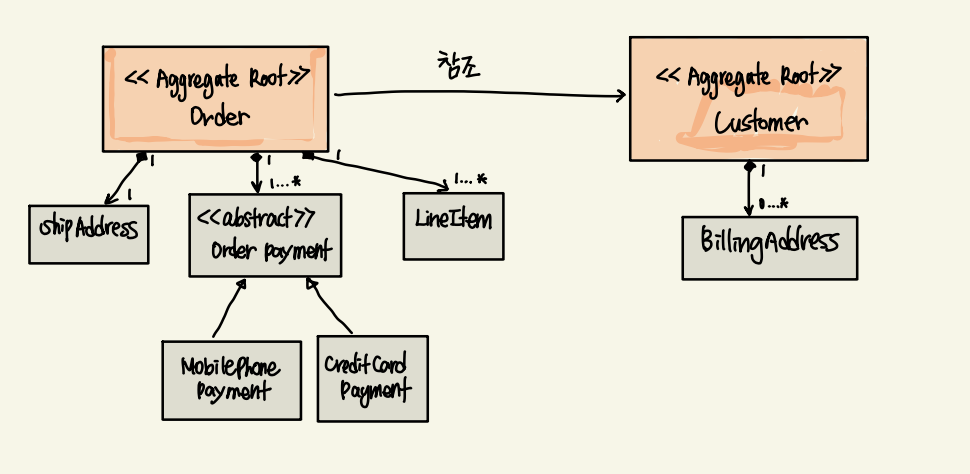
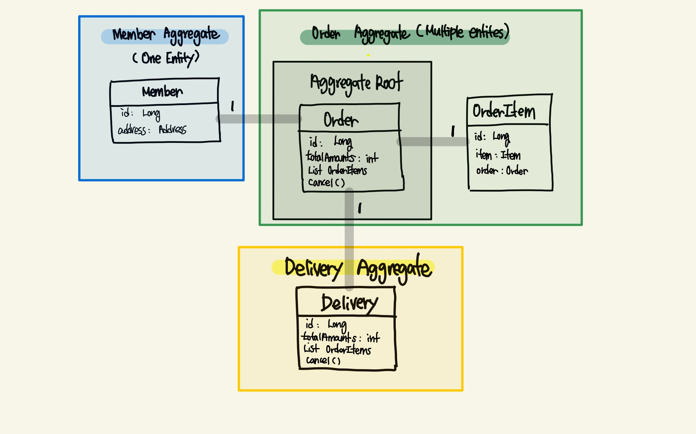

# DDD (Domain-Driven Design)

## 들어가기 전에

`객체지향에서의 핵심`은 실세계의 `객체`(물건, 사람, 주문, ... 주도적으로 무언가를 생산하는 주체)들이 
서로 간의 `상호작용`을 바탕으로 `책임, 협력, 역할` 의 가지고 메시지를 교환하는 것

=> 결국 `객체(무언가를 만드는 주체)`가 핵심이다.

그렇다면 이 객체들을 어떻게 하면 추려내고,  
어떻게 하면 어떤 객체가 필요한지 알 수 있고,  
어떻게 하면 이 객체들이 서로 상호작용 할 수 있을까?  

=> 해결방법 중 하나가 `도메인 주도 설계(DDD)`이다.

---

## DDD 정의

- Domain-Driven Design 또는 도메인 주도 설계
- 도메인 패턴을 중심에 놓고 설계하는 방식
  
  
- 도메인은 `실세계에서 사건이 발생하는 집합` 이자 `소프트웨어로 해결하고자 하는 문제 영역`
    - 예시: 도서 구매 사이트
        - Order Domain: 도서 구매 사이트에서 주문을 하는 도메인
        - Delivery Domain: 배송을 담당하는 도메인
        - Member Domain: 회원을 관리하는 도메인
    - ➡️ 이러한 여러가지 도메인들이 서로 상호작용 하며, 설계하는 것이 `도메인 주도 설계`

---
    
## DDD 특징

- 같은 객체(Object or Class)가 여러 개 존재할 수 있다.
    - 예시: 옷 쇼핑몰
        - 주문 도메인에서의 옷은 손님들에게 팔기 위한 객체 정보(name, price, ...etc)
        - 옷 관리 도메인에서의 옷은 점주 입장에서 관리하기 위한 객체 정보(madeTime, size, madeCountry, ...etc)들 위주
- 즉, `문맥(Context)`에 따라 `객체(Object)의 역할`을 바뀐다.

- 즉, `어떠한 상황에서 바라볼 것인가?` 에 대해 고민해야 하고, 이를 Bounded Context 라고 한다.
  
### Bounded Context

- 도메인 영역의 경계
- Bounded Context에 따라서 Model들의 역할과 책임은 달라진다. 
  그래서 이를 외부(public)로 노출시키지 않고, package-private으로 내부에서만 알 수 있게 한다.
- 이러한 관점에서 더 나아가서 직접 서비스에 적용시킨 것이 `MicroService(마이크로서비스)` 이다.
- 각각의 도메인은 서로 철저히 분리되고, 높은 응집력과 낮은 결합도로 변경과 확장에 용이한 설계를 가진다.

cf.  
- `결합도(coupling)`: 소프트웨어 코드의 한 요소가 다른 것과 얼마나 강력하게 연결되어 있는지, 또한 얼마나 의존적인지 나타내는 정도
- `응집도(cohesion)`: 프로그램의 한 요소가 해당 기능을 수행하기 위해 얼마만큼의 연관된 책임과 아이디어가 뭉쳐있는지를 나타내는 정도 
일반적으로 프로그램의 한 요소가 특정 목적을 위해 밀접하게 연관된 기능들이 모여서 구현되어 있고, 지나치게 많은 일을 하지 않으면 그것을 응집도가 높다고 표현한다.

---

## 도메인 주도 설계 방식

크게 3가지 Layer로 구분한다.

1. Application Layer
    a. 주로 도메인과 Repository를 바탕으로 실제 서비스(API)를 제공하는 계층
     
2. Domain Layer
    a. Entity, VO(Value Object)를 활용하여 도메인 로직이 진행되는 계층
    b. `Entity`
        1) 고유 식별자(PK)를 가지는 객체
        2) 식별자는 고유하되 엔티티의 속성 및 상태는 계속 변할 수 있다.
        3) 도메인의 고유한 개념을 표현한다. (예: 주문-Order, 회원-Member, 상품-Product)
    c. `Value`
        1) 고유 식별자를 가지지 않는다.
        2) 하나의 값을 표현할 때 사용한다.
        3) 다른 벨류 타입의 속성으로도 사용된다. (예: 주소, 우편번호)
     
3. Infrastructure Layer
    a. 외부와의 통신(ORM, DB, NoSQL) 을 담당하는 계층
     
- 각각의 도메인들을 위와 같은 Layer로 철저히 분리해서 만드는 것이 DDD의 핵심 설계 방식
- 설계한 도메인들을 모듈(Module) 별로 분리하는 것이 마이크로서비스(MicroService)
- `DDD의 핵심은 결국 도메인을 서비스 별로 분리하라`!

---

### 모놀리식 아키텍처와 마이크로서비스 아키텍처 비교

`모놀리식 아키텍처`
- 모든 프로세스가 긴밀하게 연결되고 단일 서비스로 실행된다.
- 따라서 애플리케이션의 한 프로세스에 대한 수요가 급증하면 해당 아키텍처 전체를 확장해야 한다.
- 종속 관계를 이루며 긴밀하게 결합된 많은 프로세스로 인해 단일 프로세스의 실패로 인한 영향이 증가함에 따라 모놀리식 아키텍처는 애플리케이션 가용성에 대한 위험을 가중시킨다.
  
`마이크로서비스 아키텍처`
- 애플리케이션이 독립적인 구성 요소로 구축되어 각 애플리케이션 프로세스가 서비스로 실행된다.
- 서비스는 비지니스 기능을 위해 구축되며 서비스마다 한 가지 기능을 수행한다.
- 서비스가 독립적으로 실행되기 때문에 애플리케이션의 특정 기능에 대한 수요를 충족하도록 각각의 서비스를 업데이트, 배포 및 확장할 수 있다.

---

## Aggregate Pattern

  

- 연관된 Entity 와 Value Object 의 묶음
- 주문과 관련된 엔티티를 하나의 애그리거트로 묶을 수 있다.
- 이들 간에는 비지니스 의존관계를 맺고 있으며 비지니스 정합성을 맞출 필요가 있다. 
- 따라서 애그리거트 단위가 `트랜잭션의 기본 단위`가 된다.
- 쉽게 말하면, 각각의 도메인 영역을 대표하는 객체가 바로 Aggregate 이다.
- 각각의 도메인에 Repository로 묶어야 하는 객체(Entity)가 명확해지기 때문이다.

### Aggregate Root

- 수문장 또는 접근하기 위한 최상의 객체
- OrderItem에 접근하기 위해선 반드시 Order를 통해서 접근해야 한다.
- 안정성을 보장하며 Bounded context 내에서 접근만 가능하기 때문에 이해가 쉽고 유지보수성도 높아진다.

---

## 왜 마이크로서비스여야 할까?

기존에는 Hypervisor 기반의 모놀리식 아키텍처였다면, 지금은 Domain Service 중심으로 
Container를 Scale In / Out 하는 Ops 환경이 대세가 되었기 때문이다.

---

##### references
[DDD](https://huisam.tistory.com/entry/DDD)  
[DDD](https://vprog1215.tistory.com/200)  
[결합도, 응집도](https://lazineer.tistory.com/93)  
[microservices](https://aws.amazon.com/ko/microservices/)  