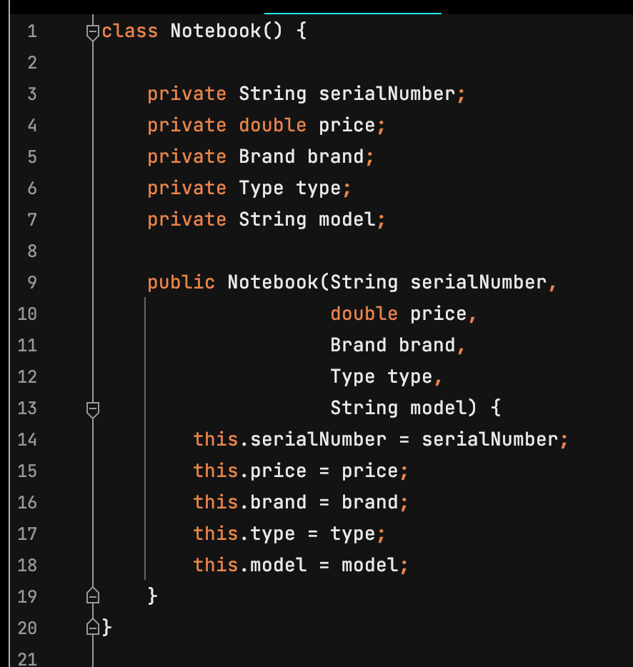
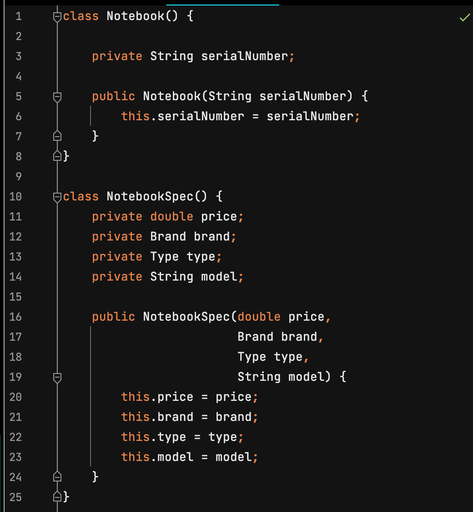
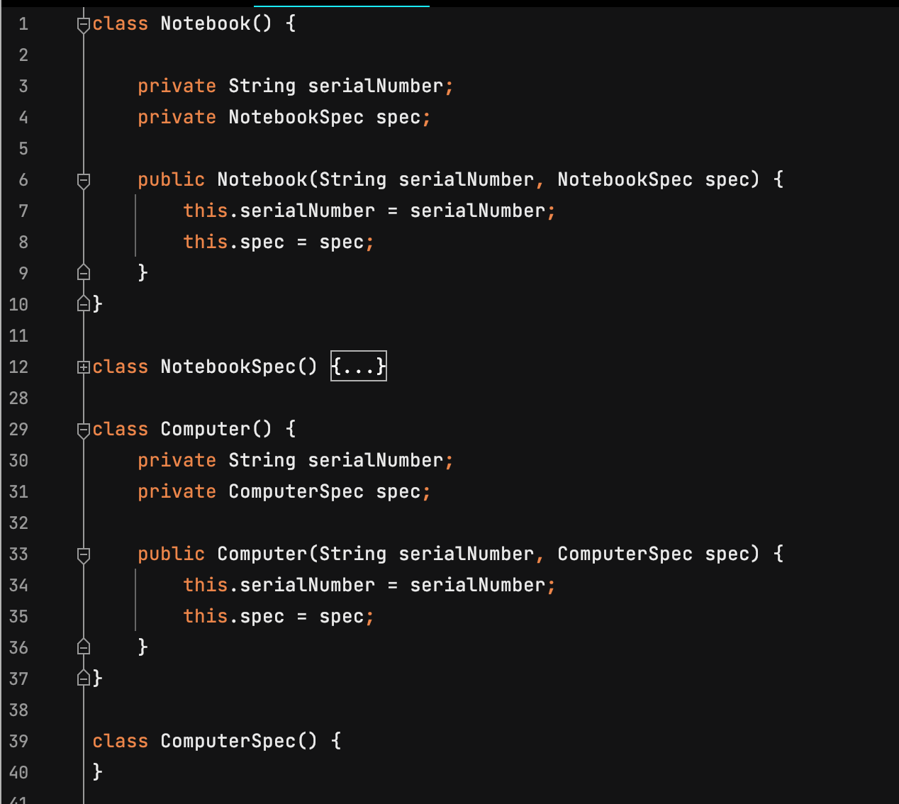
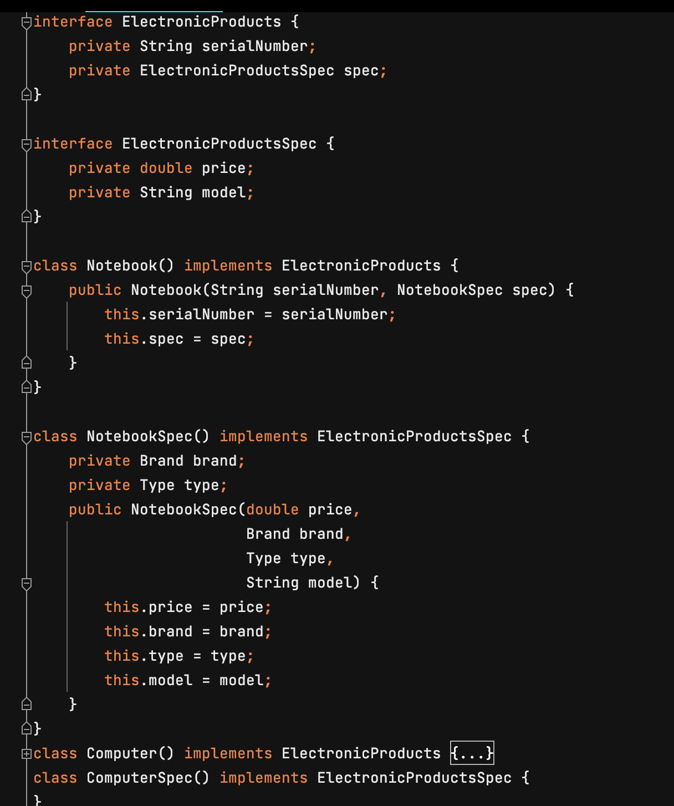
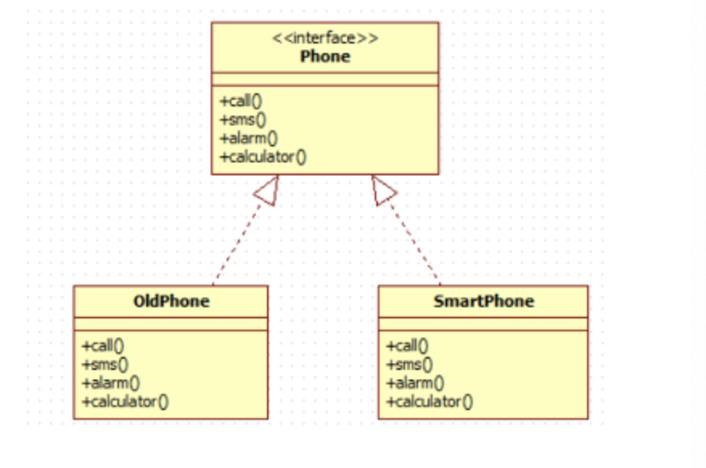
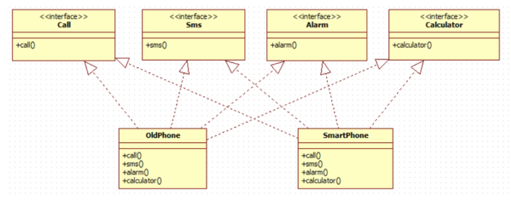
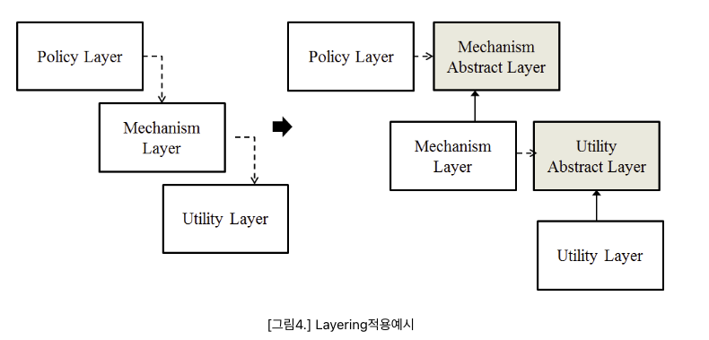
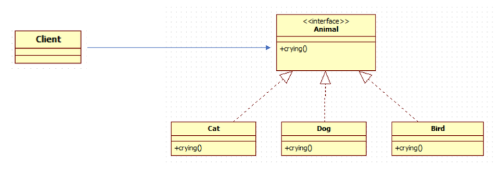

# SOLID 원칙

## SOLID 원칙이란?
> 컴퓨터 프로그래밍에서 `객체 지향 프로그래밍` 및 설계의 `다섯가지 기본 원칙`으로, 시간이 지나도 `유지 보수`와 `확장`이 쉬운 시스템을 만들고자 할 때 적용 시킨다.
- SOLID 원칙들은 소프트웨어 작업에서 프로그래머가 소스 코드가 읽기 쉽고 확장하기 쉽게 될 때까지 소프트웨어 소스 코드를 리팩토링하여 `코드 스멜`을 제거하기 위해 적용할 수 있다.   
`코드 스멜`: 문제를 일으킬 가능성이 있는 소스 코드의 특징
- 애자일 소프트웨어 개발과 적응적 소프트웨어 개발의 전반적 전략의 일부이다.

## SOLID의 5가지 원리

### 1. SRP(단일 책임 원칙, Single Responsibility Principle)

<b> 정의 </b>
> 소프트웨어 설계 부품(클래스, 메소드)는 하나의 책임(기능)만 가져야 한다. 
- SRP 원리를 적용하면 책임 영역이 확실해지기 때문에, 한 책임의 변경에서 다른 책임의 변경으로의 연쇄작용으로부터 자유로울 수 있다. 
- 책임을 적절히 분배함으로써 코드의 가독성이 향상되고 유지보수가 용이해진다.  

<b> 적용 방법 </b>

- 각 책임을 각각의 개별 클래스(함수)로 분할하여 클래스 당 하나의 책임만을 맡도록 한다.
- 리팩토링(Refactoring: Improving the Design of Existing Code -Martin Fowler)
에서 소개하는 대부분의 위험상황에 대한 해결방법은 직/간접적으로 SRP 원리와 관련이 있다.
    
- `여러 원인에 의한 변경 (Divergent change)`:
    - 관건은 책임만 분리하는 것이 아니라 분리된 두 클래스 간 관계의 복잡도를 줄이도록 설계한다.
    - 만약 Extract Class된 각각의 클래스들이 유사하고 비슷한 책임을 중복해서 갖고 있다면 Extract Superclass를 사용할 수 있다.
    - 따라서 각각의 Extract Class들의 유사한 책임들은 부모에게 명백히 위임하고 다른 책임들은 각자에게 정의할 수 있다.

<b> 적용 이슈 </b>

- 클래스 이름은 해당 클래스의 책임을 나타낼 수 있도록 하는 것이 좋다.
- 각 클래스는 하나의 개념을 나타내어야 한다.
- 무조건 책임을 분리한다고 SRP가 적용되는 것은 아니다.

<b> 적용 사례 </b>
 

그림에서 serialNumber는 변화요소라 할 수 없고 고유정보이다. 이외의 변수들은 모두 변경이 발생할 수 있는 요소로 예상이 된다.
따라서 변화가 발생하면 항상 해당 클래스를 수정해야 하는 부담이 발생하게 되므로 SRP 적용의 대상이 된다.
  
두 번째 코드에서는 변화가 예상되는 특정 요소들을 분리하였다. 따라서 변경이 일어나면 NotebookSpec 클래스만 변경하면 된다. 
변화에 의해 변경되는 부분을 한 곳에서 관리할 수 있게 된다.

### 2. OCP(개방-폐쇄 원칙, Open/Closed Principle)

<b> 정의 </b> 
> 기존의 코드를 변경하지 않고(Closed) 기능을 수정하거나 추가할 수 있도록(Open) 설계해야 한다. 
- 소프트웨어의 구성요소(컴포넌트, 클래스, 모듈, 함수)는 확장에는 열려있고 변경에는 닫혀있어야 한다. 
- 변경을 위한 비용은 가능한 줄이고 확장을 위한 비용은 가능한 극대화 해야 한다. 
- 요구사항의 변경이나 추가사항이 발생하더라도, 기존 구성요소는 수정이 일어나지 말아야 하며, 기존 구성요소를 쉽게 확장해서 재사용할 수 있어야 한다. 
- OCP는 객체 지향의 장점을 극대화하는 아주 중요한 원리이다.  

<b> 적용 방법 </b>

- 변경(확장)될 것과 변하지 않을 것을 엄격히 구분한다.
- 두 모듈이 만나는 지점에 인터페이스를 정의한다.
- 구현에 의존하기보다 정의한 인터페이스에 의존하도록 코드를 작성한다.

<b> 적용 이슈 </b>

- 확장되는 것과 변경되지 않는 모듈을 분리하는 과정에서 크기 조절에 실패하면 관계가 더 복잡해질 수 있다.
- 인터페이스는 가능하면 변경되어서는 안된다.
- 인터페이스 설계에서 적당한 추상화 레벨을 선택해야 한다.

<b> 적용 사례 </b> 

SRP 원리를 적용하여 Notebook에서 변경이 예상되는 부분을 뽑아 NotebookSpec이라는 새로운 클래스를 만들어 변화요소들을 하나로 모았다. 하지만 여기서도 변경이 발생할 수 있다.
예를 들어 Notebook 이외에 핸드폰, 컴퓨터와 같은 다른 전자기기들도 다루어야 한다면 첫 번째 이미지의 코드처럼 매번 새로운 기기들과 같은 요소들을 만들게 될 것이다.
  
이제 위의 코드를 OCP 원리를 이용해서 변화에 대응해보도록 하자면, 먼저 Notebook과 추가될 다른 전자기기들을 추상화하는 작업이 필요하다. 
공통 속성을 모두 담을 수 있는 ElectronicProducts 인터페이스를 생성한다. 새로운 전자기기가 추가되면서 변경이 발생하는 부분을 추상화 하여 분리하였다. 이렇게 코드의 수정을 최소화하여 결합도는 줄이고 응집도는 높이는 효과를 가진다.

### 3. LSP(리스코프 치환 원칙, Liskov Substitution Principle)

<b> 정의 </b>
> 자식 클래스는 최소한 자신의 부모 클래스에서 가능한 행위는 수행할 수 있어야 한다는 설계 원칙 
- 즉, 자식 클래스는 언제나 부모 클래스의 역할을 대체할 수 있어야 한다. 
- 부모 클래스와 자식 클래스의 행위가 일관되어야 한다. 
- `자식 클래스는 부모 클래스의 책임을 무시하거나 재정의하지 않고 확장만 수행`하도록 해야 LSP를 만족한다.  
- 상속 관계에서는 일반화 관계(IS-A)가 성립해야 한다.    
-> 일반화 관계가 성립한다 = 일관성이 있다 

- LSP에 따르면 객체지향적으로 설계를 하기 위해서는 오버라이드를 가급적 피하는 것이 좋다고 한다.

<b> 적용 방법 </b>

- 만약 두 개체가 똑같은 일을 한다면 둘을 하나의 클래스로 표현하고 이들을 구분할 수 있는 필드를 둔다.
- 똑같은 연산을 제공하지만, 이들을 약간씩 다르게 한다면 공통의 인터페이스를 만들고 각각 구현한다.(인터페이스 상속)
- 공통된 연산이 없다면 완전 별개인 2개의 클래스를 만든다.
- 만약 두 개체가 하는 일에 추가적으로 무언가를 더 한다면 구현 상속을 사용한다.

<b> 적용 이슈 </b>

- 혼동될 여지가 없다면 그대로 둔다.

### 4. ISP(인터페이스 분리 원칙, Interface Segregation Principle)

<b> 정의 </b>
> 하나의 일반적인 인터페이스보다 여러 개의 구체적인 인터페이스가 낫다. 
- 한 클래스는 자신이 사용하지 않는 인터페이스는 구현하지 말아야 한다. 
- 즉 어떤 클래스가 다른 클래스에 종속될 때에는 가능한 최소한의 인터페이스만을 사용해야 한다. 
- 어떤 클래스를 사용하는 클라이언트가 여러 개고 이들이 해당 클래스의 특정 부분집합만을 이용한다면, 이들을 따로 인터페이스로 빼내야 한다. 
- `SRP가 클래스 분리를 통해 클래스의 단일책임`을 강조한다면 `ISP는 인터페이스 분리를 통해 인터페이스의 단일책임`을 강조한다.  

<b> 적용 방법 </b>

- 클래스의 상속을 이용하여 인터페이스를 나눌 수 있다.
- 위임(Delegation)을 이용하여 인터페이스를 나눌 수 있다.

<b> 적용 이슈 </b>

- 클라이언트에 변경을 주지 말아야 한다.
- 두 개 이상의 인터페이스가 공유하는 부분의 재사용을 극대화 해야 한다.
- 서로 다른 성격의 인터페이스를 명백히 분리 한다.

<b> 적용 사례 </b>
 

옛날 3G폰과 현재 스마트폰들은 Phone의 기능들을 사용하므로 첫 번째 사진처럼, Phone 인터페이스를 사용할 수 있다.
그러나 ISP를 적용하려면 Phone 인터페이스에 모든 함수를 정의하는 것보다, Call, Sms, Alarm, Calculator 인터페이스를 각각 정의하여,필요한 클래스에서 해당 인터페이스를 구현하도록 설계되어야 한다.
 
이렇게 설계를 하면, 각 인터페이스의 메서드들이 서로 영향을 미치지 않게 된다. 즉, 자신이 사용하지 않는 메서드에 대해서 영향력이 줄어들게 된다.

### 5. DIP(의존관계 역전 원칙, Dependency Inversion Principle)

<b> 정의 </b>
> 프로그래머는 추상화(변화하기 어려운 것)에 의존해야지, 구체화(변화하기 쉬운 것)에 의존하면 안된다.
- 여기서의 역전은 구조적 디자인에서 발생하던 하위 레벨 모듈의 변경이 상위 레벨 모듈의 변경을 요구하는 위계관계를 끊는 의미의 역전이다.
 
- 객체들이 서로 정보를 주고 받을 때 의존 관계가 형성되는데, 이 때 객체들은 나름대로의 원칙을 갖고 정보를 주고 받아야 한다는 설계 원칙
- 여기서 원칙은, 추상성이 낮은 클래스보다 추상성이 높은 클래스와 의존 관계를 맺어야 한다는 것을 의미한다.
- 일반적으로 인터페이스를 활용하면 이 원칙을 준수할 수 있게 된다. (캡슐화)

<b> 적용 방법 </b>

- Layering   
추상화 통해 상위 모듈은 하위 모듈로의 의존성에서 벗어나 그 자체로 사용되고 확장성도 보장 받을 수 있다.
 

<b> 적용 사례 </b>
 

Client 객체는 Cat, Dog, Bird의 crying() 메서드에 직접 접근하지 않고, Animal 인터페이스의 crying() 메서드를 호출함으로써 DIP를 만족할 수 있다.

---
### 마치며

객체지향의 원칙이 중요한 것은 사실이나, 더 우선시해야 할 것은 고객의 요구사항대로 동작해야 한다는 것이다.
아무리 객체지향 원칙을 적용하고 멋진 패턴을 사용하여 확장성이 뛰어나고 유연한 설계가 되었다 하더라도 제대로 동작하지 않는 프로그램이라면 소용없다.

<small>헤드퍼스트 OOA&D 중에서</small>
1. 여러분의 소프트웨어가 고객이 원하는 기능을 하도록 하세요.
2. 객체지향 기본원리를 적용해서 소프트웨어를 유연하게 하세요.
3. 유지보수와 재사용이 쉬운 디자인을 위해 노력하세요.

---
## Reference

<a href="https://ko.wikipedia.org/wiki/SOLID_(%EA%B0%9D%EC%B2%B4_%EC%A7%80%ED%96%A5_%EC%84%A4%EA%B3%84)">SOLID (객체 지향 설계)</a>

<a href="https://www.nextree.co.kr/p6960/">객체지향 개발 5대 원리: SOLID</a>

<a href="https://dev-momo.tistory.com/entry/SOLID-%EC%9B%90%EC%B9%99">SOLID 원칙</a>

<a href="https://victorydntmd.tistory.com/m/291">[디자인 패턴] SOLID 원칙</a>